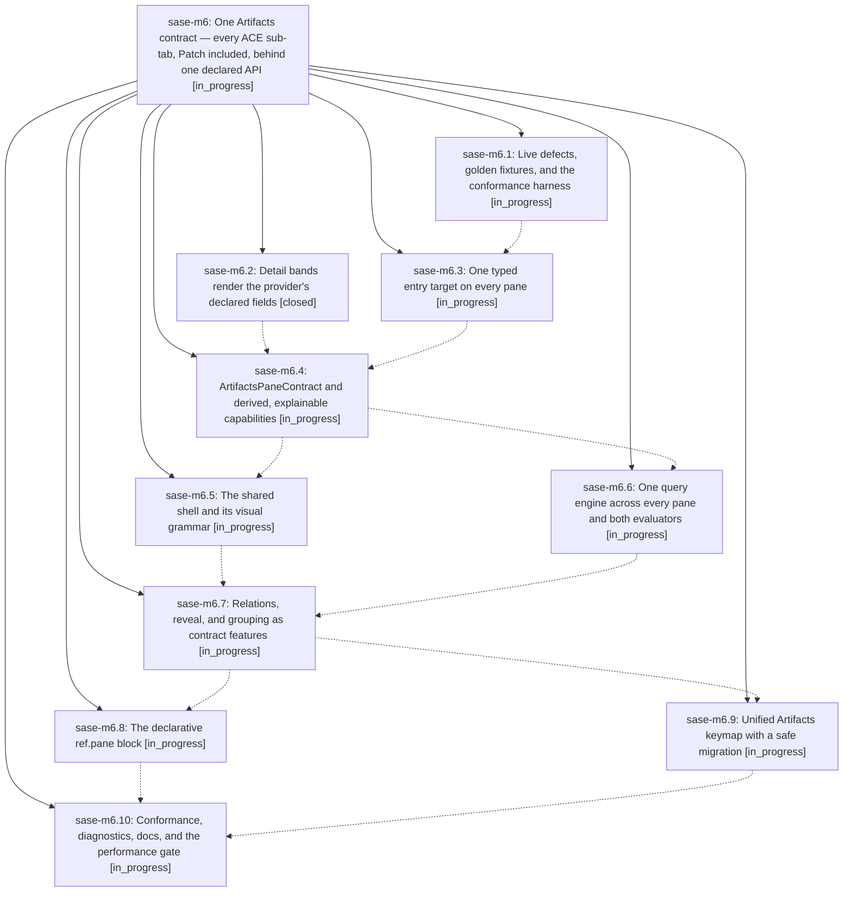

# Bead: sase-m6 — One Artifacts contract — every ACE sub-tab, Patch included, behind one declared API

[Bead Pages](../README.md) / sase-m6

**Status:** ◐ in_progress · **Type:** ▸ plan · **Tier:** epic
**Owner:** `bryanbugyi34@gmail.com` · **Created by:** [bbugyi200.athena.01u](https://github.com/sase-org/sase--agents/blob/main/families/bbugyi200.athena.01u.md) · **Assignee:** `sase-m6.land`
**Created:** 2026-08-14 17:05:15 EDT
**Plan:** [202608/artifacts\_pane\_contract.md](https://github.com/sase-org/sase--plans/blob/main/202608/artifacts_pane_contract.md)

## Description

Every ACE Artifacts sub-tab — Patch included — is driven by one host-owned ArtifactsPaneContract whose capabilities are derived from declared data. A sidecar or artifact repo declares facts in its ref spec and inherits querying, relations, grouping, marks, copy, help and chrome without shipping code, so a new sub-tab feature is implemented once and appears in every configured provider's tab — including providers belonging to users we will never see.

## Phases

| Bead | Title | Status | Size | Created | Agents | Commits |
|---|---|---|---|---|---:|---:|
| [sase-m6.1](sase-m6.1.md) | Live defects, golden fixtures, and the conformance harness | ◐ in_progress | medium | 2026-08-14 | 1 | 0 |
| [sase-m6.10](sase-m6.10.md) | Conformance, diagnostics, docs, and the performance gate | ◐ in_progress | medium | 2026-08-14 | 1 | 0 |
| [sase-m6.2](sase-m6.2.md) | Detail bands render the provider's declared fields | ✓ closed | xsmall | 2026-08-14 | 1 | 1 |
| [sase-m6.3](sase-m6.3.md) | One typed entry target on every pane | ◐ in_progress | large | 2026-08-14 | 1 | 0 |
| [sase-m6.4](sase-m6.4.md) | ArtifactsPaneContract and derived, explainable capabilities | ◐ in_progress | large | 2026-08-14 | 1 | 0 |
| [sase-m6.5](sase-m6.5.md) | The shared shell and its visual grammar | ◐ in_progress | large | 2026-08-14 | 1 | 0 |
| [sase-m6.6](sase-m6.6.md) | One query engine across every pane and both evaluators | ◐ in_progress | xlarge | 2026-08-14 | 1 | 0 |
| [sase-m6.7](sase-m6.7.md) | Relations, reveal, and grouping as contract features | ◐ in_progress | large | 2026-08-14 | 1 | 0 |
| [sase-m6.8](sase-m6.8.md) | The declarative ref.pane block | ◐ in_progress | large | 2026-08-14 | 1 | 0 |
| [sase-m6.9](sase-m6.9.md) | Unified Artifacts keymap with a safe migration | ◐ in_progress | medium | 2026-08-14 | 1 | 0 |

## Lineage

## Agents

| Agent | Bead | Commits |
|---|---|---:|
| [bbugyi200.athena.sase-m6.1](https://github.com/sase-org/sase--agents/blob/main/agents/bbugyi200.athena.sase-m6.1/README.md) | [sase-m6.1](sase-m6.1.md) | 0 |
| [bbugyi200.athena.sase-m6.10](https://github.com/sase-org/sase--agents/blob/main/agents/bbugyi200.athena.sase-m6.10/README.md) | [sase-m6.10](sase-m6.10.md) | 0 |
| [bbugyi200.athena.sase-m6.2](https://github.com/sase-org/sase--agents/blob/main/agents/bbugyi200.athena.sase-m6.2/README.md) | [sase-m6.2](sase-m6.2.md) | 1 |
| [bbugyi200.athena.sase-m6.3](https://github.com/sase-org/sase--agents/blob/main/agents/bbugyi200.athena.sase-m6.3/README.md) | [sase-m6.3](sase-m6.3.md) | 0 |
| [bbugyi200.athena.sase-m6.4](https://github.com/sase-org/sase--agents/blob/main/agents/bbugyi200.athena.sase-m6.4/README.md) | [sase-m6.4](sase-m6.4.md) | 0 |
| [bbugyi200.athena.sase-m6.5](https://github.com/sase-org/sase--agents/blob/main/agents/bbugyi200.athena.sase-m6.5/README.md) | [sase-m6.5](sase-m6.5.md) | 0 |
| [bbugyi200.athena.sase-m6.6](https://github.com/sase-org/sase--agents/blob/main/agents/bbugyi200.athena.sase-m6.6/README.md) | [sase-m6.6](sase-m6.6.md) | 0 |
| [bbugyi200.athena.sase-m6.7](https://github.com/sase-org/sase--agents/blob/main/agents/bbugyi200.athena.sase-m6.7/README.md) | [sase-m6.7](sase-m6.7.md) | 0 |
| [bbugyi200.athena.sase-m6.8](https://github.com/sase-org/sase--agents/blob/main/agents/bbugyi200.athena.sase-m6.8/README.md) | [sase-m6.8](sase-m6.8.md) | 0 |
| [bbugyi200.athena.sase-m6.9](https://github.com/sase-org/sase--agents/blob/main/agents/bbugyi200.athena.sase-m6.9/README.md) | [sase-m6.9](sase-m6.9.md) | 0 |
| [bbugyi200.athena.sase-m6.land](https://github.com/sase-org/sase--agents/blob/main/agents/bbugyi200.athena.sase-m6.land/README.md) | [sase-m6](README.md) | 0 |

## Commits

| Repo | Commit | Subject | Bead | Committed |
|---|---|---|---|---|
| sase | [`8338a32`](https://github.com/sase-org/sase/commit/8338a320ac1d04c8a5fbc406659804bb841fb63f) | fix: order artifact detail fields from provider specs | [sase-m6.2](sase-m6.2.md) | 2026-08-14 17:28:28 EDT |
