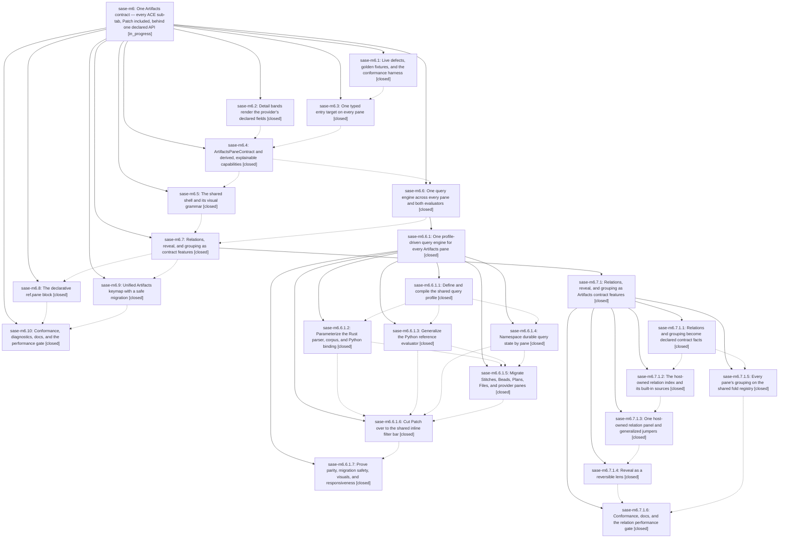

# Bead: sase-m6 — One Artifacts contract — every ACE sub-tab, Patch included, behind one declared API

[Bead Pages](../README.md) / sase-m6

**Status:** ◐ in_progress · **Type:** ▸ plan · **Tier:** epic
**Owner:** `bryanbugyi34@gmail.com` · **Created by:** [bbugyi200.athena.01u](https://github.com/sase-org/sase--agents/blob/main/families/bbugyi200.athena.01u.md) · **Assignee:** `sase-m6.land`
**Created:** 2026-08-14 17:05:15 EDT
**Plan:** [202608/artifacts\_pane\_contract.md](https://github.com/sase-org/sase--plans/blob/main/202608/artifacts_pane_contract.md)

## Description

Every ACE Artifacts sub-tab — Patch included — is driven by one host-owned ArtifactsPaneContract whose capabilities are derived from declared data. A sidecar or artifact repo declares facts in its ref spec and inherits querying, relations, grouping, marks, copy, help and chrome without shipping code, so a new sub-tab feature is implemented once and appears in every configured provider's tab — including providers belonging to users we will never see.

## Notes

[2026-08-15T01:24:53Z · sase-m9.1.1.land] DISCOVERED ISSUE: Proposed follow-up from sase-m9.1.1.2 while landing shell taxonomy: the full ACE PNG visual suite's Artifacts/Beads snapshots fail before PNG comparison because select_entry_target cannot find alpha-1 / alpha-open. This is distinct from renderer drift and from canceled task sase-l8, which covered Artifacts/Beads provider-inventory pixel drift; here fixture/selection behavior breaks before a golden comparison. The report is not caused by epic sase-m9.1.1. It is plausibly causally linked to this active Artifacts contract epic because phase sase-m6.3 promoted ArtifactEntryTarget to typed pane identities and retired index-based marks/jump anchors. Please verify the Artifacts/Beads visual fixtures target the new typed entry identities or preserve legacy fixture tokens intentionally.

[2026-08-15T04:44:40Z · sase-m4.land--a] DISCOVERED ISSUE: While observing finish_github_actions_stabilization, master CI run 31861402259 for d19d08641246a2b0f9276fded07d93004815d640 failed the visual-test job after d19d0864 (feat(tui): give every Artifacts pane a shared shell and visual grammar), which is part of this active Artifacts contract epic. Failures: Help keymaps PNG mismatch, Help filter PNG mismatch, Models panel builtin effort picker PNG mismatch, Artifacts/Beads populated and reopened detail select_entry_target returned false for typed bead targets, and Artifacts files nested strip PNG mismatch. This extends the 2026-08-15T01:24 note: the Artifacts/Beads target failure still reproduces, and additional Help/Models/Artifacts snapshots drift after the shared-shell/visual-grammar work. Epic sase-m4's stabilization commit 5601920c9 is merely an ancestor; perf-floors and nonvisual Python 3.12/3.14 jobs passed, so this CI red is attributable to later Artifacts/TUI work, not the stabilization tale.

[2026-08-16T06:13:55Z · toobig-2t.split_file.src.sase.bead._stream_integrity.0] DISCOVERED ISSUE: commit 3c3909c31 'feat(tui): add inline Patch filter bar' (SASE_BEAD=[sase-m6.6.1.6], phase of sase-m6.6.1) left ~25 DETERMINISTIC ACE TUI test failures on master d22622365. Reported from workspace sase_12 on 2026-08-16 while splitting src/sase/bead/_stream_integrity.py (bead-store code only — no ACE/TUI files touched). NOT the sase-ct/sase-j7 flake class: every node below fails serially, in isolation, with -p no:randomly, and reproduces with my diff stashed on a pristine tree.

Repro: .venv/bin/python -m pytest tests/ace/tui/test_changespec_detail_only_refresh.py tests/ace/tui/test_changespecs_onboarding.py tests/ace/tui/test_jump_to_changespec.py tests/ace/tui/widgets/test_keybinding_footer_idempotent.py tests/test_keybinding_footer_agent.py tests/test_keymaps_display_help.py tests/test_ace_testing.py -q -p no:randomly  ->  20 failed, 130 passed in 58.6s.
Plus: .venv/bin/python -m pytest tests/ace/tui/widgets/test_vim_normal_key_containment.py -q -p no:randomly  ->  45 errors (every parametrization), 1 failed.

Two distinct root causes, both traceable to that commit:

(1) PatchFilterBar input is queried before it is mounted. Teardown/refresh path raises textual.css.query.NoMatches: No nodes match '#patch-filter-input' on PatchFilterBar(id='patch-filter-bar'), via sase/ace/tui/actions/patch/_display.py:394 _refresh_display_impl -> search_panel.set_query() -> widgets/filter_bar.py:220 set_query -> filter_bar.py:315 _editor() -> query_one('#{INPUT_ID}', _FilterBarInput). This errors all 45 tests/ace/tui/widgets/test_vim_normal_key_containment.py nodes and the tests/test_ace_testing.py ACE page-group harness nodes. A related sibling signature appears as NoMatches: No nodes match '#search-query-panel' on Screen(id='_default'). set_query()/_editor() need to tolerate a not-yet-mounted (or already-unmounted) input rather than assuming the child exists.

(2) The commit's default-keymap change ('f' focuses Patch filters while 'F' edits hooks) was not propagated to the agent-side fork keybindings/help, which still advertise 'F'. Failing assertions: ('f','fork clan') not in {... ('F','fork clan') ...}; ('f','fork tribe') not in {... ('F','fork tribe') ...}; ('f','fork') not in [... ('F','fork') ...]; ('f','Fork chat as agent') missing from the footer set. Nodes: tests/test_keymaps_display_help.py::test_agents_help_uses_f_for_fork_not_r_for_resume, tests/test_keybinding_footer_agent.py::{test_keybinding_footer_clan_advertises_clan_fork, test_keybinding_footer_named_panel_advertises_tribe_fork, test_keybinding_footer_agent_bindings_tale_done_with_chat}, tests/ace/tui/widgets/test_keybinding_footer_idempotent.py::{test_clan_footer_keeps_row_cleanup_and_panel_chooser_labels, test_named_tribe_footer_advertises_fork_and_wait}. Decide which key wins for fork and update either src/sase/default_config.yml or the footer/help tests to match — right now the two disagree on master.

Also failing in the same lane, same pane area, likely the same landing: tests/ace/tui/test_changespecs_onboarding.py (7 nodes — onboarding visibility now wrong in every direction), tests/ace/tui/test_changespec_detail_only_refresh.py::{test_full_refresh_still_calls_update_list, test_mark_toggle_falls_back_to_full_refresh_on_patch_failure} (update_list_calls == 0), tests/ace/tui/test_jump_to_changespec.py::TestNavigateToPatchExactFirst::test_exact_target_wins_after_switching_to_project_query (navigate_to_patch_tab returns False).

Routed here rather than to a new task because sase-m6.6.1.6 is an in-progress child of this epic and its own commit introduced both the widget and the keymap change; sase-m6.9 ('Unified Artifacts keymap with a safe migration') explicitly owns the keymap half. RELATED: sase-ct (retired umbrella, not +1'd — this is deterministic, not a flake); sase-ml and sase-mv cover the other, unrelated failures in the same lane and were corroborated separately.

[2026-08-16T20:55:51Z · sase-na.land] DISCOVERED ISSUE: closed phase sase-m6.9 ('Unified Artifacts keymap with a safe migration', commit 3c9df1182) moved the grouping-cycle hint in the AcePage top bar from 'o' to 'B' without regenerating the PNG goldens, so a large fraction of the 'just test-visual' suite fails repo-wide on unmodified master. Confirmed by pixel diff, not inference: tests/ace/tui/visual/snapshots/png/history_word_completion_panel_120x40.png differed from the render by 101 of 1,520,532 pixels, entirely inside one glyph in the top-bar hint -- expected renders '... project (o)]' and actual renders '... project (B)]'. Reproduction in workspace sase_12 on master eba0eab73 after 'just install': 'just test-visual tests/ace/tui/visual/test_ace_png_snapshots_history_word_completion.py tests/ace/tui/visual/test_ace_png_snapshots_prompt_word_completion.py tests/ace/tui/visual/test_ace_png_snapshots_config_center_home.py' -> 6 failed, 0 passed, with the identical single-glyph diff shape in the config-center goldens (a completely unrelated pane), which is what makes this one shared regression rather than N independent ones. Phase bead sase-na.4 measured the blast radius at 278 of 692 nodes on master 101af7242 and attributed it to a 'top-right badge' and possibly e38d7b80f (the bead flag work); that attribution is wrong -- the diff region is the top-bar keymap hint and the cause is sase-m6.9's o->B move. Impact: blocks 'just check-full' (test-cost depends on _setup-visual) for every agent regardless of diff. Scope: one coordinated regeneration with --sase-update-visual-snapshots once the keymap is settled, not a per-test fix; note that task sase-lo warns 'just test-visual-update' rewrites every golden and can silently absorb unrelated drift. Recorded here rather than as a task bead because sase-m6 is the active causal owner and phase sase-m6.10 is still in progress. Found by sase-na.land; I regenerated only my own epic's history_word_completion_panel_120x40 golden in commit b5b7f761b, which now passes, leaving the rest of the suite untouched for this coordinated pass.

## Phases

| Bead | Title | Status | Size | Created | Agents | Commits |
|---|---|---|---|---|---:|---:|
| [sase-m6.1](sase-m6.1.md) | Live defects, golden fixtures, and the conformance harness | ✓ closed | medium | 2026-08-14 | 1 | 1 |
| [sase-m6.10](sase-m6.10.md) | Conformance, diagnostics, docs, and the performance gate | ✓ closed | medium | 2026-08-14 | 1 | 1 |
| [sase-m6.2](sase-m6.2.md) | Detail bands render the provider's declared fields | ✓ closed | xsmall | 2026-08-14 | 1 | 1 |
| [sase-m6.3](sase-m6.3.md) | One typed entry target on every pane | ✓ closed | large | 2026-08-14 | 1 | 1 |
| [sase-m6.4](sase-m6.4.md) | ArtifactsPaneContract and derived, explainable capabilities | ✓ closed | large | 2026-08-14 | 1 | 1 |
| [sase-m6.5](sase-m6.5.md) | The shared shell and its visual grammar | ✓ closed | large | 2026-08-14 | 1 | 1 |
| [sase-m6.6](sase-m6.6.md) | One query engine across every pane and both evaluators | ✓ closed | xlarge | 2026-08-14 | 1 | 0 |
| [sase-m6.7](sase-m6.7.md) | Relations, reveal, and grouping as contract features | ✓ closed | large | 2026-08-14 | 1 | 0 |
| [sase-m6.8](sase-m6.8.md) | The declarative ref.pane block | ✓ closed | large | 2026-08-14 | 1 | 1 |
| [sase-m6.9](sase-m6.9.md) | Unified Artifacts keymap with a safe migration | ✓ closed | medium | 2026-08-14 | 1 | 1 |

## Lineage

## Agents

| Agent | Bead | Commits |
|---|---|---:|
| [bbugyi200.athena.sase-m6.1](https://github.com/sase-org/sase--agents/blob/main/agents/bbugyi200.athena.sase-m6.1/README.md) | [sase-m6.1](sase-m6.1.md) | 1 |
| [bbugyi200.athena.sase-m6.10](https://github.com/sase-org/sase--agents/blob/main/families/bbugyi200.athena.sase-m6.10.md) | [sase-m6.10](sase-m6.10.md) | 1 |
| [bbugyi200.athena.sase-m6.2](https://github.com/sase-org/sase--agents/blob/main/agents/bbugyi200.athena.sase-m6.2/README.md) | [sase-m6.2](sase-m6.2.md) | 1 |
| [bbugyi200.athena.sase-m6.3](https://github.com/sase-org/sase--agents/blob/main/families/bbugyi200.athena.sase-m6.3.md) | [sase-m6.3](sase-m6.3.md) | 1 |
| [bbugyi200.athena.sase-m6.4](https://github.com/sase-org/sase--agents/blob/main/families/bbugyi200.athena.sase-m6.4.md) | [sase-m6.4](sase-m6.4.md) | 1 |
| [bbugyi200.athena.sase-m6.5](https://github.com/sase-org/sase--agents/blob/main/families/bbugyi200.athena.sase-m6.5.md) | [sase-m6.5](sase-m6.5.md) | 1 |
| [bbugyi200.athena.sase-m6.6](https://github.com/sase-org/sase--agents/blob/main/families/bbugyi200.athena.sase-m6.6.md) | [sase-m6.6](sase-m6.6.md) | 0 |
| [bbugyi200.athena.sase-m6.6.1.1](https://github.com/sase-org/sase--agents/blob/main/families/bbugyi200.athena.sase-m6.6.1.1.md) | [sase-m6.6.1.1](sase-m6.6.1.1.md) | 1 |
| [bbugyi200.athena.sase-m6.6.1.2](https://github.com/sase-org/sase--agents/blob/main/families/bbugyi200.athena.sase-m6.6.1.2.md) | [sase-m6.6.1.2](sase-m6.6.1.2.md) | 1 |
| [bbugyi200.athena.sase-m6.6.1.3](https://github.com/sase-org/sase--agents/blob/main/agents/bbugyi200.athena.sase-m6.6.1.3/README.md) | [sase-m6.6.1.3](sase-m6.6.1.3.md) | 1 |
| [bbugyi200.athena.sase-m6.6.1.4](https://github.com/sase-org/sase--agents/blob/main/agents/bbugyi200.athena.sase-m6.6.1.4/README.md) | [sase-m6.6.1.4](sase-m6.6.1.4.md) | 1 |
| [bbugyi200.athena.sase-m6.6.1.5](https://github.com/sase-org/sase--agents/blob/main/families/bbugyi200.athena.sase-m6.6.1.5.md) | [sase-m6.6.1.5](sase-m6.6.1.5.md) | 3 |
| [bbugyi200.athena.sase-m6.6.1.6](https://github.com/sase-org/sase--agents/blob/main/families/bbugyi200.athena.sase-m6.6.1.6.md) | [sase-m6.6.1.6](sase-m6.6.1.6.md) | 1 |
| [bbugyi200.athena.sase-m6.6.1.7](https://github.com/sase-org/sase--agents/blob/main/agents/bbugyi200.athena.sase-m6.6.1.7/README.md) | [sase-m6.6.1.7](sase-m6.6.1.7.md) | 1 |
| [bbugyi200.athena.sase-m6.6.1.land](https://github.com/sase-org/sase--agents/blob/main/families/bbugyi200.athena.sase-m6.6.1.land.md) | [sase-m6.6.1](sase-m6.6.1.md) | 1 |
| [bbugyi200.athena.sase-m6.7](https://github.com/sase-org/sase--agents/blob/main/families/bbugyi200.athena.sase-m6.7.md) | [sase-m6.7](sase-m6.7.md) | 0 |
| [bbugyi200.athena.sase-m6.7.1.1](https://github.com/sase-org/sase--agents/blob/main/agents/bbugyi200.athena.sase-m6.7.1.1/README.md) | [sase-m6.7.1.1](sase-m6.7.1.1.md) | 1 |
| [bbugyi200.athena.sase-m6.7.1.2](https://github.com/sase-org/sase--agents/blob/main/families/bbugyi200.athena.sase-m6.7.1.2.md) | [sase-m6.7.1.2](sase-m6.7.1.2.md) | 1 |
| [bbugyi200.athena.sase-m6.7.1.3](https://github.com/sase-org/sase--agents/blob/main/families/bbugyi200.athena.sase-m6.7.1.3.md) | [sase-m6.7.1.3](sase-m6.7.1.3.md) | 2 |
| [bbugyi200.athena.sase-m6.7.1.4](https://github.com/sase-org/sase--agents/blob/main/families/bbugyi200.athena.sase-m6.7.1.4.md) | [sase-m6.7.1.4](sase-m6.7.1.4.md) | 1 |
| [bbugyi200.athena.sase-m6.7.1.5](https://github.com/sase-org/sase--agents/blob/main/families/bbugyi200.athena.sase-m6.7.1.5.md) | [sase-m6.7.1.5](sase-m6.7.1.5.md) | 1 |
| [bbugyi200.athena.sase-m6.7.1.6](https://github.com/sase-org/sase--agents/blob/main/families/bbugyi200.athena.sase-m6.7.1.6.md) | [sase-m6.7.1.6](sase-m6.7.1.6.md) | 0 |
| [bbugyi200.athena.sase-m6.8](https://github.com/sase-org/sase--agents/blob/main/families/bbugyi200.athena.sase-m6.8.md) | [sase-m6.8](sase-m6.8.md) | 1 |
| [bbugyi200.athena.sase-m6.9](https://github.com/sase-org/sase--agents/blob/main/agents/bbugyi200.athena.sase-m6.9/README.md) | [sase-m6.9](sase-m6.9.md) | 1 |
| [bbugyi200.athena.sase-m6.land](https://github.com/sase-org/sase--agents/blob/main/agents/bbugyi200.athena.sase-m6.land/README.md) | [sase-m6](README.md) | 0 |

## Commits

| Repo | Commit | Subject | Bead | Committed |
|---|---|---|---|---|
| sase | [`8338a32`](https://github.com/sase-org/sase/commit/8338a320ac1d04c8a5fbc406659804bb841fb63f) | fix: order artifact detail fields from provider specs | [sase-m6.2](sase-m6.2.md) | 2026-08-14 17:28:28 EDT |
| sase | [`191e9f2`](https://github.com/sase-org/sase/commit/191e9f2196830a547306d6de0f660a3cccf00235) | feat(ace): stabilize provider tabs and freeze Patch contract goldens | [sase-m6.1](sase-m6.1.md) | 2026-08-14 17:51:38 EDT |
| sase | [`33180da`](https://github.com/sase-org/sase/commit/33180daf1e381f44a88a8825fa9e46d7c55b2228) | feat(ace): give every Artifacts pane a typed, serializable row identity | [sase-m6.3](sase-m6.3.md) | 2026-08-14 19:56:53 EDT |
| sase | [`7060a2e`](https://github.com/sase-org/sase/commit/7060a2ec45dc8a89f6f29b72e9555259103259e7) | feat(tui): drive Artifacts panes from a derived host contract | [sase-m6.4](sase-m6.4.md) | 2026-08-14 21:17:24 EDT |
| sase | [`d19d086`](https://github.com/sase-org/sase/commit/d19d08641246a2b0f9276fded07d93004815d640) | feat(tui): give every Artifacts pane a shared shell and visual grammar | [sase-m6.5](sase-m6.5.md) | 2026-08-14 23:17:01 EDT |
| sase | [`2f9b59c`](https://github.com/sase-org/sase/commit/2f9b59cadb2a25169a15a58c8ab7aa5c05c2cfc4) | feat(ace): define and compile the shared query profile | [sase-m6.6.1.1](sase-m6.6.1.1.md) | 2026-08-15 07:02:27 EDT |
| sase-core | [`sase-core@ba78216`](https://github.com/sase-org/sase-core/commit/ba7821682990377dae42ad9c8a08392592470f54) | feat(query): parameterize the Rust query engine by compiled profile | [sase-m6.6.1.2](sase-m6.6.1.2.md) | 2026-08-15 07:43:27 EDT |
| sase | [`682cc31`](https://github.com/sase-org/sase/commit/682cc31b37dae72dea9183c5b28d386dbb5898cf) | feat(query): add profile-driven artifact query reference | [sase-m6.6.1.3](sase-m6.6.1.3.md) | 2026-08-15 07:51:35 EDT |
| sase | [`368e8f6`](https://github.com/sase-org/sase/commit/368e8f66479170f3c4f977369130daa5a8178eab) | feat(ace): namespace durable query state by pane | [sase-m6.6.1.4](sase-m6.6.1.4.md) | 2026-08-15 07:57:13 EDT |
| sase | [`545cb8e`](https://github.com/sase-org/sase/commit/545cb8e7055c61a81773c424a94a73386aa131db) | feat(query): wire the compiled query profile into contracts, host facade, and FilterBar | [sase-m6.6.1.5](sase-m6.6.1.5.md) | 2026-08-15 09:08:39 EDT |
| sase-core | [`sase-core@f898057`](https://github.com/sase-org/sase-core/commit/f8980573b24217d227a9931617443ceec0ceb302) | fix(query): correct exact-match, date-range, and digest handling in the profile engine | [sase-m6.6.1.5](sase-m6.6.1.5.md) | 2026-08-15 09:10:43 EDT |
| sase | [`e4c6460`](https://github.com/sase-org/sase/commit/e4c64607f693552d3101bd1d130c3c76680f6e7f) | test(ace): align flat-pane visual fixtures with query profiles | [sase-m6.6.1.5](sase-m6.6.1.5.md) | 2026-08-15 19:38:20 EDT |
| sase | [`3c3909c`](https://github.com/sase-org/sase/commit/3c3909c314d2c501ba58fe14ebf1765f70195460) | feat(tui): add inline Patch filter bar | [sase-m6.6.1.6](sase-m6.6.1.6.md) | 2026-08-16 00:54:18 EDT |
| sase | [`ff3b0fa`](https://github.com/sase-org/sase/commit/ff3b0fa43f8175fea54af7cead671d3e863a88ca) | test: add artifacts query profile conformance goldens | [sase-m6.6.1.7](sase-m6.6.1.7.md) | 2026-08-16 01:31:43 EDT |
| sase | [`172b1a1`](https://github.com/sase-org/sase/commit/172b1a1a0937dcaf939cbd75d903613a797a3f3a) | fix(tui): guard inline Patch filter before compose | [sase-m6.6.1](sase-m6.6.1.md) | 2026-08-16 02:42:32 EDT |
| sase | [`2abe188`](https://github.com/sase-org/sase/commit/2abe188aae089950b13f22b9c5c299baaf5e6cef) | feat(artifacts): declare pane relation and grouping facts | [sase-m6.7.1.1](sase-m6.7.1.1.md) | 2026-08-16 03:17:40 EDT |
| sase | [`708c254`](https://github.com/sase-org/sase/commit/708c254523118a65c7d5f85eec42fa152c02ec97) | feat(artifacts): add host-owned RelationIndex for Artifacts panes | [sase-m6.7.1.2](sase-m6.7.1.2.md) | 2026-08-16 04:32:00 EDT |
| sase | [`f5dda81`](https://github.com/sase-org/sase/commit/f5dda81f351b085304f96a2acb11aaf4a7606860) | feat(artifacts): put every pane on the shared fold registry | [sase-m6.7.1.5](sase-m6.7.1.5.md) | 2026-08-16 05:18:05 EDT |
| sase | [`a0b6cd1`](https://github.com/sase-org/sase/commit/a0b6cd16bafc0cf4b4c17d760ebdc47e38875f8c) | feat(tui): generalize artifact relation navigation | [sase-m6.7.1.3](sase-m6.7.1.3.md) | 2026-08-16 06:58:13 EDT |
| sase | [`467f8c1`](https://github.com/sase-org/sase/commit/467f8c184e08967805b3faf74ba1995c3307966a) | test: restore two test files reverted by a0b6cd16b | [sase-m6.7.1.3](sase-m6.7.1.3.md) | 2026-08-16 07:38:51 EDT |
| sase | [`30c9ba2`](https://github.com/sase-org/sase/commit/30c9ba23b7fbfc4e8956577af3dddc49cabea270) | feat(artifacts): add reversible relation reveal lens | [sase-m6.7.1.4](sase-m6.7.1.4.md) | 2026-08-16 08:00:27 EDT |
| sase | [`ae3c862`](https://github.com/sase-org/sase/commit/ae3c86249e73b24d3807842ac91cc22fb81f4683) | feat(artifacts): support declarative ref pane presentation | [sase-m6.8](sase-m6.8.md) | 2026-08-16 14:44:54 EDT |
| sase | [`3c9df11`](https://github.com/sase-org/sase/commit/3c9df1182ce53093c637909edef19c1297679b4e) | feat(ace-tui)!: unify the Artifacts keymap across Patch and its siblings | [sase-m6.9](sase-m6.9.md) | 2026-08-16 16:01:10 EDT |
| sase | [`3f5378a`](https://github.com/sase-org/sase/commit/3f5378aebe2490cfc6c88aa266e30c8f1755a212) | feat(artifacts): conform pane contract capabilities | [sase-m6.10](sase-m6.10.md) | 2026-08-16 17:20:39 EDT |
