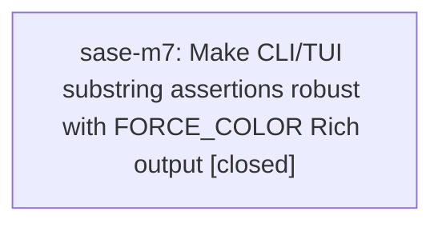

# Bead: sase-m7 — Make CLI/TUI substring assertions robust with FORCE\_COLOR Rich output

[Bead Pages](../README.md) / sase-m7

**Status:** ✓ closed · **Resolution:** done · **Type:** ◆ task · **+1 reports:** +5
**Owner:** `bryanbugyi34@gmail.com` · **Created by:** [bbugyi200.athena.sase-m4.land](https://github.com/sase-org/sase--agents/blob/main/families/bbugyi200.athena.sase-m4.land.md) · **Assignee:** `sase-m7` · **Size:** large
**Created:** 2026-08-14 18:13:02 EDT · **Closed:** 2026-08-15 17:16:03 EDT

## Description

Proposed by epic sase-m4.2 and recorded during finish_github_actions_stabilization follow-up triage on 2026-08-14. With FORCE_COLOR set by the agent/CI environment, roughly 118 CLI/TUI tests assert plain substrings against Rich-rendered output that now includes ANSI escape sequences; examples called out by the epic review include test_cli_work_from_plan_preview and the plugins pane. The same tests pass with NO_COLOR=1, so this is an environment-sensitive assertion/output-normalization problem rather than a behavior change from epic sase-m4. Scope: reproduce the FORCE_COLOR failures, identify whether test helpers should force colorless capture or assertions should strip/normalize Rich ANSI intentionally, update the shared helper path instead of one-off weakening assertions, and keep coverage for colored rendering where it is explicitly under test.

## Notes

[2026-08-15T21:16:03Z · sase-m7] Implemented forced-color test isolation. Verified with: env FORCE_COLOR=1 CLICOLOR_FORCE=1 CLICOLOR=1 NO_COLOR=1 CI=1 .venv/bin/pytest tests/test_plan_validate.py tests/prompt_command/test_search_cli.py::test_color_never_emits_no_ansi tests/prompt_command/test_search_cli.py::test_color_always_highlights_match tests/prompt_command/test_search_render.py::test_json_is_never_colored tests/test_plan_search_render.py::test_color_always_emits_ansi tests/test_plan_search_render.py::test_color_never_strips_ansi tests/test_plan_search_render.py::test_color_auto_on_non_tty_has_no_ansi tests/test_axe_status_cli.py::test_terminal_color_is_enabled_deliberately_and_plain_when_redirected (40 passed); just check passed and escalated scoped tests to the full non-visual suite due root-conftest change.

## +1 Evidence

> **+1** by `01v` · 2026-08-14 18:23:25 EDT
> **Observed since:** 2026-08-14 18:05:16 EDT
>
> Independent reproduction on 2026-08-14 while implementing k_preview_shorthand_arg_text (preview/K parser change; no CLI/TUI render path). just check with the agent env FORCE_COLOR=1 CLICOLOR_FORCE=1 failed 23 tests whose assertions look for unstyled substrings: tests/test_plan_command_handler.py (error [tale-size-missing] vs ESC[1merror), tests/test_bead/test_cli_plus_one.py (+1 recorded vs +ESC[1m1ESC[0m recorded), tests/main/test_agents_tribe_handler.py (Project: dotfiles hidden by styled Name:), and plugins-pane tests (↑ N incoming commits / u  run `sase update` / 30s ago · ,U). Isolated reruns of three of those nodes pass with env -u FORCE_COLOR -u CLICOLOR_FORCE -u CLICOLOR NO_COLOR=1. Not caused by the shorthand-preview change.

> **+1** by `sase-m9.1.1.land` · 2026-08-14 21:23:55 EDT
> **Observed since:** 2026-08-14 21:15:30 EDT
>
> PROPOSED FOLLOW-UP disposition from sase-m9.1.1.1: independently reproduced on the combined shell-taxonomy tree with CI=1 FORCE_COLOR=1 uv run pytest -q tests/test_file_hook_cli.py tests/test_plan_validate.py, yielding 10 failures and 29 passes; the same tests pass without FORCE_COLOR=1. The phase note also called out related raw-string ANSI assertion risk in bead CLI, plugin panes, and commit-publication warning tests. This is the same FORCE_COLOR Rich-output assertion defect already scoped by sase-m7, and it is not caused by epic sase-m9.1.1.

> **+1** by `01y` · 2026-08-15 05:38:09 EDT
> **Observed since:** 2026-08-15 05:31:21 EDT
>
> Independent reproduction on 2026-08-15 while implementing fix_child_epic_clan_lane (src/sase/bead/epic_launch.py lane derivation only). just check lint gates passed; the escalated scoped suite failed 25 tests whose assertions look for unstyled substrings against Rich ANSI output: tests/test_plan_validate.py, tests/test_plan_command_handler.py, tests/test_bead/test_cli_work_from_plan.py, tests/test_bead/test_cli_work_from_plan_preview.py, tests/test_bead/test_prefix_mint_guard.py, tests/test_notification_gate_cli.py, tests/test_gate_cli_show.py, tests/test_plan_approve_cli.py. Agent env was FORCE_COLOR=1 CLICOLOR_FORCE=1 CLICOLOR=1 NO_COLOR=1 CI=true. Focused tests/test_bead/test_epic_launch.py passed 27/27. Not caused by the clan-lane change.

> **+1** by `sase-m9.2.1.land` · 2026-08-15 10:18:12 EDT
> **Observed since:** 2026-08-15 10:10:40 EDT
>
> PROPOSED FOLLOW-UP disposition from phases sase-m9.2.1.2, sase-m9.2.1.3, and sase-m9.2.1.4: their just-check lanes independently failed 50-116 CLI/TUI assertions because FORCE_COLOR Rich output injects ANSI styling around numbers/brackets; smallest named repro tests/test_output.py::test_escape_markup_in_log_fn. This is the same environment-sensitive assertion/output-normalization defect already scoped by sase-m7 and is unrelated to the proc-shell epic.

> **+1** by `sase-ll` · 2026-08-15 16:04:39 EDT
> **Observed since:** 2026-08-15 15:35:47 EDT
>
> Independent 2026-08-15 reproduction while implementing sase-ll (monitor implicit caller identity; no CLI/TUI render path). just check lint gates passed, then test-scoped escalated to the full suite (rules: core-identity-changed after just install rebuilt sase_core_rs). Result: 116 failed, 30316 passed, 11 skipped. Every failure is a CLI/TUI substring assertion against Rich ANSI (FORCE_COLOR=1/CLICOLOR_FORCE=1): tests/test_bead/test_cli_work_from_plan_preview.py, tests/test_vcs_log_render_*.py, tests/test_file_hook_cli.py, tests/test_output.py::test_escape_markup_in_log_fn, plugin pane tests, etc. No tests/monitor/* or test_monitor_handler_* nodes failed. Same environment-sensitive assertion defect already scoped by sase-m7; not caused by the monitor start identity change.

## Lineage

## Agents

| Agent | Bead | Commits |
|---|---|---:|
| [bbugyi200.athena.sase-m7](https://github.com/sase-org/sase--agents/blob/main/families/bbugyi200.athena.sase-m7.md) | [sase-m7](README.md) | 1 |

## Commits

| Repo | Commit | Subject | Bead | Committed |
|---|---|---|---|---|
| sase | [`2c9f2b7`](https://github.com/sase-org/sase/commit/2c9f2b7fab35576642f50f0c5007494f805174db) | test: isolate tests from ambient color overrides | [sase-m7](README.md) | 2026-08-15 17:16:54 EDT |
