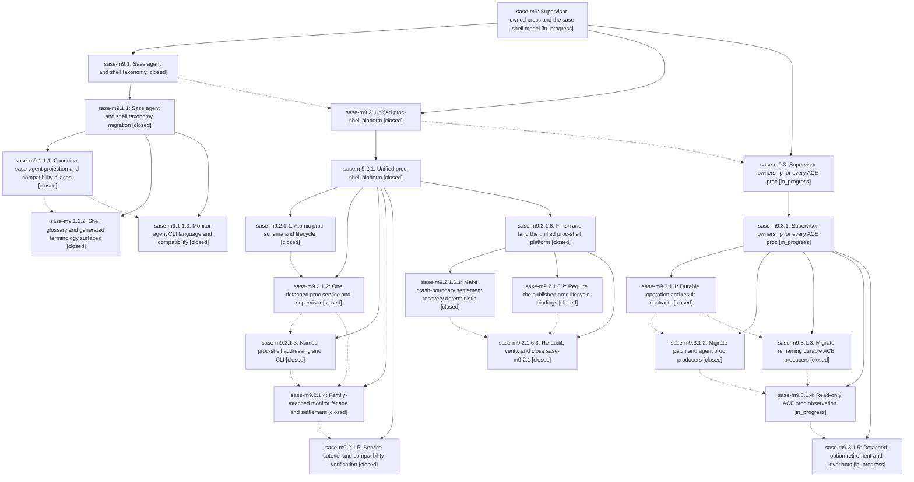

# Bead: sase-m9 — Supervisor-owned procs and the sase shell model

[Bead Pages](../README.md) / sase-m9

**Status:** ◐ in_progress · **Type:** ▸ plan · **Tier:** epic
**Owner:** `bryanbugyi34@gmail.com` · **Created by:** [bbugyi200.athena.01x](https://github.com/sase-org/sase--agents/blob/main/families/bbugyi200.athena.01x.md) · **Assignee:** `sase-m9.land`
**Created:** 2026-08-14 19:16:40 EDT
**Plan:** [202608/supervised\_proc\_shells.md](https://github.com/sase-org/sase--plans/blob/main/202608/supervised_proc_shells.md)

## Description

Every durable proc is detached and supervisor-owned, monitors are a proc-shell facade, ACE owns no proc execution, and SASE presents one coherent agent-and-shell taxonomy.

## Notes

[2026-08-15T22:26:45Z · sase-mc.5.land] DISCOVERED ISSUE: Proposed by phase sase-mc.5.2 and reproduced by land agent on current master 3b810036f: sase monitor show g6g21192dysz --all-lines crashes in list_monitors with ValueError because ace-run artifact 20260815145837 has agent_family_role=monitor but no monitor_id. This is unrelated to provider disabling and causally belongs to the active supervisor-owned proc/monitor-facade epic; monitor listing/show must tolerate or correctly classify legacy/malformed monitor-role artifacts.

[2026-08-15T22:38:23Z · sase-me--1] DISCOVERED ISSUE: Independently reproduced while finishing task sase-me on current master 5b4d5b3c6: sase monitor show vhy8mhvgd48q --all-lines crashes in list_monitors with ValueError because ace-run artifact 20260815145837 is not a monitor member. This blocks retained-log inspection for a completed monitor and corroborates the existing malformed monitor-role artifact report; causal owner is the active supervisor-owned proc/monitor-facade epic.

## Phases

| Bead | Title | Status | Size | Created | Agents | Commits |
|---|---|---|---|---|---:|---:|
| [sase-m9.1](sase-m9.1.md) | Sase agent and shell taxonomy | ✓ closed | xlarge | 2026-08-14 | 1 | 0 |
| [sase-m9.2](sase-m9.2.md) | Unified proc-shell platform | ✓ closed | xlarge | 2026-08-14 | 1 | 0 |
| [sase-m9.3](sase-m9.3.md) | Supervisor ownership for every ACE proc | ◐ in_progress | xlarge | 2026-08-14 | 1 | 0 |

## Lineage

## Agents

| Agent | Bead | Commits |
|---|---|---:|
| [bbugyi200.athena.sase-m9.1](https://github.com/sase-org/sase--agents/blob/main/families/bbugyi200.athena.sase-m9.1.md) | [sase-m9.1](sase-m9.1.md) | 0 |
| [bbugyi200.athena.sase-m9.1.1.1](https://github.com/sase-org/sase--agents/blob/main/agents/bbugyi200.athena.sase-m9.1.1.1/README.md) | [sase-m9.1.1.1](sase-m9.1.1.1.md) | 1 |
| [bbugyi200.athena.sase-m9.1.1.2](https://github.com/sase-org/sase--agents/blob/main/agents/bbugyi200.athena.sase-m9.1.1.2/README.md) | [sase-m9.1.1.2](sase-m9.1.1.2.md) | 1 |
| [bbugyi200.athena.sase-m9.1.1.3](https://github.com/sase-org/sase--agents/blob/main/agents/bbugyi200.athena.sase-m9.1.1.3/README.md) | [sase-m9.1.1.3](sase-m9.1.1.3.md) | 1 |
| [bbugyi200.athena.sase-m9.1.1.land](https://github.com/sase-org/sase--agents/blob/main/families/bbugyi200.athena.sase-m9.1.1.land.md) | [sase-m9.1.1](sase-m9.1.1.md) | 1 |
| [bbugyi200.athena.sase-m9.2](https://github.com/sase-org/sase--agents/blob/main/families/bbugyi200.athena.sase-m9.2.md) | [sase-m9.2](sase-m9.2.md) | 0 |
| [bbugyi200.athena.sase-m9.2.1.1](https://github.com/sase-org/sase--agents/blob/main/agents/bbugyi200.athena.sase-m9.2.1.1/README.md) | [sase-m9.2.1.1](sase-m9.2.1.1.md) | 2 |
| [bbugyi200.athena.sase-m9.2.1.2](https://github.com/sase-org/sase--agents/blob/main/agents/bbugyi200.athena.sase-m9.2.1.2/README.md) | [sase-m9.2.1.2](sase-m9.2.1.2.md) | 1 |
| [bbugyi200.athena.sase-m9.2.1.3](https://github.com/sase-org/sase--agents/blob/main/agents/bbugyi200.athena.sase-m9.2.1.3/README.md) | [sase-m9.2.1.3](sase-m9.2.1.3.md) | 1 |
| [bbugyi200.athena.sase-m9.2.1.4](https://github.com/sase-org/sase--agents/blob/main/agents/bbugyi200.athena.sase-m9.2.1.4/README.md) | [sase-m9.2.1.4](sase-m9.2.1.4.md) | 1 |
| [bbugyi200.athena.sase-m9.2.1.5](https://github.com/sase-org/sase--agents/blob/main/families/bbugyi200.athena.sase-m9.2.1.5.md) | [sase-m9.2.1.5](sase-m9.2.1.5.md) | 1 |
| [bbugyi200.athena.sase-m9.2.1.6.1](https://github.com/sase-org/sase--agents/blob/main/agents/bbugyi200.athena.sase-m9.2.1.6.1/README.md) | [sase-m9.2.1.6.1](sase-m9.2.1.6.1.md) | 1 |
| [bbugyi200.athena.sase-m9.2.1.6.2](https://github.com/sase-org/sase--agents/blob/main/agents/bbugyi200.athena.sase-m9.2.1.6.2/README.md) | [sase-m9.2.1.6.2](sase-m9.2.1.6.2.md) | 1 |
| [bbugyi200.athena.sase-m9.2.1.6.3](https://github.com/sase-org/sase--agents/blob/main/families/bbugyi200.athena.sase-m9.2.1.6.3.md) | [sase-m9.2.1.6.3](sase-m9.2.1.6.3.md) | 0 |
| [bbugyi200.athena.sase-m9.2.1.6.land](https://github.com/sase-org/sase--agents/blob/main/families/bbugyi200.athena.sase-m9.2.1.6.land.md) | [sase-m9.2.1.6](sase-m9.2.1.6.md) | 2 |
| [bbugyi200.athena.sase-m9.2.1.land](https://github.com/sase-org/sase--agents/blob/main/families/bbugyi200.athena.sase-m9.2.1.land.md) | [sase-m9.2.1](sase-m9.2.1.md) | 0 |
| [bbugyi200.athena.sase-m9.3](https://github.com/sase-org/sase--agents/blob/main/families/bbugyi200.athena.sase-m9.3.md) | [sase-m9.3](sase-m9.3.md) | 0 |
| [bbugyi200.athena.sase-m9.3.1.1](https://github.com/sase-org/sase--agents/blob/main/families/bbugyi200.athena.sase-m9.3.1.1.md) | [sase-m9.3.1.1](sase-m9.3.1.1.md) | 1 |
| [bbugyi200.athena.sase-m9.3.1.2](https://github.com/sase-org/sase--agents/blob/main/families/bbugyi200.athena.sase-m9.3.1.2.md) | [sase-m9.3.1.2](sase-m9.3.1.2.md) | 1 |
| [bbugyi200.athena.sase-m9.3.1.3](https://github.com/sase-org/sase--agents/blob/main/families/bbugyi200.athena.sase-m9.3.1.3.md) | [sase-m9.3.1.3](sase-m9.3.1.3.md) | 1 |
| [bbugyi200.athena.sase-m9.3.1.4](https://github.com/sase-org/sase--agents/blob/main/agents/bbugyi200.athena.sase-m9.3.1.4/README.md) | [sase-m9.3.1.4](sase-m9.3.1.4.md) | 0 |
| [bbugyi200.athena.sase-m9.3.1.5](https://github.com/sase-org/sase--agents/blob/main/agents/bbugyi200.athena.sase-m9.3.1.5/README.md) | [sase-m9.3.1.5](sase-m9.3.1.5.md) | 0 |
| [bbugyi200.athena.sase-m9.3.1.land](https://github.com/sase-org/sase--agents/blob/main/agents/bbugyi200.athena.sase-m9.3.1.land/README.md) | [sase-m9.3.1](sase-m9.3.1.md) | 0 |
| [bbugyi200.athena.sase-m9.land](https://github.com/sase-org/sase--agents/blob/main/agents/bbugyi200.athena.sase-m9.land/README.md) | [sase-m9](README.md) | 0 |

## Commits

| Repo | Commit | Subject | Bead | Committed |
|---|---|---|---|---|
| sase | [`4280bc9`](https://github.com/sase-org/sase/commit/4280bc990c59dd3c2558af442673b0c037015281) | refactor(agents): introduce canonical SaseAgentRef projection | [sase-m9.1.1.1](sase-m9.1.1.1.md) | 2026-08-14 19:59:18 EDT |
| sase | [`e923dcb`](https://github.com/sase-org/sase/commit/e923dcb5d104705db58ffdf402309b85aac160b5) | feat(monitor)!: rename monitor CLI lane-facing language to agent | [sase-m9.1.1.3](sase-m9.1.1.3.md) | 2026-08-14 20:27:09 EDT |
| sase | [`2265f26`](https://github.com/sase-org/sase/commit/2265f2618c149e6c29cada008d8121c7544b9332) | refactor: rename agent lane surfaces to sase agents | [sase-m9.1.1.2](sase-m9.1.1.2.md) | 2026-08-14 21:01:45 EDT |
| sase | [`76356cf`](https://github.com/sase-org/sase/commit/76356cf57d71e7574350f003f15caea0f50d9c0d) | docs: align shell taxonomy wording | [sase-m9.1.1](sase-m9.1.1.md) | 2026-08-14 21:36:53 EDT |
| sase-core | [`sase-core@6d7000a`](https://github.com/sase-org/sase-core/commit/6d7000ac8d07638f9541666de1edc09dcfd8574e) | feat(procs): add proc-shell lifecycle operations | [sase-m9.2.1.1](sase-m9.2.1.1.md) | 2026-08-15 06:53:32 EDT |
| sase | [`11072ba`](https://github.com/sase-org/sase/commit/11072ba5d56ba1968bf7c2f16df38ab31ff92c38) | feat(procs): expose proc-shell lifecycle facade | [sase-m9.2.1.1](sase-m9.2.1.1.md) | 2026-08-15 06:54:25 EDT |
| sase | [`152268b`](https://github.com/sase-org/sase/commit/152268b597d070c653fe022e88c9370352e07a08) | feat(procs): route submits through one typed supervisor service | [sase-m9.2.1.2](sase-m9.2.1.2.md) | 2026-08-15 07:37:40 EDT |
| sase | [`1e242aa`](https://github.com/sase-org/sase/commit/1e242aa8b9e8c6c4bc4213fa84526378ec3512a2) | feat(procs): address named proc shells from the CLI | [sase-m9.2.1.3](sase-m9.2.1.3.md) | 2026-08-15 08:12:12 EDT |
| sase | [`8b4635a`](https://github.com/sase-org/sase/commit/8b4635ad13e8caa76a004adee92d41c4322fd43c) | feat(monitor): run monitors through the shared proc service | [sase-m9.2.1.4](sase-m9.2.1.4.md) | 2026-08-15 09:25:57 EDT |
| sase | [`6683d4b`](https://github.com/sase-org/sase/commit/6683d4bcc25c173a5a5903e1884271f0acb3f937) | docs: document named proc shell addressing | [sase-m9.2.1.5](sase-m9.2.1.5.md) | 2026-08-15 10:09:31 EDT |
| sase | [`ca93686`](https://github.com/sase-org/sase/commit/ca93686a65d1ad53ecf1c94d024658750f05bb27) | build(deps): require proc lifecycle core bindings | [sase-m9.2.1.6.2](sase-m9.2.1.6.2.md) | 2026-08-15 11:28:02 EDT |
| sase | [`ffce3c8`](https://github.com/sase-org/sase/commit/ffce3c842846352f6b39e66066fdd30aaf9cd193) | fix(procs): recover proc-shell settlement while waiting | [sase-m9.2.1.6.1](sase-m9.2.1.6.1.md) | 2026-08-15 11:28:41 EDT |
| sase | [`4ba7ee8`](https://github.com/sase-org/sase/commit/4ba7ee812573024d48b201d223c7cc075903b3b0) | build(deps): require provider-disable core floor | [sase-m9.2.1.6](sase-m9.2.1.6.md) | 2026-08-15 12:56:20 EDT |
| sase-core | [`sase-core@1ecbc8c`](https://github.com/sase-org/sase-core/commit/1ecbc8c54af83e069b26aca148e102774fde756d) | fix(notifications): preserve snooze microsecond timestamps | [sase-m9.2.1.6](sase-m9.2.1.6.md) | 2026-08-15 13:22:27 EDT |
| sase | [`07e254a`](https://github.com/sase-org/sase/commit/07e254a42073f3367bba23b1beb893ad72f92635) | feat(ops): add durable operation contracts and producer inventory | [sase-m9.3.1.1](sase-m9.3.1.1.md) | 2026-08-15 16:39:31 EDT |
| sase | [`0835b38`](https://github.com/sase-org/sase/commit/0835b38d24fb0316d23e664b2d3d7a0ee079c49c) | feat(ace): migrate Patch and agent producers to durable argv | [sase-m9.3.1.2](sase-m9.3.1.2.md) | 2026-08-15 18:40:26 EDT |
| sase | [`7d7581a`](https://github.com/sase-org/sase/commit/7d7581a21cc7e3418979f09b2b17c8ec0daba0f6) | feat(ace): migrate remaining durable producers | [sase-m9.3.1.3](sase-m9.3.1.3.md) | 2026-08-15 18:56:54 EDT |
