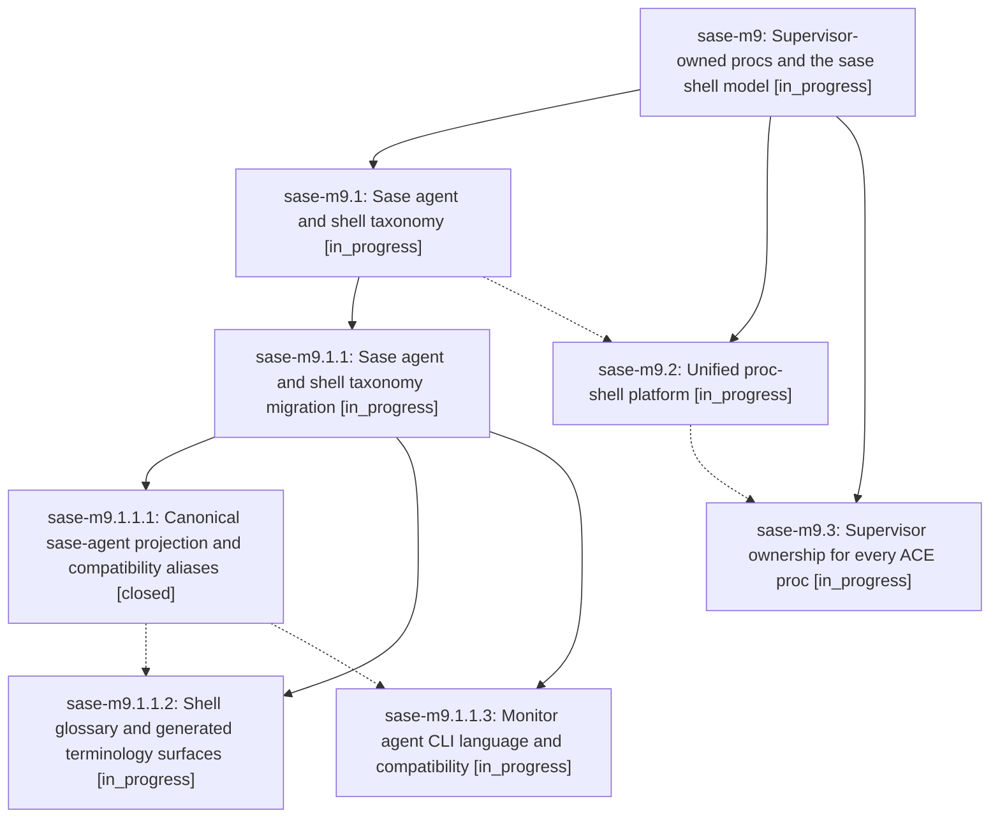

# Bead: sase-m9 — Supervisor-owned procs and the sase shell model

[Bead Pages](../README.md) / sase-m9

**Status:** ◐ in_progress · **Type:** ▸ plan · **Tier:** epic
**Owner:** `bryanbugyi34@gmail.com` · **Created by:** [bbugyi200.athena.01x](https://github.com/sase-org/sase--agents/blob/main/families/bbugyi200.athena.01x.md) · **Assignee:** `sase-m9.land`
**Created:** 2026-08-14 19:16:40 EDT
**Plan:** [202608/supervised\_proc\_shells.md](https://github.com/sase-org/sase--plans/blob/main/202608/supervised_proc_shells.md)

## Description

Every durable proc is detached and supervisor-owned, monitors are a proc-shell facade, ACE owns no proc execution, and SASE presents one coherent agent-and-shell taxonomy.

## Phases

| Bead | Title | Status | Size | Created | Agents | Commits |
|---|---|---|---|---|---:|---:|
| [sase-m9.1](sase-m9.1.md) | Sase agent and shell taxonomy | ◐ in_progress | xlarge | 2026-08-14 | 1 | 0 |
| [sase-m9.2](sase-m9.2.md) | Unified proc-shell platform | ◐ in_progress | xlarge | 2026-08-14 | 1 | 0 |
| [sase-m9.3](sase-m9.3.md) | Supervisor ownership for every ACE proc | ◐ in_progress | xlarge | 2026-08-14 | 1 | 0 |

## Lineage

## Agents

| Agent | Bead | Commits |
|---|---|---:|
| [bbugyi200.athena.sase-m9.1](https://github.com/sase-org/sase--agents/blob/main/families/bbugyi200.athena.sase-m9.1.md) | [sase-m9.1](sase-m9.1.md) | 0 |
| [bbugyi200.athena.sase-m9.1.1.1](https://github.com/sase-org/sase--agents/blob/main/agents/bbugyi200.athena.sase-m9.1.1.1/README.md) | [sase-m9.1.1.1](sase-m9.1.1.1.md) | 1 |
| [bbugyi200.athena.sase-m9.1.1.2](https://github.com/sase-org/sase--agents/blob/main/agents/bbugyi200.athena.sase-m9.1.1.2/README.md) | [sase-m9.1.1.2](sase-m9.1.1.2.md) | 0 |
| [bbugyi200.athena.sase-m9.1.1.3](https://github.com/sase-org/sase--agents/blob/main/agents/bbugyi200.athena.sase-m9.1.1.3/README.md) | [sase-m9.1.1.3](sase-m9.1.1.3.md) | 0 |
| [bbugyi200.athena.sase-m9.1.1.land](https://github.com/sase-org/sase--agents/blob/main/agents/bbugyi200.athena.sase-m9.1.1.land/README.md) | [sase-m9.1.1](sase-m9.1.1.md) | 0 |
| [bbugyi200.athena.sase-m9.2](https://github.com/sase-org/sase--agents/blob/main/agents/bbugyi200.athena.sase-m9.2/README.md) | [sase-m9.2](sase-m9.2.md) | 0 |
| [bbugyi200.athena.sase-m9.3](https://github.com/sase-org/sase--agents/blob/main/agents/bbugyi200.athena.sase-m9.3/README.md) | [sase-m9.3](sase-m9.3.md) | 0 |
| [bbugyi200.athena.sase-m9.land](https://github.com/sase-org/sase--agents/blob/main/agents/bbugyi200.athena.sase-m9.land/README.md) | [sase-m9](README.md) | 0 |

## Commits

| Repo | Commit | Subject | Bead | Committed |
|---|---|---|---|---|
| sase | [`4280bc9`](https://github.com/sase-org/sase/commit/4280bc990c59dd3c2558af442673b0c037015281) | refactor(agents): introduce canonical SaseAgentRef projection | [sase-m9.1.1.1](sase-m9.1.1.1.md) | 2026-08-14 19:59:18 EDT |
