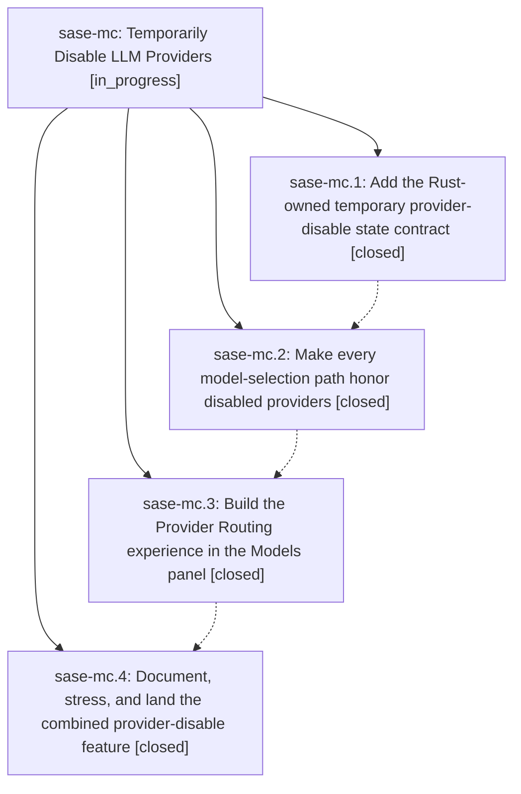

# Bead: sase-mc — Temporarily Disable LLM Providers

[Bead Pages](../README.md) / sase-mc

**Status:** ◐ in_progress · **Type:** ▸ plan · **Tier:** epic
**Owner:** `bryanbugyi34@gmail.com` · **Created by:** [bbugyi200.athena.02f](https://github.com/sase-org/sase--agents/blob/main/families/bbugyi200.athena.02f.md) · **Assignee:** `sase-mc.land`
**Created:** 2026-08-15 11:11:45 EDT
**Plan:** [202608/temporary\_provider\_disabling.md](https://github.com/sase-org/sase--plans/blob/main/202608/temporary_provider_disabling.md)

## Description

Let users temporarily disable one or more registered LLM providers from the ACE Models panel, with durable machine-wide expiry state, routing semantics that remove disabled providers from alias pools and ordered fallbacks, preserved-but-suspended alias overrides, actionable failures for direct explicit requests, and a polished provider-management/countdown experience that stays responsive and visible.

## Phases

| Bead | Title | Status | Size | Created | Agents | Commits |
|---|---|---|---|---|---:|---:|
| [sase-mc.1](sase-mc.1.md) | Add the Rust-owned temporary provider-disable state contract | ✓ closed | medium | 2026-08-15 | 1 | 2 |
| [sase-mc.2](sase-mc.2.md) | Make every model-selection path honor disabled providers | ✓ closed | medium | 2026-08-15 | 1 | 1 |
| [sase-mc.3](sase-mc.3.md) | Build the Provider Routing experience in the Models panel | ✓ closed | medium | 2026-08-15 | 1 | 1 |
| [sase-mc.4](sase-mc.4.md) | Document, stress, and land the combined provider-disable feature | ✓ closed | small | 2026-08-15 | 1 | 1 |

## Lineage

## Agents

| Agent | Bead | Commits |
|---|---|---:|
| [bbugyi200.athena.sase-mc.1](https://github.com/sase-org/sase--agents/blob/main/agents/bbugyi200.athena.sase-mc.1/README.md) | [sase-mc.1](sase-mc.1.md) | 2 |
| [bbugyi200.athena.sase-mc.2](https://github.com/sase-org/sase--agents/blob/main/agents/bbugyi200.athena.sase-mc.2/README.md) | [sase-mc.2](sase-mc.2.md) | 1 |
| [bbugyi200.athena.sase-mc.3](https://github.com/sase-org/sase--agents/blob/main/agents/bbugyi200.athena.sase-mc.3/README.md) | [sase-mc.3](sase-mc.3.md) | 1 |
| [bbugyi200.athena.sase-mc.4](https://github.com/sase-org/sase--agents/blob/main/agents/bbugyi200.athena.sase-mc.4/README.md) | [sase-mc.4](sase-mc.4.md) | 1 |
| [bbugyi200.athena.sase-mc.land](https://github.com/sase-org/sase--agents/blob/main/agents/bbugyi200.athena.sase-mc.land/README.md) | [sase-mc](README.md) | 0 |

## Commits

| Repo | Commit | Subject | Bead | Committed |
|---|---|---|---|---|
| sase-core | [`sase-core@9939f8f`](https://github.com/sase-org/sase-core/commit/9939f8f28ee3ab9a9c1a90f94f17fc58bd3d7c91) | feat(llm-provider): add provider-disable state store | [sase-mc.1](sase-mc.1.md) | 2026-08-15 12:19:57 EDT |
| sase | [`8902cb5`](https://github.com/sase-org/sase/commit/8902cb5e5eea51e8f795e7f6816a53142605f46c) | feat(llm-provider): add temporary provider-disable facade | [sase-mc.1](sase-mc.1.md) | 2026-08-15 12:22:29 EDT |
| sase | [`58b9b44`](https://github.com/sase-org/sase/commit/58b9b447fed9d5bc4d7d637fbf428aea43b0f9f0) | feat(llm-provider): honor disabled providers in model routing | [sase-mc.2](sase-mc.2.md) | 2026-08-15 13:29:59 EDT |
| sase | [`868f376`](https://github.com/sase-org/sase/commit/868f376dfa797852ba4f116df1d778e05fbb8bd8) | feat(ace): add provider routing controls to models panel | [sase-mc.3](sase-mc.3.md) | 2026-08-15 14:48:16 EDT |
| sase | [`3a31bd3`](https://github.com/sase-org/sase/commit/3a31bd3b8c4a5082edc772b50f07103436ff5764) | feat(llm): land provider disable integration | [sase-mc.4](sase-mc.4.md) | 2026-08-15 15:42:51 EDT |
