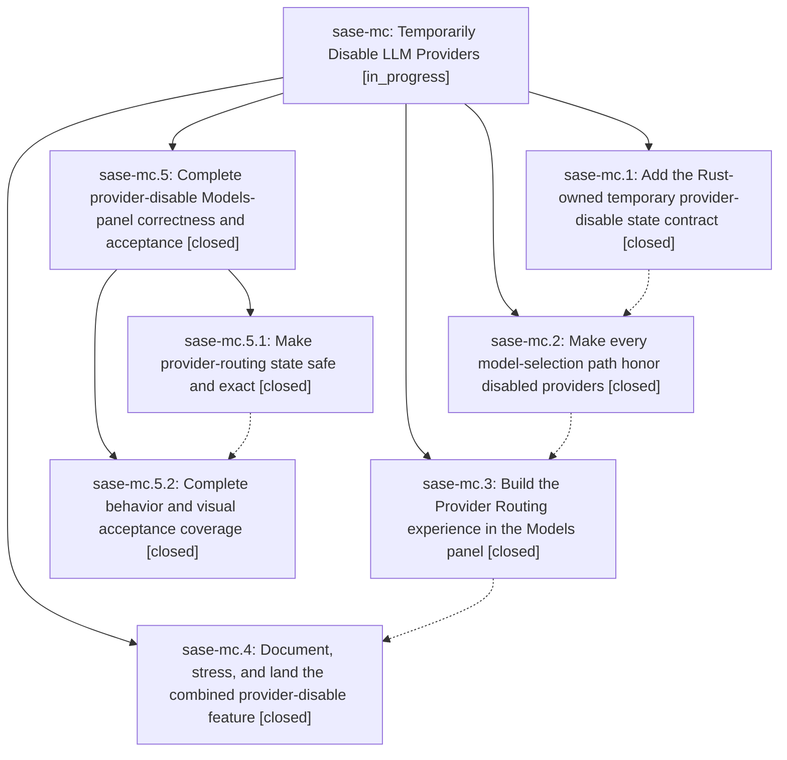

# Bead: sase-mc — Temporarily Disable LLM Providers

[Bead Pages](../README.md) / sase-mc

**Status:** ◐ in_progress · **Type:** ▸ plan · **Tier:** epic
**Owner:** `bryanbugyi34@gmail.com` · **Created by:** [bbugyi200.athena.02f](https://github.com/sase-org/sase--agents/blob/main/families/bbugyi200.athena.02f.md) · **Assignee:** `sase-mc.land`
**Created:** 2026-08-15 11:11:45 EDT
**Plan:** [202608/temporary\_provider\_disabling.md](https://github.com/sase-org/sase--plans/blob/main/202608/temporary_provider_disabling.md)

## Description

Let users temporarily disable one or more registered LLM providers from the ACE Models panel, with durable machine-wide expiry state, routing semantics that remove disabled providers from alias pools and ordered fallbacks, preserved-but-suspended alias overrides, actionable failures for direct explicit requests, and a polished provider-management/countdown experience that stays responsive and visible.

## Notes

[2026-08-15T20:09:02Z · sase-mc.land] LANDING AUDIT 2026-08-15: Reviewed the epic, linked plan, all four child descriptions and every child note; audited sase commits 8902cb5e, 58b9b447, 868f376d, and 3a31bd3b plus linked sase-core commit 9939f8f; read the Rust provider-disable store and PyO3 surface, Python facade/peek/routing/default/alias integrations, Models-panel provider UI, and top-bar indicator. Focused provider verification passes: 43 tests across provider_disable, peek, routing, smoke, Models-panel provider routing, and indicator. Reviewed every non-epic commit since 8902cb5e in sase and sase-core: the 0.27.5 floor already integrates the Rust binding; later Artifacts query commits explain unrelated visual drift and are owned by sase-m6.6.1; nested-landing, Stitches debounce, H-collapse, test-isolation, snooze timestamp, and model-route primitive commits do not require provider-disable integration. Epic is not ready to close: ModelsPanel synchronous compose/refresh calls build_alias_views without its loaded in-memory provider snapshot, allowing authoritative Rust state I/O and its lock wait on the Textual event loop; free-form custom model submission in override and edit flows can bypass disabled-provider rejection; opening the Provider Routing modal applies its initial snapshot through an unconditional changed callback and falsely marks routing changed; and phase 3 acceptance coverage is materially short of the plan, with only five behavior tests and three primary provider PNGs rather than the promised duration, enable, replace/exact, cancellation, worker/error/stale-completion/countdown/cursor, multiple-pill, and narrow-manager matrix. These are epic-caused completion gaps, so landing is paused for a child remediation plan; do not close sase-mc or mark temporary_provider_disabling.md done yet.

[2026-08-15T20:09:29Z · sase-mc.land] FOLLOW-UP DISPOSITION 2026-08-15: Collected every PROPOSED FOLLOW-UP from sase-mc.3 and sase-mc.4. The Artifacts Beads/Files PNG drift and commits-fixture normalize_reference_time errors were reproduced in a targeted visual run as 3 failures and 11 errors, registered as file:explicit:b511fe27a71b5834683146da, and attached as a DISCOVERED ISSUE to active causally owning query-migration epic sase-m6.6.1; no duplicate task created. The phase-agent monitor family-attach failure is exact ready task sase-ll and received +1 evidence naming proposer sase-mc.4. The partial-line monitor-supervisor flake is exact ready task sase-lk and received +1. The notification mute/snooze round-trip flake is exact ready task sase-me and received +1. The plan-approval inflight-anchor flake and proc settlement-resume flake were attached as separate corroborating DISCOVERED ISSUE notes to active epic sase-j7, which owns the process-global/pass-isolation flake class; both have earlier independent reports and are unrelated to provider disabling. The one stale node is tests/test_external_mirror_issues.py::test_creation_budget_defers_then_converges_next_pass: current selection-health explicitly classifies it as no longer collectable and excludes it from the live gate, matching the already-landed stale-node classifier work, so no new work was filed. Current selection-health still reports exactly the four live nodes above, and all have durable owners. No proposal was silently dropped.

## Phases

| Bead | Title | Status | Size | Created | Agents | Commits |
|---|---|---|---|---|---:|---:|
| [sase-mc.1](sase-mc.1.md) | Add the Rust-owned temporary provider-disable state contract | ✓ closed | medium | 2026-08-15 | 1 | 2 |
| [sase-mc.2](sase-mc.2.md) | Make every model-selection path honor disabled providers | ✓ closed | medium | 2026-08-15 | 1 | 1 |
| [sase-mc.3](sase-mc.3.md) | Build the Provider Routing experience in the Models panel | ✓ closed | medium | 2026-08-15 | 1 | 1 |
| [sase-mc.4](sase-mc.4.md) | Document, stress, and land the combined provider-disable feature | ✓ closed | small | 2026-08-15 | 1 | 1 |

## Lineage

## Agents

| Agent | Bead | Commits |
|---|---|---:|
| [bbugyi200.athena.sase-mc.1](https://github.com/sase-org/sase--agents/blob/main/agents/bbugyi200.athena.sase-mc.1/README.md) | [sase-mc.1](sase-mc.1.md) | 2 |
| [bbugyi200.athena.sase-mc.2](https://github.com/sase-org/sase--agents/blob/main/agents/bbugyi200.athena.sase-mc.2/README.md) | [sase-mc.2](sase-mc.2.md) | 1 |
| [bbugyi200.athena.sase-mc.3](https://github.com/sase-org/sase--agents/blob/main/agents/bbugyi200.athena.sase-mc.3/README.md) | [sase-mc.3](sase-mc.3.md) | 1 |
| [bbugyi200.athena.sase-mc.4](https://github.com/sase-org/sase--agents/blob/main/agents/bbugyi200.athena.sase-mc.4/README.md) | [sase-mc.4](sase-mc.4.md) | 1 |
| [bbugyi200.athena.sase-mc.5.1](https://github.com/sase-org/sase--agents/blob/main/agents/bbugyi200.athena.sase-mc.5.1/README.md) | [sase-mc.5.1](sase-mc.5.1.md) | 1 |
| [bbugyi200.athena.sase-mc.5.2](https://github.com/sase-org/sase--agents/blob/main/families/bbugyi200.athena.sase-mc.5.2.md) | [sase-mc.5.2](sase-mc.5.2.md) | 1 |
| [bbugyi200.athena.sase-mc.5.land](https://github.com/sase-org/sase--agents/blob/main/families/bbugyi200.athena.sase-mc.5.land.md) | [sase-mc.5](sase-mc.5.md) | 1 |
| [bbugyi200.athena.sase-mc.land](https://github.com/sase-org/sase--agents/blob/main/families/bbugyi200.athena.sase-mc.land.md) | [sase-mc](README.md) | 0 |

## Commits

| Repo | Commit | Subject | Bead | Committed |
|---|---|---|---|---|
| sase-core | [`sase-core@9939f8f`](https://github.com/sase-org/sase-core/commit/9939f8f28ee3ab9a9c1a90f94f17fc58bd3d7c91) | feat(llm-provider): add provider-disable state store | [sase-mc.1](sase-mc.1.md) | 2026-08-15 12:19:57 EDT |
| sase | [`8902cb5`](https://github.com/sase-org/sase/commit/8902cb5e5eea51e8f795e7f6816a53142605f46c) | feat(llm-provider): add temporary provider-disable facade | [sase-mc.1](sase-mc.1.md) | 2026-08-15 12:22:29 EDT |
| sase | [`58b9b44`](https://github.com/sase-org/sase/commit/58b9b447fed9d5bc4d7d637fbf428aea43b0f9f0) | feat(llm-provider): honor disabled providers in model routing | [sase-mc.2](sase-mc.2.md) | 2026-08-15 13:29:59 EDT |
| sase | [`868f376`](https://github.com/sase-org/sase/commit/868f376dfa797852ba4f116df1d778e05fbb8bd8) | feat(ace): add provider routing controls to models panel | [sase-mc.3](sase-mc.3.md) | 2026-08-15 14:48:16 EDT |
| sase | [`3a31bd3`](https://github.com/sase-org/sase/commit/3a31bd3b8c4a5082edc772b50f07103436ff5764) | feat(llm): land provider disable integration | [sase-mc.4](sase-mc.4.md) | 2026-08-15 15:42:51 EDT |
| sase | [`56c0df1`](https://github.com/sase-org/sase/commit/56c0df12b659e28acb29a5a9d8fae16aa9fe2d91) | fix(tui): respect provider disables in Models panel routing | [sase-mc.5.1](sase-mc.5.1.md) | 2026-08-15 16:52:47 EDT |
| sase | [`6841e29`](https://github.com/sase-org/sase/commit/6841e296fc7063142ec6afc42941020c6831fb72) | test: cover provider disable completion flows | [sase-mc.5.2](sase-mc.5.2.md) | 2026-08-15 17:33:52 EDT |
| sase | [`5511f04`](https://github.com/sase-org/sase/commit/5511f04ed37e0545984957e17e52247cc3fa3256) | fix(tui): keep Models selection across provider snapshots | [sase-mc.5](sase-mc.5.md) | 2026-08-15 18:51:27 EDT |
