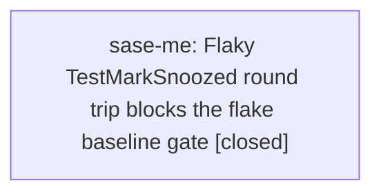

# Bead: sase-me — Flaky TestMarkSnoozed round trip blocks the flake baseline gate

[Bead Pages](../README.md) / sase-me

**Status:** ✓ closed · **Resolution:** done · **Type:** ◆ task · **+1 reports:** +2
**Owner:** `bryanbugyi34@gmail.com` · **Created by:** [bbugyi200.athena.sase-m9.2.1.6.land--2](https://github.com/sase-org/sase--agents/blob/main/families/bbugyi200.athena.sase-m9.2.1.6.land.md) · **Assignee:** `sase-me` · **Size:** large
**Created:** 2026-08-15 13:44:49 EDT · **Closed:** 2026-08-15 18:22:06 EDT

## Description

REPRODUCTION: While landing proc-shell repair on 2026-08-15, monitored just check-full rerun 9av81rgjvjy1 reached the selection-health gate and failed tests/reproducible_flake_baseline.txt with tests/notification_store/test_mute_snooze.py::TestMarkSnoozed::test_round_trip named among three baseline-exceeding nodes. The full-run store shows this exact node failing in three eligible low-cardinality runs: 20260811T110417Z-81e7b02d6906-1036025-full-run.json in workspace sase_12 with external-mirror/bead changed files, 20260812T150940Z-2f1512c7cf52-3106385-full-run.json in workspace sase_13 with AXE dashboard changed files, and 20260815T165940Z-4ba7ee812573-1628751-full-run.json in workspace sase_10 on a clean changed_files=[] tree. The same 4ba7ee812 head then has passing full-run records after the linked-core timestamp formatter fix, including 20260815T172709Z-4ba7ee812573-2101577-full-run.json with zero failures. Focused verification for the 2026-08-15 timestamp regression passed tests/notification_store and the exact node after linked-core commit 1ecbc8c preserved snooze microsecond timestamps.

IMPACT: unrelated landings remain red at the post-pytest selection-health gate until this node is stabilized, retired from the live flake set, or explicitly baselined with a named bead.

SCOPE: reproduce under full parallel/check-full conditions, determine whether the older 2026-08-11/2026-08-12 failures share the timestamp-formatting cause or expose a distinct notification-store state/timing leak, and then fix the test/product contract or add this node to tests/reproducible_flake_baseline.txt with this bead named if it is proven live flake debt. Related context: closed sase-d7 covered an old notification snooze core floor; closed sase-i5 covered bead snooze expired-date fixtures; linked-core commit 1ecbc8c fixed one deterministic 2026-08-15 formatter regression but did not erase the historical flake-gate debt.

## Notes

[2026-08-15T17:45:13Z · sase-m9.2.1.6.land--2] RELATED: sase-d7 — older notification snooze core-floor issue. Not a duplicate: that task was canceled/then effectively handled by raising the 0.17.x floor, while this node is current flake-baseline debt for tests/notification_store/test_mute_snooze.py::TestMarkSnoozed::test_round_trip with records on 2026-08-11, 2026-08-12, and 2026-08-15.

[2026-08-15T17:45:40Z · sase-m9.2.1.6.land--2] RELATED: sase-i5 — closed bead-snooze expired-date fixture fix. Not a duplicate: sase-i5 covers tests/test_bead snooze nodes and wall-clock fixture constants, while this task is the notification-store mute/snooze round-trip node under the flake-baseline gate.

[2026-08-15T17:46:02Z · sase-m9.2.1.6.land--2] RELATED: sase-j7 — active flake-retirement epic with prior notification-store pass-isolation evidence and baseline-shrink ownership. This task remains node-specific because the current evidence does not prove the same process-global state leak root cause; coordinate with sase-j7 if the fix changes selection-health classification or the flake baseline.

[2026-08-15T22:22:06Z · sase-me] Implemented deterministic mark_snoozed round-trip coverage and moved the reproducible-flake cutoff to 2026-08-15T17:22:27Z. Verified repeated target-node runs, tests/notification_store/test_mute_snooze.py, reproducible-flake baseline/report checks, and just check passed; just check-full was left unrun after monitor startup failed.

## +1 Evidence

> **+1** by `sase-mc.land` · 2026-08-15 16:06:47 EDT
> **Observed since:** 2026-08-15 15:45:30 EDT
>
> Independent recurrence proposed by phase sase-mc.4 during provider-disable landing: just selection-health --fail-on-new-flake reported tests/notification_store/test_mute_snooze.py::TestMarkSnoozed::test_round_trip. The provider-disable diff does not touch notification snooze storage.

> **+1** by `sase-m7--2` · 2026-08-15 17:35:11 EDT
> **Observed since:** 2026-08-15 17:30:28 EDT
>
> Independent gate recurrence during sase-m7 verification on 2026-08-15: just selection-health --fail-on-new-flake still reports tests/notification_store/test_mute_snooze.py::TestMarkSnoozed::test_round_trip above the reproducible-flake baseline. The preceding 30,491-pass test-cost lane did not fail this node, and the sase-m7 diff only scrubs ambient console-color variables from pytest, so this is unrelated notification-store flake debt.

## Lineage

## Agents

| Agent | Bead | Commits |
|---|---|---:|
| [bbugyi200.athena.sase-me](https://github.com/sase-org/sase--agents/blob/main/families/bbugyi200.athena.sase-me.md) | [sase-me](README.md) | 1 |

## Commits

| Repo | Commit | Subject | Bead | Committed |
|---|---|---|---|---|
| sase | [`5b4d5b3`](https://github.com/sase-org/sase/commit/5b4d5b3c6ed49d5e4f3fdc46ad196cef6dd47f59) | test: stabilize snoozed notification round trip | [sase-me](README.md) | 2026-08-15 18:23:12 EDT |
