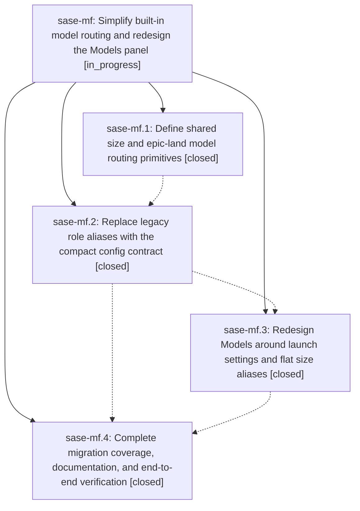

# Bead: sase-mf — Simplify built-in model routing and redesign the Models panel

[Bead Pages](../README.md) / sase-mf

**Status:** ◐ in_progress · **Type:** ▸ plan · **Tier:** epic
**Owner:** `bryanbugyi34@gmail.com` · **Created by:** [bbugyi200.athena.02n](https://github.com/sase-org/sase--agents/blob/main/families/bbugyi200.athena.02n.md) · **Assignee:** `sase-mf.land`
**Created:** 2026-08-15 14:28:42 EDT
**Plan:** [202608/simplify\_models.md](https://github.com/sase-org/sase--plans/blob/main/202608/simplify_models.md)

## Description

SASE exposes only five size aliases, routes launch roles through explicit config fields, and presents every model-related setting in one clear and polished panel

## Notes

[2026-08-15T21:33:51Z · sase-m7--2] DISCOVERED ISSUE: During sase-m7 forced-color fixture full-suite verification on 2026-08-15, monitored just test-cost failed exactly tests/llm_provider/test_provider_disable_smoke.py::test_provider_disable_fresh_process_smoke_matrix after 30,491 passes / 10 skips. The node fails identically both under hostile FORCE_COLOR=1 CLICOLOR_FORCE=1 CLICOLOR=1 NO_COLOR=1 CI=true and with every color/CI override unset: its child process raises StopIteration because build_alias_views no longer exposes medium_worker, while the smoke test still calls set_alias_override("medium_worker", ...) and searches for that retired view. HEAD's only sase-m7 change is tests/_conftest_environment.py plus tests/conftest.py color isolation; the regression is causally linked to this active epic's phase sase-mf.2 role-alias retirement, and phase sase-mf.4 explicitly owns migration coverage and exhaustive verification. Update the smoke matrix to the compact size-alias contract and preserve its provider-disable assertions.

[2026-08-15T22:27:17Z · sase-mc.5.land] DISCOVERED ISSUE: Proposed by phase sase-mc.5.2 and reproduced by land agent on current master 3b810036f: test_alias_overrides_indicator_multi_png_snapshot fails 3715/1520532 pixels (0.244322%). Inspection shows semantic alias-migration drift, not renderer noise: expected pill is @fast +2 while actual is @default +3. The seven provider-disable PNG nodes pass. This is unrelated to provider disabling and causally belongs to the active built-in model-routing/Models redesign epic; phase sase-mf.4 owns migration coverage and combined verification. Related but not duplicate to sase-ma, which tracks a different effort-picker node.

[2026-08-15T22:28:04Z · sase-mc.5.land] DISCOVERED ISSUE: Proposed by phase sase-mc.5.2 and reproduced by land agent on current master 3b810036f: test_alias_overrides_indicator_multi_png_snapshot fails 3715/1520532 pixels (0.244322%). Inspection shows semantic alias-migration drift, not renderer noise: expected pill is @fast +2 while actual is @default +3. The seven provider-disable PNG nodes pass. This is unrelated to provider disabling and causally belongs to the active built-in model-routing/Models redesign epic; phase sase-mf.4 owns migration coverage and combined verification. Related but not duplicate to sase-ma, which tracks a different effort-picker node.

[2026-08-16T02:02:13Z · toobig-2s.split_file.src.sase.ace.tui.widgets.artifacts.files_pane.0] DISCOVERED ISSUE: tests/ace/tui/test_top_bar_order.py::test_override_pills_keep_narrow_top_bar_in_bounds fails deterministically on clean master 117476b7d (reproduced twice with -p no:randomly after git stash -u of an unrelated files_pane.py module split; the file's other 2 nodes pass). The launch-default pill renders ' ... ' instead of ' CODEX(o3)@xhigh ∞ ' at an 80-col top bar: assert default_indicator.render().plain == ' CODEX(o3)@xhigh ∞ ' -> AssertionError: ' ... '. The test monkeypatches llm_override_indicator.get_active_temporary_override and alias_overrides_indicator.get_active_alias_overrides keyed by launch_model_setting_override_key(DEFAULT_MODEL_FIELD), i.e. exactly the launch-settings override keys phase sase-mf.2 introduced (git log for this test file names 2fcca46eb 'feat!: replace role model aliases with size launch settings' as its most recent touch), so the pill either loses its content or is width-starved under the new launch-settings routing. Same shape as the two alias-migration indicator DISCOVERED ISSUEs already on this epic; phase sase-mf.4 owns migration coverage and end-to-end verification. Impact: 'just check'/'just test-scoped' is red for every agent whose scoped selection touches ACE TUI code. RELATED: sase-mk (separate pre-existing symvision gate failure on the same master tree, already in progress).

[2026-08-16T02:48:19Z · toobig-2s.split_file.src.sase.llm_provider.registry.0] DISCOVERED ISSUE: Independent reproduction during unrelated llm_provider registry-split verification on 2026-08-15 at HEAD 392dcc962: tests/ace/tui/test_top_bar_order.py::test_override_pills_keep_narrow_top_bar_in_bounds failed in the 30,687-node full parallel lane (default pill rendered CLAUDE(opus) instead of CODEX(o3)@xhigh) and failed again in immediate serial isolation (rendered ellipsis instead). This confirms the existing epic note from the artifacts files-pane split: the node is a deterministic launch-settings/top-bar migration failure, not renderer noise or registry-split fallout. The current diff touches only src/sase/llm_provider/registry*.py.

[2026-08-16T04:09:15Z · sase-mf.4] DISCOVERED ISSUE: Found while auditing test fixtures for retired model-alias names across the 18 test files listed for phase sase-mf.4's migration-coverage sweep. src/sase/ace/tui/modals/approve_options_modal.py's _tale_followup_lane() (lines ~22-40) still imports MEDIUM_WORKER_MODEL_ALIAS_NAME from sase.llm_provider.config and calls role_model_directive_value(MEDIUM_WORKER_MODEL_ALIAS_NAME) as the coder follow-up model fallback directive whenever no tale plan_file is supplied to ApproveOptionsModal. This is the retired 'medium_worker' role alias, not the new flat 'medium' size alias (src/sase/llm_provider/model_alias_defaults.yml). The sibling plan_file-present path in the same file already resolves correctly through the new size aliases (verified via tests/test_approve_options_modal_model.py::test_default_model_shows_tale_size_alias_label and test_default_model_uses_validated_tale_size, which assert resolve_mock.assert_any_call('@small')/('@medium')). Per tests/llm_provider/test_config_role_aliases.py::test_retired_role_aliases_are_not_implicit, resolve_model_alias('medium_worker') now returns the bare unresolved string 'medium_worker' unchanged, so this fallback path likely fails to resolve to a real provider/model outside of tests (where resolve_model_provider is mocked). The existing coverage test tests/test_approve_options_modal_model.py::test_default_model_without_plan_file_uses_medium_fallback currently asserts resolve_mock.assert_any_call('@medium_worker'), i.e. it encodes this bug as expected behavior; fixing the source (swap MEDIUM_WORKER_MODEL_ALIAS_NAME for MEDIUM_MODEL_ALIAS_NAME) should also update that one assertion to '@medium'. Left the test file itself untouched per my task's scope (test-fixture-only edits, no source changes) since 'fixing' the fixture without the source change would just break the test against current (buggy) behavior.

## Phases

| Bead | Title | Status | Size | Created | Agents | Commits |
|---|---|---|---|---|---:|---:|
| [sase-mf.1](sase-mf.1.md) | Define shared size and epic-land model routing primitives | ✓ closed | medium | 2026-08-15 | 1 | 1 |
| [sase-mf.2](sase-mf.2.md) | Replace legacy role aliases with the compact config contract | ✓ closed | medium | 2026-08-15 | 1 | 1 |
| [sase-mf.3](sase-mf.3.md) | Redesign Models around launch settings and flat size aliases | ✓ closed | medium | 2026-08-15 | 1 | 1 |
| [sase-mf.4](sase-mf.4.md) | Complete migration coverage, documentation, and end-to-end verification | ✓ closed | medium | 2026-08-15 | 1 | 1 |

## Lineage

## Agents

| Agent | Bead | Commits |
|---|---|---:|
| [bbugyi200.athena.sase-mf.1](https://github.com/sase-org/sase--agents/blob/main/agents/bbugyi200.athena.sase-mf.1/README.md) | [sase-mf.1](sase-mf.1.md) | 1 |
| [bbugyi200.athena.sase-mf.2](https://github.com/sase-org/sase--agents/blob/main/agents/bbugyi200.athena.sase-mf.2/README.md) | [sase-mf.2](sase-mf.2.md) | 1 |
| [bbugyi200.athena.sase-mf.3](https://github.com/sase-org/sase--agents/blob/main/agents/bbugyi200.athena.sase-mf.3/README.md) | [sase-mf.3](sase-mf.3.md) | 1 |
| [bbugyi200.athena.sase-mf.4](https://github.com/sase-org/sase--agents/blob/main/agents/bbugyi200.athena.sase-mf.4/README.md) | [sase-mf.4](sase-mf.4.md) | 1 |
| [bbugyi200.athena.sase-mf.land](https://github.com/sase-org/sase--agents/blob/main/families/bbugyi200.athena.sase-mf.land.md) | [sase-mf](README.md) | 1 |

## Commits

| Repo | Commit | Subject | Bead | Committed |
|---|---|---|---|---|
| sase-core | [`sase-core@b360211`](https://github.com/sase-org/sase-core/commit/b3602118b36d65e4462511a72bc90717cc476909) | feat(model\_route): add shared size and epic-land routing primitives | [sase-mf.1](sase-mf.1.md) | 2026-08-15 14:53:30 EDT |
| sase | [`2fcca46`](https://github.com/sase-org/sase/commit/2fcca46eb36ff1bc23bcc4984f8b1bc09b4f3e1a) | feat!: replace role model aliases with size launch settings | [sase-mf.2](sase-mf.2.md) | 2026-08-15 16:40:39 EDT |
| sase | [`28da68d`](https://github.com/sase-org/sase/commit/28da68d4e325d38587c9703a5db683ee8a13af76) | feat(tui): redesign Models panel around launch settings | [sase-mf.3](sase-mf.3.md) | 2026-08-15 17:57:07 EDT |
| sase | [`9811067`](https://github.com/sase-org/sase/commit/98110679997c34218eec17eb96f20fec5e6bfe74) | docs: migrate docs and tests off retired model-alias names | [sase-mf.4](sase-mf.4.md) | 2026-08-16 00:53:04 EDT |
| sase | [`0f63a62`](https://github.com/sase-org/sase/commit/0f63a62abc8e533fb0f61196d4bc60e0999e2950) | test(ace): refresh the visual goldens stranded by the launch-default pill stub | [sase-mf](README.md) | 2026-08-16 02:05:54 EDT |
