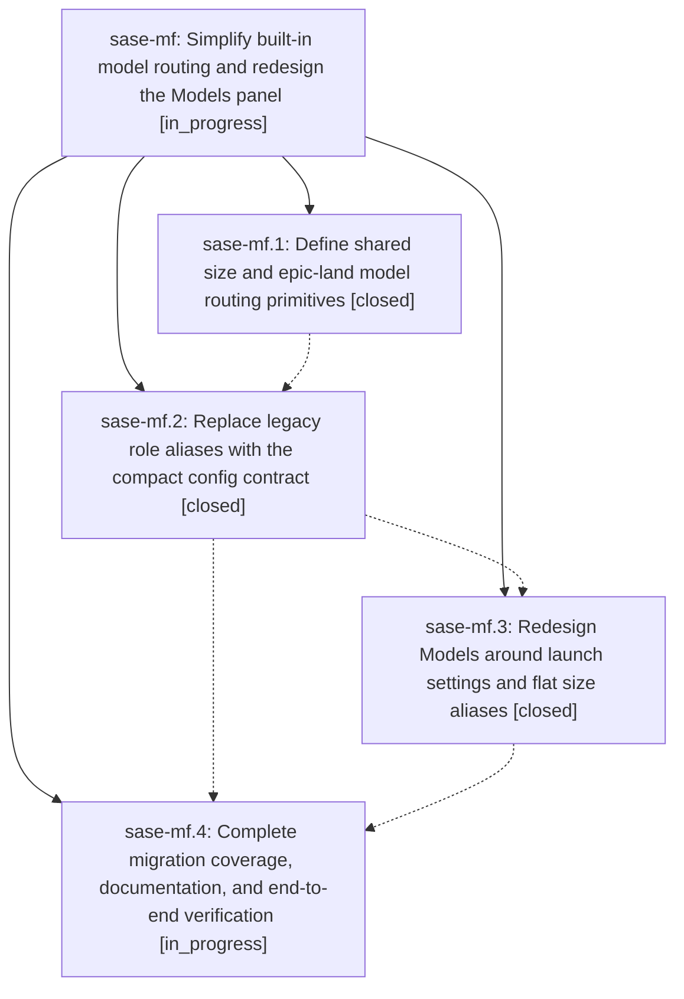

# Bead: sase-mf — Simplify built-in model routing and redesign the Models panel

[Bead Pages](../README.md) / sase-mf

**Status:** ◐ in_progress · **Type:** ▸ plan · **Tier:** epic
**Owner:** `bryanbugyi34@gmail.com` · **Created by:** [bbugyi200.athena.02n](https://github.com/sase-org/sase--agents/blob/main/families/bbugyi200.athena.02n.md) · **Assignee:** `sase-mf.land`
**Created:** 2026-08-15 14:28:42 EDT
**Plan:** [202608/simplify\_models.md](https://github.com/sase-org/sase--plans/blob/main/202608/simplify_models.md)

## Description

SASE exposes only five size aliases, routes launch roles through explicit config fields, and presents every model-related setting in one clear and polished panel

## Notes

[2026-08-15T21:33:51Z · sase-m7--2] DISCOVERED ISSUE: During sase-m7 forced-color fixture full-suite verification on 2026-08-15, monitored just test-cost failed exactly tests/llm_provider/test_provider_disable_smoke.py::test_provider_disable_fresh_process_smoke_matrix after 30,491 passes / 10 skips. The node fails identically both under hostile FORCE_COLOR=1 CLICOLOR_FORCE=1 CLICOLOR=1 NO_COLOR=1 CI=true and with every color/CI override unset: its child process raises StopIteration because build_alias_views no longer exposes medium_worker, while the smoke test still calls set_alias_override("medium_worker", ...) and searches for that retired view. HEAD's only sase-m7 change is tests/_conftest_environment.py plus tests/conftest.py color isolation; the regression is causally linked to this active epic's phase sase-mf.2 role-alias retirement, and phase sase-mf.4 explicitly owns migration coverage and exhaustive verification. Update the smoke matrix to the compact size-alias contract and preserve its provider-disable assertions.

## Phases

| Bead | Title | Status | Size | Created | Agents | Commits |
|---|---|---|---|---|---:|---:|
| [sase-mf.1](sase-mf.1.md) | Define shared size and epic-land model routing primitives | ✓ closed | medium | 2026-08-15 | 1 | 1 |
| [sase-mf.2](sase-mf.2.md) | Replace legacy role aliases with the compact config contract | ✓ closed | medium | 2026-08-15 | 1 | 1 |
| [sase-mf.3](sase-mf.3.md) | Redesign Models around launch settings and flat size aliases | ✓ closed | medium | 2026-08-15 | 1 | 1 |
| [sase-mf.4](sase-mf.4.md) | Complete migration coverage, documentation, and end-to-end verification | ◐ in_progress | medium | 2026-08-15 | 0 | 0 |

## Lineage

## Agents

| Agent | Bead | Commits |
|---|---|---:|
| [bbugyi200.athena.sase-mf.1](https://github.com/sase-org/sase--agents/blob/main/agents/bbugyi200.athena.sase-mf.1/README.md) | [sase-mf.1](sase-mf.1.md) | 1 |
| [bbugyi200.athena.sase-mf.2](https://github.com/sase-org/sase--agents/blob/main/agents/bbugyi200.athena.sase-mf.2/README.md) | [sase-mf.2](sase-mf.2.md) | 1 |
| [bbugyi200.athena.sase-mf.3](https://github.com/sase-org/sase--agents/blob/main/agents/bbugyi200.athena.sase-mf.3/README.md) | [sase-mf.3](sase-mf.3.md) | 1 |

## Commits

| Repo | Commit | Subject | Bead | Committed |
|---|---|---|---|---|
| sase-core | [`sase-core@b360211`](https://github.com/sase-org/sase-core/commit/b3602118b36d65e4462511a72bc90717cc476909) | feat(model\_route): add shared size and epic-land routing primitives | [sase-mf.1](sase-mf.1.md) | 2026-08-15 14:53:30 EDT |
| sase | [`2fcca46`](https://github.com/sase-org/sase/commit/2fcca46eb36ff1bc23bcc4984f8b1bc09b4f3e1a) | feat!: replace role model aliases with size launch settings | [sase-mf.2](sase-mf.2.md) | 2026-08-15 16:40:39 EDT |
| sase | [`28da68d`](https://github.com/sase-org/sase/commit/28da68d4e325d38587c9703a5db683ee8a13af76) | feat(tui): redesign Models panel around launch settings | [sase-mf.3](sase-mf.3.md) | 2026-08-15 17:57:07 EDT |
