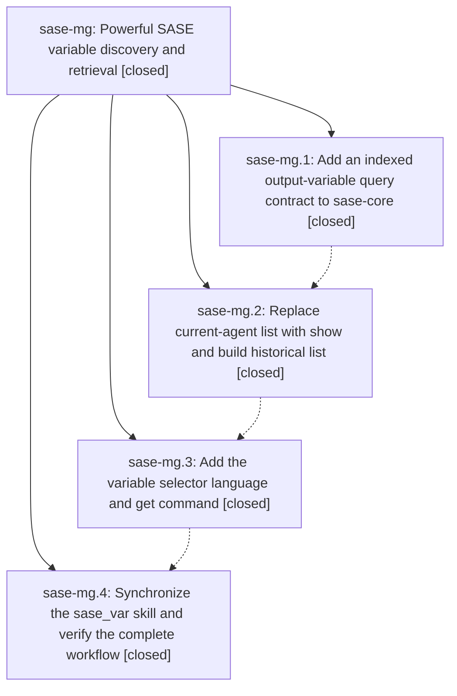

# Bead: sase-mg — Powerful SASE variable discovery and retrieval

[Bead Pages](../README.md) / sase-mg

**Status:** ✓ closed · **Resolution:** done · **Type:** ▸ plan · **Tier:** epic
**Owner:** `bryanbugyi34@gmail.com` · **Created by:** [bbugyi200.athena.02u](https://github.com/sase-org/sase--agents/blob/main/families/bbugyi200.athena.02u.md) · **Assignee:** `sase-mg.land`
**Created:** 2026-08-15 15:36:31 EDT · **Closed:** 2026-08-15 18:55:34 EDT
**Plan:** [202608/powerful\_variables.md](https://github.com/sase-org/sase--plans/blob/main/202608/powerful_variables.md)

## Description

Make SASE output variables easy to inspect, search, aggregate, and retrieve across agent history without weakening their existing reliability guarantees.

## Notes

[2026-08-15T22:42:20Z · sase-me--1] DISCOVERED ISSUE: During unrelated sase-me verification on current sase master 5b4d5b3c6, phase sase-mg.3's landed Python required parse_output_variable_selector, query_agent_output_variable_selectors, and agent_output_variable_selector_wire_schema_version while the clean workspace's linked sase-core remained on v0.27.8; the bindings are in core commit 13a9db1 / release v0.27.9 on origin/master. just install rebuilt the stale source and selection-health setup stayed red. Corroborated exact stale-linked-checkout task sase-jw with a verified-after-close +1; the output-variable epic should also ensure its released core floor/lock and landing verification cover v0.27.9.

[2026-08-15T22:55:34Z · sase-mg.land] Implemented powerful variables landing: raised sase-core-rs floor to 0.27.9, refreshed uv.lock, expanded docs/configuration.md for sase var show/list/get/set, and added landing guards. Verified with just install, tools/validate_sase_core_rs, tools/validate_sase_core_rs_version, focused pytest suite (46 passed), and just test-scoped escalated full non-visual suite (30561 passed, 10 skipped). just check is blocked only by unrelated pre-existing Symvision stale epic-symbol entry for closed bead sase-m9.3.1.2, recorded on active epic sase-m9.3.1.

## Phases

| Bead | Title | Status | Size | Created | Agents | Commits |
|---|---|---|---|---|---:|---:|
| [sase-mg.1](sase-mg.1.md) | Add an indexed output-variable query contract to sase-core | ✓ closed | medium | 2026-08-15 | 1 | 1 |
| [sase-mg.2](sase-mg.2.md) | Replace current-agent list with show and build historical list | ✓ closed | medium | 2026-08-15 | 1 | 1 |
| [sase-mg.3](sase-mg.3.md) | Add the variable selector language and get command | ✓ closed | medium | 2026-08-15 | 1 | 2 |
| [sase-mg.4](sase-mg.4.md) | Synchronize the sase\_var skill and verify the complete workflow | ✓ closed | small | 2026-08-15 | 1 | 1 |

## Lineage

## Agents

| Agent | Bead | Commits |
|---|---|---:|
| [bbugyi200.athena.sase-mg.1](https://github.com/sase-org/sase--agents/blob/main/agents/bbugyi200.athena.sase-mg.1/README.md) | [sase-mg.1](sase-mg.1.md) | 1 |
| [bbugyi200.athena.sase-mg.2](https://github.com/sase-org/sase--agents/blob/main/agents/bbugyi200.athena.sase-mg.2/README.md) | [sase-mg.2](sase-mg.2.md) | 1 |
| [bbugyi200.athena.sase-mg.3](https://github.com/sase-org/sase--agents/blob/main/agents/bbugyi200.athena.sase-mg.3/README.md) | [sase-mg.3](sase-mg.3.md) | 2 |
| [bbugyi200.athena.sase-mg.4](https://github.com/sase-org/sase--agents/blob/main/agents/bbugyi200.athena.sase-mg.4/README.md) | [sase-mg.4](sase-mg.4.md) | 1 |
| [bbugyi200.athena.sase-mg.land](https://github.com/sase-org/sase--agents/blob/main/families/bbugyi200.athena.sase-mg.land.md) | [sase-mg](README.md) | 1 |

## Commits

| Repo | Commit | Subject | Bead | Committed |
|---|---|---|---|---|
| sase-core | [`sase-core@7acf607`](https://github.com/sase-org/sase-core/commit/7acf60737880ca56eb2745ea18b0e9a2c4e40f88) | feat: index agent output variable history | [sase-mg.1](sase-mg.1.md) | 2026-08-15 15:59:10 EDT |
| sase | [`57af5d3`](https://github.com/sase-org/sase/commit/57af5d3ed0c0ca5557ec3d2421714172d7ded28a) | feat(var): add historical list and current-agent show | [sase-mg.2](sase-mg.2.md) | 2026-08-15 17:03:00 EDT |
| sase-core | [`sase-core@13a9db1`](https://github.com/sase-org/sase-core/commit/13a9db10c78e19c8e3aea45412999dd741fc206b) | feat: parse and resolve output-variable selectors | [sase-mg.3](sase-mg.3.md) | 2026-08-15 18:06:25 EDT |
| sase | [`3b81003`](https://github.com/sase-org/sase/commit/3b810036f1a5b864f0e2641d8ede4d847cd01855) | feat(var): add selector language and get command | [sase-mg.3](sase-mg.3.md) | 2026-08-15 18:07:32 EDT |
| sase | [`4d81923`](https://github.com/sase-org/sase/commit/4d81923528a7d38c1ba9632fbc403c94b12ebd09) | feat: document current variable inspection workflow | [sase-mg.4](sase-mg.4.md) | 2026-08-15 18:28:24 EDT |
| sase | [`9d9d499`](https://github.com/sase-org/sase/commit/9d9d49959146740f171753547ad32145fbcb0d3e) | build(deps): require powerful variable core release | [sase-mg](README.md) | 2026-08-15 18:56:15 EDT |
