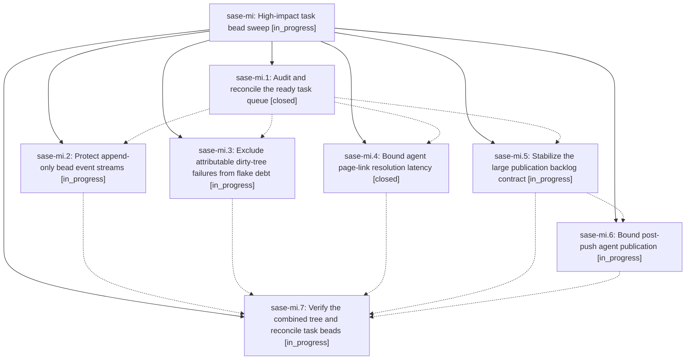

# Bead: sase-mi — High-impact task bead sweep

[Bead Pages](../README.md) / sase-mi

**Status:** ◐ in_progress · **Type:** ▸ plan · **Tier:** epic
**Owner:** `bryanbugyi34@gmail.com` · **Created by:** [bbugyi200.athena.02y](https://github.com/sase-org/sase--agents/blob/main/families/bbugyi200.athena.02y.md) · **Assignee:** `sase-mi.land`
**Created:** 2026-08-15 20:00:31 EDT
**Plan:** [202608/high\_impact\_task\_bead\_sweep.md](https://github.com/sase-org/sase--plans/blob/main/202608/high_impact_task_bead_sweep.md)

## Description

Reconcile every ready sase task bead, retire stale recommendations with evidence, and complete the five live fixes with the largest durability, verification, responsiveness, and commit-workflow impact.

## Phases

| Bead | Title | Status | Size | Created | Agents | Commits |
|---|---|---|---|---|---:|---:|
| [sase-mi.1](sase-mi.1.md) | Audit and reconcile the ready task queue | ✓ closed | medium | 2026-08-15 | 1 | 0 |
| [sase-mi.2](sase-mi.2.md) | Protect append-only bead event streams | ◐ in_progress | medium | 2026-08-15 | 1 | 0 |
| [sase-mi.3](sase-mi.3.md) | Exclude attributable dirty-tree failures from flake debt | ◐ in_progress | medium | 2026-08-15 | 1 | 0 |
| [sase-mi.4](sase-mi.4.md) | Bound agent page-link resolution latency | ✓ closed | medium | 2026-08-15 | 1 | 1 |
| [sase-mi.5](sase-mi.5.md) | Stabilize the large publication backlog contract | ◐ in_progress | small | 2026-08-15 | 1 | 0 |
| [sase-mi.6](sase-mi.6.md) | Bound post-push agent publication | ◐ in_progress | medium | 2026-08-15 | 1 | 0 |
| [sase-mi.7](sase-mi.7.md) | Verify the combined tree and reconcile task beads | ◐ in_progress | medium | 2026-08-15 | 1 | 0 |

## Lineage

## Agents

| Agent | Bead | Commits |
|---|---|---:|
| [bbugyi200.athena.sase-mi.1](https://github.com/sase-org/sase--agents/blob/main/agents/bbugyi200.athena.sase-mi.1/README.md) | [sase-mi.1](sase-mi.1.md) | 0 |
| [bbugyi200.athena.sase-mi.2](https://github.com/sase-org/sase--agents/blob/main/agents/bbugyi200.athena.sase-mi.2/README.md) | [sase-mi.2](sase-mi.2.md) | 0 |
| [bbugyi200.athena.sase-mi.3](https://github.com/sase-org/sase--agents/blob/main/agents/bbugyi200.athena.sase-mi.3/README.md) | [sase-mi.3](sase-mi.3.md) | 0 |
| [bbugyi200.athena.sase-mi.4](https://github.com/sase-org/sase--agents/blob/main/agents/bbugyi200.athena.sase-mi.4/README.md) | [sase-mi.4](sase-mi.4.md) | 1 |
| [bbugyi200.athena.sase-mi.5](https://github.com/sase-org/sase--agents/blob/main/agents/bbugyi200.athena.sase-mi.5/README.md) | [sase-mi.5](sase-mi.5.md) | 0 |
| [bbugyi200.athena.sase-mi.6](https://github.com/sase-org/sase--agents/blob/main/agents/bbugyi200.athena.sase-mi.6/README.md) | [sase-mi.6](sase-mi.6.md) | 0 |
| [bbugyi200.athena.sase-mi.7](https://github.com/sase-org/sase--agents/blob/main/agents/bbugyi200.athena.sase-mi.7/README.md) | [sase-mi.7](sase-mi.7.md) | 0 |
| [bbugyi200.athena.sase-mi.land](https://github.com/sase-org/sase--agents/blob/main/agents/bbugyi200.athena.sase-mi.land/README.md) | [sase-mi](README.md) | 0 |

## Commits

| Repo | Commit | Subject | Bead | Committed |
|---|---|---|---|---|
| sase | [`517d09b`](https://github.com/sase-org/sase/commit/517d09b7107277354852b907f5b85ddcd11cb732) | perf(tui): cache agent page registry snapshots | [sase-mi.4](sase-mi.4.md) | 2026-08-15 20:59:21 EDT |
