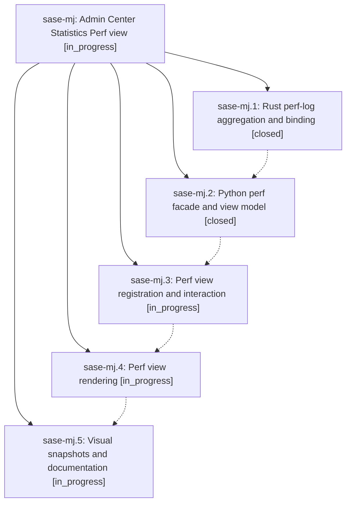

# Bead: sase-mj — Admin Center Statistics Perf view

[Bead Pages](../README.md) / sase-mj

**Status:** ◐ in_progress · **Type:** ▸ plan · **Tier:** epic
**Owner:** `bryanbugyi34@gmail.com` · **Created by:** [bbugyi200.athena.032](https://github.com/sase-org/sase--agents/blob/main/families/bbugyi200.athena.032.md) · **Assignee:** `sase-mj.land`
**Created:** 2026-08-15 20:25:25 EDT
**Plan:** [202608/statistics\_perf\_view.md](https://github.com/sase-org/sase--plans/blob/main/202608/statistics_perf_view.md)

## Description

The Admin Center Statistics tab gains an eighth "Perf" view that answers "is SASE fast right now, and where is it slow?" from durable data SASE already records — TUI startup and stall behavior, agent-launch latency, and agent/LLM/hook latency and reliability — with honest coverage reporting and no new event-loop work.

## Phases

| Bead | Title | Status | Size | Created | Agents | Commits |
|---|---|---|---|---|---:|---:|
| [sase-mj.1](sase-mj.1.md) | Rust perf-log aggregation and binding | ✓ closed | medium | 2026-08-15 | 1 | 1 |
| [sase-mj.2](sase-mj.2.md) | Python perf facade and view model | ✓ closed | medium | 2026-08-15 | 1 | 1 |
| [sase-mj.3](sase-mj.3.md) | Perf view registration and interaction | ◐ in_progress | medium | 2026-08-15 | 1 | 0 |
| [sase-mj.4](sase-mj.4.md) | Perf view rendering | ◐ in_progress | medium | 2026-08-15 | 1 | 0 |
| [sase-mj.5](sase-mj.5.md) | Visual snapshots and documentation | ◐ in_progress | small | 2026-08-15 | 1 | 0 |

## Lineage

## Agents

| Agent | Bead | Commits |
|---|---|---:|
| [bbugyi200.athena.sase-mj.1](https://github.com/sase-org/sase--agents/blob/main/agents/bbugyi200.athena.sase-mj.1/README.md) | [sase-mj.1](sase-mj.1.md) | 1 |
| [bbugyi200.athena.sase-mj.2](https://github.com/sase-org/sase--agents/blob/main/agents/bbugyi200.athena.sase-mj.2/README.md) | [sase-mj.2](sase-mj.2.md) | 1 |
| [bbugyi200.athena.sase-mj.3](https://github.com/sase-org/sase--agents/blob/main/agents/bbugyi200.athena.sase-mj.3/README.md) | [sase-mj.3](sase-mj.3.md) | 0 |
| [bbugyi200.athena.sase-mj.4](https://github.com/sase-org/sase--agents/blob/main/agents/bbugyi200.athena.sase-mj.4/README.md) | [sase-mj.4](sase-mj.4.md) | 0 |
| [bbugyi200.athena.sase-mj.5](https://github.com/sase-org/sase--agents/blob/main/agents/bbugyi200.athena.sase-mj.5/README.md) | [sase-mj.5](sase-mj.5.md) | 0 |
| [bbugyi200.athena.sase-mj.land](https://github.com/sase-org/sase--agents/blob/main/agents/bbugyi200.athena.sase-mj.land/README.md) | [sase-mj](README.md) | 0 |

## Commits

| Repo | Commit | Subject | Bead | Committed |
|---|---|---|---|---|
| sase-core | [`sase-core@d0ac555`](https://github.com/sase-org/sase-core/commit/d0ac55516eaeba739398a6014f6e9f31dec1519e) | feat: add perf log aggregation query | [sase-mj.1](sase-mj.1.md) | 2026-08-15 20:59:52 EDT |
| sase | [`a244947`](https://github.com/sase-org/sase/commit/a244947a8cc040ddaba013c39a4807bc07dd8cf7) | feat(stats): add Python perf facade and immutable PerfView | [sase-mj.2](sase-mj.2.md) | 2026-08-15 21:45:47 EDT |
