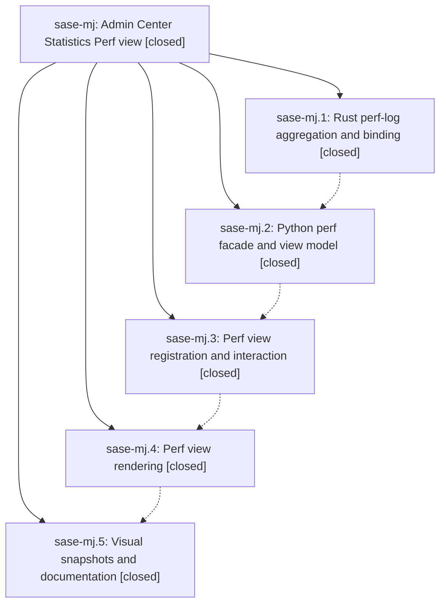

# Bead: sase-mj — Admin Center Statistics Perf view

[Bead Pages](../README.md) / sase-mj

**Status:** ✓ closed · **Resolution:** done · **Type:** ▸ plan · **Tier:** epic
**Owner:** `bryanbugyi34@gmail.com` · **Created by:** [bbugyi200.athena.032](https://github.com/sase-org/sase--agents/blob/main/families/bbugyi200.athena.032.md) · **Assignee:** `sase-mj.land`
**Created:** 2026-08-15 20:25:25 EDT · **Closed:** 2026-08-16 00:53:58 EDT
**Plan:** [202608/statistics\_perf\_view.md](https://github.com/sase-org/sase--plans/blob/main/202608/statistics_perf_view.md)

## Description

The Admin Center Statistics tab gains an eighth "Perf" view that answers "is SASE fast right now, and where is it slow?" from durable data SASE already records — TUI startup and stall behavior, agent-launch latency, and agent/LLM/hook latency and reliability — with honest coverage reporting and no new event-loop work.

## Notes

[2026-08-16T02:43:17Z · toobig-2s.split_file.src.sase.llm_provider.registry.0] DISCOVERED ISSUE: During unrelated llm_provider registry-split verification on 2026-08-15 at HEAD 392dcc962, the same advisory core-floor probe used by just check reported stale_actionable: pyproject declares sase-core-rs==0.27.9, but perf_logs_query first appears in released sase-core v0.27.10. This is causally linked to closed phase sase-mj.1, which added the perf_logs_query binding, and must be reconciled before the epic's combined tree lands. Probe command: .venv/bin/python tools/probe_core_floor --advisory --sase-core-dir sase/repos/linked/sase-core. The current registry diff does not touch pyproject.toml, uv.lock, or sase-core.

[2026-08-16T03:43:45Z · toobig-2t.split_file.src.sase.ace.tui.modals.models_panel_display.0] DISCOVERED ISSUE: The advisory core-floor probe still reports stale_actionable on newer HEAD c6d84d2a4 during unrelated Models-panel display splitting: pyproject pins sase-core-rs==0.27.9, while perf_logs_query first appears in published v0.27.10. This independently reproduces the existing epic note tied to closed phase sase-mj.1; my source diff touches only models_panel_display.py and models_panel_display_options.py.

[2026-08-16T04:53:58Z · sase-mj.land] VERIFIED (step 1). Read the plan (plans:202608/statistics_perf_view.md), all five phase beads and every phase note, and the four epic commits against the actual source.
- sase-mj.1 / core_perf_logs: sibling sase-core has crates/sase_core/src/perf_logs/{mod,sources,aggregate,wire}.rs registered at lib.rs:49/604 and the PyO3 binding py_perf_logs_query at crates/sase_core_py/src/lib.rs:8451 with module registration at 9099, the documented binding list at 262, and the round-trip test at 14192. Wire defaults for max_records_per_source / max_bytes_per_source are serde defaults (wire.rs:7/11/51-54), which is why the Python adapter can omit them. Landed as d0ac555 and published in sase-core v0.27.10.
- sase-mj.2 / stats_facade: src/sase/stats/perf_query.py is a thin adapter (require_rust_binding('perf_logs_query'), six env-overridable log paths, the plan's enumerated telemetry fan-out with grouped variants replacing rather than adding to the ungrouped ones, one store_stats call, never raising on a disabled/empty store); src/sase/stats/_perf_view.py holds the I/O-free frozen view models plus build_perf_view with HealthThresholds-based grading, deltas, and coverage notes; both are exported from sase/stats/__init__.py; load_statistics_view builds PerfView only when view == 'perf' (statistics_pane_data.py:163-165).
- sase-mj.3 / perf_view: 'perf' is last in VIEW_ORDER with Perf/Perf/Prf labels and a description, statistics_view_supports_grouping returns True for perf, the tab-strip thresholds are 123/83, and the help modal has the Perf methodology section. The views.empty bypass includes perf (statistics_pane_rendering.py:113) and the dimmed '· not applied' project chip is at 359-372.
- sase-mj.4 / perf_render: statistics_pane_perf.py holds StatisticsPerfRenderingMixin with the five hero tiles, startup and stalls panels, the grouped latency table, the data-and-instrumentation strip, and every degraded/empty state; _PERF_STACK_BELOW_WIDTH is 108 with the matching on_resize branch; tiles are non-interactive.
- sase-mj.5 / perf_visuals: the three PNG goldens (perf_120x40, perf_90x30, perf_degraded_120x40) exist and docs/perf_runbook.md has the 'Reading the Admin Center Perf view' section with panel/metric mapping, retention caveats, and probe flags.

INTEGRATED (step 2). Reviewed all 21 non-epic commits landed since the epic opened (2026-08-15 20:25). No other commit touched src/sase/stats or any statistics_pane* module, so there were no conflicts, and src/sase/ace/tui/logs/sources.py only registers the same JSONL files as raw Logs-tab tails, which is the separation the plan intends - no duplicated aggregation to fold in.
The one real integration item was this bead's own DISCOVERED ISSUE, filed twice by unrelated agents: pyproject declared sase-core-rs>=0.27.9 while perf_logs_query first shipped in v0.27.10, so the advisory core-floor probe reported stale_actionable. Reconciled with the owning tool, 'just ratchet-core-window', which bumped pyproject.toml and uv.lock from >=0.27.9,<0.28.0 to >=0.27.11,<0.28.0 (0.27.11 is the newest complete published release and contains the binding). This follows the established land-agent precedent (9d9d49959 by sase-mg.land, 4ba7ee812, ca93686a6). The probe now exits clean. That bump broke tests/test_powerful_variables_landing.py, whose floor guard pinned the exact string 'sase-core-rs>=0.27.9,<0.28.0'; since .github/workflows/publish.yml runs the same ratchet automatically on the release branch, that guard would have failed on every future release, so it was rewritten to compare the parsed floor against its intended minimum (0, 27, 9) instead of pinning it.

VERIFICATION RUN. just install, then every check-full gate individually: ruff format, ruff, mypy (3195 + 39 files), keep-sorted, pyscripts, test-waits, changelog, patch/stitch terminology, toobig, sase validate, committed plans (3750 files, 0 errors), and the core-floor probe - all green. just test-scoped escalated to the full suite: 30689 passed, 11 skipped, 2 failed, both pre-existing and unrelated (sase-mp and sase-mv below). Two gates are red on master for reasons this epic did not cause and did not touch: lint (symvision) fails only on FilesQueryIndexResult (sase-mn), and selection-health --fail-on-new-flake fails on the sase-mp and sase-mv nodes.

FOLLOW-UPS ROUTED.
- sase-mj.2 and sase-mj.3 proposed symvision private-cross-file-import failures (models_panel_provider_*, _now helpers): already resolved on this HEAD - just _lint-symvision no longer reports any private-import failure. Tracked by existing task sase-mk. No new bead.
- sase-mj.4 proposed nine unused public symbols: eight (PublicationDrainTimedOut, StreamIntegrityResult, analyze_stream_against_ancestor, clear_agent_page_url_registry_cache, configured_publication_drain_timeout, encode_stream_events, is_event_stream_relpath, parse_stream_text) were fixed by daf933aa5 from epic sase-mi. The ninth, FilesQueryIndexResult, is already task sase-mn; corroborated with an independent reproduction (+4) rather than duplicated.
- sase-mj.4 proposed a flaky test_override_pills_keep_narrow_top_bar_in_bounds. It is not flaky - it fails deterministically in isolation. Already filed as sase-mp with the same root cause I independently confirmed (llm_override_indicator reads peek_active_temporary_override on the render paths while the test patches get_active_temporary_override, first bad commit 233d62463); corroborated with +1 (+2) rather than duplicated.
- sase-mj.3 proposed that a beads close publish was blocked by a stream rewrite of ancestor event 5. Declined as no longer reproducing: every bead mutation in this landing (one create, four notes, two +1s, one status update, this close) succeeded, and b681d1bc3 plus f935acace landed the append-only shrink guards. The class is covered by closed task sase-li.
- NEW, found by this landing: tests/test_config_cache.py::test_owner_snapshot_reuses_parsed_overlay_until_token_changes fails only in the full parallel lane and passes in isolation and under file-scoped contention (3 repeats, 0 failures). sase-ct is a retired umbrella that forbids +1, so per its close policy this became node-specific task sase-mv (large, ready) with RELATED notes to sase-ct, sase-j7, and sase-mp, plus a note widening it to cover the sibling node test_clear_config_cache_forces_reload that the flake gate names.
- No symvision --epic-symbol whitelist entries exist for sase-mj in the Justfile, so nothing expires at this close.

TREE STATE: pyproject.toml, uv.lock, and tests/test_powerful_variables_landing.py carry the uncommitted integration change described above.

[2026-08-16T05:05:21Z · sase-mj.land] Land verification: read the linked plan (202608/statistics_perf_view.md), all five phase beads and every note, and confirmed each phase's work in the real source. .1 core_perf_logs: crates/sase_core/src/perf_logs/{mod,sources,aggregate,wire}.rs plus binding py_perf_logs_query and its round-trip test in sase-core, published in v0.27.10. .2 stats_facade: src/sase/stats/perf_query.py adapter and _perf_view.py frozen I/O-free models with HealthThresholds grading, built only when view == 'perf'. .3 perf_view: 'perf' last in VIEW_ORDER, grouping support, tab-strip thresholds 123/83, views.empty bypass, dimmed 'not applied' chip, help methodology section. .4 perf_render: statistics_pane_perf.py mixin with all five tiles, both panels, latency table, instrumentation strip, degraded states, _PERF_STACK_BELOW_WIDTH = 108. .5 perf_visuals: three PNG goldens plus docs/perf_runbook.md 'Reading the Admin Center Perf view'. Integration: reviewed all 21 non-epic commits since the epic opened; none touched src/sase/stats or any statistics_pane* module, so no conflicts, and the Logs-tab tails in logs/sources.py do not duplicate the new aggregation. Resolved the epic's own DISCOVERED ISSUE - pyproject declared sase-core-rs>=0.27.9 while perf_logs_query first shipped in v0.27.10 - via just ratchet-core-window (now >=0.27.11,<0.28.0); the core-floor probe exits clean. That bump broke tests/test_powerful_variables_landing.py, which pinned the exact floor string and would therefore fail on every future release since publish.yml runs the same ratchet on the release branch, so it now compares the parsed floor against its intended minimum. Follow-ups: symvision private-import proposals (.2, .3) already fixed on HEAD and tracked by sase-mk; 8 of 9 unused-symbol proposals (.4) fixed by daf933aa5 (sase-mi) with the 9th corroborated onto sase-mn (+4); the '.4 flaky' top-bar test is deterministic and corroborated onto sase-mp (+2) with root cause; the .3 bead-publish block declined as no longer reproducing; and a new full-lane-only flake in test_owner_

… and 686 more characters

## Phases

| Bead | Title | Status | Size | Created | Agents | Commits |
|---|---|---|---|---|---:|---:|
| [sase-mj.1](sase-mj.1.md) | Rust perf-log aggregation and binding | ✓ closed | medium | 2026-08-15 | 1 | 1 |
| [sase-mj.2](sase-mj.2.md) | Python perf facade and view model | ✓ closed | medium | 2026-08-15 | 1 | 1 |
| [sase-mj.3](sase-mj.3.md) | Perf view registration and interaction | ✓ closed | medium | 2026-08-15 | 1 | 1 |
| [sase-mj.4](sase-mj.4.md) | Perf view rendering | ✓ closed | medium | 2026-08-15 | 1 | 1 |
| [sase-mj.5](sase-mj.5.md) | Visual snapshots and documentation | ✓ closed | small | 2026-08-15 | 1 | 1 |

## Lineage

## Agents

| Agent | Bead | Commits |
|---|---|---:|
| [bbugyi200.athena.sase-mj.1](https://github.com/sase-org/sase--agents/blob/main/agents/bbugyi200.athena.sase-mj.1/README.md) | [sase-mj.1](sase-mj.1.md) | 1 |
| [bbugyi200.athena.sase-mj.2](https://github.com/sase-org/sase--agents/blob/main/agents/bbugyi200.athena.sase-mj.2/README.md) | [sase-mj.2](sase-mj.2.md) | 1 |
| [bbugyi200.athena.sase-mj.3](https://github.com/sase-org/sase--agents/blob/main/agents/bbugyi200.athena.sase-mj.3/README.md) | [sase-mj.3](sase-mj.3.md) | 1 |
| [bbugyi200.athena.sase-mj.4](https://github.com/sase-org/sase--agents/blob/main/agents/bbugyi200.athena.sase-mj.4/README.md) | [sase-mj.4](sase-mj.4.md) | 1 |
| [bbugyi200.athena.sase-mj.5](https://github.com/sase-org/sase--agents/blob/main/agents/bbugyi200.athena.sase-mj.5/README.md) | [sase-mj.5](sase-mj.5.md) | 1 |
| [bbugyi200.athena.sase-mj.land](https://github.com/sase-org/sase--agents/blob/main/agents/bbugyi200.athena.sase-mj.land/README.md) | [sase-mj](README.md) | 1 |

## Commits

| Repo | Commit | Subject | Bead | Committed |
|---|---|---|---|---|
| sase-core | [`sase-core@d0ac555`](https://github.com/sase-org/sase-core/commit/d0ac55516eaeba739398a6014f6e9f31dec1519e) | feat: add perf log aggregation query | [sase-mj.1](sase-mj.1.md) | 2026-08-15 20:59:52 EDT |
| sase | [`a244947`](https://github.com/sase-org/sase/commit/a244947a8cc040ddaba013c39a4807bc07dd8cf7) | feat(stats): add Python perf facade and immutable PerfView | [sase-mj.2](sase-mj.2.md) | 2026-08-15 21:45:47 EDT |
| sase | [`d9423e3`](https://github.com/sase-org/sase/commit/d9423e37a96e7f7bb7efdd88fca91820e913f7bd) | feat(ace): register Perf as the eighth Statistics view | [sase-mj.3](sase-mj.3.md) | 2026-08-15 22:25:24 EDT |
| sase | [`9a3a861`](https://github.com/sase-org/sase/commit/9a3a8617cac79b79217520fbc5ba8c33bde5f17b) | feat(ace): render the Statistics Perf dashboard | [sase-mj.4](sase-mj.4.md) | 2026-08-15 23:48:50 EDT |
| sase | [`3862288`](https://github.com/sase-org/sase/commit/3862288e98d737dbbe2c2a9dad20d8d16f5eeb96) | test(ace): add visual snapshots and runbook documentation for Statistics Perf view | [sase-mj.5](sase-mj.5.md) | 2026-08-16 00:06:51 EDT |
| sase | [`3a783a4`](https://github.com/sase-org/sase/commit/3a783a411863801c7fe1fd1b908a508eb954abca) | build(deps): raise the sase-core-rs floor to the published perf\_logs\_query release | [sase-mj](README.md) | 2026-08-16 01:07:15 EDT |
