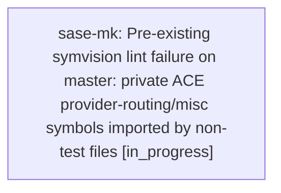

# Bead: sase-mk — Pre-existing symvision lint failure on master: private ACE provider-routing/misc symbols imported by non-test files

[Bead Pages](../README.md) / sase-mk

**Status:** ◐ in_progress · **Type:** ◆ task · **+1 reports:** +2
**Owner:** `bryanbugyi34@gmail.com` · **Created by:** [bbugyi200.athena.034](https://github.com/sase-org/sase--agents/blob/main/families/bbugyi200.athena.034.md) · **Assignee:** `sase-mk` · **Size:** small
**Created:** 2026-08-15 21:04:20 EDT

## Description

just lint / just check fails the _lint-symvision gate on a clean master checkout (verified via git stash on commit 85c09a886, no other changes) with "Private functions/classes should not be imported. Make these public if they need to be imported by non-test files!" for:

  _ProviderRoutingModal in src/sase/ace/tui/modals/models_panel_provider_modal.py
  _ProviderRoutingSnapshot in src/sase/ace/tui/modals/models_panel_provider_state.py
  _ProviderWriteOutcome in src/sase/ace/tui/modals/models_panel_provider_state.py
  _active_disable in src/sase/ace/tui/modals/models_panel_provider_state.py
  _duration_suffix in src/sase/ace/tui/modals/models_panel_provider_rendering.py
  _load_provider_routing_snapshot in src/sase/ace/tui/modals/models_panel_provider_state.py
  _now in src/sase/vcs_log/fetch_cache.py
  _now in src/sase/bead/project.py
  _now in src/sase/prompt/search/dates.py
  _now in src/sase/ace/tui/modals/models_panel_provider_state.py
  _provider_description_text in src/sase/ace/tui/modals/models_panel_provider_rendering.py
  _provider_disable_route_key in src/sase/ace/tui/modals/models_panel_provider_state.py
  _provider_duration_modal in src/sase/ace/tui/modals/models_panel_provider_rendering.py
  _provider_title_line in src/sase/ace/tui/modals/models_panel_provider_rendering.py
  _remaining_label in src/sase/ace/tui/modals/models_panel_provider_state.py
  _render_provider_row in src/sase/ace/tui/modals/models_panel_provider_rendering.py

Reproduction:
  SASE_SYMVISION_BEAD_STATUS_ONLY=1 BD_COMMAND=tools/sase_bead .venv/bin/symvision src/sase --exclude-decorator gate_command_entrypoint --exclude-decorator builtin_chop --epic-symbol 'sase-m6.6.1(parse_artifact_query)' --epic-symbol 'sase-m6.6.1(build_artifact_query_context)' --epic-symbol 'sase-m6.6.1(canonicalize_artifact_query)' --epic-symbol 'sase-m6.6.1(evaluate_artifact_query)' --epic-symbol 'sase-m6.6.1(evaluate_artifact_query_with_context)'

Impact: blocks just check / just check-full from completing on an otherwise-clean master checkout for any agent, since the check recipe runs lint gates sequentially and stops at the first failure. Discovered while implementing the approved plan sase/repos/plans/202608/ace_launch_default_indicator_liveness.md; unrelated to that work (the plan only touches src/sase/llm_provider/{load_balancing,provider_disable_peek,temporary_override,temporary_override_peek,launch_default_peek}.py and src/sase/ace/tui/widgets/llm_override_indicator.py plus tests/docs).

Likely fix: either make the listed private symbols public (with a real docstring) where genuinely imported from non-test files, or fix the underlying non-test import sites to stop reaching into private module internals, or extend the symvision epic-symbol allowlist if this is an intentional, temporary exception (cf. closed precedent tasks sase-ld, sase-kt, sase-iz, sase-i0, sase-jg, sase-kc, sase-fj, sase-f4 for the same failure shape in other files).

## +1 Evidence

> **+1** by `033` · 2026-08-15 21:08:34 EDT
> **Observed since:** 2026-08-15 20:26:05 EDT
>
> Independently reproduced 2026-08-15 while implementing sase/repos/plans/202608/adaptive_models_panel_description_height.md (Launch Control description-height plan). Verified via git stash on commit 85c09a886 with no local changes — same 16 symbols/files fail identically. Confirms this is a general symvision gate blocker unrelated to any specific in-flight change, not something introduced by either plan.

> **+1** by `sase-m9.3.1.5` · 2026-08-15 21:45:31 EDT
> **Observed since:** 2026-08-15 21:17:09 EDT
>
> Independently reproduced during detached proc retirement verification on 2026-08-16 after just install. just check passed Python/Markdown formatting, keep-sorted, Ruff, mypy, pyscripts, test-waits, changelog, and patch/stitch terminology, then failed lint (symvision) with the same 16 private-import findings for models_panel_provider_* symbols and _now helpers. The current diff does not touch those provider-routing or timestamp-helper files, so this remains an unrelated gate blocker.

## Lineage

## Agents

| Agent | Bead | Commits |
|---|---|---:|
| [bbugyi200.athena.sase-mk](https://github.com/sase-org/sase--agents/blob/main/agents/bbugyi200.athena.sase-mk/README.md) | [sase-mk](README.md) | 1 |

## Commits

| Repo | Commit | Subject | Bead | Committed |
|---|---|---|---|---|
| sase | [`7a8f113`](https://github.com/sase-org/sase/commit/7a8f1138f311ba3be9e09fc67f4da6f6eba52b70) | fix(tui): publicize Models-panel provider-routing helpers | [sase-mk](README.md) | 2026-08-15 22:21:14 EDT |
