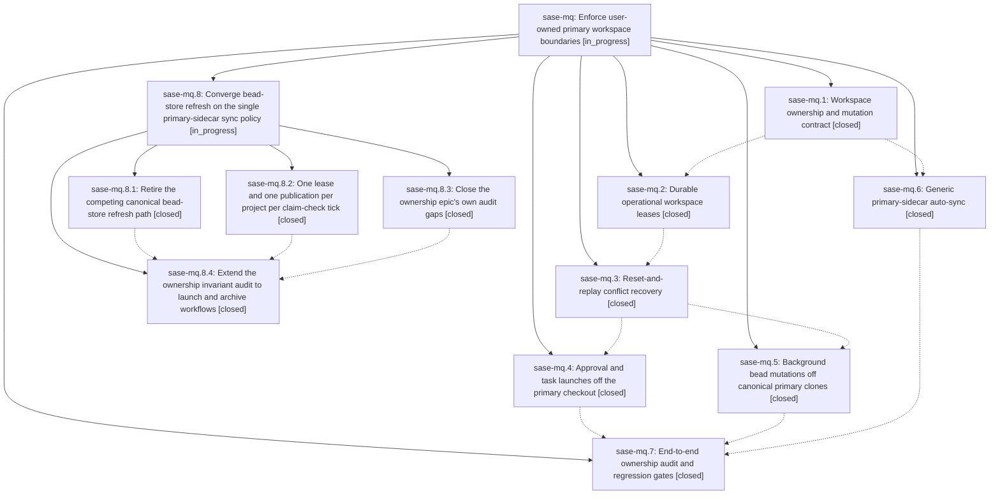

# Bead: sase-mq — Enforce user-owned primary workspace boundaries

[Bead Pages](../README.md) / sase-mq

**Status:** ◐ in_progress · **Type:** ▸ plan · **Tier:** epic
**Owner:** `bryanbugyi34@gmail.com` · **Created by:** [bbugyi200.athena.035](https://github.com/sase-org/sase--agents/blob/main/families/bbugyi200.athena.035.md) · **Assignee:** `sase-mq.land`
**Created:** 2026-08-15 23:37:55 EDT
**Plan:** [202608/primary\_workspace\_ownership.md](https://github.com/sase-org/sase--plans/blob/main/202608/primary_workspace_ownership.md)

## Description

Every SASE-initiated repository mutation runs in a claimed disposable workspace, conflict recovery is destructive only inside that ownership boundary, and configured primary sidecar checkouts converge safely without disturbing user work.

## Notes

[2026-08-16T03:46:58Z · 038.f1] DISCOVERED ISSUE (2026-08-16, while repairing the wedged bead store that blocked this epic's own launch): the canonical primary bead-store clone at /home/bryan/projects/github/sase-org/sase/sase/repos/beads had diverged from origin by 1 local / 10 remote commits and had accumulated 53 consecutive failed managed-sync integrations (41/53 'dirty-worktree refusal'), plus 2 retained recovery refs and 2 recovery stashes whose contents (epics sase-jx, sase-e6) were already fully present on origin/main. Because the primary clone was 10 commits behind, waiting phase agents polling it could not observe phase closes that had already landed on the remote, so multiple epics (sase-mi, sase-mj, sase-m6.6.1) stalled on dependencies that were in fact satisfied. Separately, events/manifest.json stream_count disagreed across clones and flip-flopped 851 -> 852 -> 851 -> 853 across consecutive 'repair event manifest' commits (d1ee870f, 420fd244, 6c734f5c), which is two clones repairing each other. Repaired by hand this time (reset to origin/main, dropped superseded recovery refs/stashes, re-applied the one stranded close). This is direct evidence for phases sase-mq.5 (background bead mutations off canonical primary clones) and sase-mq.6 (generic primary-sidecar auto-sync).

[2026-08-16T07:20:46Z · toobig-2t.split_file.tests.main.test_var_get.0] DISCOVERED ISSUE (2026-08-16, while splitting tests/main/test_var_get.py in an unrelated workspace): 'just check' fails deterministically at the lint (symvision) gate with "Error: --epic-symbol 'sase-mq.5(mark_sidecar_sync_hint)': bead 'sase-mq.5' is closed. Remove this stale --epic-symbol entry and clean up the symbol." Justfile:316 still passes --epic-symbol "sase-mq.5(mark_sidecar_sync_hint)" to _lint-symvision; that line was added by this epic's own commit e342ff476 ('feat(repos): add generic primary-sidecar auto-sync'), and phase sase-mq.5 closed 2026-08-16T07:06:50Z, so the whitelist entry went stale the moment that phase closed. Routed here instead of a new task: this epic is in progress and owns both the symbol (mark_sidecar_sync_hint in src/sase/_sidecar_sync_hints.py, currently referenced only from tests/test_sidecar_sync_hints.py) and the whitelist entry. Verification is unambiguous rather than diff-dependent: symvision rejects the argument during --epic-symbol validation before analyzing any source, and my local diff touches only tests/. Fix per sase/memory/symvision.md: drop the stale --epic-symbol line and dispose of the symbol (wire up a real non-test caller, make it private, or delete it as dead code). RELATED: sase-mk — in-progress task for a different root cause in the same gate (private ACE provider-routing symbols imported by non-test files); its failure is currently masked because this epic-symbol validation error aborts symvision first. Same recurring pattern as closed tasks sase-kc (sase-js), sase-jg (sase-j3), and sase-i0 (sase-hq).

[2026-08-16T08:50:45Z · sase-mq.land] LANDING (2026-08-16, sase-mq.land) — NOT CLOSED: verification found four pieces of this epic's declared scope still open. Planned as child epic via sase_plan_primary_bead_sync_convergence.md (parent_bead: sase-mq); this landing resumes when that child lands.

VERIFIED COMPLETE: all 7 phases closed with matching commits (6f7052fc9 ownership contract, 419c5a9fc leases, e342ff476 sidecar auto-sync, 985aae20c reset-and-replay, 4b30309e0 background writers, 16728587d approval launches, ec390cdd4 invariant audit). Read the source, not just the notes: OperationContext/authorize_store_mutation gate machine mutations of primary #0 and unclaimed checkouts; epic_launch/task_launch/plan-archive now acquire operational leases (get_workspace_directory(project, 1) survives only as a read-only preflight in _plan_approval_epic.py:150 and for user-directed gate answers); reset_and_replay refuses any non-LEASED_OPERATIONAL context, primary #0, unclaimed checkout, or path outside the lease; background bead writers (claims.py, bead_claim_checks, external mirror) go through writable_bead_store_for_machine; canonical_beads_dir_for_project survives only in read paths (wait deps, mobile, catalog, triage state, mirror coverage index). 242 tests pass across tests/workspace_provider/, test_sidecar_auto_sync.py, test_sidecar_sync_hints.py, test_axe_chop_sidecar_auto_sync.py, test_bead/test_background_store.py. just lint is fully green.

REMAINING EPIC WORK (child epic phases): (1) Phase 6's 'Retire or narrow the bead-only primary refresh path so there is one scheduling policy rather than competing synchronizers' was never done — sase_chop_bead_store_refresh.py:272 and axe/run_agent_wait_deps.py:33 still call refresh_bead_store() on canonical_beads_dir_for_project, which takes a mutates_worktree=True lock and runs integrate_sdd_repository (commit/rebase/push + repair_event_manifest_after_integration) against the user's primary bead sidecar. That is the mechanism behind this bead's own DISCOVERED ISSUE note (53 failed managed-sync integrations, 41 dirty-worktree refusals, stream_count flip-flop 851->852->851->853 across d1ee870f/420fd244/6c734f5c). sase-mq.6 deferred it pending sase-mq.5, which has since closed. (2) Phase 5's 'Chops should batch one project's changes under one lease and one publication transaction' was never done — bead_claim_checks takes two leases per project per tick (_read_claimed_issues:254 and _reconcile_project_claims:82). (3) tests/test_agent_artifact_directory_operation_audit.py is RED on a clean tree: reset_replay.py:_clear_owned_paths (added by 985aae20c) is unreviewed; sase-mq.4 and sase-mq.5 both proposed it and sase-mq.7 did not do it. (4) Integration gap: commit 298cea966 landed mid-epic and widened _SOURCE_AUDIT_SCAN_ROOTS to cover invariant-style source-tree audits; phase 7's tests/workspace_provider/test_primary_writable_store_import_boundary.py is exactly that shape and was never registered.

PROPOSED FOLLOW-UP DISPOSITION (all 9 child-bead proposals): [sase-mq.1 unused public symbols] RESOLVED — symvision is green at HEAD; FilesQueryIndexResult is separately tracked by task sase-mn. [sase-mq.1 + sase-mq.4 shared ~/.sase/procs/runtime contaminating gate/ops CLI tests] +1 recorded on existing ready task sase-ml (now +6). [sase-mq.3 memory init vs --check on sase_sizes.md] NEW TASK sase-n0 (medium, ready) — reproduced both sides at HEAD: sase validate reports 'ok init memory --check' while sase init memory --check --diff wants to rewrite the note from @<size> to @<size>_worker. [sase-mq.3 + sase-mq.5 pre-existing TUI failures] PARTIALLY RESOLVED, not filed — PatchFilterBar was fixed by 172b1a1a0; QueryEditModal (4 nodes) and all 138 fork-keybinding nodes pass standalone at HEAD, so the residual full-parallel-only behavior belongs to in-progress epic sase-j7's process-global-state-leak scope rather than to a new task. [sase-mq.4 artifact-directory audit missing reset-replay site] EPIC WORK, child phase audit-gaps. [sase-mq.4 config-cache token mock] +1 recorded on existing ready task sase-mv (now +2); confirmed 51/51 pass standalone. [sase-mq.5 bead_claim_checks two leases per tick] EPIC WORK, child phase chop-lease-batching. [sase-mq.6 wire mark_sidecar_sync_hint into publication paths] RESOLVED by sase-mq.5 — real caller at bead/background_store.py:53, and that phase's commit 4b30309e0 also removed the stale Justfile --epic-symbol 'sase-mq.5(mark_sidecar_sync_hint)' entry this bead's second note reported. [sase-mq.6 retire/narrow bead_store_refresh] EPIC WORK, child phase waiter-sync-hints.

POST-CLOSE WORK STILL OWED (for whoever finishes this landing): the six Justfile --epic-symbol 'sase-mq(...)' entries expire at close. All six (OperationalLeaseError, authorize_operational_lease_workspace, bind_operational_lease, operational_lease_settlement_policy, submit_leased_proc_request, transfer_operational_lease) are referenced only inside src/sase/workspace_provider/lease.py and from tests/workspace_provider/test_workspace_lease.py, so per sase/memory/symvision.md they need privatizing or deleting, not re-whitelisting. Plan file 202608/primary_workspace_ownership.md must be set to status: done at close.

## Phases

| Bead | Title | Status | Size | Created | Agents | Commits |
|---|---|---|---|---|---:|---:|
| [sase-mq.1](sase-mq.1.md) | Workspace ownership and mutation contract | ✓ closed | medium | 2026-08-15 | 1 | 1 |
| [sase-mq.2](sase-mq.2.md) | Durable operational workspace leases | ✓ closed | medium | 2026-08-15 | 1 | 2 |
| [sase-mq.3](sase-mq.3.md) | Reset-and-replay conflict recovery | ✓ closed | medium | 2026-08-15 | 1 | 1 |
| [sase-mq.4](sase-mq.4.md) | Approval and task launches off the primary checkout | ✓ closed | medium | 2026-08-15 | 1 | 1 |
| [sase-mq.5](sase-mq.5.md) | Background bead mutations off canonical primary clones | ✓ closed | medium | 2026-08-15 | 1 | 1 |
| [sase-mq.6](sase-mq.6.md) | Generic primary-sidecar auto-sync | ✓ closed | medium | 2026-08-15 | 1 | 1 |
| [sase-mq.7](sase-mq.7.md) | End-to-end ownership audit and regression gates | ✓ closed | small | 2026-08-15 | 1 | 1 |

## Lineage

## Agents

| Agent | Bead | Commits |
|---|---|---:|
| [bbugyi200.athena.sase-mq.1](https://github.com/sase-org/sase--agents/blob/main/agents/bbugyi200.athena.sase-mq.1/README.md) | [sase-mq.1](sase-mq.1.md) | 1 |
| [bbugyi200.athena.sase-mq.2](https://github.com/sase-org/sase--agents/blob/main/families/bbugyi200.athena.sase-mq.2.md) | [sase-mq.2](sase-mq.2.md) | 2 |
| [bbugyi200.athena.sase-mq.3](https://github.com/sase-org/sase--agents/blob/main/families/bbugyi200.athena.sase-mq.3.md) | [sase-mq.3](sase-mq.3.md) | 1 |
| [bbugyi200.athena.sase-mq.4](https://github.com/sase-org/sase--agents/blob/main/families/bbugyi200.athena.sase-mq.4.md) | [sase-mq.4](sase-mq.4.md) | 1 |
| [bbugyi200.athena.sase-mq.5](https://github.com/sase-org/sase--agents/blob/main/agents/bbugyi200.athena.sase-mq.5/README.md) | [sase-mq.5](sase-mq.5.md) | 1 |
| [bbugyi200.athena.sase-mq.6](https://github.com/sase-org/sase--agents/blob/main/agents/bbugyi200.athena.sase-mq.6/README.md) | [sase-mq.6](sase-mq.6.md) | 1 |
| [bbugyi200.athena.sase-mq.7](https://github.com/sase-org/sase--agents/blob/main/agents/bbugyi200.athena.sase-mq.7/README.md) | [sase-mq.7](sase-mq.7.md) | 1 |
| [bbugyi200.athena.sase-mq.8.1](https://github.com/sase-org/sase--agents/blob/main/agents/bbugyi200.athena.sase-mq.8.1/README.md) | [sase-mq.8.1](sase-mq.8.1.md) | 1 |
| [bbugyi200.athena.sase-mq.8.2](https://github.com/sase-org/sase--agents/blob/main/agents/bbugyi200.athena.sase-mq.8.2/README.md) | [sase-mq.8.2](sase-mq.8.2.md) | 1 |
| [bbugyi200.athena.sase-mq.8.3](https://github.com/sase-org/sase--agents/blob/main/agents/bbugyi200.athena.sase-mq.8.3/README.md) | [sase-mq.8.3](sase-mq.8.3.md) | 1 |
| [bbugyi200.athena.sase-mq.8.4](https://github.com/sase-org/sase--agents/blob/main/agents/bbugyi200.athena.sase-mq.8.4/README.md) | [sase-mq.8.4](sase-mq.8.4.md) | 1 |
| [bbugyi200.athena.sase-mq.8.land](https://github.com/sase-org/sase--agents/blob/main/agents/bbugyi200.athena.sase-mq.8.land/README.md) | [sase-mq.8](sase-mq.8.md) | 0 |
| [bbugyi200.athena.sase-mq.land](https://github.com/sase-org/sase--agents/blob/main/families/bbugyi200.athena.sase-mq.land.md) | [sase-mq](README.md) | 0 |

## Commits

| Repo | Commit | Subject | Bead | Committed |
|---|---|---|---|---|
| sase | [`6f7052f`](https://github.com/sase-org/sase/commit/6f7052fc90467145c78def777622e950eeb9f0ec) | feat(workspace): add ownership contract for store mutations | [sase-mq.1](sase-mq.1.md) | 2026-08-16 00:46:58 EDT |
| sase | [`419c5a9`](https://github.com/sase-org/sase/commit/419c5a9fcdcce70bb42d3ebd22974ced71321163) | feat(workspace): add durable operational workspace leases | [sase-mq.2](sase-mq.2.md) | 2026-08-16 01:31:13 EDT |
| sase-core | [`sase-core@3e6502d`](https://github.com/sase-org/sase-core/commit/3e6502d10db0f404379c587ad8c2928493b0cf4b) | feat(workspace\_lease): add operational lease eligibility and policy kinds | [sase-mq.2](sase-mq.2.md) | 2026-08-16 01:33:59 EDT |
| sase | [`e342ff4`](https://github.com/sase-org/sase/commit/e342ff47614d3b955b7598578e8da85d0f2577e3) | feat(repos): add generic primary-sidecar auto-sync | [sase-mq.6](sase-mq.6.md) | 2026-08-16 01:43:46 EDT |
| sase | [`985aae2`](https://github.com/sase-org/sase/commit/985aae20c132bf9d5c629820f330cc12eef174a2) | feat(workspace): add reset-and-replay recovery for leased checkouts | [sase-mq.3](sase-mq.3.md) | 2026-08-16 02:28:11 EDT |
| sase | [`4b30309`](https://github.com/sase-org/sase/commit/4b30309e0f639e44063102544f621419c5cdbb9a) | feat(bead): lease workspace-local stores for background writers | [sase-mq.5](sase-mq.5.md) | 2026-08-16 03:08:53 EDT |
| sase | [`1672858`](https://github.com/sase-org/sase/commit/16728587dd72a1e7c0ba817f380a09ba864e388b) | feat(workspace): run approval launches on operational leases | [sase-mq.4](sase-mq.4.md) | 2026-08-16 03:48:32 EDT |
| sase | [`ec390cd`](https://github.com/sase-org/sase/commit/ec390cdd451f95730a1246475c7746c5c0643190) | test(workspace): add end-to-end ownership invariant audit gates | [sase-mq.7](sase-mq.7.md) | 2026-08-16 04:18:27 EDT |
| sase | [`b82f21c`](https://github.com/sase-org/sase/commit/b82f21c1bfcbaa40d1224102465b69446a0b54c4) | test: register ownership audit coverage | [sase-mq.8.3](sase-mq.8.3.md) | 2026-08-16 05:11:06 EDT |
| sase | [`9b5bba5`](https://github.com/sase-org/sase/commit/9b5bba5df887247ec28aa50e1f14d6ddf431d513) | perf(beads): fuse claim-check snapshot and reconcile into one lease | [sase-mq.8.2](sase-mq.8.2.md) | 2026-08-16 05:14:55 EDT |
| sase | [`b57f644`](https://github.com/sase-org/sase/commit/b57f644dbf6a48e656aaa3e708d07741d22a063b) | refactor(sidecar-sync): replace bead-store-refresh chop with sync hints | [sase-mq.8.1](sase-mq.8.1.md) | 2026-08-16 05:31:56 EDT |
| sase | [`d10fe53`](https://github.com/sase-org/sase/commit/d10fe53024144a0084501c349642552cccc8e033) | test: audit ownership invariant launch paths | [sase-mq.8.4](sase-mq.8.4.md) | 2026-08-16 06:05:19 EDT |
