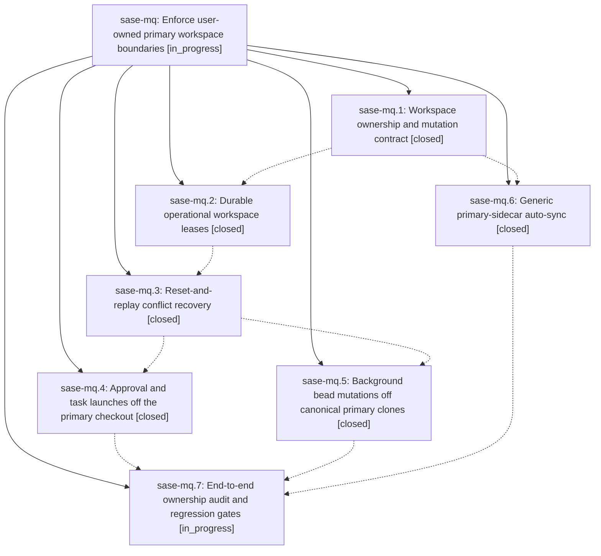

# Bead: sase-mq — Enforce user-owned primary workspace boundaries

[Bead Pages](../README.md) / sase-mq

**Status:** ◐ in_progress · **Type:** ▸ plan · **Tier:** epic
**Owner:** `bryanbugyi34@gmail.com` · **Created by:** [bbugyi200.athena.035](https://github.com/sase-org/sase--agents/blob/main/families/bbugyi200.athena.035.md) · **Assignee:** `sase-mq.land`
**Created:** 2026-08-15 23:37:55 EDT
**Plan:** [202608/primary\_workspace\_ownership.md](https://github.com/sase-org/sase--plans/blob/main/202608/primary_workspace_ownership.md)

## Description

Every SASE-initiated repository mutation runs in a claimed disposable workspace, conflict recovery is destructive only inside that ownership boundary, and configured primary sidecar checkouts converge safely without disturbing user work.

## Notes

[2026-08-16T03:46:58Z · 038.f1] DISCOVERED ISSUE (2026-08-16, while repairing the wedged bead store that blocked this epic's own launch): the canonical primary bead-store clone at /home/bryan/projects/github/sase-org/sase/sase/repos/beads had diverged from origin by 1 local / 10 remote commits and had accumulated 53 consecutive failed managed-sync integrations (41/53 'dirty-worktree refusal'), plus 2 retained recovery refs and 2 recovery stashes whose contents (epics sase-jx, sase-e6) were already fully present on origin/main. Because the primary clone was 10 commits behind, waiting phase agents polling it could not observe phase closes that had already landed on the remote, so multiple epics (sase-mi, sase-mj, sase-m6.6.1) stalled on dependencies that were in fact satisfied. Separately, events/manifest.json stream_count disagreed across clones and flip-flopped 851 -> 852 -> 851 -> 853 across consecutive 'repair event manifest' commits (d1ee870f, 420fd244, 6c734f5c), which is two clones repairing each other. Repaired by hand this time (reset to origin/main, dropped superseded recovery refs/stashes, re-applied the one stranded close). This is direct evidence for phases sase-mq.5 (background bead mutations off canonical primary clones) and sase-mq.6 (generic primary-sidecar auto-sync).

[2026-08-16T07:20:46Z · toobig-2t.split_file.tests.main.test_var_get.0] DISCOVERED ISSUE (2026-08-16, while splitting tests/main/test_var_get.py in an unrelated workspace): 'just check' fails deterministically at the lint (symvision) gate with "Error: --epic-symbol 'sase-mq.5(mark_sidecar_sync_hint)': bead 'sase-mq.5' is closed. Remove this stale --epic-symbol entry and clean up the symbol." Justfile:316 still passes --epic-symbol "sase-mq.5(mark_sidecar_sync_hint)" to _lint-symvision; that line was added by this epic's own commit e342ff476 ('feat(repos): add generic primary-sidecar auto-sync'), and phase sase-mq.5 closed 2026-08-16T07:06:50Z, so the whitelist entry went stale the moment that phase closed. Routed here instead of a new task: this epic is in progress and owns both the symbol (mark_sidecar_sync_hint in src/sase/_sidecar_sync_hints.py, currently referenced only from tests/test_sidecar_sync_hints.py) and the whitelist entry. Verification is unambiguous rather than diff-dependent: symvision rejects the argument during --epic-symbol validation before analyzing any source, and my local diff touches only tests/. Fix per sase/memory/symvision.md: drop the stale --epic-symbol line and dispose of the symbol (wire up a real non-test caller, make it private, or delete it as dead code). RELATED: sase-mk — in-progress task for a different root cause in the same gate (private ACE provider-routing symbols imported by non-test files); its failure is currently masked because this epic-symbol validation error aborts symvision first. Same recurring pattern as closed tasks sase-kc (sase-js), sase-jg (sase-j3), and sase-i0 (sase-hq).

## Phases

| Bead | Title | Status | Size | Created | Agents | Commits |
|---|---|---|---|---|---:|---:|
| [sase-mq.1](sase-mq.1.md) | Workspace ownership and mutation contract | ✓ closed | medium | 2026-08-15 | 1 | 1 |
| [sase-mq.2](sase-mq.2.md) | Durable operational workspace leases | ✓ closed | medium | 2026-08-15 | 1 | 2 |
| [sase-mq.3](sase-mq.3.md) | Reset-and-replay conflict recovery | ✓ closed | medium | 2026-08-15 | 1 | 1 |
| [sase-mq.4](sase-mq.4.md) | Approval and task launches off the primary checkout | ✓ closed | medium | 2026-08-15 | 1 | 1 |
| [sase-mq.5](sase-mq.5.md) | Background bead mutations off canonical primary clones | ✓ closed | medium | 2026-08-15 | 1 | 1 |
| [sase-mq.6](sase-mq.6.md) | Generic primary-sidecar auto-sync | ✓ closed | medium | 2026-08-15 | 1 | 1 |
| [sase-mq.7](sase-mq.7.md) | End-to-end ownership audit and regression gates | ◐ in_progress | small | 2026-08-15 | 1 | 0 |

## Lineage

## Agents

| Agent | Bead | Commits |
|---|---|---:|
| [bbugyi200.athena.sase-mq.1](https://github.com/sase-org/sase--agents/blob/main/agents/bbugyi200.athena.sase-mq.1/README.md) | [sase-mq.1](sase-mq.1.md) | 1 |
| [bbugyi200.athena.sase-mq.2](https://github.com/sase-org/sase--agents/blob/main/families/bbugyi200.athena.sase-mq.2.md) | [sase-mq.2](sase-mq.2.md) | 2 |
| [bbugyi200.athena.sase-mq.3](https://github.com/sase-org/sase--agents/blob/main/families/bbugyi200.athena.sase-mq.3.md) | [sase-mq.3](sase-mq.3.md) | 1 |
| [bbugyi200.athena.sase-mq.4](https://github.com/sase-org/sase--agents/blob/main/families/bbugyi200.athena.sase-mq.4.md) | [sase-mq.4](sase-mq.4.md) | 1 |
| [bbugyi200.athena.sase-mq.5](https://github.com/sase-org/sase--agents/blob/main/agents/bbugyi200.athena.sase-mq.5/README.md) | [sase-mq.5](sase-mq.5.md) | 1 |
| [bbugyi200.athena.sase-mq.6](https://github.com/sase-org/sase--agents/blob/main/agents/bbugyi200.athena.sase-mq.6/README.md) | [sase-mq.6](sase-mq.6.md) | 1 |
| [bbugyi200.athena.sase-mq.7](https://github.com/sase-org/sase--agents/blob/main/agents/bbugyi200.athena.sase-mq.7/README.md) | [sase-mq.7](sase-mq.7.md) | 0 |
| [bbugyi200.athena.sase-mq.land](https://github.com/sase-org/sase--agents/blob/main/agents/bbugyi200.athena.sase-mq.land/README.md) | [sase-mq](README.md) | 0 |

## Commits

| Repo | Commit | Subject | Bead | Committed |
|---|---|---|---|---|
| sase | [`6f7052f`](https://github.com/sase-org/sase/commit/6f7052fc90467145c78def777622e950eeb9f0ec) | feat(workspace): add ownership contract for store mutations | [sase-mq.1](sase-mq.1.md) | 2026-08-16 00:46:58 EDT |
| sase | [`419c5a9`](https://github.com/sase-org/sase/commit/419c5a9fcdcce70bb42d3ebd22974ced71321163) | feat(workspace): add durable operational workspace leases | [sase-mq.2](sase-mq.2.md) | 2026-08-16 01:31:13 EDT |
| sase-core | [`sase-core@3e6502d`](https://github.com/sase-org/sase-core/commit/3e6502d10db0f404379c587ad8c2928493b0cf4b) | feat(workspace\_lease): add operational lease eligibility and policy kinds | [sase-mq.2](sase-mq.2.md) | 2026-08-16 01:33:59 EDT |
| sase | [`e342ff4`](https://github.com/sase-org/sase/commit/e342ff47614d3b955b7598578e8da85d0f2577e3) | feat(repos): add generic primary-sidecar auto-sync | [sase-mq.6](sase-mq.6.md) | 2026-08-16 01:43:46 EDT |
| sase | [`985aae2`](https://github.com/sase-org/sase/commit/985aae20c132bf9d5c629820f330cc12eef174a2) | feat(workspace): add reset-and-replay recovery for leased checkouts | [sase-mq.3](sase-mq.3.md) | 2026-08-16 02:28:11 EDT |
| sase | [`4b30309`](https://github.com/sase-org/sase/commit/4b30309e0f639e44063102544f621419c5cdbb9a) | feat(bead): lease workspace-local stores for background writers | [sase-mq.5](sase-mq.5.md) | 2026-08-16 03:08:53 EDT |
| sase | [`1672858`](https://github.com/sase-org/sase/commit/16728587dd72a1e7c0ba817f380a09ba864e388b) | feat(workspace): run approval launches on operational leases | [sase-mq.4](sase-mq.4.md) | 2026-08-16 03:48:32 EDT |
