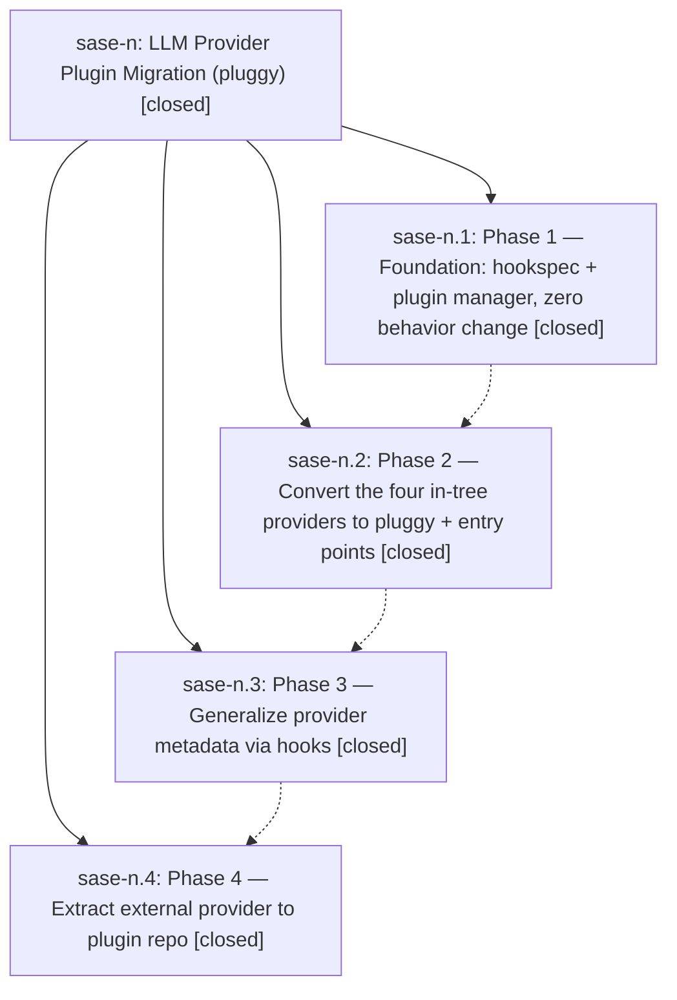

# Bead: sase-n — LLM Provider Plugin Migration (pluggy)

[Bead Pages](../README.md) / sase-n

**Status:** ✓ closed · **Resolution:** (unrecorded) · **Type:** plan · **Tier:** epic
**Owner:** `bryanbugyi34@gmail.com`
**Created:** 2026-04-24 18:02:39 UTC · **Closed:** 2026-04-24 18:46:11 UTC
**Plan:** /home/bryan/projects/github/sase-org/sase/plans/202604/llm\_provider\_plugins.md

## Description

Convert sase's LLM provider layer from a hand-rolled registry into a pluggy-based plugin system that mirrors the VCS plugin architecture. Moves an external provider out of sase into its plugin repo.

## Phases

| Bead | Title | Status | Size | Agents | Commits |
|---|---|---|---|---:|---:|
| [sase-n.1](sase-n.1.md) | Phase 1 — Foundation: hookspec + plugin manager, zero behavior change | ✓ closed | small | 0 | 1 |
| [sase-n.2](sase-n.2.md) | Phase 2 — Convert the four in-tree providers to pluggy + entry points | ✓ closed | small | 0 | 1 |
| [sase-n.3](sase-n.3.md) | Phase 3 — Generalize provider metadata via hooks | ✓ closed | small | 0 | 1 |
| [sase-n.4](sase-n.4.md) | Phase 4 — Extract external provider to plugin repo | ✓ closed | small | 0 | 1 |

## Lineage

## Commits

| Commit | Subject | Bead | Committed (UTC) |
|---|---|---|---|
| [`863a0d9`](https://github.com/sase-org/sase/commit/863a0d99c96798be4520575bae40e53f9a6ddf74) | feat: add pluggy hookspec and plugin manager for LLM providers (sase-n.1) | [sase-n.1](sase-n.1.md) | 2026-04-24 18:11:53 |
| [`30d6330`](https://github.com/sase-org/sase/commit/30d6330f596411678d5d59003bd579cfb9a2b8ff) | feat: migrate built-in LLM providers to pluggy entry points (sase-n.2) | [sase-n.2](sase-n.2.md) | 2026-04-24 18:20:18 |
| [`e0d376f`](https://github.com/sase-org/sase/commit/e0d376fc95a4cc625c769279426d940509b9d90f) | ref: generalize LLM provider metadata via pluggy hooks (sase-n.3) | [sase-n.3](sase-n.3.md) | 2026-04-24 18:31:46 |
| [`4dce69c`](https://github.com/sase-org/sase/commit/4dce69c1b127ec477ed4e18714e2d2f639186327) | ref: extract jetski LLM provider to sase-google (sase-n.4) | [sase-n.4](sase-n.4.md) | 2026-04-24 18:42:35 |
