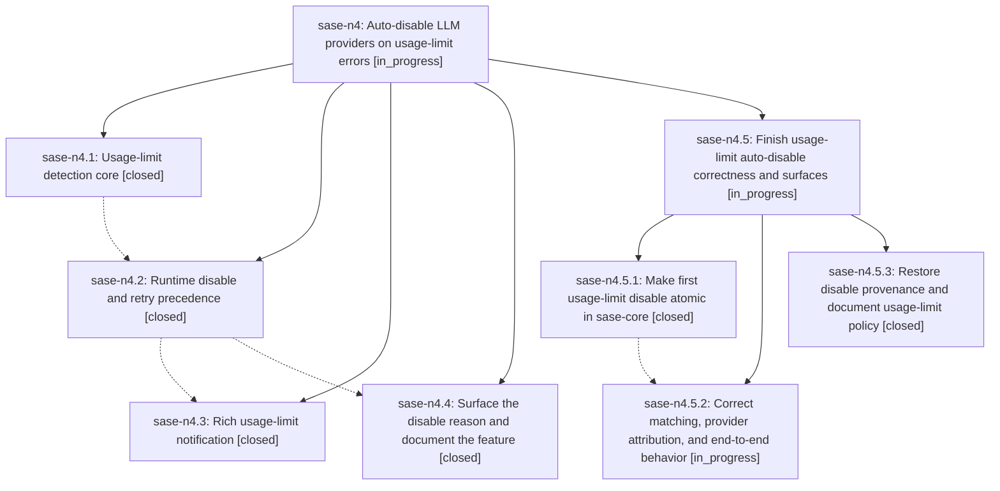

# Bead: sase-n4 — Auto-disable LLM providers on usage-limit errors

[Bead Pages](../README.md) / sase-n4

**Status:** ◐ in_progress · **Type:** ▸ plan · **Tier:** epic
**Owner:** `bryanbugyi34@gmail.com` · **Created by:** [bbugyi200.athena.03j](https://github.com/sase-org/sase--agents/blob/main/families/bbugyi200.athena.03j.md) · **Assignee:** `sase-n4.land`
**Created:** 2026-08-16 10:33:22 EDT
**Plan:** [202608/llm\_usage\_limit\_auto\_disable.md](https://github.com/sase-org/sase--plans/blob/main/202608/llm_usage_limit_auto_disable.md)

## Description

When a sase agent fails because its LLM provider reported a usage/quota limit, sase recognizes that failure, temporarily disables just that provider (honoring the reset time the provider itself reported when one is available), stops wasting retries on it, and tells the user what happened with a rich notification. Defaults work out of the box for every shipped provider, and users can extend or replace the patterns and durations from config.

## Notes

[2026-08-16T18:17:21Z · sase-n4.land] LANDING AUDIT (sase-n4.land, 2026-08-16): reviewed the 602-line linked plan, all four child beads and every note, epic commits 3201e7fd/c9ef6751/1fbc8c0f, current source, and every non-epic commit since 3201e7fd on fetched origin/master. Focused verification after just install passed 175 tests, including all usage-limit suites plus the query-profile, var-integration, and Vim-containment proposals. Completion is still blocked: sase-n4.4 has no commit and its provenance/config/docs are absent; replace_patterns=true with an empty list incorrectly restores built-ins; known-provider retry detection can misattribute Codex output to Claude and does not refresh execution provenance after fallback despite 96b48d0a; Rust storage makes the first-writer dedup check non-atomic; and the fakey test does not exercise the full invocation/retry/notification/error path. Remaining work is captured in validated child epic plan sase_plan_finish_usage_limit_auto_disable.md with parent_bead sase-n4. Follow-up outcomes: config-cache cascade corroborated on sase-mv and active epic sase-j7; Config Center atomic-save flake corroborated on sase-md; notification Models-panel action filed ready as sase-nh; Vim containment family filed ready as sase-ni with RELATED sase-ct; query-profile proposal declined as fixed by 5d0bcf9 and passing; schema-22 var proposal routed to sase-n8, whose 57c71d17 fix now passes while n8.8 owns the published core floor. Do not close sase-n4 until the child epic lands and this audit resumes.

## Phases

| Bead | Title | Status | Size | Created | Agents | Commits |
|---|---|---|---|---|---:|---:|
| [sase-n4.1](sase-n4.1.md) | Usage-limit detection core | ✓ closed | medium | 2026-08-16 | 1 | 1 |
| [sase-n4.2](sase-n4.2.md) | Runtime disable and retry precedence | ✓ closed | medium | 2026-08-16 | 1 | 1 |
| [sase-n4.3](sase-n4.3.md) | Rich usage-limit notification | ✓ closed | small | 2026-08-16 | 1 | 1 |
| [sase-n4.4](sase-n4.4.md) | Surface the disable reason and document the feature | ✓ closed | small | 2026-08-16 | 0 | 0 |

## Lineage

## Agents

| Agent | Bead | Commits |
|---|---|---:|
| [bbugyi200.athena.sase-n4.1](https://github.com/sase-org/sase--agents/blob/main/agents/bbugyi200.athena.sase-n4.1/README.md) | [sase-n4.1](sase-n4.1.md) | 1 |
| [bbugyi200.athena.sase-n4.2](https://github.com/sase-org/sase--agents/blob/main/agents/bbugyi200.athena.sase-n4.2/README.md) | [sase-n4.2](sase-n4.2.md) | 1 |
| [bbugyi200.athena.sase-n4.3](https://github.com/sase-org/sase--agents/blob/main/agents/bbugyi200.athena.sase-n4.3/README.md) | [sase-n4.3](sase-n4.3.md) | 1 |
| [bbugyi200.athena.sase-n4.5.1](https://github.com/sase-org/sase--agents/blob/main/agents/bbugyi200.athena.sase-n4.5.1/README.md) | [sase-n4.5.1](sase-n4.5.1.md) | 1 |
| [bbugyi200.athena.sase-n4.5.2](https://github.com/sase-org/sase--agents/blob/main/agents/bbugyi200.athena.sase-n4.5.2/README.md) | [sase-n4.5.2](sase-n4.5.2.md) | 0 |
| [bbugyi200.athena.sase-n4.5.3](https://github.com/sase-org/sase--agents/blob/main/agents/bbugyi200.athena.sase-n4.5.3/README.md) | [sase-n4.5.3](sase-n4.5.3.md) | 1 |
| [bbugyi200.athena.sase-n4.5.land](https://github.com/sase-org/sase--agents/blob/main/agents/bbugyi200.athena.sase-n4.5.land/README.md) | [sase-n4.5](sase-n4.5.md) | 0 |
| [bbugyi200.athena.sase-n4.land](https://github.com/sase-org/sase--agents/blob/main/families/bbugyi200.athena.sase-n4.land.md) | [sase-n4](README.md) | 0 |

## Commits

| Repo | Commit | Subject | Bead | Committed |
|---|---|---|---|---|
| sase | [`3201e7f`](https://github.com/sase-org/sase/commit/3201e7fdb793e9eb0043e08c2c61629eafbfc656) | feat(llm-provider): add usage-limit detection core | [sase-n4.1](sase-n4.1.md) | 2026-08-16 11:18:09 EDT |
| sase | [`c9ef675`](https://github.com/sase-org/sase/commit/c9ef675105258e853f80629628c6826f9ad33fe2) | feat(llm-provider): auto-disable providers on usage-limit errors | [sase-n4.2](sase-n4.2.md) | 2026-08-16 12:24:54 EDT |
| sase | [`1fbc8c0`](https://github.com/sase-org/sase/commit/1fbc8c0f193338b0ac4fb63a435694f8f81cb403) | feat(llm-provider): notify on usage-limit auto-disable | [sase-n4.3](sase-n4.3.md) | 2026-08-16 13:13:37 EDT |
| sase | [`2509e39`](https://github.com/sase-org/sase/commit/2509e3990c17db2a237e57f945357934f9b7ede3) | feat: show provider-disable provenance in Launch Control | [sase-n4.5.3](sase-n4.5.3.md) | 2026-08-16 15:06:05 EDT |
| sase-core | [`sase-core@dc87c8e`](https://github.com/sase-org/sase-core/commit/dc87c8e5faa250b1babc84764493e05233d5a0a8) | feat(provider\_disable): add atomic first-writer disable | [sase-n4.5.1](sase-n4.5.1.md) | 2026-08-16 15:15:23 EDT |
