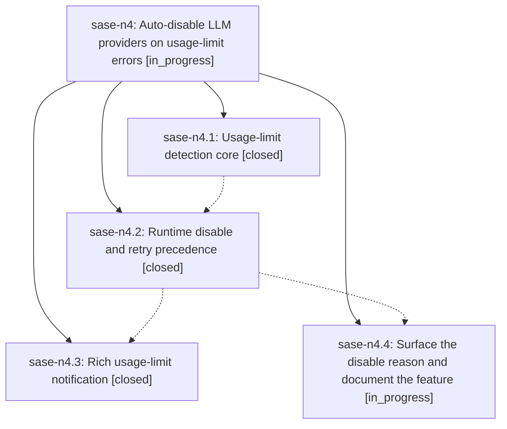

# Bead: sase-n4 — Auto-disable LLM providers on usage-limit errors

[Bead Pages](../README.md) / sase-n4

**Status:** ◐ in_progress · **Type:** ▸ plan · **Tier:** epic
**Owner:** `bryanbugyi34@gmail.com` · **Created by:** [bbugyi200.athena.03j](https://github.com/sase-org/sase--agents/blob/main/families/bbugyi200.athena.03j.md) · **Assignee:** `sase-n4.land`
**Created:** 2026-08-16 10:33:22 EDT
**Plan:** [202608/llm\_usage\_limit\_auto\_disable.md](https://github.com/sase-org/sase--plans/blob/main/202608/llm_usage_limit_auto_disable.md)

## Description

When a sase agent fails because its LLM provider reported a usage/quota limit, sase recognizes that failure, temporarily disables just that provider (honoring the reset time the provider itself reported when one is available), stops wasting retries on it, and tells the user what happened with a rich notification. Defaults work out of the box for every shipped provider, and users can extend or replace the patterns and durations from config.

## Phases

| Bead | Title | Status | Size | Created | Agents | Commits |
|---|---|---|---|---|---:|---:|
| [sase-n4.1](sase-n4.1.md) | Usage-limit detection core | ✓ closed | medium | 2026-08-16 | 1 | 1 |
| [sase-n4.2](sase-n4.2.md) | Runtime disable and retry precedence | ✓ closed | medium | 2026-08-16 | 1 | 1 |
| [sase-n4.3](sase-n4.3.md) | Rich usage-limit notification | ✓ closed | small | 2026-08-16 | 1 | 1 |
| [sase-n4.4](sase-n4.4.md) | Surface the disable reason and document the feature | ◐ in_progress | small | 2026-08-16 | 1 | 0 |

## Lineage

## Agents

| Agent | Bead | Commits |
|---|---|---:|
| [bbugyi200.athena.sase-n4.1](https://github.com/sase-org/sase--agents/blob/main/agents/bbugyi200.athena.sase-n4.1/README.md) | [sase-n4.1](sase-n4.1.md) | 1 |
| [bbugyi200.athena.sase-n4.2](https://github.com/sase-org/sase--agents/blob/main/agents/bbugyi200.athena.sase-n4.2/README.md) | [sase-n4.2](sase-n4.2.md) | 1 |
| [bbugyi200.athena.sase-n4.3](https://github.com/sase-org/sase--agents/blob/main/agents/bbugyi200.athena.sase-n4.3/README.md) | [sase-n4.3](sase-n4.3.md) | 1 |
| [bbugyi200.athena.sase-n4.4](https://github.com/sase-org/sase--agents/blob/main/agents/bbugyi200.athena.sase-n4.4/README.md) | [sase-n4.4](sase-n4.4.md) | 0 |
| [bbugyi200.athena.sase-n4.land](https://github.com/sase-org/sase--agents/blob/main/agents/bbugyi200.athena.sase-n4.land/README.md) | [sase-n4](README.md) | 0 |

## Commits

| Repo | Commit | Subject | Bead | Committed |
|---|---|---|---|---|
| sase | [`3201e7f`](https://github.com/sase-org/sase/commit/3201e7fdb793e9eb0043e08c2c61629eafbfc656) | feat(llm-provider): add usage-limit detection core | [sase-n4.1](sase-n4.1.md) | 2026-08-16 11:18:09 EDT |
| sase | [`c9ef675`](https://github.com/sase-org/sase/commit/c9ef675105258e853f80629628c6826f9ad33fe2) | feat(llm-provider): auto-disable providers on usage-limit errors | [sase-n4.2](sase-n4.2.md) | 2026-08-16 12:24:54 EDT |
| sase | [`1fbc8c0`](https://github.com/sase-org/sase/commit/1fbc8c0f193338b0ac4fb63a435694f8f81cb403) | feat(llm-provider): notify on usage-limit auto-disable | [sase-n4.3](sase-n4.3.md) | 2026-08-16 13:13:37 EDT |
