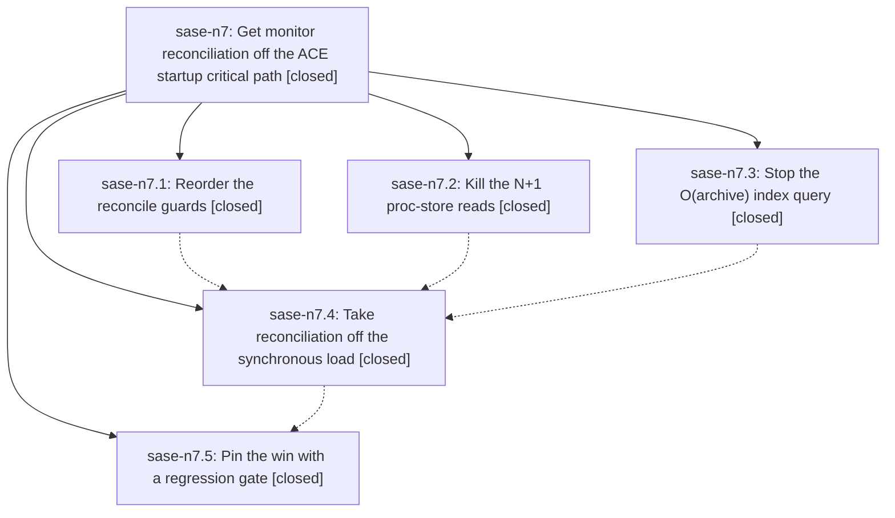

# Bead: sase-n7 — Get monitor reconciliation off the ACE startup critical path

[Bead Pages](../README.md) / sase-n7

**Status:** ✓ closed · **Resolution:** done · **Type:** ▸ plan · **Tier:** epic
**Owner:** `bryanbugyi34@gmail.com` · **Created by:** [bbugyi200.athena.03q](https://github.com/sase-org/sase--agents/blob/main/families/bbugyi200.athena.03q.md) · **Assignee:** `sase-n7.land`
**Created:** 2026-08-16 11:15:59 EDT · **Closed:** 2026-08-16 14:04:10 EDT
**Plan:** [202608/tui\_startup\_monitor\_reconcile.md](https://github.com/sase-org/sase--plans/blob/main/202608/tui_startup_monitor_reconcile.md)

## Description

`sase ace` startup returns to at or below its 2026-08-12 baseline (median `visible_ready` <= 2.8 s, `agents_ready` <= 3.4 s), monitor reconciliation no longer runs synchronously inside the agents disk load, and an operation-count regression gate keeps data-scaled work off the startup path.

## Notes

[2026-08-16T18:04:10Z · sase-n7.land] VERIFIED (step 1): read all five child beads and every child note, then read the source and each commit rather than trusting the reports. sase-n7.1 (6d9db4c26) reorders should_reconcile_dead_supervisor so monitor_state/pid reject before proc_shell_owns() — behavior-preserving, all three are pure False-returning predicates. sase-n7.2 (3f3f61d14) adds procs.store.read_proc_snapshot() as the single store-read primitive, threads snapshot= through get_proc/proc_shell_owns/should_reconcile_dead_supervisor/reconcile_dead_supervisors_for_records and list_monitors/_with_proc_projection; get_proc's semantics are preserved because filter_procs with all-default args is a no-op. sase-n7.3 (9fe82045d) gives reconciliation its own _reconciliation_project_records() query (include_active only, active_limit=1000, include_full_history=False, recent_completed_limit=0, only_monitors=True) plus a bounded max_records=0/newest_first fallback scan, and leaves _project_records/list_monitors on full history — no Rust escalation was needed. sase-n7.4 (39bdd6772) removes the sync _reconcile_dead_monitor_supervisors_for_tui() from _load_agents_from_disk_impl and schedules it after the sync, async, and artifact-delta loads, mirroring _run_loader_cleanup exactly (latest-wins coalesce, spawn_pump_free_task, NavigationGate deferral, spawn-fail guard release, trailing pass in finally) with MONITOR_RECONCILE_REFRESH_SOURCE breaking the refresh loop. sase-n7.5 (0ec2018f1) adds tests/perf/bench_agent_disk_load_ops.py, check_agent_disk_load_ops_regression.py, a committed baseline, a pytest gate, and a Just recipe. Grep confirms no synchronous reconcile caller remains on any TUI path; only the background helper and axe/hook_jobs.py call reconcile_dead_supervisors.

MEASURED: 54 tests green across tests/monitor/test_monitor_store_reconcile.py, tests/test_procs_facade.py, tests/ace/tui/test_monitor_reconcile_off_read_path.py, tests/perf/test_agent_disk_load_ops_regression.py. 'just agent-disk-load-ops-check' passes: 1 loader index query, 0 proc-store reads, 0 monitor-reconcile index queries, 0 sync reconcile calls, unchanged between 0 and 250 monitor rows. The plan's own harness on the author's real ~/.sase state now reports disk_load 1.014s / 1.229s / 1.224s for 361 agents with 0 sync reconcile_dead_supervisors calls (was 3.84s for 173 agents with the sync call). The epic's structural goals are met; the plan's absolute median visible_ready <= 2.8 s was NOT re-measured, because a live 'sase ace' launch needs an interactive session and the box was under heavy load. The one post-change tui_startup.jsonl sample (2026-08-16T17:34:13Z) reads visible_ready 3.95 s / agents_ready 4.78 s, down from 5.8-8.1 s before, on a workload that has roughly doubled since the 2026-08-12 baseline (173 -> 361 agents scanned, index_row_count 530 -> 614).

INTEGRATED (step 2): reviewed all seven non-epic commits since 6d9db4c26 (be0e35d81, 23c953bc7, c9ef67510, ddef1f0d4, 1fbc8c0f1, ed39dd0b8, 96b48d0ab). None touch src/sase/monitor, src/sase/procs, or the agents loading path, and none introduce a proc-store or artifact-index N+1 that should adopt read_proc_snapshot(). procs/service.py's reconcile_proc_shells deliberately re-reads after writes and must not be snapshot-scoped. One real integration gap was found and fixed as epic work: the new gate had a Just recipe and a pytest gate but no step in CI's perf-floors job, unlike its siblings launch-perf-check and view-hints-perf-check. Added 'Run agents disk-load operation-count floor' plus its artifact upload to .github/workflows/ci.yml.

FULL VERIFICATION: 'just check' escalated to the whole suite — every lint gate green, 31240 passed, 11 skipped, 2 failed. Both failures are cross-repo drift from other in-flight epics, reproduced in isolation and unrelated to this epic: test_var_integration schema 21-vs-22 (sase-core 5078d26, epic sase-n8) and test_bead_cli_golden_contract[stats] missing the Flags row (sase-core 198a7b4, epic sase-nb).

FOLLOW-UPS from child PROPOSED FOLLOW-UP notes, all five routed: (1) sase-n7.5's Python/Rust index schema 21-vs-22 -> corroborating DISCOVERED ISSUE note on epic sase-n8, which already tracked it and whose phase sase-n8.8 is the natural home; no task created. (2) sase-n7.2's lane-helper N+1 proc-store reads (active_monitor_for_lane, monitor_blocking_start_for_lane) -> DISCOVERED ISSUE note on epic sase-m9, whose phase sase-m9.2.1.4 (8b4635ad1) put the expensive proc_shell_owns() into that guard; no task created. (3) sase-n7.4's get_monitor() full-history query per reconcile candidate -> new task sase-ne (medium, ready), with RELATED notes to sase-n7, sase-m9, and sase-kh. (4) sase-n7.2 and sase-n7.3's tests/test_config.py xdist flakes (test_load_config_layers_overlay_detected, test_load_merged_config_invalid_yaml_skipped) -> +1 on sase-mv, same process-global config-cache root cause and same remediation. (5) sase-n7.3's test_enter_returns_while_xprompt_file_read_is_blocked -> new task sase-nf (large, ready), filed as a narrow node task per sase-ct's retired-umbrella close reason, with RELATED notes to sase-ct, sase-j7, and sase-mv. Nothing was declined.

DELIBERATELY NOT DONE: the gate phase's sase/memory/tui_perf.md rule-9 update. CLAUDE.md requires explicit user permission for memory-file edits and the plan anticipated this; permission was not granted to sase-n7.5 and has not been granted in this landing either, so the memory note still does not record the monitor-reconciliation instance of the settlement-work-on-a-read-path failure mode.

[2026-08-16T18:06:30Z · sase-n7.land] POST-CLOSE INTEGRATION (second gap, found while checking the working tree after the close): .gitignore listed an explicit ignore line for every other perf floor-check report — sdd/plans/202604/rust_backend_phase7_floor_check.json, 202605/bead_perf_smoke.json, 202605/agent_launch_regression_check.json, 202607/view_hints_regression_check.json — but not the report sase-n7.5's checker writes. So running 'just agent-disk-load-ops-check' left sdd/plans/202608/perf_artifacts/agent_disk_load_ops_regression_check.json untracked in every agent's tree, which is exactly the dirty-tree state the repo's commit workflow and dirty-tree audits object to. Added the matching ignore line with the same comment shape as its siblings; 'git status --short' is now clean apart from the two intentional edits. Both edits from this landing — the CI perf-floors step in .github/workflows/ci.yml and this .gitignore line — are in the working tree for the finalizer to commit.

[2026-08-16T18:16:52Z · 044] DISCOVERED ISSUE: During finish_m9_proc_closeout verification on master 57c71d17a, just check escalated to the full 14-worker lane and failed both tests/monitor/test_monitor_store_reconcile.py::test_reconcile_dead_supervisors_reads_proc_store_once and ::test_list_monitors_proc_store_reads_do_not_scale_with_record_count. Both passed immediately together in isolation, and the focused monitor/proc lane had already passed 221/221. The local diff only publishes the spawned supervisor PID before start ack; it does not touch store reconciliation. The two assertions count process-global proc-store reads, so their full-lane/pass-isolation shape is credible evidence of a background reconciliation call leaking across test boundaries after this epic moved reconciliation off the synchronous startup path. Please diagnose with the sase-j7 global-state leak tooling or route elsewhere if the recorded call source proves different.

[2026-08-16T18:18:44Z · sase-n7.land] FINALIZER PASS (commit): re-ran close to verify the 2026-08-16T18:04:10Z close was published, not merely local. The two integration edits from this landing (.github/workflows/ci.yml perf-floors step for just agent-disk-load-ops-check + .gitignore line for the checker's report) are being committed in this pass.

[2026-08-16T18:31:55Z · sase-n7.land] ROUTED (post-close, in response to 044's DISCOVERED ISSUE note of 2026-08-16T18:16:52Z): 044's report is correct and this epic caused it. Diagnosis: _count_proc_store_reads (tests/monitor/test_monitor_store_reconcile.py:641) and the inline 'counting' closure in test_list_monitors_proc_store_reads_do_not_scale_with_record_count both monkeypatch the PROCESS-GLOBAL sase.procs.store._call_binding and append every read_procs_snapshot call to a plain list with no thread or task scoping. Phase sase-n7.4 (39bdd6772) then moved _reconcile_dead_monitor_supervisors_for_tui off the synchronous disk load onto a background spawn_pump_free_task, so a concurrently-running ACE TUI test in the same xdist worker can now emit a read_procs_snapshot that these counters attribute to themselves. That is exactly the pass-in-isolation / fail-in-full-lane shape 044 observed. Filed as new task sase-nj (small, ready) via /sase_new_task, with RELATED notes to sase-n7, sase-j7 (the process-global-state-leak epic whose tooling 044 suggested), and sase-ne. Not fixed here: this epic is closed and published, and a speculative change to a regression gate could not be verified under the 14-worker conditions that produce the failure within this finalizer turn.

## Phases

| Bead | Title | Status | Size | Created | Agents | Commits |
|---|---|---|---|---|---:|---:|
| [sase-n7.1](sase-n7.1.md) | Reorder the reconcile guards | ✓ closed | small | 2026-08-16 | 1 | 1 |
| [sase-n7.2](sase-n7.2.md) | Kill the N+1 proc-store reads | ✓ closed | medium | 2026-08-16 | 1 | 1 |
| [sase-n7.3](sase-n7.3.md) | Stop the O(archive) index query | ✓ closed | medium | 2026-08-16 | 1 | 1 |
| [sase-n7.4](sase-n7.4.md) | Take reconciliation off the synchronous load | ✓ closed | medium | 2026-08-16 | 1 | 1 |
| [sase-n7.5](sase-n7.5.md) | Pin the win with a regression gate | ✓ closed | small | 2026-08-16 | 1 | 1 |

## Lineage

## Agents

| Agent | Bead | Commits |
|---|---|---:|
| [bbugyi200.athena.sase-n7.1](https://github.com/sase-org/sase--agents/blob/main/agents/bbugyi200.athena.sase-n7.1/README.md) | [sase-n7.1](sase-n7.1.md) | 1 |
| [bbugyi200.athena.sase-n7.2](https://github.com/sase-org/sase--agents/blob/main/agents/bbugyi200.athena.sase-n7.2/README.md) | [sase-n7.2](sase-n7.2.md) | 1 |
| [bbugyi200.athena.sase-n7.3](https://github.com/sase-org/sase--agents/blob/main/agents/bbugyi200.athena.sase-n7.3/README.md) | [sase-n7.3](sase-n7.3.md) | 1 |
| [bbugyi200.athena.sase-n7.4](https://github.com/sase-org/sase--agents/blob/main/agents/bbugyi200.athena.sase-n7.4/README.md) | [sase-n7.4](sase-n7.4.md) | 1 |
| [bbugyi200.athena.sase-n7.5](https://github.com/sase-org/sase--agents/blob/main/agents/bbugyi200.athena.sase-n7.5/README.md) | [sase-n7.5](sase-n7.5.md) | 1 |
| [bbugyi200.athena.sase-n7.land](https://github.com/sase-org/sase--agents/blob/main/agents/bbugyi200.athena.sase-n7.land/README.md) | [sase-n7](README.md) | 1 |

## Commits

| Repo | Commit | Subject | Bead | Committed |
|---|---|---|---|---|
| sase | [`6d9db4c`](https://github.com/sase-org/sase/commit/6d9db4c26a357c78b0b015f14e8379c6fc7d365c) | perf(monitor): skip proc-store lookup before cheap reconcile guards | [sase-n7.1](sase-n7.1.md) | 2026-08-16 11:36:42 EDT |
| sase | [`9fe8204`](https://github.com/sase-org/sase/commit/9fe82045d1948f20209b9b4d89a32a39fee0a2aa) | perf(monitor): bound reconciliation artifact-index query | [sase-n7.3](sase-n7.3.md) | 2026-08-16 11:51:21 EDT |
| sase | [`3f3f61d`](https://github.com/sase-org/sase/commit/3f3f61d14d9a53441fae2d98b92ce4882c929147) | perf(monitor): resolve many proc ids from one store snapshot | [sase-n7.2](sase-n7.2.md) | 2026-08-16 12:04:13 EDT |
| sase | [`39bdd67`](https://github.com/sase-org/sase/commit/39bdd6772ed2cdd0f3b6b822449e687542cfe1b5) | perf(ace): take monitor reconcile off the agents disk load | [sase-n7.4](sase-n7.4.md) | 2026-08-16 12:45:19 EDT |
| sase | [`0ec2018`](https://github.com/sase-org/sase/commit/0ec2018f1f191fdafe3d7e8416eb06263e6abec1) | test: add agents disk-load operation regression gate | [sase-n7.5](sase-n7.5.md) | 2026-08-16 13:24:08 EDT |
| sase | [`a892dce`](https://github.com/sase-org/sase/commit/a892dce3a9db82b03822d00b76b8879f9992285a) | ci: run the agents disk-load ops floor in the perf-floors job | [sase-n7](README.md) | 2026-08-16 14:33:04 EDT |
