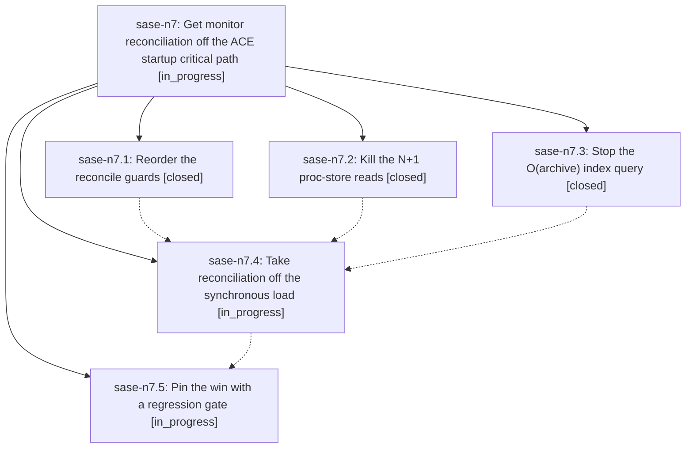

# Bead: sase-n7 — Get monitor reconciliation off the ACE startup critical path

[Bead Pages](../README.md) / sase-n7

**Status:** ◐ in_progress · **Type:** ▸ plan · **Tier:** epic
**Owner:** `bryanbugyi34@gmail.com` · **Created by:** [bbugyi200.athena.03q](https://github.com/sase-org/sase--agents/blob/main/families/bbugyi200.athena.03q.md) · **Assignee:** `sase-n7.land`
**Created:** 2026-08-16 11:15:59 EDT
**Plan:** [202608/tui\_startup\_monitor\_reconcile.md](https://github.com/sase-org/sase--plans/blob/main/202608/tui_startup_monitor_reconcile.md)

## Description

`sase ace` startup returns to at or below its 2026-08-12 baseline (median `visible_ready` <= 2.8 s, `agents_ready` <= 3.4 s), monitor reconciliation no longer runs synchronously inside the agents disk load, and an operation-count regression gate keeps data-scaled work off the startup path.

## Phases

| Bead | Title | Status | Size | Created | Agents | Commits |
|---|---|---|---|---|---:|---:|
| [sase-n7.1](sase-n7.1.md) | Reorder the reconcile guards | ✓ closed | small | 2026-08-16 | 1 | 1 |
| [sase-n7.2](sase-n7.2.md) | Kill the N+1 proc-store reads | ✓ closed | medium | 2026-08-16 | 1 | 1 |
| [sase-n7.3](sase-n7.3.md) | Stop the O(archive) index query | ✓ closed | medium | 2026-08-16 | 1 | 1 |
| [sase-n7.4](sase-n7.4.md) | Take reconciliation off the synchronous load | ◐ in_progress | medium | 2026-08-16 | 1 | 0 |
| [sase-n7.5](sase-n7.5.md) | Pin the win with a regression gate | ◐ in_progress | small | 2026-08-16 | 1 | 0 |

## Lineage

## Agents

| Agent | Bead | Commits |
|---|---|---:|
| [bbugyi200.athena.sase-n7.1](https://github.com/sase-org/sase--agents/blob/main/agents/bbugyi200.athena.sase-n7.1/README.md) | [sase-n7.1](sase-n7.1.md) | 1 |
| [bbugyi200.athena.sase-n7.2](https://github.com/sase-org/sase--agents/blob/main/agents/bbugyi200.athena.sase-n7.2/README.md) | [sase-n7.2](sase-n7.2.md) | 1 |
| [bbugyi200.athena.sase-n7.3](https://github.com/sase-org/sase--agents/blob/main/agents/bbugyi200.athena.sase-n7.3/README.md) | [sase-n7.3](sase-n7.3.md) | 1 |
| [bbugyi200.athena.sase-n7.4](https://github.com/sase-org/sase--agents/blob/main/agents/bbugyi200.athena.sase-n7.4/README.md) | [sase-n7.4](sase-n7.4.md) | 0 |
| [bbugyi200.athena.sase-n7.5](https://github.com/sase-org/sase--agents/blob/main/agents/bbugyi200.athena.sase-n7.5/README.md) | [sase-n7.5](sase-n7.5.md) | 0 |
| [bbugyi200.athena.sase-n7.land](https://github.com/sase-org/sase--agents/blob/main/agents/bbugyi200.athena.sase-n7.land/README.md) | [sase-n7](README.md) | 0 |

## Commits

| Repo | Commit | Subject | Bead | Committed |
|---|---|---|---|---|
| sase | [`6d9db4c`](https://github.com/sase-org/sase/commit/6d9db4c26a357c78b0b015f14e8379c6fc7d365c) | perf(monitor): skip proc-store lookup before cheap reconcile guards | [sase-n7.1](sase-n7.1.md) | 2026-08-16 11:36:42 EDT |
| sase | [`9fe8204`](https://github.com/sase-org/sase/commit/9fe82045d1948f20209b9b4d89a32a39fee0a2aa) | perf(monitor): bound reconciliation artifact-index query | [sase-n7.3](sase-n7.3.md) | 2026-08-16 11:51:21 EDT |
| sase | [`3f3f61d`](https://github.com/sase-org/sase/commit/3f3f61d14d9a53441fae2d98b92ce4882c929147) | perf(monitor): resolve many proc ids from one store snapshot | [sase-n7.2](sase-n7.2.md) | 2026-08-16 12:04:13 EDT |
