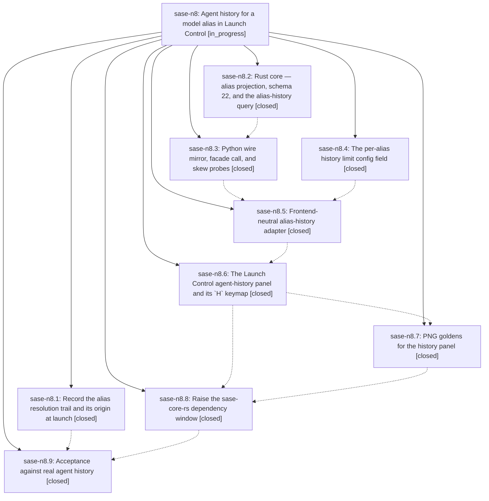

# Bead: sase-n8 — Agent history for a model alias in Launch Control

[Bead Pages](../README.md) / sase-n8

**Status:** ◐ in_progress · **Type:** ▸ plan · **Tier:** epic
**Owner:** `bryanbugyi34@gmail.com` · **Created by:** [bbugyi200.athena.03t](https://github.com/sase-org/sase--agents/blob/main/families/bbugyi200.athena.03t.md) · **Assignee:** `sase-n8.land`
**Created:** 2026-08-16 11:30:23 EDT
**Plan:** [202608/launch\_control\_alias\_history.md](https://github.com/sase-org/sase--plans/blob/main/202608/launch_control_alias_history.md)

## Description

Pressing `H` on any alias-bearing Launch Control row opens a pop-up panel that answers "which agents actually ran on this alias, and how did they get here?" — a bounded, newest-first list of prior runs with the concrete model that answered, a readable prompt snippet, and an honest provenance chip that distinguishes a direct `%model:@alias` request from an alias reached through another alias and from the no-directive default, backed by a new per-alias retention limit config field.

## Notes

[2026-08-16T16:55:47Z · 03w] DISCOVERED ISSUE: tests/main/test_var_integration.py::test_var_cli_end_to_end_refreshes_index_and_round_trips_machine_outputs failed under an escalated full just check (workspace sase_19, 2026-08-16) with AssertionError: assert '22' == '21' at the schema_version meta check after sase var list upgrades a stale index. Python still has AGENT_ARTIFACT_INDEX_SCHEMA_VERSION = 21 (src/sase/core/agent_scan_wire_records.py) while just install fast-forwarded linked sase-core to 0.27.12, which writes schema 22. The test writes version (Python_const - 1) then expects the on-disk meta to equal the Python constant; Rust upgrade lands 22 instead. This is the expected skew until sase-n8.3 (Python wire mirror) and sase-n8.8 (raise sase-core-rs floor) land. The session that observed it did not touch agent-scan schema or var CLI — it only added reserved lease(...) RUNNING-field labels. Isolated rerun of that session's own tests passed (38 passed).

[2026-08-16T17:40:50Z · sase-nb.2] DISCOVERED ISSUE: During feature_flag_registry implementation verification on 2026-08-16, just check escalated to the full suite and failed tests/main/test_var_integration.py::test_var_cli_end_to_end_refreshes_index_and_round_trips_machine_outputs with AssertionError: assert '22' == '21' after the stale-index upgrade. Focused rerun reproduced the same var failure while tests/ace/tui/test_config_center_state.py::test_save_atomically_replaces_existing_state and tests/test_config.py::test_load_merged_config_local_overrides_global passed in isolation. This workspace did not touch agent-scan wire or var CLI; the linked Rust binding rebuilt by just install writes schema 22 while Python AGENT_ARTIFACT_INDEX_SCHEMA_VERSION remains 21. This corroborates the existing 2026-08-16 note on this epic and remains expected skew until sase-n8.3/sase-n8.8 land.

[2026-08-16T17:44:45Z · sase-n7.land] DISCOVERED ISSUE (corroboration of the 2026-08-16T16:55:47Z note): reproduced independently by sase-n7.land in workspace sase_17 on master HEAD 0ec2018f1 after a fresh 'just install' (builds sase_core_rs from the linked sase-core checkout at e55bd44 / v0.27.14). '.venv/bin/python -m pytest -q tests/main/test_var_integration.py' fails with 'AssertionError: assert 22 == 21' at tests/main/test_var_integration.py:70. Root cause confirmed cross-repo: sase-core commit 5078d26 'feat(agent_scan): project alias trails and query bounded alias history' (SASE_BEAD=sase-n8.2) bumped crates/sase_core/src/agent_scan/index.rs:42 AGENT_ARTIFACT_INDEX_SCHEMA_VERSION 21 -> 22, while this repo's src/sase/core/agent_scan_wire_records.py:29 still declares 21 (last set by sase-mg.2, 57af5d3ed). tests/test_core_agent_scan_wire.py:31 also pins 21. Impact: 'just check' escalations and 'just check-full' are red on master for every agent. Phase sase-n8.8 (raise the sase-core-rs dependency window) is still in progress and is the natural home for the Python-side bump. Proposed by bead sase-n7.5.

[2026-08-16T18:13:43Z · sase-n4.land] DISCOVERED ISSUE: Phase beads sase-n4.3 and sase-n4.4 both proposed the tests/main/test_var_integration.py schema 22-vs-21 failure during epic sase-n4 verification. This is the same Rust/Python alias-history skew already recorded here: current master commit 57c71d17 (sase-n8.3) now mirrors schema 22 and the isolated var integration test passes after just install; phase sase-n8.8 still owns raising the published sase-core-rs dependency window.

[2026-08-16T20:42:57Z · sase-n4.5.land] DISCOVERED ISSUE: sase-n4.5 landing just check on master eba0eab7 fails Symvision on unused public AliasHistoryRowSpec, alias_history_empty_text, alias_history_group_header_text, and alias_history_row_text in alias_history_rendering.py. These were introduced by active epic phase sase-n8.6 (commit bc529f11); no standalone task because active epic sase-n8 is the causal owner. Its land pass should privatize/delete the unused exports after descendants finish.

[2026-08-16T20:53:12Z · sase-na.land] DISCOVERED ISSUE: 'just check' is red repo-wide at lint (symvision) because four public symbols added by closed phase sase-n8.6 in src/sase/ace/tui/modals/alias_history_rendering.py have no non-test consumer: AliasHistoryRowSpec, alias_history_empty_text, alias_history_group_header_text, and alias_history_row_text. Symvision: 'Unused public functions/classes. Make these private if they are used only within the file they are defined.' All four are used only inside alias_history_rendering.py itself (alias_history_group_header_text at line 192, alias_history_row_text at line 209, alias_history_empty_text at line 220, AliasHistoryRowSpec at lines 177-207) plus tests/test_alias_history_rendering.py, and test references never count for Symvision; alias_history_modal.py imports other names from the module, not these. They are also exported in the module's __all__ (lines 389-394), which does not satisfy Symvision either. Per sase/memory/symvision.md the fix is decision-hierarchy step 2: prefix each with '_', update the in-file callers, the __all__ entries, and the test imports. Reproduction: 'just _lint-symvision' on unmodified master eba0eab73 (verified via git stash in workspace sase_12 after 'just install'). Impact: every agent in every workspace is blocked at the mandatory pre-reply gate regardless of diff. Recorded here rather than as a task bead because sase-n8 is the active causal owner -- phases sase-n8.8 and sase-n8.9 are still in progress, so its land agent should resolve this before closing. Found by sase-na.land; my epic's own two Symvision findings (build_score_meter, format_reason_chip) are fixed in commit 4e18a1a.

[2026-08-16T20:54:26Z · sase-na.land] CORRECTION to the preceding note: the sase-na landing commit that fixed my epic's own two Symvision findings is b5b7f761b, not the placeholder sha typed in that note. Everything else in it stands.

[2026-08-16T20:59:44Z · 04b] DISCOVERED ISSUE (corroboration): independently reproduced on 2026-08-16 in a fresh workspace while implementing an unrelated plan (finalizer_staged_bead_state). 'just check' fails lint (symvision) on clean master 630f4ea71 with the same unused public symbols already tracked here: AliasHistoryRowSpec, alias_history_empty_text, alias_history_group_header_text, alias_history_row_text in src/sase/ace/tui/modals/alias_history_rendering.py; build_score_meter, format_reason_chip in src/sase/ace/tui/widgets/_history_word_rows.py. Confirmed via git stash on a clean checkout, no local changes present. Not creating a task bead per /sase_new_task guidance since sase-n8 is the established causal owner (see sase-n4.5.land and sase-na.land notes) and its land pass is expected to privatize/delete these once descendants finish.

[2026-08-16T21:00:07Z · 04c] DISCOVERED ISSUE: three tests added by phase sase-n8.6 assert a Launch Control footer 'History' hint that phase sase-n8.7 then deliberately removed, so master is deterministically red. Failing nodes (verified 2026-08-16, workspace sase_13, master 630f4ea71, clean tree, '.venv/bin/python -m pytest tests/test_models_panel_history.py -q -p no:randomly'): test_footer_shows_history_only_for_supported_rows[large-True], test_footer_shows_history_only_for_supported_rows[bucket:research-True], and test_footer_shows_history_for_alias_backed_launch_setting. Evidence: bc529f11f (sase-n8.6) added both the tests and the footer markup ('[green]H[/green]=History' at models_panel_display.py lines 177 and 229); bbc24e472 (sase-n8.7, 'fix(ace): keep Launch Control footer stable') then deleted those 6 lines with the stated rationale 'Keep the history key path available while omitting the parent footer hint so shared Launch Control goldens do not shift', but did not update sase-n8.6's assertions. Rendered footer is now "ctrl+e=Effort ctrl+r=Limit p=Providers / o=Override ...=Clear e=Edit r=Reset j/k=Navigate '=Jump esc=Close". Decide which side is correct -- restore the hint (and refresh the shared Launch Control PNG goldens) or relax the three assertions to cover only the H key path -- before sase-n8 lands. Originally filed as standalone task sase-no, now closed and routed here because it is squarely this epic's own fallout.

[2026-08-16T21:23:12Z · toobig-2v.split_file.tests.ace.tui.artifacts_contract.test_contract_compiler.0] DISCOVERED ISSUE: just check on clean master after commit fc1ad39e7 (phase sase-n8.8) fails mypy before scoped tests: _history_word_rows.py:17 and _prompt_input_bar_completion_panel_labels.py:30 still import HistoryWordCompletionMetadata, but history_word_completion.py now defines only _HistoryWordCompletionMetadata. git blame attributes the public-to-private rename to fc1ad39e7 while both consumers remain from sase-na.4. Reproduced during an unrelated test-file split; the focused artifact-contract suite passes 70 tests. Impact: the mandatory repo-wide check is red for every agent. Route to active causal epic sase-n8 for its remaining acceptance/land pass; no standalone task created.

[2026-08-16T21:48:40Z · sase-m6.land] DISCOVERED ISSUE: phase sase-n8.8's commit fc1ad39e7 ('build(deps): require sase-core-rs 0.27.15', whose body says 'make their remaining test-only helpers private') hard-breaks master. It renamed HistoryWordCompletionMetadata -> _HistoryWordCompletionMetadata in src/sase/ace/tui/widgets/history_word_completion.py, but the class is NOT test-only: two src (non-test) modules still import the public name -- src/sase/ace/tui/widgets/_history_word_rows.py:18 and src/sase/ace/tui/widgets/_prompt_input_bar_completion_panel_labels.py:32. Both importers predate fc1ad39e7 (added by e7b2a30fb and b5b7f761b, confirmed ancestors via git merge-base --is-ancestor), so the privatization was gratuitous rather than a cleanup.

Reproduced on master 35d75b24e in workspace sase_12 after a from-scratch 'just install':
  (1) .venv/bin/python -m mypy src/sase/ace/tui/widgets/_history_word_rows.py -> error: Module "sase.ace.tui.widgets.history_word_completion" has n

… and 3997 more characters

## Phases

| Bead | Title | Status | Size | Created | Agents | Commits |
|---|---|---|---|---|---:|---:|
| [sase-n8.1](sase-n8.1.md) | Record the alias resolution trail and its origin at launch | ✓ closed | large | 2026-08-16 | 1 | 1 |
| [sase-n8.2](sase-n8.2.md) | Rust core — alias projection, schema 22, and the alias-history query | ✓ closed | large | 2026-08-16 | 1 | 1 |
| [sase-n8.3](sase-n8.3.md) | Python wire mirror, facade call, and skew probes | ✓ closed | medium | 2026-08-16 | 1 | 1 |
| [sase-n8.4](sase-n8.4.md) | The per-alias history limit config field | ✓ closed | small | 2026-08-16 | 1 | 1 |
| [sase-n8.5](sase-n8.5.md) | Frontend-neutral alias-history adapter | ✓ closed | medium | 2026-08-16 | 1 | 1 |
| [sase-n8.6](sase-n8.6.md) | The Launch Control agent-history panel and its \`H\` keymap | ✓ closed | large | 2026-08-16 | 1 | 1 |
| [sase-n8.7](sase-n8.7.md) | PNG goldens for the history panel | ✓ closed | medium | 2026-08-16 | 1 | 1 |
| [sase-n8.8](sase-n8.8.md) | Raise the sase-core-rs dependency window | ✓ closed | small | 2026-08-16 | 1 | 2 |
| [sase-n8.9](sase-n8.9.md) | Acceptance against real agent history | ✓ closed | small | 2026-08-16 | 1 | 0 |

## Lineage

## Agents

| Agent | Bead | Commits |
|---|---|---:|
| [bbugyi200.athena.sase-n8.1](https://github.com/sase-org/sase--agents/blob/main/families/bbugyi200.athena.sase-n8.1.md) | [sase-n8.1](sase-n8.1.md) | 1 |
| [bbugyi200.athena.sase-n8.2](https://github.com/sase-org/sase--agents/blob/main/families/bbugyi200.athena.sase-n8.2.md) | [sase-n8.2](sase-n8.2.md) | 1 |
| [bbugyi200.athena.sase-n8.3](https://github.com/sase-org/sase--agents/blob/main/agents/bbugyi200.athena.sase-n8.3/README.md) | [sase-n8.3](sase-n8.3.md) | 1 |
| [bbugyi200.athena.sase-n8.4](https://github.com/sase-org/sase--agents/blob/main/agents/bbugyi200.athena.sase-n8.4/README.md) | [sase-n8.4](sase-n8.4.md) | 1 |
| [bbugyi200.athena.sase-n8.5](https://github.com/sase-org/sase--agents/blob/main/agents/bbugyi200.athena.sase-n8.5/README.md) | [sase-n8.5](sase-n8.5.md) | 1 |
| [bbugyi200.athena.sase-n8.6](https://github.com/sase-org/sase--agents/blob/main/families/bbugyi200.athena.sase-n8.6.md) | [sase-n8.6](sase-n8.6.md) | 1 |
| [bbugyi200.athena.sase-n8.7](https://github.com/sase-org/sase--agents/blob/main/agents/bbugyi200.athena.sase-n8.7/README.md) | [sase-n8.7](sase-n8.7.md) | 1 |
| [bbugyi200.athena.sase-n8.8](https://github.com/sase-org/sase--agents/blob/main/families/bbugyi200.athena.sase-n8.8.md) | [sase-n8.8](sase-n8.8.md) | 2 |
| [bbugyi200.athena.sase-n8.9](https://github.com/sase-org/sase--agents/blob/main/agents/bbugyi200.athena.sase-n8.9/README.md) | [sase-n8.9](sase-n8.9.md) | 0 |
| [bbugyi200.athena.sase-n8.land](https://github.com/sase-org/sase--agents/blob/main/agents/bbugyi200.athena.sase-n8.land/README.md) | [sase-n8](README.md) | 1 |

## Commits

| Repo | Commit | Subject | Bead | Committed |
|---|---|---|---|---|
| sase | [`23c953b`](https://github.com/sase-org/sase/commit/23c953bc7489c6b7a430ae11974e4fb13228a2f1) | feat: add model alias history limit config | [sase-n8.4](sase-n8.4.md) | 2026-08-16 12:13:03 EDT |
| sase-core | [`sase-core@5078d26`](https://github.com/sase-org/sase-core/commit/5078d263f9078bd66382d40d24ed659154c48b88) | feat(agent\_scan): project alias trails and query bounded alias history | [sase-n8.2](sase-n8.2.md) | 2026-08-16 12:23:18 EDT |
| sase | [`96b48d0`](https://github.com/sase-org/sase/commit/96b48d0abbe9acec0f8037a08c388fc7c291edf8) | feat: record alias launch provenance | [sase-n8.1](sase-n8.1.md) | 2026-08-16 13:22:10 EDT |
| sase | [`57c71d1`](https://github.com/sase-org/sase/commit/57c71d17a007e73b016a6cac60d14698c45c9b53) | feat(core): mirror alias-history wire contract and add skew probe | [sase-n8.3](sase-n8.3.md) | 2026-08-16 13:37:24 EDT |
| sase | [`556a78b`](https://github.com/sase-org/sase/commit/556a78bcacbed60137dd69cbf33e5417e8b6acff) | feat(llm-provider): add frontend-neutral alias-history adapter | [sase-n8.5](sase-n8.5.md) | 2026-08-16 14:25:32 EDT |
| sase | [`bc529f1`](https://github.com/sase-org/sase/commit/bc529f11f5f2c8c910f3e2ba08650350b68eb1e9) | feat(ace): add alias agent-history panel to Launch Control | [sase-n8.6](sase-n8.6.md) | 2026-08-16 15:29:09 EDT |
| sase | [`bbc24e4`](https://github.com/sase-org/sase/commit/bbc24e472e53ffb067c4cc41137f5885f70775c3) | fix(ace): keep Launch Control footer stable | [sase-n8.7](sase-n8.7.md) | 2026-08-16 16:01:49 EDT |
| sase | [`fc1ad39`](https://github.com/sase-org/sase/commit/fc1ad39e7ceafca6c7013b52a10f923c2f84987e) | build(deps): require sase-core-rs 0.27.15 | [sase-n8.8](sase-n8.8.md) | 2026-08-16 16:53:46 EDT |
| sase | [`e50d8a9`](https://github.com/sase-org/sase/commit/e50d8a9537a1a1baefd44bf121e1c8faf213b181) | fix: restore history-word metadata API | [sase-n8.8](sase-n8.8.md) | 2026-08-16 17:51:52 EDT |
| sase | [`f3bb46f`](https://github.com/sase-org/sase/commit/f3bb46f292ab9927228534c13885339de5578f92) | fix(ace): restore the Launch Control History footer hint | [sase-n8](README.md) | 2026-08-16 18:39:30 EDT |
