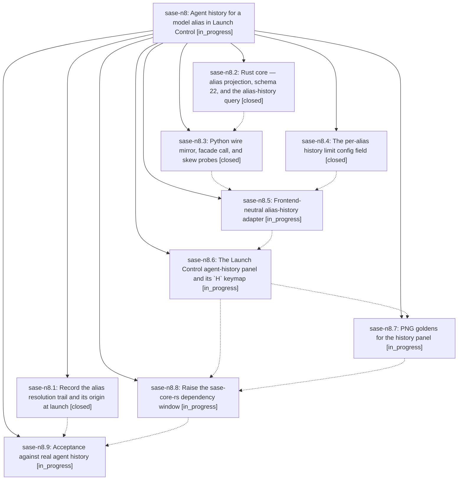

# Bead: sase-n8 — Agent history for a model alias in Launch Control

[Bead Pages](../README.md) / sase-n8

**Status:** ◐ in_progress · **Type:** ▸ plan · **Tier:** epic
**Owner:** `bryanbugyi34@gmail.com` · **Created by:** [bbugyi200.athena.03t](https://github.com/sase-org/sase--agents/blob/main/families/bbugyi200.athena.03t.md) · **Assignee:** `sase-n8.land`
**Created:** 2026-08-16 11:30:23 EDT
**Plan:** [202608/launch\_control\_alias\_history.md](https://github.com/sase-org/sase--plans/blob/main/202608/launch_control_alias_history.md)

## Description

Pressing `H` on any alias-bearing Launch Control row opens a pop-up panel that answers "which agents actually ran on this alias, and how did they get here?" — a bounded, newest-first list of prior runs with the concrete model that answered, a readable prompt snippet, and an honest provenance chip that distinguishes a direct `%model:@alias` request from an alias reached through another alias and from the no-directive default, backed by a new per-alias retention limit config field.

## Notes

[2026-08-16T16:55:47Z · 03w] DISCOVERED ISSUE: tests/main/test_var_integration.py::test_var_cli_end_to_end_refreshes_index_and_round_trips_machine_outputs failed under an escalated full just check (workspace sase_19, 2026-08-16) with AssertionError: assert '22' == '21' at the schema_version meta check after sase var list upgrades a stale index. Python still has AGENT_ARTIFACT_INDEX_SCHEMA_VERSION = 21 (src/sase/core/agent_scan_wire_records.py) while just install fast-forwarded linked sase-core to 0.27.12, which writes schema 22. The test writes version (Python_const - 1) then expects the on-disk meta to equal the Python constant; Rust upgrade lands 22 instead. This is the expected skew until sase-n8.3 (Python wire mirror) and sase-n8.8 (raise sase-core-rs floor) land. The session that observed it did not touch agent-scan schema or var CLI — it only added reserved lease(...) RUNNING-field labels. Isolated rerun of that session's own tests passed (38 passed).

## Phases

| Bead | Title | Status | Size | Created | Agents | Commits |
|---|---|---|---|---|---:|---:|
| [sase-n8.1](sase-n8.1.md) | Record the alias resolution trail and its origin at launch | ✓ closed | large | 2026-08-16 | 1 | 1 |
| [sase-n8.2](sase-n8.2.md) | Rust core — alias projection, schema 22, and the alias-history query | ✓ closed | large | 2026-08-16 | 1 | 1 |
| [sase-n8.3](sase-n8.3.md) | Python wire mirror, facade call, and skew probes | ✓ closed | medium | 2026-08-16 | 1 | 1 |
| [sase-n8.4](sase-n8.4.md) | The per-alias history limit config field | ✓ closed | small | 2026-08-16 | 1 | 1 |
| [sase-n8.5](sase-n8.5.md) | Frontend-neutral alias-history adapter | ◐ in_progress | medium | 2026-08-16 | 1 | 0 |
| [sase-n8.6](sase-n8.6.md) | The Launch Control agent-history panel and its \`H\` keymap | ◐ in_progress | large | 2026-08-16 | 1 | 0 |
| [sase-n8.7](sase-n8.7.md) | PNG goldens for the history panel | ◐ in_progress | medium | 2026-08-16 | 1 | 0 |
| [sase-n8.8](sase-n8.8.md) | Raise the sase-core-rs dependency window | ◐ in_progress | small | 2026-08-16 | 1 | 0 |
| [sase-n8.9](sase-n8.9.md) | Acceptance against real agent history | ◐ in_progress | small | 2026-08-16 | 1 | 0 |

## Lineage

## Agents

| Agent | Bead | Commits |
|---|---|---:|
| [bbugyi200.athena.sase-n8.1](https://github.com/sase-org/sase--agents/blob/main/families/bbugyi200.athena.sase-n8.1.md) | [sase-n8.1](sase-n8.1.md) | 1 |
| [bbugyi200.athena.sase-n8.2](https://github.com/sase-org/sase--agents/blob/main/families/bbugyi200.athena.sase-n8.2.md) | [sase-n8.2](sase-n8.2.md) | 1 |
| [bbugyi200.athena.sase-n8.3](https://github.com/sase-org/sase--agents/blob/main/agents/bbugyi200.athena.sase-n8.3/README.md) | [sase-n8.3](sase-n8.3.md) | 1 |
| [bbugyi200.athena.sase-n8.4](https://github.com/sase-org/sase--agents/blob/main/agents/bbugyi200.athena.sase-n8.4/README.md) | [sase-n8.4](sase-n8.4.md) | 1 |
| [bbugyi200.athena.sase-n8.5](https://github.com/sase-org/sase--agents/blob/main/agents/bbugyi200.athena.sase-n8.5/README.md) | [sase-n8.5](sase-n8.5.md) | 0 |
| [bbugyi200.athena.sase-n8.6](https://github.com/sase-org/sase--agents/blob/main/agents/bbugyi200.athena.sase-n8.6/README.md) | [sase-n8.6](sase-n8.6.md) | 0 |
| [bbugyi200.athena.sase-n8.7](https://github.com/sase-org/sase--agents/blob/main/agents/bbugyi200.athena.sase-n8.7/README.md) | [sase-n8.7](sase-n8.7.md) | 0 |
| [bbugyi200.athena.sase-n8.8](https://github.com/sase-org/sase--agents/blob/main/agents/bbugyi200.athena.sase-n8.8/README.md) | [sase-n8.8](sase-n8.8.md) | 0 |
| [bbugyi200.athena.sase-n8.9](https://github.com/sase-org/sase--agents/blob/main/agents/bbugyi200.athena.sase-n8.9/README.md) | [sase-n8.9](sase-n8.9.md) | 0 |
| [bbugyi200.athena.sase-n8.land](https://github.com/sase-org/sase--agents/blob/main/agents/bbugyi200.athena.sase-n8.land/README.md) | [sase-n8](README.md) | 0 |

## Commits

| Repo | Commit | Subject | Bead | Committed |
|---|---|---|---|---|
| sase | [`23c953b`](https://github.com/sase-org/sase/commit/23c953bc7489c6b7a430ae11974e4fb13228a2f1) | feat: add model alias history limit config | [sase-n8.4](sase-n8.4.md) | 2026-08-16 12:13:03 EDT |
| sase-core | [`sase-core@5078d26`](https://github.com/sase-org/sase-core/commit/5078d263f9078bd66382d40d24ed659154c48b88) | feat(agent\_scan): project alias trails and query bounded alias history | [sase-n8.2](sase-n8.2.md) | 2026-08-16 12:23:18 EDT |
| sase | [`96b48d0`](https://github.com/sase-org/sase/commit/96b48d0abbe9acec0f8037a08c388fc7c291edf8) | feat: record alias launch provenance | [sase-n8.1](sase-n8.1.md) | 2026-08-16 13:22:10 EDT |
| sase | [`57c71d1`](https://github.com/sase-org/sase/commit/57c71d17a007e73b016a6cac60d14698c45c9b53) | feat(core): mirror alias-history wire contract and add skew probe | [sase-n8.3](sase-n8.3.md) | 2026-08-16 13:37:24 EDT |
