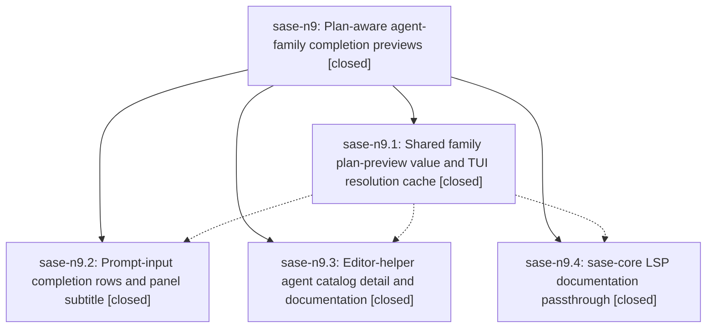

# Bead: sase-n9 — Plan-aware agent-family completion previews

[Bead Pages](../README.md) / sase-n9

**Status:** ✓ closed · **Resolution:** done · **Type:** ▸ plan · **Tier:** epic
**Owner:** `bryanbugyi34@gmail.com` · **Created by:** [bbugyi200.athena.03u](https://github.com/sase-org/sase--agents/blob/main/families/bbugyi200.athena.03u.md) · **Assignee:** `sase-n9.land`
**Created:** 2026-08-16 11:59:35 EDT · **Closed:** 2026-08-16 15:10:07 EDT
**Plan:** [202608/agent\_family\_completion\_previews.md](https://github.com/sase-org/sase--plans/blob/main/202608/agent_family_completion_previews.md)

## Description

Agent-family completion entries in the ACE prompt input and in external editors lead with the tale/epic they belong to — tier, title, and epic phase structure — and fall back to the launch prompt instead of a list of member names.

## Notes

[2026-08-16T18:46:01Z · sase-n9.land] LAND VERIFICATION (blocked): phases sase-n9.1/.2/.3 verified complete in this repo (commits ddef1f0d4, 15e1fda0c, 233657db3); 77 epic tests plus both prompt-target PNG snapshots pass after 'just install'. Phase sase-n9.4 (lspdoc) is NOT implemented despite its close note: sase-core master (e55bd44, v0.27.14) has no 'documentation' field on AgentCompletionEntry (crates/sase_core/src/editor/wire.rs:258-272), build_agent_completion_candidates still hardcodes 'documentation: None' (crates/sase_core/src/editor/completion.rs:1371), wait_completion_uses_kind_aware_agent_catalog has no documentation coverage, no sase-n9 commit or open PR exists in sase-core, and both the ws17 and ws21 linked checkouts are clean at origin/master. The close note appears to have confused the pre-existing CompletionCandidate.documentation field (wire.rs:109) with the new AgentCompletionEntry field. No breakage today: AgentCompletionEntry has no deny_unknown_fields, so the helper's new 'documentation' key is silently ignored. Epic close deferred; planning the remaining lspdoc work as a child plan.

[2026-08-16T18:59:46Z · sase-n9.land] FOLLOW-UP TRIAGE (sase-n9.land, all PROPOSED FOLLOW-UP entries from sase-n9.1/.2/.3): (1) bead stats golden missing the 'Flags: 0' row (proposed by sase-n9.2, corroborated by sase-n9.3) — reproduced at HEAD a892dce3a; no task created, recorded as a DISCOVERED ISSUE note on active epic sase-nb, whose phase sase-nb.1 shipped the flag issue type in sase-core v0.27.14; two identical notes from sase-n7.land and sase-m6.8 already existed. (2) test_var_integration schema_version 22 vs 21 (proposed by sase-n9.2, corroborated by sase-n9.3) — DECLINED, not a defect: it was a stale workspace venv holding an older sase_core_rs build. After 'just install' rebuilt sase_core_rs 0.27.14 the node passes. (3) tests/ace/tui/test_config_center_state.py::test_save_atomically_replaces_existing_state (sase-n9.3) — +1 on existing ready task sase-md (now +3). (4) tests/test_config.py::test_machine_overlays_require_matching_selector_and_keep_ordinary_overlays (sase-n9.1) — +1 on existing ready task sase-mv (now +13); same process-global sase.config.core poisoning root cause, second victim node. (5) tests/ace/tui/widgets/test_agent_page_url.py::test_resolve_agent_page_url_refreshes_after_snapshot_ttl (sase-n9.3) — no existing task; created sase-nl (task, large, ready) with RELATED notes to sase-md, sase-lw, and sase-j7. INTEGRATION: reviewed all 12 non-epic commits landed since ddef1f0d4; none touch the completion, editor-helper, or plan-preview surfaces, and the agents disk-load ops floor (0ec2018f1/a892dce3a) benchmarks _loading_helpers only, not the _loading_apply path this epic's warmup lane hooks, so no integration change is owed.

[2026-08-16T19:10:07Z · sase-n9.land] lspdoc phase implemented in sase-core: AgentCompletionEntry gained a documentation field (serde default), build_agent_completion_candidates passes it through as Some(...) when non-empty, exhaustive struct literals updated, unit test + wait_completion_uses_kind_aware_agent_catalog extended to cover documentation passthrough. just check (fmt, clippy, full test suite) passed clean.

## Phases

| Bead | Title | Status | Size | Created | Agents | Commits |
|---|---|---|---|---|---:|---:|
| [sase-n9.1](sase-n9.1.md) | Shared family plan-preview value and TUI resolution cache | ✓ closed | medium | 2026-08-16 | 1 | 1 |
| [sase-n9.2](sase-n9.2.md) | Prompt-input completion rows and panel subtitle | ✓ closed | medium | 2026-08-16 | 1 | 1 |
| [sase-n9.3](sase-n9.3.md) | Editor-helper agent catalog detail and documentation | ✓ closed | medium | 2026-08-16 | 1 | 1 |
| [sase-n9.4](sase-n9.4.md) | sase-core LSP documentation passthrough | ✓ closed | small | 2026-08-16 | 1 | 0 |

## Lineage

## Agents

| Agent | Bead | Commits |
|---|---|---:|
| [bbugyi200.athena.sase-n9.1](https://github.com/sase-org/sase--agents/blob/main/families/bbugyi200.athena.sase-n9.1.md) | [sase-n9.1](sase-n9.1.md) | 1 |
| [bbugyi200.athena.sase-n9.2](https://github.com/sase-org/sase--agents/blob/main/agents/bbugyi200.athena.sase-n9.2/README.md) | [sase-n9.2](sase-n9.2.md) | 1 |
| [bbugyi200.athena.sase-n9.3](https://github.com/sase-org/sase--agents/blob/main/families/bbugyi200.athena.sase-n9.3.md) | [sase-n9.3](sase-n9.3.md) | 1 |
| [bbugyi200.athena.sase-n9.4](https://github.com/sase-org/sase--agents/blob/main/families/bbugyi200.athena.sase-n9.4.md) | [sase-n9.4](sase-n9.4.md) | 0 |
| [bbugyi200.athena.sase-n9.land](https://github.com/sase-org/sase--agents/blob/main/families/bbugyi200.athena.sase-n9.land.md) | [sase-n9](README.md) | 1 |

## Commits

| Repo | Commit | Subject | Bead | Committed |
|---|---|---|---|---|
| sase | [`ddef1f0`](https://github.com/sase-org/sase/commit/ddef1f0d42a711729b6e322a6575e47fe3046a3a) | feat(ace): share agent-family plan/bead preview across TUI and editor | [sase-n9.1](sase-n9.1.md) | 2026-08-16 13:08:14 EDT |
| sase | [`15e1fda`](https://github.com/sase-org/sase/commit/15e1fda0c153e9024073a13cad131c73509afdf1) | feat(editor): enrich family entries in the agent-catalog helper | [sase-n9.3](sase-n9.3.md) | 2026-08-16 14:00:22 EDT |
| sase | [`233657d`](https://github.com/sase-org/sase/commit/233657db3cab758939f6f5c6c5c69efef57d9fae) | feat(tui): preview family plans in target completions | [sase-n9.2](sase-n9.2.md) | 2026-08-16 14:31:30 EDT |
| sase-core | [`sase-core@534bc1d`](https://github.com/sase-org/sase-core/commit/534bc1d495fea13780536b927326e936ffffb96a) | feat(editor): pass through agent-family completion documentation | [sase-n9](README.md) | 2026-08-16 15:11:33 EDT |
