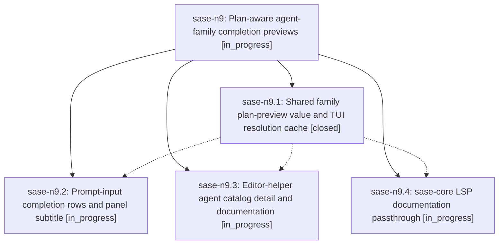

# Bead: sase-n9 — Plan-aware agent-family completion previews

[Bead Pages](../README.md) / sase-n9

**Status:** ◐ in_progress · **Type:** ▸ plan · **Tier:** epic
**Owner:** `bryanbugyi34@gmail.com` · **Created by:** [bbugyi200.athena.03u](https://github.com/sase-org/sase--agents/blob/main/families/bbugyi200.athena.03u.md) · **Assignee:** `sase-n9.land`
**Created:** 2026-08-16 11:59:35 EDT
**Plan:** [202608/agent\_family\_completion\_previews.md](https://github.com/sase-org/sase--plans/blob/main/202608/agent_family_completion_previews.md)

## Description

Agent-family completion entries in the ACE prompt input and in external editors lead with the tale/epic they belong to — tier, title, and epic phase structure — and fall back to the launch prompt instead of a list of member names.

## Phases

| Bead | Title | Status | Size | Created | Agents | Commits |
|---|---|---|---|---|---:|---:|
| [sase-n9.1](sase-n9.1.md) | Shared family plan-preview value and TUI resolution cache | ✓ closed | medium | 2026-08-16 | 1 | 1 |
| [sase-n9.2](sase-n9.2.md) | Prompt-input completion rows and panel subtitle | ◐ in_progress | medium | 2026-08-16 | 1 | 0 |
| [sase-n9.3](sase-n9.3.md) | Editor-helper agent catalog detail and documentation | ◐ in_progress | medium | 2026-08-16 | 1 | 0 |
| [sase-n9.4](sase-n9.4.md) | sase-core LSP documentation passthrough | ◐ in_progress | small | 2026-08-16 | 1 | 0 |

## Lineage

## Agents

| Agent | Bead | Commits |
|---|---|---:|
| [bbugyi200.athena.sase-n9.1](https://github.com/sase-org/sase--agents/blob/main/families/bbugyi200.athena.sase-n9.1.md) | [sase-n9.1](sase-n9.1.md) | 1 |
| [bbugyi200.athena.sase-n9.2](https://github.com/sase-org/sase--agents/blob/main/agents/bbugyi200.athena.sase-n9.2/README.md) | [sase-n9.2](sase-n9.2.md) | 0 |
| [bbugyi200.athena.sase-n9.3](https://github.com/sase-org/sase--agents/blob/main/agents/bbugyi200.athena.sase-n9.3/README.md) | [sase-n9.3](sase-n9.3.md) | 0 |
| [bbugyi200.athena.sase-n9.4](https://github.com/sase-org/sase--agents/blob/main/agents/bbugyi200.athena.sase-n9.4/README.md) | [sase-n9.4](sase-n9.4.md) | 0 |
| [bbugyi200.athena.sase-n9.land](https://github.com/sase-org/sase--agents/blob/main/agents/bbugyi200.athena.sase-n9.land/README.md) | [sase-n9](README.md) | 0 |

## Commits

| Repo | Commit | Subject | Bead | Committed |
|---|---|---|---|---|
| sase | [`ddef1f0`](https://github.com/sase-org/sase/commit/ddef1f0d42a711729b6e322a6575e47fe3046a3a) | feat(ace): share agent-family plan/bead preview across TUI and editor | [sase-n9.1](sase-n9.1.md) | 2026-08-16 13:08:14 EDT |
