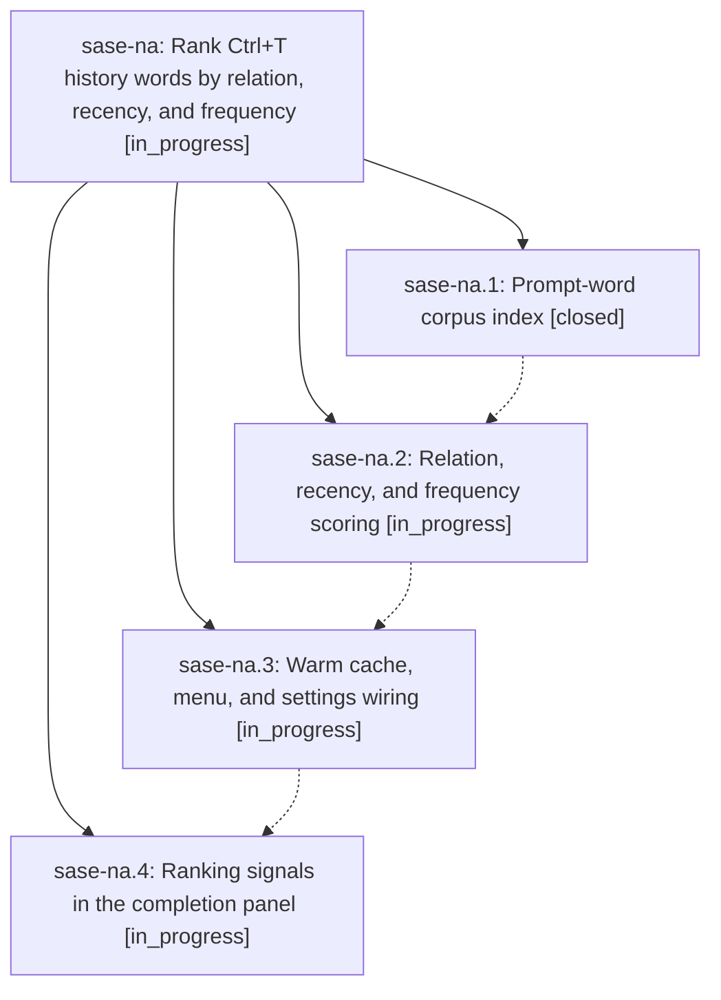

# Bead: sase-na — Rank Ctrl+T history words by relation, recency, and frequency

[Bead Pages](../README.md) / sase-na

**Status:** ◐ in_progress · **Type:** ▸ plan · **Tier:** epic
**Owner:** `bryanbugyi34@gmail.com` · **Created by:** [bbugyi200.athena.03s.w0](https://github.com/sase-org/sase--agents/blob/main/families/bbugyi200.athena.03s.w0.md) · **Assignee:** `sase-na.land`
**Created:** 2026-08-16 12:13:35 EDT
**Plan:** [202608/word\_completion\_ranking.md](https://github.com/sase-org/sase--plans/blob/main/202608/word_completion_ranking.md)

## Description

The Ctrl+T history-word menu ranks candidates by how strongly they relate to the words already in the prompt, how recently they were used, and how often they were used, and every row shows a compact, colored signal explaining why it ranks where it does.

## Phases

| Bead | Title | Status | Size | Created | Agents | Commits |
|---|---|---|---|---|---:|---:|
| [sase-na.1](sase-na.1.md) | Prompt-word corpus index | ✓ closed | medium | 2026-08-16 | 1 | 1 |
| [sase-na.2](sase-na.2.md) | Relation, recency, and frequency scoring | ◐ in_progress | medium | 2026-08-16 | 1 | 0 |
| [sase-na.3](sase-na.3.md) | Warm cache, menu, and settings wiring | ◐ in_progress | medium | 2026-08-16 | 1 | 0 |
| [sase-na.4](sase-na.4.md) | Ranking signals in the completion panel | ◐ in_progress | medium | 2026-08-16 | 1 | 0 |

## Lineage

## Agents

| Agent | Bead | Commits |
|---|---|---:|
| [bbugyi200.athena.sase-na.1](https://github.com/sase-org/sase--agents/blob/main/families/bbugyi200.athena.sase-na.1.md) | [sase-na.1](sase-na.1.md) | 1 |
| [bbugyi200.athena.sase-na.2](https://github.com/sase-org/sase--agents/blob/main/agents/bbugyi200.athena.sase-na.2/README.md) | [sase-na.2](sase-na.2.md) | 0 |
| [bbugyi200.athena.sase-na.3](https://github.com/sase-org/sase--agents/blob/main/agents/bbugyi200.athena.sase-na.3/README.md) | [sase-na.3](sase-na.3.md) | 0 |
| [bbugyi200.athena.sase-na.4](https://github.com/sase-org/sase--agents/blob/main/agents/bbugyi200.athena.sase-na.4/README.md) | [sase-na.4](sase-na.4.md) | 0 |
| [bbugyi200.athena.sase-na.land](https://github.com/sase-org/sase--agents/blob/main/agents/bbugyi200.athena.sase-na.land/README.md) | [sase-na](README.md) | 0 |

## Commits

| Repo | Commit | Subject | Bead | Committed |
|---|---|---|---|---|
| sase | [`ed39dd0`](https://github.com/sase-org/sase/commit/ed39dd0b886b7dcccd96a859aa856913b430787a) | feat: add prompt-word history index | [sase-na.1](sase-na.1.md) | 2026-08-16 13:21:31 EDT |
