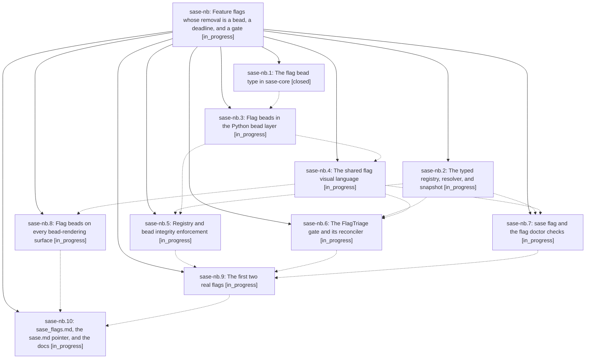

# Bead: sase-nb — Feature flags whose removal is a bead, a deadline, and a gate

[Bead Pages](../README.md) / sase-nb

**Status:** ◐ in_progress · **Type:** ▸ plan · **Tier:** epic
**Owner:** `bryanbugyi34@gmail.com` · **Created by:** [bbugyi200.athena.03v](https://github.com/sase-org/sase--agents/blob/main/families/bbugyi200.athena.03v.md) · **Assignee:** `sase-nb.land`
**Created:** 2026-08-16 12:23:47 EDT
**Plan:** [202608/feature\_flags.md](https://github.com/sase-org/sase--plans/blob/main/202608/feature_flags.md)

## Description

SASE has one boolean feature-flag registry resolved through the existing config layer chain, every temporary flag is owned by a dedicated `flag` bead carrying a date-and-release removal threshold, that threshold raises a FlagTriage gate the owner answers with Remove / Extend / Keep / Close, flag beads read unmistakably on every surface that renders a bead, and `sase/memory/sase_flags.md` teaches agents when a flag is warranted and how to retire one.

## Phases

| Bead | Title | Status | Size | Created | Agents | Commits |
|---|---|---|---|---|---:|---:|
| [sase-nb.1](sase-nb.1.md) | The flag bead type in sase-core | ✓ closed | medium | 2026-08-16 | 1 | 1 |
| [sase-nb.10](sase-nb.10.md) | sase\_flags.md, the sase.md pointer, and the docs | ◐ in_progress | medium | 2026-08-16 | 1 | 0 |
| [sase-nb.2](sase-nb.2.md) | The typed registry, resolver, and snapshot | ◐ in_progress | large | 2026-08-16 | 1 | 0 |
| [sase-nb.3](sase-nb.3.md) | Flag beads in the Python bead layer | ◐ in_progress | medium | 2026-08-16 | 1 | 0 |
| [sase-nb.4](sase-nb.4.md) | The shared flag visual language | ◐ in_progress | small | 2026-08-16 | 1 | 0 |
| [sase-nb.5](sase-nb.5.md) | Registry and bead integrity enforcement | ◐ in_progress | medium | 2026-08-16 | 1 | 0 |
| [sase-nb.6](sase-nb.6.md) | The FlagTriage gate and its reconciler | ◐ in_progress | large | 2026-08-16 | 1 | 0 |
| [sase-nb.7](sase-nb.7.md) | sase flag and the flag doctor checks | ◐ in_progress | medium | 2026-08-16 | 1 | 0 |
| [sase-nb.8](sase-nb.8.md) | Flag beads on every bead-rendering surface | ◐ in_progress | large | 2026-08-16 | 1 | 0 |
| [sase-nb.9](sase-nb.9.md) | The first two real flags | ◐ in_progress | medium | 2026-08-16 | 1 | 0 |

## Lineage

## Agents

| Agent | Bead | Commits |
|---|---|---:|
| [bbugyi200.athena.sase-nb.1](https://github.com/sase-org/sase--agents/blob/main/agents/bbugyi200.athena.sase-nb.1/README.md) | [sase-nb.1](sase-nb.1.md) | 1 |
| [bbugyi200.athena.sase-nb.10](https://github.com/sase-org/sase--agents/blob/main/agents/bbugyi200.athena.sase-nb.10/README.md) | [sase-nb.10](sase-nb.10.md) | 0 |
| [bbugyi200.athena.sase-nb.2](https://github.com/sase-org/sase--agents/blob/main/families/bbugyi200.athena.sase-nb.2.md) | [sase-nb.2](sase-nb.2.md) | 0 |
| [bbugyi200.athena.sase-nb.3](https://github.com/sase-org/sase--agents/blob/main/agents/bbugyi200.athena.sase-nb.3/README.md) | [sase-nb.3](sase-nb.3.md) | 0 |
| [bbugyi200.athena.sase-nb.4](https://github.com/sase-org/sase--agents/blob/main/agents/bbugyi200.athena.sase-nb.4/README.md) | [sase-nb.4](sase-nb.4.md) | 0 |
| [bbugyi200.athena.sase-nb.5](https://github.com/sase-org/sase--agents/blob/main/agents/bbugyi200.athena.sase-nb.5/README.md) | [sase-nb.5](sase-nb.5.md) | 0 |
| [bbugyi200.athena.sase-nb.6](https://github.com/sase-org/sase--agents/blob/main/agents/bbugyi200.athena.sase-nb.6/README.md) | [sase-nb.6](sase-nb.6.md) | 0 |
| [bbugyi200.athena.sase-nb.7](https://github.com/sase-org/sase--agents/blob/main/agents/bbugyi200.athena.sase-nb.7/README.md) | [sase-nb.7](sase-nb.7.md) | 0 |
| [bbugyi200.athena.sase-nb.8](https://github.com/sase-org/sase--agents/blob/main/agents/bbugyi200.athena.sase-nb.8/README.md) | [sase-nb.8](sase-nb.8.md) | 0 |
| [bbugyi200.athena.sase-nb.9](https://github.com/sase-org/sase--agents/blob/main/agents/bbugyi200.athena.sase-nb.9/README.md) | [sase-nb.9](sase-nb.9.md) | 0 |
| [bbugyi200.athena.sase-nb.land](https://github.com/sase-org/sase--agents/blob/main/agents/bbugyi200.athena.sase-nb.land/README.md) | [sase-nb](README.md) | 0 |

## Commits

| Repo | Commit | Subject | Bead | Committed |
|---|---|---|---|---|
| sase-core | [`sase-core@198a7b4`](https://github.com/sase-org/sase-core/commit/198a7b400444fe6bd9092a3021afa5090c52571c) | feat(bead): add flag issue type and BeadFlagWire | [sase-nb.1](sase-nb.1.md) | 2026-08-16 13:08:45 EDT |
