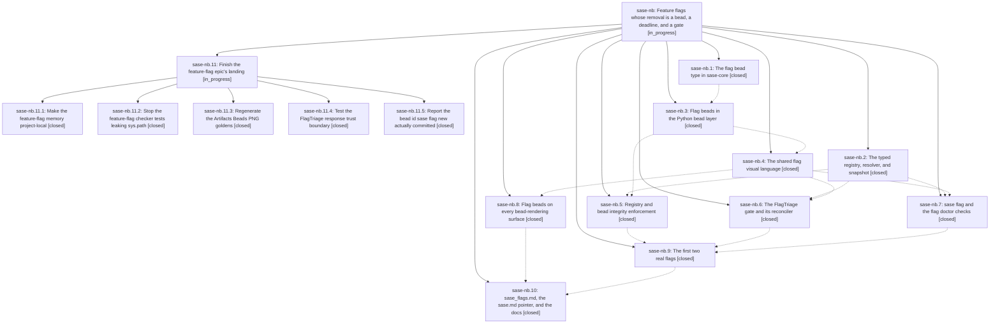

# Bead: sase-nb — Feature flags whose removal is a bead, a deadline, and a gate

[Bead Pages](../README.md) / sase-nb

**Status:** ◐ in_progress · **Type:** ▸ plan · **Tier:** epic
**Owner:** `bryanbugyi34@gmail.com` · **Created by:** [bbugyi200.athena.03v](https://github.com/sase-org/sase--agents/blob/main/families/bbugyi200.athena.03v.md) · **Assignee:** `sase-nb.land`
**Created:** 2026-08-16 12:23:47 EDT
**Plan:** [202608/feature\_flags.md](https://github.com/sase-org/sase--plans/blob/main/202608/feature_flags.md)

## Description

SASE has one boolean feature-flag registry resolved through the existing config layer chain, every temporary flag is owned by a dedicated `flag` bead carrying a date-and-release removal threshold, that threshold raises a FlagTriage gate the owner answers with Remove / Extend / Keep / Close, flag beads read unmistakably on every surface that renders a bead, and `sase/memory/sase_flags.md` teaches agents when a flag is warranted and how to retire one.

## Notes

[2026-08-16T17:33:15Z · 042] DESIGN CORRECTION (owner, 2026-08-16) — applies to the memory phase, sase-nb.10:

sase/memory/sase_flags.md must NOT be generated by `sase init`. Feature flags are sase's own registry, so the note that teaches them is local to this repo; a generated note would ship flag teaching into every SASE project's memory tree, including projects that can never own a flag.

Do NOT add `templates/memory-sase-flags.template.md`, a `_GeneratedLongMemorySpec`, or a `_generated_flags_memory_relative_path()` in `init_memory/root_rendering.py:122-145`. Write `sase/memory/sase_flags.md` by hand instead, shaped like the existing project-local Tier 2 notes `symvision.md` and `tui_perf.md`: `type: long`, `parent: AGENTS.md`, and a `description:` naming the decision it settles. Then run `sase memory init` to reindex AGENTS.md, the provider shims, and the memory README. The note's content budget and required coverage from the plan are unchanged. If a phase already landed the generated form, revert the template, the spec entry, and any test pinning the generated-note set (tests/main/test_init_memory_markdown_templates.py, tests/main/test_init_memory_handler_outputs.py).

Revised exit condition: `sase init -c` no longer proves anything about this note, since drift checks cover generated files only. Verify instead that (1) `sase memory list` shows sase_flags.md as a Tier 2 note with its description, (2) the regenerated AGENTS.md Tier 2 listing includes it, and (3) `sase init` in a non-sase project produces no sase_flags.md.

Same mistake one level up: the plan's always-loaded pointer targets `templates/memory-sase.template.md`, which renders sase/memory/sase.md into EVERY project. That pointer must move to a project-local Tier 1 short note in this repo (its own note, or a section in sase/memory/gotchas.md). See the sase variables on this run for the remaining fallout.

[2026-08-16T17:41:28Z · 042.f0] DESIGN CORRECTION FALLOUT (owner, 2026-08-16) — the rest of what the "local note, not
generated" decision changes. Read together with the correction note above.

1. The Tier 1 pointer is the same bug (sase-nb.10). The plan's "Feature Flags" section
targets `templates/memory-sase.template.md`, which renders `sase/memory/sase.md` into
EVERY project — wider blast radius than the Tier 2 note. Put it in a project-local short
note in this repo instead: a new `sase/memory/*.md` with `type: short`,
`parent: AGENTS.md`, or a new section in `sase/memory/gotchas.md`. Hand-written short
notes are still structure-checked when AGENTS.md is assembled
(`amd/_memory.py::_short_memory_structure_blockers` -> `validate_short_memory_structure`:
exactly one H1 first, no heading deeper than H3), so the shape still matters. The 90-word
budget was priced as text loaded into every project's Tier 1; local text is cheaper, so
keep it tight but treat 90 words as guidance and drop it from the exit condition.

2. Nothing that ships globally may cite the note's path (sase-nb.7, sase-nb.6). The
`sase flag new` scaffold ("the path `sase/memory/sase_flags.md` teaches"), the `flags.*`
doctor messages, and the FlagTriage gate text all reach every install, while the note now
exists only here — strip the path from those strings or make it conditional. This exposes
a scope question the plan never asked: the registry is code under this repo's `src/sase/`,
so `sase flag new` run from another project scaffolds a registry entry with nowhere to
paste it. Gate the `sase flag` group — or at minimum warn — on `is_sase_managed`
(`project_management.py:15,35`; default `false` in `default_config.yml:17`), and say so in
`-h`.

3. Do NOT extend "local" to the glossary or the user docs. `Feature Flag` / `Flag Bead` in
the `glossary:` block of `sase/sase.yml` is already project-local and regenerates
`sase/memory/glossary.md` here only — leave it as planned. `docs/configuration.md` also
stays: `scope: "project"` flags are overridable from any project's local config, so the
config surface is genuinely global even though the teaching note is not. Local memory !=
local config surface.

4. Formatting and validation move to the ordinary gates. The hand-written note loses
`format_generated_memory_markdown` (`init_memory/formatting.py:99`), so run `just fmt-md`;
`just check` runs prettier over `**/*.md` and will fail on unformatted frontmatter or
prose. And `description:` is optional on a discovered note (`memory/notes.py`,
`description: str | None`) — omitting it raises no error, it just leaves a blank hook in
the AGENTS.md Tier 2 listing, so eyeball the regenerated listing.

[2026-08-16T18:02:54Z · sase-n7.land] DISCOVERED ISSUE: tests/test_bead/golden/cli/stats.stdout is stale against the flag issue type, so tests/test_bead/test_cli_golden.py::test_bead_cli_golden_contract[stats] fails deterministically. Found by sase-n7.land in workspace sase_17 on master HEAD 0ec2018f1: 'just check' escalated to the full suite (31240 passed, 2 failed) and this node failed with "assert 'Issue Statis...gs: 0' == 'Issue Statis...ks: 0'", the actual output carrying an extra 'Flags:       0' row. Reproduced in isolation with '.venv/bin/python -m pytest -q tests/test_bead/test_cli_golden.py::test_bead_cli_golden_contract -p no:randomly' -> 1 failed, 39 passed. Root cause is cross-repo drift: sase-core commit 198a7b4 'feat(bead): add flag issue type and BeadFlagWire' (SASE_BEAD=sase-nb.1, 2026-08-16 13:08, shipped in v0.27.14) added the Flags row to 'sase bead stats', while this repo's golden was last updated 2026-07-30 by d0da0d94f and still ends at 'Tasks:       0'. Any agent who runs 'just install' against the linked sase-core checkout now sees this node red. Fix is the one-line golden refresh on the sase side, which belongs to this epic. Note the other failure in the same run was the unrelated agent-artifact index schema 21-vs-22 drift already recorded on sase-n8.

[2026-08-16T18:38:52Z · sase-m6.8] DISCOVERED ISSUE: Independent corroboration while implementing declarative Artifacts pane presentation on 2026-08-16. 'just check' passed all lint/validation gates, escalated to the full scoped pytest lane, then failed tests/test_bead/test_cli_golden.py::test_bead_cli_golden_contract[stats] because actual 'sase bead stats' includes the new 'Flags:       0' row while tests/test_bead/golden/cli/stats.stdout still ends at Tasks. Exact focused rerun of tests/test_config_cache.py::test_explicit_invalidation_wins_race_with_background_refresh, tests/test_bead/test_cli_golden.py::test_bead_cli_golden_contract[stats], and tests/monitor/test_monitor_store_reconcile.py::test_list_monitors_proc_store_reads_do_not_scale_with_record_count reproduced only the bead stats golden failure; the other two full-lane failures passed in isolation. My diff does not touch bead CLI/stat rendering. This corroborates the existing 2026-08-16 note on this epic; no standalone task bead created.

[2026-08-16T18:52:12Z · sase-n9.land] DISCOVERED ISSUE (third independent report, from sase-n9.land): tests/test_bead/test_cli_golden.py::test_bead_cli_golden_contract[stats] still fails on master because tests/test_bead/golden/cli/stats.stdout ends at 'Tasks:       0' while 'sase bead stats' now prints an extra 'Flags:       0' row. Reproduced at HEAD a892dce3a after 'just install' (sase_core_rs 0.27.14): '.venv/bin/python -m pytest tests/test_bead/test_cli_golden.py::test_bead_cli_golden_contract' -> 1 failed, 43 passed, diff is exactly '+   Flags:       0'. Proposed independently by phase beads sase-n9.2 and sase-n9.3 as PROPOSED FOLLOW-UP notes; recorded here rather than as a task because sase-nb.1 (IssueTypeWire::Flag / BeadFlagWire, sase-core v0.27.14) is the cause, matching the existing DISCOVERED ISSUE notes from sase-n7.land and sase-m6.8. Fix remains the one-line golden refresh on the sase side.

[2026-08-16T21:52:56Z · sase-n8.8--7] DISCOVERED ISSUE (corroboration, 2026-08-16): final sase-n8.8 published-wheel check-full monitor gb7wk5kphw1y failed the global leak detector gate with 25 poisoning changes, all from tests/test_check_feature_flags_tool.py. Every recorded change is sys.path changing as the feature-flag checker tests run (first node test_rule_1_rejects_missing_bead_and_ops_rationale; last node test_static_main_ignores_exploding_bd_command). No existing task matched test_check_feature_flags_tool/sys.path; this appears causally tied to this active feature-flags epic rather than to sase-n8.8, whose local diff only restores public HistoryWordCompletionMetadata and updates its direct test import. Evidence log: file:explicit:07aea7284478453e2034ced2.

[2026-08-16T23:36:16Z · sase-ns.land] DISCOVERED ISSUE: tests/test_check_feature_flags_tool.py trips the blocking global-state leak gate in just test-cost / just check-full. Observed by the epic sase-ns land agent on master 3a22ff04f (just test-cost, 812s): 'sase global leak detector blocking gate failed -- 25 poisoning change(s) across 25 test(s)'. Every one of the 25 poisoning changes is kind=sys_path / reason=sys-path-changed, and every poisoning node is in tests/test_check_feature_flags_tool.py (report: .pytest_cache/sase-global-leaks.json). That file arrived with fa6d8229c 'feat(lint): enforce feature-flag registry and flag-bead integrity' on this epic; it appends the repo root (or tools dir) to sys.path to import the checker and never restores it, so each node leaves sys.path one entry longer for the rest of that xdist worker. The sys_path detector predates this epic (87cffa3b8) and this is the only poisoning class in the whole 31,757-test run, so the gate is otherwise clean. Suggested fix: import the tool through a fixture that saves/restores sys.path (or use monkeypatch.syspath_prepend, which restores automatically). Routed here by the sase-ns land agent; not caused by sase-ns.

[2026-08-16T23:41:59Z · sase-m6.land] DISCOVERED ISSUE: master is hard-broken at import time; every TUI import raises NameError.

REPRODUCTION (on master @ 497d383aa or later):
  $ uv run

… and 18416 more characters

## Phases

| Bead | Title | Status | Size | Created | Agents | Commits |
|---|---|---|---|---|---:|---:|
| [sase-nb.1](sase-nb.1.md) | The flag bead type in sase-core | ✓ closed | medium | 2026-08-16 | 1 | 1 |
| [sase-nb.10](sase-nb.10.md) | sase\_flags.md, the sase.md pointer, and the docs | ✓ closed | medium | 2026-08-16 | 1 | 1 |
| [sase-nb.2](sase-nb.2.md) | The typed registry, resolver, and snapshot | ✓ closed | large | 2026-08-16 | 1 | 1 |
| [sase-nb.3](sase-nb.3.md) | Flag beads in the Python bead layer | ✓ closed | medium | 2026-08-16 | 1 | 1 |
| [sase-nb.4](sase-nb.4.md) | The shared flag visual language | ✓ closed | small | 2026-08-16 | 0 | 0 |
| [sase-nb.5](sase-nb.5.md) | Registry and bead integrity enforcement | ✓ closed | medium | 2026-08-16 | 1 | 1 |
| [sase-nb.6](sase-nb.6.md) | The FlagTriage gate and its reconciler | ✓ closed | large | 2026-08-16 | 1 | 1 |
| [sase-nb.7](sase-nb.7.md) | sase flag and the flag doctor checks | ✓ closed | medium | 2026-08-16 | 1 | 1 |
| [sase-nb.8](sase-nb.8.md) | Flag beads on every bead-rendering surface | ✓ closed | large | 2026-08-16 | 1 | 3 |
| [sase-nb.9](sase-nb.9.md) | The first two real flags | ✓ closed | medium | 2026-08-16 | 1 | 1 |

## Lineage

## Agents

| Agent | Bead | Commits |
|---|---|---:|
| [bbugyi200.athena.sase-nb.1](https://github.com/sase-org/sase--agents/blob/main/agents/bbugyi200.athena.sase-nb.1/README.md) | [sase-nb.1](sase-nb.1.md) | 1 |
| [bbugyi200.athena.sase-nb.10](https://github.com/sase-org/sase--agents/blob/main/agents/bbugyi200.athena.sase-nb.10/README.md) | [sase-nb.10](sase-nb.10.md) | 1 |
| [bbugyi200.athena.sase-nb.11.1](https://github.com/sase-org/sase--agents/blob/main/families/bbugyi200.athena.sase-nb.11.1.md) | [sase-nb.11.1](sase-nb.11.1.md) | 1 |
| [bbugyi200.athena.sase-nb.11.2](https://github.com/sase-org/sase--agents/blob/main/agents/bbugyi200.athena.sase-nb.11.2/README.md) | [sase-nb.11.2](sase-nb.11.2.md) | 1 |
| [bbugyi200.athena.sase-nb.11.3](https://github.com/sase-org/sase--agents/blob/main/agents/bbugyi200.athena.sase-nb.11.3/README.md) | [sase-nb.11.3](sase-nb.11.3.md) | 1 |
| [bbugyi200.athena.sase-nb.11.4](https://github.com/sase-org/sase--agents/blob/main/agents/bbugyi200.athena.sase-nb.11.4/README.md) | [sase-nb.11.4](sase-nb.11.4.md) | 1 |
| [bbugyi200.athena.sase-nb.11.5](https://github.com/sase-org/sase--agents/blob/main/agents/bbugyi200.athena.sase-nb.11.5/README.md) | [sase-nb.11.5](sase-nb.11.5.md) | 1 |
| [bbugyi200.athena.sase-nb.11.land](https://github.com/sase-org/sase--agents/blob/main/agents/bbugyi200.athena.sase-nb.11.land/README.md) | [sase-nb.11](sase-nb.11.md) | 0 |
| [bbugyi200.athena.sase-nb.2](https://github.com/sase-org/sase--agents/blob/main/families/bbugyi200.athena.sase-nb.2.md) | [sase-nb.2](sase-nb.2.md) | 1 |
| [bbugyi200.athena.sase-nb.3](https://github.com/sase-org/sase--agents/blob/main/agents/bbugyi200.athena.sase-nb.3/README.md) | [sase-nb.3](sase-nb.3.md) | 1 |
| [bbugyi200.athena.sase-nb.5](https://github.com/sase-org/sase--agents/blob/main/agents/bbugyi200.athena.sase-nb.5/README.md) | [sase-nb.5](sase-nb.5.md) | 1 |
| [bbugyi200.athena.sase-nb.6](https://github.com/sase-org/sase--agents/blob/main/families/bbugyi200.athena.sase-nb.6.md) | [sase-nb.6](sase-nb.6.md) | 1 |
| [bbugyi200.athena.sase-nb.7](https://github.com/sase-org/sase--agents/blob/main/agents/bbugyi200.athena.sase-nb.7/README.md) | [sase-nb.7](sase-nb.7.md) | 1 |
| [bbugyi200.athena.sase-nb.8](https://github.com/sase-org/sase--agents/blob/main/families/bbugyi200.athena.sase-nb.8.md) | [sase-nb.8](sase-nb.8.md) | 3 |
| [bbugyi200.athena.sase-nb.9](https://github.com/sase-org/sase--agents/blob/main/agents/bbugyi200.athena.sase-nb.9/README.md) | [sase-nb.9](sase-nb.9.md) | 1 |
| [bbugyi200.athena.sase-nb.land](https://github.com/sase-org/sase--agents/blob/main/families/bbugyi200.athena.sase-nb.land.md) | [sase-nb](README.md) | 0 |

## Commits

| Repo | Commit | Subject | Bead | Committed |
|---|---|---|---|---|
| sase-core | [`sase-core@198a7b4`](https://github.com/sase-org/sase-core/commit/198a7b400444fe6bd9092a3021afa5090c52571c) | feat(bead): add flag issue type and BeadFlagWire | [sase-nb.1](sase-nb.1.md) | 2026-08-16 13:08:45 EDT |
| sase | [`76c332b`](https://github.com/sase-org/sase/commit/76c332bd5d1e15a2753fd1a005242b9040b2d327) | feat: add feature flag registry foundation | [sase-nb.2](sase-nb.2.md) | 2026-08-16 13:53:02 EDT |
| sase | [`e38d7b8`](https://github.com/sase-org/sase/commit/e38d7b80f7845abc53ff8c8b5e364248834ad1b5) | feat(bead): add flag issue type to the Python bead layer | [sase-nb.3](sase-nb.3.md) | 2026-08-16 14:50:45 EDT |
| sase | [`fa6d822`](https://github.com/sase-org/sase/commit/fa6d8229c5c1553fb1d51b65b2218d8a5c2abaac) | feat(lint): enforce feature-flag registry and flag-bead integrity | [sase-nb.5](sase-nb.5.md) | 2026-08-16 15:35:39 EDT |
| sase | [`5703667`](https://github.com/sase-org/sase/commit/5703667f0e6c37909e82b01b52aee336661e5f11) | feat(bead): add the FlagTriage gate and generalize the bead gate reconciler | [sase-nb.6](sase-nb.6.md) | 2026-08-16 18:51:54 EDT |
| sase | [`497d383`](https://github.com/sase-org/sase/commit/497d383aa16a9bbfb24bc001ed9f99fd9e03e2b7) | feat(cli): add sase flag group and flags.\* doctor checks | [sase-nb.7](sase-nb.7.md) | 2026-08-16 19:07:38 EDT |
| sase-core | [`sase-core@a2260be`](https://github.com/sase-org/sase-core/commit/a2260be5c73dcefbec06ad7b332817dfca6c67f7) | feat(beads): exclude flags from external ref ownership | [sase-nb.8](sase-nb.8.md) | 2026-08-16 19:35:54 EDT |
| sase | [`278cc81`](https://github.com/sase-org/sase/commit/278cc810b6bbce80b5b2e6784b9c49a09748654c) | feat(beads): surface flag beads across bead views | [sase-nb.8](sase-nb.8.md) | 2026-08-16 19:43:38 EDT |
| sase | [`6f1286e`](https://github.com/sase-org/sase/commit/6f1286e269aeb279aa42f3e8a78466767ea8893c) | fix(ace): repair post-rebase history metadata checks | [sase-nb.8](sase-nb.8.md) | 2026-08-16 19:48:53 EDT |
| sase | [`5b458f1`](https://github.com/sase-org/sase/commit/5b458f1bb9b31515c85957bc436dad8252195669) | feat(flags): register the first two consumer feature flags | [sase-nb.9](sase-nb.9.md) | 2026-08-16 19:58:13 EDT |
| sase | [`14d6156`](https://github.com/sase-org/sase/commit/14d61561f40d3d4657a0377efe0df729d88b71c4) | feat(memory): add feature flag lifecycle guidance | [sase-nb.10](sase-nb.10.md) | 2026-08-16 20:38:21 EDT |
| sase | [`8873e64`](https://github.com/sase-org/sase/commit/8873e64c451cf24368c278f3faf9dc92c9349317) | test: restore sys.path around every check\_feature\_flags tool load | [sase-nb.11.2](sase-nb.11.2.md) | 2026-08-16 21:25:01 EDT |
| sase | [`d5443be`](https://github.com/sase-org/sase/commit/d5443be389eb33a105ad03c1372362c15a472ab9) | fix(flags): report the committed flag-bead id after remint | [sase-nb.11.5](sase-nb.11.5.md) | 2026-08-16 21:34:31 EDT |
| sase | [`f4cbb13`](https://github.com/sase-org/sase/commit/f4cbb138e20b7f57fdf6ea85031b3a13cb0b6a95) | feat(memory): keep feature-flag notes project-local | [sase-nb.11.1](sase-nb.11.1.md) | 2026-08-16 21:37:03 EDT |
| sase | [`0a5074d`](https://github.com/sase-org/sase/commit/0a5074df7307b26aaedbea69f4f0715bf4f6af8a) | test: regenerate stale artifacts\_beads PNG goldens for flag-bead chrome | [sase-nb.11.3](sase-nb.11.3.md) | 2026-08-16 21:39:02 EDT |
| sase | [`dd79cf1`](https://github.com/sase-org/sase/commit/dd79cf142f405ad290f485133e087bc6cddb253a) | test: cover flag triage response translation | [sase-nb.11.4](sase-nb.11.4.md) | 2026-08-16 21:46:56 EDT |
