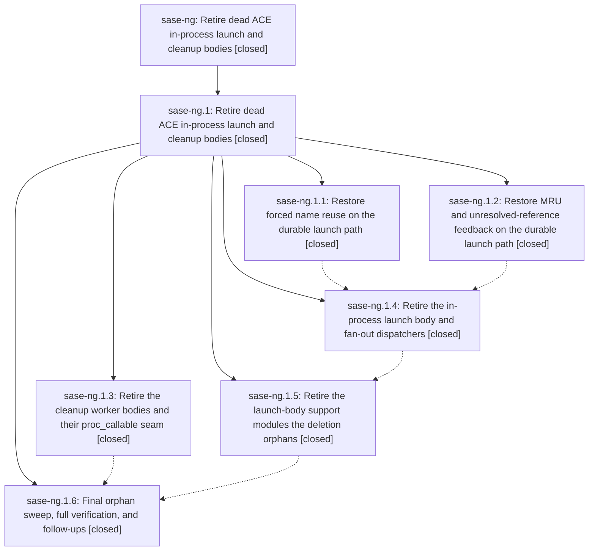

# Bead: sase-ng — Retire dead ACE in-process launch and cleanup bodies

[Bead Pages](../README.md) / sase-ng

**Status:** ✓ closed · **Resolution:** done · **Type:** ◆ task · **+1 reports:** +1
**Owner:** `bryanbugyi34@gmail.com` · **Created by:** [bbugyi200.athena.044](https://github.com/sase-org/sase--agents/blob/main/families/bbugyi200.athena.044.md) · **Assignee:** `sase-ng` · **Size:** large
**Created:** 2026-08-16 13:57:45 EDT · **Closed:** 2026-08-17 19:53:59 EDT

## Description

On current master 57c71d17a, src/sase/ace/tui/actions/agent_workflow/_launch_procs.py and src/sase/ace/tui/actions/agents/_cleanup_procs.py accept proc_callable only to delete it before submitting the durable argv operation. The in-process launch helpers run_agent_launch_body, run_single_agent_launch_body, _launch_repeat_agents, _launch_bulk_agents, _launch_multi_prompt_agents, and _launch_multi_model_agents therefore have no executable production path even though test doubles still invoke their callables directly; the same ignored seam leaves cleanup worker bodies test-only. This production/test divergence previously hid the stale _prompt_context bug fixed by 2aa8ba26f. Retire both dead in-process body families and both proc_callable parameters, and migrate affected test doubles to exercise the durable submit paths production uses.

## Notes

[2026-08-17T23:53:59Z · sase-ng.1.land--1] Delivered in full by child epic sase-ng.1 (closed 2026-08-18, plan 202608/retire_dead_ace_launch_cleanup_bodies.md, commits 97f5b6f03 / f43358dcb / 13e9ccbc9 / 0f7d86a66 / 65b72d43a plus the prerequisite dc4ca2057). Re-verified against this bead's description at master c89e5bbeb before closing:

- Both dead in-process body families are gone. grep over src/, tests/ and docs/ finds no run_agent_launch_body, run_single_agent_launch_body, _launch_repeat_agents, _launch_bulk_agents, _launch_multi_prompt_agents or _launch_multi_model_agents, and the modules that held them (_launch_body*.py, _launch_bulk.py, _launch_multi_prompt.py, _launch_multi_model.py, _launch_repeat.py, _launch_background.py, _launch_history.py, _workflow_exec.py, axe/run_workflow_runner.py) are deleted, along with the cleanup worker closures behind kill, dismiss and save persistence.
- Both proc_callable parameters are gone. Zero proc_callable references remain in src/; _submit_launch_proc (_launch_procs.py:49) and _submit_cleanup_proc (_cleanup_procs.py:34) no longer accept one. The six test files that still spell proc_callable are positional stand-ins for _submit_session_worker's 'body' argument (_proc_action_submission.py:197-200) - a different, still-live production seam this task never targeted.
- Affected test doubles now exercise the durable submit paths: the launch and cleanup harnesses assert on the RUN_LAUNCH / persist-cleanup payloads production submits instead of invoking task["proc_callable"]() directly, which is exactly the divergence this bead was filed to remove (the +1 evidence from the kill_and_edit_force_reuse plan).
- No user-facing capability was dropped on the way: forced name reuse (%id:!name kill-and-edit), VCS-xprompt MRU recording, the unresolved-#ref warning toast, and cleanup-failure recovery were each moved onto the durable path and verified end to end during the epic landing.

Two capabilities the epic plan deliberately scoped out are carried by ready task beads rather than left implicit: sase-p6 (marked-Patch bulk launch fans out one agent instead of N) and sase-p7 (Ctrl+Space replay target not refreshed from the submitted prompt). Both are pre-existing regressions from 0835b38d2, not damage from this retirement.

Verification: just check-full at c89e5bbeb - all lint/mypy/symvision/validation gates green, full suite 32563 passed / 13 skipped / 0 failed; the only failure was tools/check_test_cost_budgets, the standing master-red gate tracked on sase-j0. The trailing flake gate named two of this epic's own pre-fix seam nodes, whose evidence was retired with a '# fixed-at: 2026-08-17T20:21:41Z' block for 13e9ccbc9; the remaining named node belongs to sase-oh (+1 recorded). Full detail is in sase-ng.1's close note.

No parent above this bead.

## +1 Evidence

> **+1** by `054` · 2026-08-17 13:50:55 EDT
> **Observed since:** 2026-08-17 13:33:53 EDT
>
> Independent corroboration from the kill_and_edit_force_reuse plan (sase/repos/plans/202608/kill_and_edit_force_reuse.md, landed 2026-08-17): this exact production/test divergence let the forced-name-reuse launch pipeline silently regress after commit 0835b38d2 while tests/ace/tui/test_agent_launch_non_blocking.py stayed green, because those tests called task["proc_callable"]() directly instead of exercising the durable submit path. The fix re-pointed run_agent_launch_body()'s force-reuse block at a new shared sase.agent.force_reuse_launch helper (also used by the real sase.main.query_handler._launch.launch_query() child-process path) rather than deleting run_agent_launch_body, to keep that change scoped -- so the orphaned subtree sase-ng targets (run_agent_launch_body, run_single_agent_launch_body, _launch_bulk.py, _launch_multi_prompt.py, _launch_multi_model.py, _launch_repeat.py, and their proc_callable-only tests) is unchanged and still worth retiring.

## Lineage

## Agents

| Agent | Bead | Commits |
|---|---|---:|
| [bbugyi200.athena.sase-ng](https://github.com/sase-org/sase--agents/blob/main/families/bbugyi200.athena.sase-ng.md) | [sase-ng](README.md) | 0 |
| [bbugyi200.athena.sase-ng.1.1](https://github.com/sase-org/sase--agents/blob/main/families/bbugyi200.athena.sase-ng.1.1.md) | [sase-ng.1.1](sase-ng.1.1.md) | 1 |
| [bbugyi200.athena.sase-ng.1.2](https://github.com/sase-org/sase--agents/blob/main/agents/bbugyi200.athena.sase-ng.1.2/README.md) | [sase-ng.1.2](sase-ng.1.2.md) | 1 |
| [bbugyi200.athena.sase-ng.1.3](https://github.com/sase-org/sase--agents/blob/main/agents/bbugyi200.athena.sase-ng.1.3/README.md) | [sase-ng.1.3](sase-ng.1.3.md) | 1 |
| [bbugyi200.athena.sase-ng.1.4](https://github.com/sase-org/sase--agents/blob/main/agents/bbugyi200.athena.sase-ng.1.4/README.md) | [sase-ng.1.4](sase-ng.1.4.md) | 1 |
| [bbugyi200.athena.sase-ng.1.5](https://github.com/sase-org/sase--agents/blob/main/families/bbugyi200.athena.sase-ng.1.5.md) | [sase-ng.1.5](sase-ng.1.5.md) | 1 |
| [bbugyi200.athena.sase-ng.1.6](https://github.com/sase-org/sase--agents/blob/main/families/bbugyi200.athena.sase-ng.1.6.md) | [sase-ng.1.6](sase-ng.1.6.md) | 0 |
| [bbugyi200.athena.sase-ng.1.land](https://github.com/sase-org/sase--agents/blob/main/families/bbugyi200.athena.sase-ng.1.land.md) | [sase-ng.1](sase-ng.1.md) | 1 |

## Commits

| Repo | Commit | Subject | Bead | Committed |
|---|---|---|---|---|
| sase | [`97f5b6f`](https://github.com/sase-org/sase/commit/97f5b6f03c277c165cb1d4c631a25006202e5574) | feat(launch): record VCS xprompt MRU and unresolved-ref toasts on durable sase run | [sase-ng.1.2](sase-ng.1.2.md) | 2026-08-17 15:41:29 EDT |
| sase | [`f43358d`](https://github.com/sase-org/sase/commit/f43358dcb5444fa25696f7167bdd3ea830f77d23) | refactor(agent-cleanup): retire dead worker closures and proc\_callable seam | [sase-ng.1.3](sase-ng.1.3.md) | 2026-08-17 16:05:39 EDT |
| sase | [`13e9ccb`](https://github.com/sase-org/sase/commit/13e9ccbc9b1b044fe1a56f8d3c505f65af235352) | fix(agent): consume force-reuse plans on the durable launch path | [sase-ng.1.1](sase-ng.1.1.md) | 2026-08-17 16:21:41 EDT |
| sase | [`0f7d86a`](https://github.com/sase-org/sase/commit/0f7d86a662c4c6e66bedbe248079f96f991adf89) | refactor(tui): retire in-process launch body and fan-out dispatchers | [sase-ng.1.4](sase-ng.1.4.md) | 2026-08-17 17:06:32 EDT |
| sase | [`65b72d4`](https://github.com/sase-org/sase/commit/65b72d43afc9c84ed313c77592744aa3de8c86ec) | refactor(tui): retire launch-body support modules orphaned by the deletion | [sase-ng.1.5](sase-ng.1.5.md) | 2026-08-17 17:51:57 EDT |
| sase | [`f77d940`](https://github.com/sase-org/sase/commit/f77d940d6ca0767966c6b377f8924f72c1d13e68) | test(flake-baseline): retire pre-fix force-reuse seam evidence | [sase-ng.1](sase-ng.1.md) | 2026-08-17 19:56:11 EDT |
