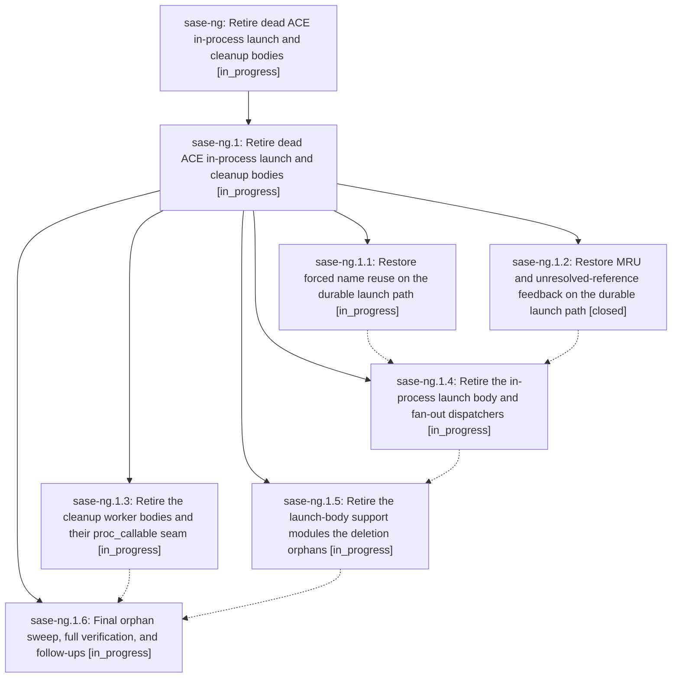

# Bead: sase-ng — Retire dead ACE in-process launch and cleanup bodies

[Bead Pages](../README.md) / sase-ng

**Status:** ◐ in_progress · **Type:** ◆ task · **+1 reports:** +1
**Owner:** `bryanbugyi34@gmail.com` · **Created by:** [bbugyi200.athena.044](https://github.com/sase-org/sase--agents/blob/main/families/bbugyi200.athena.044.md) · **Assignee:** `sase-ng` · **Size:** large
**Created:** 2026-08-16 13:57:45 EDT

## Description

On current master 57c71d17a, src/sase/ace/tui/actions/agent_workflow/_launch_procs.py and src/sase/ace/tui/actions/agents/_cleanup_procs.py accept proc_callable only to delete it before submitting the durable argv operation. The in-process launch helpers run_agent_launch_body, run_single_agent_launch_body, _launch_repeat_agents, _launch_bulk_agents, _launch_multi_prompt_agents, and _launch_multi_model_agents therefore have no executable production path even though test doubles still invoke their callables directly; the same ignored seam leaves cleanup worker bodies test-only. This production/test divergence previously hid the stale _prompt_context bug fixed by 2aa8ba26f. Retire both dead in-process body families and both proc_callable parameters, and migrate affected test doubles to exercise the durable submit paths production uses.

## +1 Evidence

> **+1** by `054` · 2026-08-17 13:50:55 EDT
> **Observed since:** 2026-08-17 13:33:53 EDT
>
> Independent corroboration from the kill_and_edit_force_reuse plan (sase/repos/plans/202608/kill_and_edit_force_reuse.md, landed 2026-08-17): this exact production/test divergence let the forced-name-reuse launch pipeline silently regress after commit 0835b38d2 while tests/ace/tui/test_agent_launch_non_blocking.py stayed green, because those tests called task["proc_callable"]() directly instead of exercising the durable submit path. The fix re-pointed run_agent_launch_body()'s force-reuse block at a new shared sase.agent.force_reuse_launch helper (also used by the real sase.main.query_handler._launch.launch_query() child-process path) rather than deleting run_agent_launch_body, to keep that change scoped -- so the orphaned subtree sase-ng targets (run_agent_launch_body, run_single_agent_launch_body, _launch_bulk.py, _launch_multi_prompt.py, _launch_multi_model.py, _launch_repeat.py, and their proc_callable-only tests) is unchanged and still worth retiring.

## Lineage

## Agents

| Agent | Bead | Commits |
|---|---|---:|
| [bbugyi200.athena.sase-ng](https://github.com/sase-org/sase--agents/blob/main/families/bbugyi200.athena.sase-ng.md) | [sase-ng](README.md) | 0 |
| [bbugyi200.athena.sase-ng.1.1](https://github.com/sase-org/sase--agents/blob/main/agents/bbugyi200.athena.sase-ng.1.1/README.md) | [sase-ng.1.1](sase-ng.1.1.md) | 0 |
| [bbugyi200.athena.sase-ng.1.2](https://github.com/sase-org/sase--agents/blob/main/agents/bbugyi200.athena.sase-ng.1.2/README.md) | [sase-ng.1.2](sase-ng.1.2.md) | 1 |
| [bbugyi200.athena.sase-ng.1.3](https://github.com/sase-org/sase--agents/blob/main/agents/bbugyi200.athena.sase-ng.1.3/README.md) | [sase-ng.1.3](sase-ng.1.3.md) | 0 |
| [bbugyi200.athena.sase-ng.1.4](https://github.com/sase-org/sase--agents/blob/main/agents/bbugyi200.athena.sase-ng.1.4/README.md) | [sase-ng.1.4](sase-ng.1.4.md) | 0 |
| [bbugyi200.athena.sase-ng.1.5](https://github.com/sase-org/sase--agents/blob/main/agents/bbugyi200.athena.sase-ng.1.5/README.md) | [sase-ng.1.5](sase-ng.1.5.md) | 0 |
| [bbugyi200.athena.sase-ng.1.6](https://github.com/sase-org/sase--agents/blob/main/agents/bbugyi200.athena.sase-ng.1.6/README.md) | [sase-ng.1.6](sase-ng.1.6.md) | 0 |
| [bbugyi200.athena.sase-ng.1.land](https://github.com/sase-org/sase--agents/blob/main/agents/bbugyi200.athena.sase-ng.1.land/README.md) | [sase-ng.1](sase-ng.1.md) | 0 |

## Commits

| Repo | Commit | Subject | Bead | Committed |
|---|---|---|---|---|
| sase | [`97f5b6f`](https://github.com/sase-org/sase/commit/97f5b6f03c277c165cb1d4c631a25006202e5574) | feat(launch): record VCS xprompt MRU and unresolved-ref toasts on durable sase run | [sase-ng.1.2](sase-ng.1.2.md) | 2026-08-17 15:41:29 EDT |
