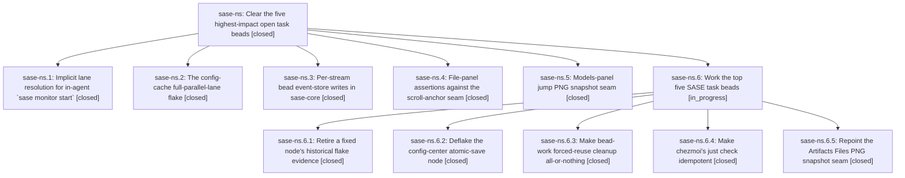

# Bead: sase-ns — Clear the five highest-impact open task beads

[Bead Pages](../README.md) / sase-ns

**Status:** ✓ closed · **Resolution:** done · **Type:** ▸ plan · **Tier:** epic
**Owner:** `bryanbugyi34@gmail.com` · **Created by:** [bbugyi200.athena.04c](https://github.com/sase-org/sase--agents/blob/main/families/bbugyi200.athena.04c.md) · **Assignee:** `sase-ns.land`
**Created:** 2026-08-16 17:11:09 EDT · **Closed:** 2026-08-16 19:53:13 EDT
**Plan:** [202608/top\_task\_bead\_sweep.md](https://github.com/sase-org/sase--plans/blob/main/202608/top_task_bead_sweep.md)

## Description

Task beads sase-ll, sase-mv, sase-nk, sase-mw, and sase-mr are fixed, verified, noted, and closed, and the remaining "sase" task-bead backlog is either handed to a follow-up agent or reported to the user with every TASK NEEDS APPROVAL note consolidated.

## Notes

[2026-08-16T23:53:13Z · sase-ns.land] VERIFIED all five phases, INTEGRATED with everything that landed since the epic started, and ROUTED every PROPOSED FOLLOW-UP.

WHAT I VERIFIED IN THE CODE, NOT JUST THE NOTES
- sase-ns.1 / task sase-ll (commit 2605324cb): sase.monitor.store gained resolve_caller_agent()/caller_artifacts_dir(), resolving metadata-first (own SASE_ARTIFACTS_DIR record -> exact agent_meta.name -> newest non-monitor member of the caller's own family), wired into monitor.start._resolve_start_identity/_resolve_lane_start and main.monitor_handler._resolve_ref_or_active/_agent_workspace_dir. default_lane() is fully removed (grep: zero references left in src/, tests/, docs/). Both reported failure shapes are addressed: the family-attach target now comes from the resolved record's own name (no sibling-phase parent), and a suffixed member is found through its own artifacts rather than a collapsed base name. Documented in docs/monitors.md and the sase_monitor skill source. tests/monitor/ + monitor handler tests: green.
- sase-ns.2 / task sase-mv (commit 3a22ff04f): two real process-global mechanisms fixed -- current_config_token() now binds its memoized token to the CONFIG_DIR object it was computed against, and _clear_config_caches became a yield fixture depending on _isolate_sase_home that drains sase-config-token-refresh and clears the originally-captured functools helpers before monkeypatch restores host paths. The sase-j7.2 leak detector now treats a leftover refresh worker as poisoning. Task bead sase-mv was left open by the phase; I verified and closed it (see its note).
- sase-ns.3 / task sase-mr: verified in the sibling repo, opened via /sase_repo. sase-core 291ea25 (released in 7a240dd v0.27.16, clean and in sync with origin/master) tracks mutated stream IDs in TrackedEventStreams, marks every imported legacy stream dirty so first-save migration still works, writes only changed streams via write_event_store_changed, and skips byte-identical rewrites via write_file_atomic_if_changed. The append-only guard and manifest.json are untouched. Covered by a Rust regression that mutates one stream in a multi-stream store and asserts the untouched stream's bytes AND mtime are unchanged. just install rebuilt and installed 0.27.16 here; just validate's published-minimum check passes.
- sase-ns.4 / task sase-nk (commit c8b5e962e): the six assertions moved from panel.update to a _last_updated_body() helper reading _update_body.call_args -- the renderable production hands the scroll-anchor seam. Every content check is preserved (static-file header/syntax group of 3, linked-diff banner Text, live-diff 'more lines below' absence + line-count message, cached-body identity via 'second_body is first_body', pathological-cap editor hint). No production code changed. tests/test_file_panel.py green.
- sase-ns.5 / task sase-mw (commit 8a769012f): _patch_alias_views repointed from models_panel_providers to models_panel_provider_state (where load_provider_routing_snapshot actually calls build_alias_views), and three goldens regenerated. All three snapshots pass. The phase correctly declined adjacent bead sase-my as non-mechanical (f5dda81f3 removed the Files pane's date grouping entirely, so that test needs a content decision, not a monkeypatch retarget); sase-my is left open.

INTEGRATION WITH POST-EPIC MASTER (this was not a no-op)
- e50d8a953 fixed the HistoryWordCompletionMetadata break that all four phases reported as blocking. Unblocking mypy exposed a gate the phases had never reached: _lint-test-waits flagged three literal sleeps that 3a22ff04f itself introduced. Fixed in 644177a88 (sase-test-wait pragmas on the two _release() drain staggers and the refresh-thread poll interval).
- 497d383aa (phase sase-nb.7) then hard-broke master: it added 'HistoryWordCompletionMetadata = _HistoryWordCompletionMetadata' after e50d8a953 had already made that class public, so the private name existed nowhere and the module raised NameError at import, failing collection across the whole ACE prompt/completion/xprompt/PNG surface -- including this epic's own visual verification. Removed the dead line in f8b4ebb11 and recorded it on epic sase-nb.
- 563a67fb0 regenerated a large set of visual goldens; re-ran this epic's three Models-panel jump snapshots on the rebased tree: still 3 passed, so sase-ns.5's goldens integrate cleanly.
- Checked for duplication/conflict: no post-epic commit reimplements implicit lane resolution, and sase-core's per-stream write is the only writer path (write_event_store survives only for tests and the full-write case).

VERIFICATION RUN
- Full parallel lane (just test-cost) on the epic's tree: 31743 passed, 4 failed, 11 skipped in 812s. Zero failures in tests/test_config*.py. The 4 failures are pre-existing and owned elsewhere: sase-nt, sase-nu, and two usage-limit nodes on epic sase-n4 (one of which also failed pre-epic at fc1ad39e7).
- Re-verified on the current rebased tree (HEAD f8b4ebb11): 271 passed across tests/test_config.py, test_config_cache.py, test_config_cache_isolation.py, tests/monitor/, tests/test_file_panel.py and the monitor handler tests; 3 passed on the jump PNG snapshots; 51 passed on the history-word widgets.
- Lint gates on the final tree: fmt(py), fmt(md), keep-sorted, ruff, mypy, pyscripts, test-waits, changelog, patch/stitch terminology, toobig, SASE validation, committed plans all pass. This epic added no --epic-symbol entries, so nothing expires at this close.
- NOT green, and not this epic's: _lint-flags rule 8 (live flag beads sase-nw/sase-nx have no definition yet -- sase-nb.9 is mid-flight) and _lint-symvision (stale 'sase-nb(flag_due_chip)' entry that 278cc810b left behind). Both recorded on epic sase-nb. The full-lane leak detector also failed its blocking gate on 25 sys.path poisonings, every one from tests/test_check_feature_flags_tool.py -- also recorded on sase-nb, and notably zero refresh-worker poisonings, which independently confirms sase-ns.2's fix.

FOLLOW-UPS ROUTED (every PROPOSED FOLLOW-UP note accounted for)
- HistoryWordCompletionMetadata mypy/ImportError cascade (sase-ns.1, .2, .4, .5): already fixed on master by e50d8a953; no bead needed.
- symvision unused host_actions_for_capability/registered_host_actions (sase-ns.1): already a DISCOVERED ISSUE on in-progress epic sase-m6; 497d383aa has since resolved it.
- test_agy_captured_failure_disables_small_pool_member (sase-ns.2): duplicate of task sase-nt; +1 with independent reproduction on 3a22ff04f, noting phase sase-n4.5.4.2 appears to be working it.
- format_agent_option parallel_family_counts TypeError (sase-ns.2): duplicate of task sase-nu; +1 with independent reproduction.
- fakey usage-limit timestamp ULP compare (sase-ns.2): DISCOVERED ISSUE on epic sase-n4, which owns TemporaryProviderDisable.
- selection-health's 13 historical records (sase-ns.2): genuinely new defect -- the gate's evidence bar needs an interleaved pass BETWEEN failures, so records from pre-fix trees can never be retired by later green lanes, and the only lever (a file-wide effective-after bump) would also erase other beads' live evidence. Filed as task sase-nv (large, ready) with RELATED notes to sase-j5, sase-mv, sase-mp.
- 41 stale Models-panel PNG goldens (sase-ns.5): duplicate of task sase-nq; +1 recording the five-module blast radius and the two candidate rename commits.
- sase-my (Artifacts Files PNG seam, sase-ns.5): already an open task bead, deliberately left; no action.
No proposal was declined. No TASK NEEDS APPROVAL note was left by any phase (sase bead search 'TASK NEEDS APPROVAL' returns only this epic's own description).

OBSERVATION, not routed: sase.monitor.store.resolve_exact_agent() lost its last production caller in 2605324cb and now survives only via the sase.monitor package re-export and its own tests. Symvision does not flag it (the __init__ re-export counts as a non-test consumer), and I did not remove it without being able to check the uncloned sase-github/sase-telegram plugin repos for consumers.

## Phases

| Bead | Title | Status | Size | Created | Agents | Commits |
|---|---|---|---|---|---:|---:|
| [sase-ns.1](sase-ns.1.md) | Implicit lane resolution for in-agent \`sase monitor start\` | ✓ closed | large | 2026-08-16 | 1 | 1 |
| [sase-ns.2](sase-ns.2.md) | The config-cache full-parallel-lane flake | ✓ closed | large | 2026-08-16 | 1 | 1 |
| [sase-ns.3](sase-ns.3.md) | Per-stream bead event-store writes in sase-core | ✓ closed | large | 2026-08-16 | 1 | 1 |
| [sase-ns.4](sase-ns.4.md) | File-panel assertions against the scroll-anchor seam | ✓ closed | small | 2026-08-16 | 1 | 1 |
| [sase-ns.5](sase-ns.5.md) | Models-panel jump PNG snapshot seam | ✓ closed | small | 2026-08-16 | 1 | 1 |

## Lineage

## Agents

| Agent | Bead | Commits |
|---|---|---:|
| [bbugyi200.athena.sase-ns.1](https://github.com/sase-org/sase--agents/blob/main/families/bbugyi200.athena.sase-ns.1.md) | [sase-ns.1](sase-ns.1.md) | 1 |
| [bbugyi200.athena.sase-ns.2](https://github.com/sase-org/sase--agents/blob/main/families/bbugyi200.athena.sase-ns.2.md) | [sase-ns.2](sase-ns.2.md) | 1 |
| [bbugyi200.athena.sase-ns.3](https://github.com/sase-org/sase--agents/blob/main/families/bbugyi200.athena.sase-ns.3.md) | [sase-ns.3](sase-ns.3.md) | 1 |
| [bbugyi200.athena.sase-ns.4](https://github.com/sase-org/sase--agents/blob/main/agents/bbugyi200.athena.sase-ns.4/README.md) | [sase-ns.4](sase-ns.4.md) | 1 |
| [bbugyi200.athena.sase-ns.5](https://github.com/sase-org/sase--agents/blob/main/agents/bbugyi200.athena.sase-ns.5/README.md) | [sase-ns.5](sase-ns.5.md) | 1 |
| [bbugyi200.athena.sase-ns.6.1](https://github.com/sase-org/sase--agents/blob/main/families/bbugyi200.athena.sase-ns.6.1.md) | [sase-ns.6.1](sase-ns.6.1.md) | 1 |
| [bbugyi200.athena.sase-ns.6.2](https://github.com/sase-org/sase--agents/blob/main/families/bbugyi200.athena.sase-ns.6.2.md) | [sase-ns.6.2](sase-ns.6.2.md) | 1 |
| [bbugyi200.athena.sase-ns.6.3](https://github.com/sase-org/sase--agents/blob/main/agents/bbugyi200.athena.sase-ns.6.3/README.md) | [sase-ns.6.3](sase-ns.6.3.md) | 1 |
| [bbugyi200.athena.sase-ns.6.4](https://github.com/sase-org/sase--agents/blob/main/agents/bbugyi200.athena.sase-ns.6.4/README.md) | [sase-ns.6.4](sase-ns.6.4.md) | 0 |
| [bbugyi200.athena.sase-ns.6.5](https://github.com/sase-org/sase--agents/blob/main/agents/bbugyi200.athena.sase-ns.6.5/README.md) | [sase-ns.6.5](sase-ns.6.5.md) | 1 |
| [bbugyi200.athena.sase-ns.6.land](https://github.com/sase-org/sase--agents/blob/main/agents/bbugyi200.athena.sase-ns.6.land/README.md) | [sase-ns.6](sase-ns.6.md) | 0 |
| [bbugyi200.athena.sase-ns.land](https://github.com/sase-org/sase--agents/blob/main/families/bbugyi200.athena.sase-ns.land.md) | [sase-ns](README.md) | 2 |

## Commits

| Repo | Commit | Subject | Bead | Committed |
|---|---|---|---|---|
| sase | [`c8b5e96`](https://github.com/sase-org/sase/commit/c8b5e962e4962f0819008136168d5532cbee9094) | test(file-panel): assert body renders at the \_update\_body seam | [sase-ns.4](sase-ns.4.md) | 2026-08-16 17:48:31 EDT |
| sase-core | [`sase-core@291ea25`](https://github.com/sase-org/sase-core/commit/291ea25baa1c49db70341e558160f58db8f25ecd) | perf(bead): write only changed event streams | [sase-ns.3](sase-ns.3.md) | 2026-08-16 17:54:26 EDT |
| sase | [`8a76901`](https://github.com/sase-org/sase/commit/8a769012fde7d70ccfcfdc19dbda53e98fb05292) | fix(tui): repoint stale alias-views monkeypatch in models panel jump tests | [sase-ns.5](sase-ns.5.md) | 2026-08-16 17:57:12 EDT |
| sase | [`2605324`](https://github.com/sase-org/sase/commit/2605324cb2c47e43809de822ae78db120905faa2) | fix(monitor): resolve implicit start/show/stop caller from its own artifacts | [sase-ns.1](sase-ns.1.md) | 2026-08-16 18:02:49 EDT |
| sase | [`3a22ff0`](https://github.com/sase-org/sase/commit/3a22ff04f67a78af9416c87b1f6b591903c30962) | fix(config): isolate config cache from test-owned CONFIG\_DIR | [sase-ns.2](sase-ns.2.md) | 2026-08-16 19:02:36 EDT |
| sase | [`644177a`](https://github.com/sase-org/sase/commit/644177a889ce763650ec822d82583ad0a117fa6f) | test(config): mark the config-cache drain sleeps with wait pragmas | [sase-ns](README.md) | 2026-08-16 19:37:10 EDT |
| sase | [`f8b4ebb`](https://github.com/sase-org/sase/commit/f8b4ebb11eddf4ff1e8f09ac4f783cd8cf9707dc) | fix(tui): drop the stale history-word metadata re-export | [sase-ns](README.md) | 2026-08-16 19:47:06 EDT |
| sase | [`4d8d24e`](https://github.com/sase-org/sase/commit/4d8d24eef0a4eb8717dafeefa92b5d69182c468d) | fix(bead): make forced-reuse cleanup all-or-nothing | [sase-ns.6.3](sase-ns.6.3.md) | 2026-08-16 21:27:05 EDT |
| sase | [`d9b2984`](https://github.com/sase-org/sase/commit/d9b2984a7b54e5c0788513755a2cf165ea673919) | fix(tui): isolate config center state replacement | [sase-ns.6.2](sase-ns.6.2.md) | 2026-08-16 21:44:57 EDT |
| sase | [`0c86462`](https://github.com/sase-org/sase/commit/0c86462638b1e382b259b0c4aa96e82782c6cc79) | test(ace): drop dead clock pin from Artifacts Files snapshot | [sase-ns.6.5](sase-ns.6.5.md) | 2026-08-16 21:46:14 EDT |
| sase | [`6000a54`](https://github.com/sase-org/sase/commit/6000a54a1894375ed21f68b3e2c44026b2dcd481) | feat(selection-health): retire a fixed node's historical flake evidence | [sase-ns.6.1](sase-ns.6.1.md) | 2026-08-16 21:47:13 EDT |
