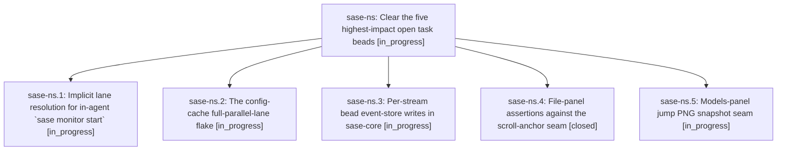

# Bead: sase-ns — Clear the five highest-impact open task beads

[Bead Pages](../README.md) / sase-ns

**Status:** ◐ in_progress · **Type:** ▸ plan · **Tier:** epic
**Owner:** `bryanbugyi34@gmail.com` · **Created by:** [bbugyi200.athena.04c](https://github.com/sase-org/sase--agents/blob/main/families/bbugyi200.athena.04c.md) · **Assignee:** `sase-ns.land`
**Created:** 2026-08-16 17:11:09 EDT
**Plan:** [202608/top\_task\_bead\_sweep.md](https://github.com/sase-org/sase--plans/blob/main/202608/top_task_bead_sweep.md)

## Description

Task beads sase-ll, sase-mv, sase-nk, sase-mw, and sase-mr are fixed, verified, noted, and closed, and the remaining "sase" task-bead backlog is either handed to a follow-up agent or reported to the user with every TASK NEEDS APPROVAL note consolidated.

## Phases

| Bead | Title | Status | Size | Created | Agents | Commits |
|---|---|---|---|---|---:|---:|
| [sase-ns.1](sase-ns.1.md) | Implicit lane resolution for in-agent \`sase monitor start\` | ◐ in_progress | large | 2026-08-16 | 1 | 0 |
| [sase-ns.2](sase-ns.2.md) | The config-cache full-parallel-lane flake | ◐ in_progress | large | 2026-08-16 | 1 | 0 |
| [sase-ns.3](sase-ns.3.md) | Per-stream bead event-store writes in sase-core | ◐ in_progress | large | 2026-08-16 | 1 | 0 |
| [sase-ns.4](sase-ns.4.md) | File-panel assertions against the scroll-anchor seam | ✓ closed | small | 2026-08-16 | 1 | 1 |
| [sase-ns.5](sase-ns.5.md) | Models-panel jump PNG snapshot seam | ◐ in_progress | small | 2026-08-16 | 1 | 0 |

## Lineage

## Agents

| Agent | Bead | Commits |
|---|---|---:|
| [bbugyi200.athena.sase-ns.1](https://github.com/sase-org/sase--agents/blob/main/families/bbugyi200.athena.sase-ns.1.md) | [sase-ns.1](sase-ns.1.md) | 0 |
| [bbugyi200.athena.sase-ns.2](https://github.com/sase-org/sase--agents/blob/main/families/bbugyi200.athena.sase-ns.2.md) | [sase-ns.2](sase-ns.2.md) | 0 |
| [bbugyi200.athena.sase-ns.3](https://github.com/sase-org/sase--agents/blob/main/families/bbugyi200.athena.sase-ns.3.md) | [sase-ns.3](sase-ns.3.md) | 0 |
| [bbugyi200.athena.sase-ns.4](https://github.com/sase-org/sase--agents/blob/main/agents/bbugyi200.athena.sase-ns.4/README.md) | [sase-ns.4](sase-ns.4.md) | 1 |
| [bbugyi200.athena.sase-ns.5](https://github.com/sase-org/sase--agents/blob/main/agents/bbugyi200.athena.sase-ns.5/README.md) | [sase-ns.5](sase-ns.5.md) | 0 |
| [bbugyi200.athena.sase-ns.land](https://github.com/sase-org/sase--agents/blob/main/agents/bbugyi200.athena.sase-ns.land/README.md) | [sase-ns](README.md) | 0 |

## Commits

| Repo | Commit | Subject | Bead | Committed |
|---|---|---|---|---|
| sase | [`c8b5e96`](https://github.com/sase-org/sase/commit/c8b5e962e4962f0819008136168d5532cbee9094) | test(file-panel): assert body renders at the \_update\_body seam | [sase-ns.4](sase-ns.4.md) | 2026-08-16 17:48:31 EDT |
