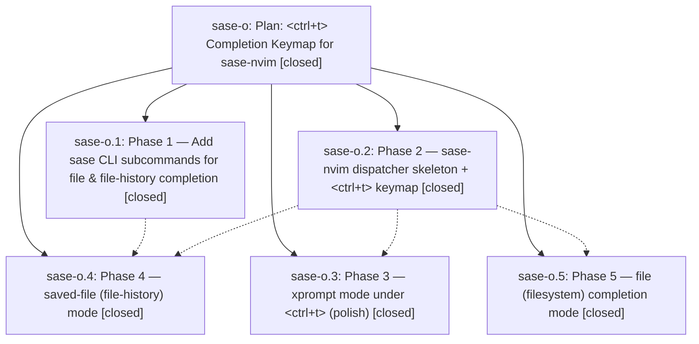

# Bead: sase-o — Plan: \<ctrl+t\> Completion Keymap for sase-nvim

[Bead Pages](../README.md) / sase-o

**Status:** ✓ closed · **Resolution:** (unrecorded) · **Type:** plan · **Tier:** epic
**Owner:** `bryanbugyi34@gmail.com`
**Created:** 2026-04-25 01:35:44 UTC · **Closed:** 2026-04-25 02:42:44 UTC
**Plan:** [202604/nvim\_ctrl\_t\_completion.md](https://github.com/sase-org/sase--plans/blob/main/202604/nvim_ctrl_t_completion.md)

## Description

Implement <ctrl+t> completion in sase-nvim mirroring the TUI dispatch (xprompt / file / saved-file modes). See plan file for full details.

## Phases

| Bead | Title | Status | Size | Agents | Commits |
|---|---|---|---|---:|---:|
| [sase-o.1](sase-o.1.md) | Phase 1 — Add sase CLI subcommands for file & file-history completion | ✓ closed | small | 0 | 1 |
| [sase-o.2](sase-o.2.md) | Phase 2 — sase-nvim dispatcher skeleton + \<ctrl+t\> keymap | ✓ closed | small | 0 | 0 |
| [sase-o.3](sase-o.3.md) | Phase 3 — xprompt mode under \<ctrl+t\> (polish) | ✓ closed | small | 0 | 0 |
| [sase-o.4](sase-o.4.md) | Phase 4 — saved-file (file-history) mode | ✓ closed | small | 0 | 0 |
| [sase-o.5](sase-o.5.md) | Phase 5 — file (filesystem) completion mode | ✓ closed | small | 0 | 0 |

## Lineage

## Commits

| Commit | Subject | Bead | Committed (UTC) |
|---|---|---|---|
| [`557aa19`](https://github.com/sase-org/sase/commit/557aa195e626e8c24029f088b13ec71d7a9bcb93) | feat(cli): add file & file-history completion subcommands (sase-o.1) | [sase-o.1](sase-o.1.md) | 2026-04-25 02:03:40 |
