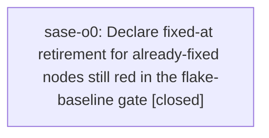

# Bead: sase-o0 — Declare fixed-at retirement for already-fixed nodes still red in the flake-baseline gate

[Bead Pages](../README.md) / sase-o0

**Status:** ✓ closed · **Resolution:** done · **Type:** ◆ task · **Task type:** · untyped · **+1 reports:** +5 · **↺ Reopened:** ↺1
**Owner:** `bryanbugyi34@gmail.com` · **Created by:** [bbugyi200.athena.sase-ns.6.land](https://github.com/sase-org/sase--agents/blob/main/families/bbugyi200.athena.sase-ns.6.land.md) · **Assignee:** `sase-o0` · **Size:** medium
**Created:** 2026-08-16 22:05:39 EDT · **Closed:** 2026-09-06 15:37:43 EDT

## Previously Closed

> ↺ Closed 2026-08-17T09:27:46Z · done
>
> (none)
>
> Reopened 2026-08-18T03:35:25Z by a +1 from @sase-p2.land--1

<!-- sase:links:start -->

## Links

| Relation | Artifact | Why |
| --- | --- | --- |
| related | [bead:sase-j7][1] | in-progress epic whose phase sase-j7.5 owned 'shrinking the baseline'. All five of its phases are closed and it is awaiting its land agent. Not routed there because sase-j7's scope is process-global state leaking between tests, and the m... |
| related | [bead:sase-mp][2] | closed task whose fix (981106799) makes the measured case above declarable. Do not reopen it; it is fixed. Only its historical evidence in the durable store needs retiring. |
| related | [bead:sase-nb][3] | in-progress feature-flag epic that added a Flags line to bead views; it may be the fix behind test_bead_cli_golden_contract[stats] in the audit list above. |
| related | [bead:sase-nv][4] | closed task that built the '# fixed-at:' mechanism this task applies. Its remediation (add the directive) is done; this task is the separate work of declaring the already-landed fixes that predate the syntax. |
| related | [bead:sase-xk][5] | split out from sase-o0 closeout because post-fix var failures are not fixed-at-grade retirement evidence |

[1]: https://github.com/sase-org/sase--beads/blob/main/pages/sase-j7/README.md
[2]: https://github.com/sase-org/sase--beads/blob/main/pages/sase-mp/README.md
[3]: https://github.com/sase-org/sase--beads/blob/main/pages/sase-nb/README.md
[4]: https://github.com/sase-org/sase--beads/blob/main/pages/sase-nv/README.md
[5]: https://github.com/sase-org/sase--beads/blob/main/pages/sase-xk/README.md

<!-- sase:links:end -->

## Description

Epic sase-ns.6 (task bead sase-nv) added a per-node '# fixed-at: <UTC timestamp> <node id>' directive to tests/reproducible_flake_baseline.txt that retires only that node's failure evidence recorded at or before the instant its fix landed. It was applied to the nine config/config-cache nodes fixed by 3a22ff04f, and the epic's land agent added the sase-md config-center node fixed by d9b2984a7. Other nodes whose fixes had already landed were never declared, so 'just selection-health --fail-on-new-flake' (the last gate of 'just check-full') stays red on historical evidence for tests that now pass.

MEASURED CASE (do this one first, it is proven):
tests/ace/tui/test_top_bar_order.py::test_override_pills_keep_narrow_top_bar_in_bounds was fixed by commit 981106799 'docs: migrate docs and tests off retired model-alias names' (2026-08-16T04:53:04Z, epic sase-mf phase sase-mf.4). Task bead sase-mp is CLOSED as done on that fix. The durable store holds 12 failure records for the node, the last two at 2026-08-16T05:28:43Z and 05:37:11Z, both from HEAD 6f7052fc9 -- which is NOT an ancestor of 981106799, i.e. stale pre-fix trees, exactly the 'Known limitation' the baseline header documents. Verified on 2026-08-17 at HEAD 6000a54a1 with a probe baseline: adding

  \# fixed-at: 2026-08-16T04:53:04Z tests/ace/tui/test_top_bar_order.py::test_override_pills_keep_narrow_top_bar_in_bounds

retires 8 more failures and drops the node out of the gate's report (7 -> 6 exceeding nodes). The node also passes in isolation (-p no:randomly, 1 passed).

REMAINING AUDIT (root cause not yet determined -- do not declare fixed-at without naming a fix commit):
- tests/main/test_var_integration.py::test_var_cli_end_to_end_refreshes_index_and_round_trips_machine_outputs -- 15 failure records, last 2026-08-16T19:55:21Z at HEAD 0ec2018f1.
- tests/test_bead/test_cli_golden.py::test_bead_cli_golden_contract[stats] -- 17 failure records, last 2026-08-16T23:08:29Z at HEAD e50d8a953. Bead sase-na.3 notes the golden fixture was missing a Flags line, which in-progress epic sase-nb may have since supplied.
- tests/test_query_profile.py::test_provider_query_schema_derives_fields_from_the_notes_fixture -- 10 failure records, last 2026-08-16T15:12:02Z at HEAD 95d66f59c.
All three pass in isolation today and none has failed across the 117 full-run records after 2026-08-16T06:00Z, but 'passes in isolation' does not distinguish a fixed node from a live full-lane flake. For each, either identify the fix commit and declare it, or leave it reported and file/corroborate a flake bead.

SCOPE GUARDRAIL (from epic sase-ns.6's plan, 202608/task_backlog_top5.md): do not bump the file-wide '# effective-after:' timestamp as a shortcut, and do not declare a fixed-at for a node you cannot tie to a named fix commit -- that turns the directive into the blanket suppression the baseline file's header forbids ('debt to remove, not suppressions to grow').

WHY THIS IS A SEPARATE TASK: epic sase-ns.6's plan explicitly scoped these four nodes out ('The other four belong to live beads and must keep being reported'), written on the belief that all four were still live. sase-mp was in fact already closed as fixed 19 hours before that plan was written. The land agent applied the mechanism only to the node its own epic fixed and filed this rather than silently overriding the plan's stated scope.

## Notes

[2026-08-17T02:06:04Z · sase-ns.6.land] RELATED: sase-nv — closed task that built the '# fixed-at:' mechanism this task applies. Its remediation (add the directive) is done; this task is the separate work of declaring the already-landed fixes that predate the syntax.

[2026-08-17T02:06:18Z · sase-ns.6.land] RELATED: sase-mp — closed task whose fix (981106799) makes the measured case above declarable. Do not reopen it; it is fixed. Only its historical evidence in the durable store needs retiring.

[2026-08-17T02:06:32Z · sase-ns.6.land] RELATED: sase-j7 — in-progress epic whose phase sase-j7.5 owned 'shrinking the baseline'. All five of its phases are closed and it is awaiting its land agent. Not routed there because sase-j7's scope is process-global state leaking between tests, and the measured case here is a monkeypatch repointing fixed by epic sase-mf, not a leak.

[2026-08-17T02:06:46Z · sase-ns.6.land] RELATED: sase-nb — in-progress feature-flag epic that added a Flags line to bead views; it may be the fix behind test_bead_cli_golden_contract[stats] in the audit list above.

[2026-08-17T02:07:01Z · sase-ns.6.land] PROPOSED BY: the land agent of epic sase-ns.6 during landing integration on 2026-08-17, not by a phase worker.

[2026-08-17T09:27:46Z · sase-ns.6.6.land] Fixed by epic sase-ns.6.6 phase sase-ns.6.6.1 (commit 72d3d5c9f). Declared four # fixed-at: retirements in tests/reproducible_flake_baseline.txt, each naming its fix commit: test_override_pills_keep_narrow_top_bar_in_bounds (981106799, sase-mp), test_provider_query_schema_derives_fields_from_the_notes_fixture (5d0bcf9e8, sase-m6.7.1.6), test_var_cli_end_to_end_refreshes_index_and_round_trips_machine_outputs (57c71d17a, sase-n8.3), and test_bead_cli_golden_contract[stats] (278cc810b, sase-nb.8). The three-node audit resolved to fix commits rather than to unexplained-flake follow-ups, so no node was declared without a named commit and no file-wide # effective-after: bump or plain suppression was used. Verified by the land agent: the gate went 7 exceeding nodes at triage -> 4 after this phase -> 2 after the epic's own two deflakes were retired (cf7eeee03). The 2 remaining are out of this task's scope: the fakey usage-limit node (epic sase-n4) and a config-cache node in the sase-mv class.

[2026-08-18T16:50:41Z · bryanbugyi34@gmail.com] Snoozed until 2026-08-21T12:50:41-04:00 (in 3d). Also wakes at 1 more +1 (3 total). Reason: Deferred from triage.

[2026-08-25T06:46:03Z · sase-sq.8.1.land] Reopened by +1 threshold: reached 3 +1s while snoozed until 2026-08-21T12:50:41-04:00.

[2026-08-25T22:01:58Z · bryanbugyi34@gmail.com] MIGRATED: linked as related/sase-nv

[2026-08-25T22:01:59Z · bryanbugyi34@gmail.com] MIGRATED: linked as related/sase-mp

[2026-08-25T22:02:00Z · bryanbugyi34@gmail.com] MIGRATED: linked as related/sase-j7

[2026-08-25T22:02:01Z · bryanbugyi34@gmail.com] MIGRATED: linked as related/sase-nb

[2026-09-06T19:01:06Z · 0gu] TASK CONSOLIDATION from notification-backed task review, 2026-09-06: sase-pr is being closed as superseded by this evidence-attribution/retirement task. Carry these two exact baseline nodes: tests/completion/test_snapshot.py::test_checked_in_snapshot_has_no_drift and ::test_current_structural_view_matches_checked_in_snapshot. Both remain listed under # sase-pr in tests/reproducible_flake_baseline.txt, but both PASS on current clean sase a45669b26 (all focused snapshot/kind/provider tests passed). The old task records real CLI/snapshot divergence on dirty or earlier trees, including 1282c7a8c adding artifact link relation without refreshing cli_spec.json; the current snapshot includes that subtree. This is not evidence that correct drift assertions should be weakened. For EACH node, attribute the historical records to their actual tree/CLI changes, name the repair commit, and inspect post-fix failures before declaring fixed-at or retiring debt. Do not add blanket suppression, bump effective-after, or treat this isolated green run as proof that all later recorded failures are stale. The full original descriptions and corroborations remain readable on closed sase-pr.

[2026-09-06T19:37:43Z · sase-o0] Verified tests/reproducible_flake_baseline.txt now declares fixed-at retirements for the consolidated sase-o0 nodes: snapshot drift nodes at caa7917ac, artifact-directory operation audit at bea92ce92, and the pre-split plan-approval node id at b6246f1cf. python3 tools/selection_health --json --fail-on-new-flake now drops the gate from the pre-edit 6 nodes to 5, with only unrelated tracked nodes remaining; the plan-approval stale-node diagnostic is gone. Focused pytest passed for tests/completion/test_snapshot.py, tests/test_agent_artifact_directory_operation_audit.py::test_artifact_directory_operation_sites_are_reviewed, and tests/main/test_var_integration.py::test_var_cli_end_to_end_refreshes_index_and_round_trips_machine_outputs: 6 passed. SASE_CORE_WHEEL=0.32.27 just check passed. The var post-fix evidence was split to ready follow-up sase-xk instead of being retired without a trustworthy fix commit.

## +1 Evidence

> **+1** by `sase-p2.land--1` · 2026-08-17 23:35:25 EDT
> **Observed since:** 2026-08-17 23:35:25 EDT
>
> REPRODUCED 2026-08-18 on master fd2d71afc, a tree that already contains this bead's close (2026-08-17T09:27:46Z) and sase-nv's (2026-08-17T01:46:07Z). 'just selection-health --fail-on-new-flake' -- the last gate of 'just check-full' -- is still red, on exactly the pattern this bead describes: historical evidence for nodes whose fixes have since landed but which were never given a '# fixed-at:' retirement directive in tests/reproducible_flake_baseline.txt.
>
> The seven blocking records, all predating this run, in three node groups:
>   tests/test_force_reuse_launch_seam.py::test_sidecar_without_authorization_still_rejects_forced_reuse
>     (20260817T195610Z, 20260817T200653Z)
>   tests/test_plan_approval_actions.py::test_headless_epic_approval_submits_while_inflight_launch_holds_anchor
>     (20260815T181758Z, 20260817T011647Z, 20260817T011725Z)
>   tests/test_query_profile.py::test_provider_query_schema_derives_fields_from_the_notes_fixture
>     (20260816T123539Z, 20260816T142626Z)
>
> Each group's underlying defect is already closed -- sase-ot for the force-reuse seam, sase-nz and sase-o5 for the plan-approval anchor node -- so these are retirement-declaration gaps, not live flakes. Worth noting the force-reuse pair postdates commit f77d940d6 'test(flake-baseline): retire pre-fix force-reuse seam evidence', so that retirement's window did not cover these two records; a fix here should check that the declared instant actually covers every record for the node rather than assuming the fix commit's timestamp suffices.
>
> Reported by sase-p2.land during an unrelated epic landing; my own diff is a one-line help-label string in tests/test_keymaps_display_help.py and cannot affect any of these nodes.

> **+1** by `sase-p4.land` · 2026-08-18 01:44:44 EDT
> **Observed since:** 2026-08-18 01:14:36 EDT
>
> Independent reproduction while landing epic sase-p4 (2026-08-18, clean master 66b884434). 'just selection-health --fail-on-new-flake' names 5 nodes exceeding tests/reproducible_flake_baseline.txt; two of them are the SAME already-fixed-but-never-declared pattern this bead tracks:
>
>   tests/completion/test_snapshot.py::test_checked_in_snapshot_has_no_drift
>   tests/completion/test_snapshot.py::test_current_structural_view_matches_checked_in_snapshot
>
> FIX COMMIT IDENTIFIED (so a fixed-at entry can be declared without further audit): both nodes compare the live CLI structure against the checked-in snapshot tests/completion/snapshots/cli_spec.json, so they go red on any tree where a CLI change landed before the snapshot was regenerated, and green again on the regenerating commit. The store holds exactly 3 failure records for test_checked_in_snapshot_has_no_drift -- 20260817T143700Z-c715bacbc1f8, 20260818T013840Z-4edc0ab235e2, and 20260818T041545Z-d4594a41645e (HEAD d4594a416) -- and ALL THREE are on trees that predate 6f5df19d6 'feat(task-types): create typed tasks with field values and rendered bodies' (2026-08-18T04:27:42Z), the last commit to regenerate cli_spec.json. Both nodes pass at HEAD 66b884434 in a full 33,003-test run (2 failures, both the unrelated external-mirror nodes).
>
> So '# fixed-at: 2026-08-18T04:27:42Z' for these two nodes retires their historical evidence and drops the gate from 5 exceeding nodes to 3 (the remaining 3 are sase-pg, sase-oz, and sase-oh, all filed). Reported by the sase-p4 land agent; the underlying proposals came from closed phases sase-p4.3 and sase-p4.4, whose PROPOSED FOLLOW-UP notes framed this as 'the threshold trips on stale history' -- this bead is the correct home for that.

> **+1** by `sase-sq.8.1.land` · 2026-08-25 02:46:03 EDT
> **Observed since:** 2026-08-25 01:34:54 EDT
>
> New measured case, root cause and fix commit both named. tests/test_config_schema.py::test_default_config_matches_public_schema is now one of only two nodes 'just selection-health --fail-on-new-flake' reports as exceeding tests/reproducible_flake_baseline.txt on master 882ba36f5 (the other, tests/fakey/test_pipe_e2e.py::test_default_pipe_creates_family_member_with_fork_and_shared_workspace, is already filed as sase-r2). ROOT CAUSE, recorded by phase bead sase-sq.3 note #1 on 2026-08-24T19:09Z: default_config.yml set finalizers.instances.commit.refusal to 'defer' while the public JSON schema's enum only allowed 'fail'. FIX: commit 6a91ae88e 'fix(finalizers): accept refusal defer in the public config schema and privatize unused finalizer symbols' at 2026-08-24T20:14:47Z added 'defer' to that enum (sase.schema.json:3059-3065). EVIDENCE WINDOW: the durable store holds 13 failure records for this node, from 2026-08-18T00:47:54Z through 2026-08-24T20:01:13Z — every one strictly before the fix landed, so a '# fixed-at: 2026-08-24T20:14:47Z' declaration retires all 13 and takes the gate from 2 exceeding nodes to 1. The node passes today in isolation on master (1 passed). Found by sase-sq.8.1.land while running the check-full gates individually to verify epic sase-sq.8.1; not caused by that epic, whose evidence window starts at 2026-08-25T03:10Z.

> **+1** by `sase-u6.5.land` · 2026-08-26 14:24:56 EDT
> **Observed since:** 2026-08-26 13:54:38 EDT
>
> Independent reproduction on 2026-08-26 at HEAD 8d074c8dd while landing epic sase-u6, and
> a second concrete node for this bead's "declare fixed-at" list.
>
> NODE: tests/ace/tui/test_artifacts_scaffold.py::test_subtab_strip_labels_and_accents_cover_all_panes
>
> It is one of the 9 nodes `just selection-health --fail-on-new-flake` currently reports
> over tests/reproducible_flake_baseline.txt, and it is purely stale pre-fix evidence, the
> exact case this bead owns:
>
> - It was never a flake. It was a deterministic assertion failure introduced by
>   4dd299502 ("feat(artifacts): put agents first in subtabs"), which added a second
>   "agents" entry to the expected ARTIFACTS_SUBTAB_ORDER tuple without removing the
>   original, so the test expected ("agents","stitches","patches","beads","agents","files")
>   against a runtime of ("agents","stitches","patches","beads","files").
>   `git log -L 518,532:tests/ace/tui/test_artifacts_scaffold.py` shows the added line in
>   4dd299502 and the removed line in 179508566.
> - It was fixed by 179508566 ("fix: repair the three deterministic master CI failure
>   clusters") at 2026-08-26T13:45:54Z.
> - All 17 of its failure records in the durable store predate that fix; the two most
>   recent are 20260826T122413Z-c8a3c606871e-2190940-full-run.json and
>   20260826T122507Z-c8a3c606871e-2201579-full-run.json, both on tree c8a3c606871e, which
>   is not an ancestor of 179508566.
> - It passes at current HEAD in isolation: `.venv/bin/python -m pytest -q
>   tests/ace/tui/test_artifacts_scaffold.py::test_subtab_strip_labels_and_accents_cover_all_panes`
>   -> 1 passed.
>
> So the declaration this bead specifies should retire it:
>
>     # fixed-at: 2026-08-26T13:45:54Z
>     tests/ace/tui/test_artifacts_scaffold.py::test_subtab_strip_labels_and_accents_cover_all_panes
>
> CONTEXT WORTH KEEPING: this node also generated two DISCOVERED ISSUE notes on epic
> sase-u6 (notes 1 and 2, from agents 0e3 and 0e5) that attributed it to phase sase-u6.4
> because the symptom mentioned Artifacts sub-tabs. That attribution was wrong -- the
> git-blame above puts it on 4dd299502, which is unrelated to sase-u6 -- and it is a good
> illustration of why leaving already-fixed nodes red in this gate costs downstream agents
> real time: two separate agents stopped to file it against the wrong epic.
>
> Of the 9 nodes currently over baseline, 7 have beads (sase-ty, sase-r2, sase-tz,
> sase-u0, sase-u7, sase-u1, and sase-sf for a sibling param). This node belongs here; the
> ninth, tests/test_keymaps_display_help.py::test_all_tab_help_guides_show_forward_jump_and_agents_metadata_sections,
> had no bead and no identifiable fix, so it was filed separately as sase-uf rather than
> declared fixed here.

> **+1** by `sase-x7.3.1.land` · 2026-09-06 14:47:31 EDT
> **Observed since:** 2026-09-06 14:31:06 EDT
>
> Two historical-evidence follow-ups proposed by sase-x7.3.1.5, notes #11 and #12, verified during sase-x7.3.1 landing. (1) tests/test_agent_artifact_directory_operation_audit.py::test_artifact_directory_operation_sites_are_reviewed has 16 recorded failures, newest 2026-09-06T02:18:06Z on dirty 43164eace; clean ece5db3cc full cost run passes. Subsequent bea92ce92 (2026-09-06T03:06:10Z) registered the two migration_kit/atomic.py removal contexts; audit each old failure before declaring any per-node retirement. This is historical retirement attribution, not evidence that closed sase-n1 (the older reset_replay context) regressed. (2) The baseline fixed-at line for tests/test_plan_approval_actions_epic.py::test_headless_epic_approval_submits_while_inflight_launch_holds_anchor names the post-d2f6cb822 split path, while historical failures name tests/test_plan_approval_actions.py. Repair that exact stale retirement mapping or remove it after evidence retention; its diagnostic is advisory. The other five gate nodes stay with sase-vt, sase-x6 and sase-j7; no blanket baseline growth or effective-after bump is authorized.

## Lineage

## Agents

| Agent | Bead | Commits |
|---|---|---:|
| [bbugyi200.athena.sase-o0](https://github.com/sase-org/sase--agents/blob/main/agents/bbugyi200.athena.sase-o0/README.md) | [sase-o0](README.md) | 1 |

## Commits

| Repo | Commit | Subject | Bead | Committed |
|---|---|---|---|---|
| sase | [`71fbcd9`](https://github.com/sase-org/sase/commit/71fbcd986d9d4c3effec7b21dcbd49e98e5b916e) | test(selection): retire fixed flake-baseline evidence | [sase-o0](README.md) | 2026-09-06 15:39:41 EDT |
