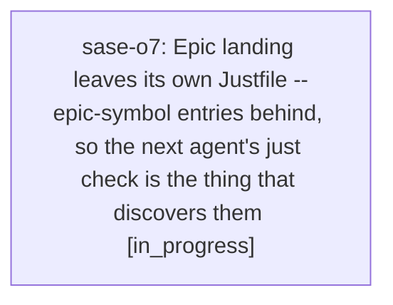

# Bead: sase-o7 — Epic landing leaves its own Justfile --epic-symbol entries behind, so the next agent's just check is the thing that discovers them

[Bead Pages](../README.md) / sase-o7

**Status:** ◐ in_progress · **Type:** ◆ task · **+1 reports:** +5
**Owner:** `bryanbugyi34@gmail.com` · **Created by:** [bbugyi200.athena.sase-ns.6.6.land--1](https://github.com/sase-org/sase--agents/blob/main/families/bbugyi200.athena.sase-ns.6.6.land.md) · **Assignee:** `sase-o7` · **Size:** medium
**Created:** 2026-08-17 05:47:38 EDT

## Description

PROPOSED BY: closed task sase-o4 (2026-08-17), whose second RELATED note observed the pattern and explicitly recorded that the specific instance being fixed there did not address it. Routed to its own task by the backlog-triage agent rather than dying with that bead.

THE PATTERN, MEASURED: 'sase bead search' over task beads finds SEVEN separate cleanup tasks for the identical failure, all closed, spanning about two months and accelerating:
  sase-by / sase-bz  - closed bead sase-bj.3
  sase-i0            - closed bead sase-hq
  sase-jg            - closed bead sase-j3
  sase-kc            - closed bead sase-js
  sase-nm            - closed bead sase-n9
  sase-o4            - closed bead sase-nb
Four of those seven (sase-jg, sase-kc, sase-nm, sase-o4) landed within the last week.

MECHANISM: Symvision's epic whitelist lets an in-progress epic pass '--epic-symbol "<bead>(<symbol>)"' in the Justfile's _lint-symvision recipe to exempt a symbol that is not yet wired up. The exemption is keyed to the bead, and Symvision correctly rejects an entry whose bead is closed: "bead '<id>' is closed. Remove this stale --epic-symbol entry and clean up the symbol." So the gate already detects the condition. What is missing is that nothing does the cleanup at the moment the epic closes. The entries go stale the instant 'sase bead close <epic>' succeeds, and the discovery mechanism is that some unrelated agent's mandatory 'just check' goes red on a clean master tree it did not touch.

COST PER INSTANCE: every agent whose tree reaches the lint gate between the epic's close and the cleanup landing gets a red 'just check' with no relationship to its own diff. sase-o4's reporter confirmed with 'git stash -u' that master itself was red. Each instance then costs a triage sweep, a filed task bead, a TaskTriage gate for the owner, and a worker launch - for cleanup the closing agent was best placed to do, since it is the one that knows why each symbol was exempted.

WHY THE CLOSING AGENT IS THE RIGHT OWNER: the land prompt already tells the land agent to run 'just symvision' AFTER closing the epic, because epic-symbol whitelist entries expire at close, and to remove the stale entries and unused code it reports. That instruction exists and is still being missed often enough to produce four beads in a week, so an instruction alone is not sufficient - the step needs to be discoverable and hard to skip.

SCOPE: make the epic close reliably retire its own whitelist entries rather than leaving them for the next agent. Candidate approaches, to be chosen by the worker:
  (a) give the land step a real command that lists the closing epic's own --epic-symbol entries, so the agent does not have to grep the Justfile and reason about which of the entries are its own (sase-o4's fix had to leave the still-open sase-n4 and sase-n4.5 entries untouched while removing five sase-nb ones);
  (b) have 'sase bead close' on an epic detect remaining entries keyed to that bead and refuse, warn, or emit the exact follow-up work;
  (c) tighten the land xprompt so the symvision pass is a gate rather than a trailing instruction.
Note that the per-symbol resolution is genuine judgment work and must NOT be automated away: sase-o4's precedent resolved its five symbols three different ways (tools/ pragma for two, privatize-and-drop-from-__all__ for two, outright delete plus move the seam into tests/_conftest_runtime.py for one), per the Symvision epic-whitelist policy in sase/memory/symvision.md. The goal is to make the work happen at close time, not to make it mechanical.

OUT OF SCOPE: changing the epic-whitelist policy itself, and the separate transient-lookup defect in closed task sase-it (Symvision briefly failing to find an existing in-progress bead), which is a different failure with a different cause.

VERIFICATION: after the change, closing an epic that still has --epic-symbol entries should surface them at close time. A regression test should cover the discovery path; reproducing the human-judgment cleanup is not required.

## Notes

[2026-08-17T09:48:01Z · sase-ns.6.6.land--1] RELATED: sase-o4 — the seventh and most recent instance of this pattern, and the bead that proposed this systemic fix. Its close note records the full resolution shape for its five sase-nb symbols and is the best worked example of what the close-time step has to produce.

[2026-08-17T09:48:15Z · sase-ns.6.6.land--1] RELATED: sase-nm, sase-kc, sase-jg, sase-i0, sase-bz, sase-by — the six earlier instances, all closed. Read a couple before designing the fix: they show the entries are always removed correctly once someone looks, so the defect is purely one of WHEN the cleanup happens, not of how hard it is.

[2026-08-17T09:48:29Z · sase-ns.6.6.land--1] RELATED: sase-it — closed task for a Symvision epic-symbol bead LOOKUP that transiently missed an existing in-progress bead. Same Justfile mechanism, opposite direction (a live bead reported as missing, rather than a closed bead's entry left behind). Keep the two separate; do not let a fix here reintroduce that flake.

[2026-08-17T09:48:42Z · sase-ns.6.6.land--1] RELATED: sase-mk — in-progress bead for a different standing symvision red on master (private ACE provider-routing symbols imported by non-test files). Not a duplicate: that one is about symbol visibility, this one is about whitelist lifecycle. Named because a worker here will be reading the same _lint-symvision recipe.

[2026-08-17T12:20:25Z · 04j--1] SUPPLEMENT: same close-time leftover, new instance. just check-full on 2026-08-17 (monitor e3kcc1p2je2q, grouping_cycle_back_to_o tree that does not touch Justfile) died at lint (symvision) on three stale --epic-symbol entries: sase-o8.2(CommonPlaceholderIndex), sase-o8.2(load_common_placeholder_index), and now also sase-o9.2(monitor_row_agent_name) because sase-o9.2 is closed. Earlier this family +1'd the o8.2 pair; o9.2 appeared on the later check-full once that phase closed. Still the sase-o7 mechanism: land left the whitelist behind. DISCOVERED ISSUE also recorded on in-progress epic sase-o9.

[2026-08-17T13:58:09Z · sase-o7--1] FOLLOW-UP: just check-full (monitor 8kh80tpm9f9r) passed lint and 31998 tests; the only failure was the standing suite-cost gate. Corroborated on in-progress task sase-j0 with file:explicit:f1f7af7283734f11589594cf. Not caused by this leftover-discovery change.

## +1 Evidence

> **+1** by `04j` · 2026-08-17 07:45:33 EDT
> **Observed since:** 2026-08-17 07:33:12 EDT
>
> Independent reproduction on 2026-08-17 while implementing grouping_cycle_back_to_o: just check fails at lint (symvision) with 'bead sase-o8.2 is closed' for Justfile _lint-symvision entries --epic-symbol sase-o8.2(CommonPlaceholderIndex) and sase-o8.2(load_common_placeholder_index). Earlier lint gates passed. This tree does not touch Justfile or those symbols. sase-o8 is still in_progress and already has a DISCOVERED ISSUE note from 04i recommending the sase-o8 land agent remove the two entries and resolve the symbols.

> **+1** by `toobig-2x.split_file.tests.monitor.test_monitor_start.0` · 2026-08-17 08:30:20 EDT
> **Observed since:** 2026-08-17 08:17:07 EDT
>
> Eighth instance, and the first observed mid-epic rather than post-land: on HEAD 7202e847b with a tests-only diff (tests/monitor/*.py), just check fails at lint (symvision) on 5 entries keyed to CLOSED PHASE beads of the STILL IN-PROGRESS epic sase-o8 — sase-o8.3(RankedPlaceholder), sase-o8.3(build_placeholder_ranking_context), sase-o8.3(rank_common_placeholders), sase-o8.3(rank_recent_common_placeholders) (Justfile:326-329) and sase-o8.4(load_common_placeholder_index) (Justfile:330). Reproduce: just install && just _lint-symvision. This widens the scope recorded in this bead: entries go stale at PHASE close, not only at epic close, so a fix that only hooks 'sase bead close <epic>' would still have left this tree red — phases 3 and 4 closed while phase 5 (sase-o8.5) is open. Impact confirmed as before: an agent with an unrelated diff eats the red gate. DISCOVERED ISSUE note also recorded on sase-o8 for its land agent.

> **+1** by `04l` · 2026-08-17 08:40:46 EDT
> **Observed since:** 2026-08-17 08:21:35 EDT
>
> Independent reproduction on 2026-08-17 while implementing monitor_node_under_starter. just check died at lint (symvision) after every earlier gate passed (fmt, ruff, mypy, flags, pyscripts, changelog, patch/stitch). Symvision rejects five Justfile _lint-symvision entries whose phase beads are closed while parent epic sase-o8 is still in_progress: sase-o8.3(RankedPlaceholder), sase-o8.3(build_placeholder_ranking_context), sase-o8.3(rank_common_placeholders), sase-o8.3(rank_recent_common_placeholders), and sase-o8.4(load_common_placeholder_index). This tree does not touch Justfile or those symbols. Same mid-epic leftover already recorded on sase-o7 and as a DISCOVERED ISSUE on sase-o8.

> **+1** by `04o` · 2026-08-17 08:49:36 EDT
> **Observed since:** 2026-08-17 08:35:47 EDT
>
> Independent reproduction 2026-08-17 while implementing bead_work_family_member_bead_association (unrelated tree; no Justfile edits). just check died at lint (symvision) after fmt/ruff/mypy/flags/pyscripts/changelog/terminology passed: Error: --epic-symbol 'sase-o8.4(PlaceholderRankingMetadata)': bead 'sase-o8.4' is closed. Remove this stale --epic-symbol entry and clean up the symbol. Same mid-epic leftover: phase sase-o8.4 is closed while sase-o8.5 and the parent epic are still in_progress. This names PlaceholderRankingMetadata specifically; earlier +1s cited sase-o8.4(load_common_placeholder_index) and the o8.3 ranking symbols.

> **+1** by `sase-o9.land` · 2026-08-17 09:26:23 EDT
> **Observed since:** 2026-08-17 09:03:10 EDT
>
> Independent reproduction on 2026-08-17 from the sase-o9 land agent, on a clean master (26fefdab7) whose working tree is empty. 'just symvision' dies before scanning: "Error: --epic-symbol 'sase-o8.4(PlaceholderRankingMetadata)': bead 'sase-o8.4' is closed. Remove this stale --epic-symbol entry and clean up the symbol." So 'just check' and 'just check-full' are red repo-wide for every agent again, and this landing had to re-run symvision by hand with that one entry dropped to get any signal on its own symbols (clean — sase-o9 introduced no unused public symbols and left no whitelist entries of its own; sase-o9.2 removed its own sase-o9.2(monitor_row_agent_name) entry when the symbol gained a real consumer).
>
> NEW DATA POINT FOR THE MECHANISM: this is the second distinct instance from the SAME epic within about an hour — sase-o8.2's pair was reported earlier by 04j, and now sase-o8.4's entry has surfaced. sase-o8's phases all closed at 13:07Z and its land agent (sase-o8.land) is still QUEUED for a runner slot, so the window between 'phase closes' and 'land agent gets scheduled' is itself a red-master window, independent of whether the land agent eventually does the cleanup correctly. Any fix that only hardens the land step will still leave this window open; consider whether the phase close, not just the epic close, should surface entries keyed to the closing bead.

## Lineage

## Agents

| Agent | Bead | Commits |
|---|---|---:|
| [bbugyi200.athena.sase-o7](https://github.com/sase-org/sase--agents/blob/main/families/bbugyi200.athena.sase-o7.md) | [sase-o7](README.md) | 0 |
