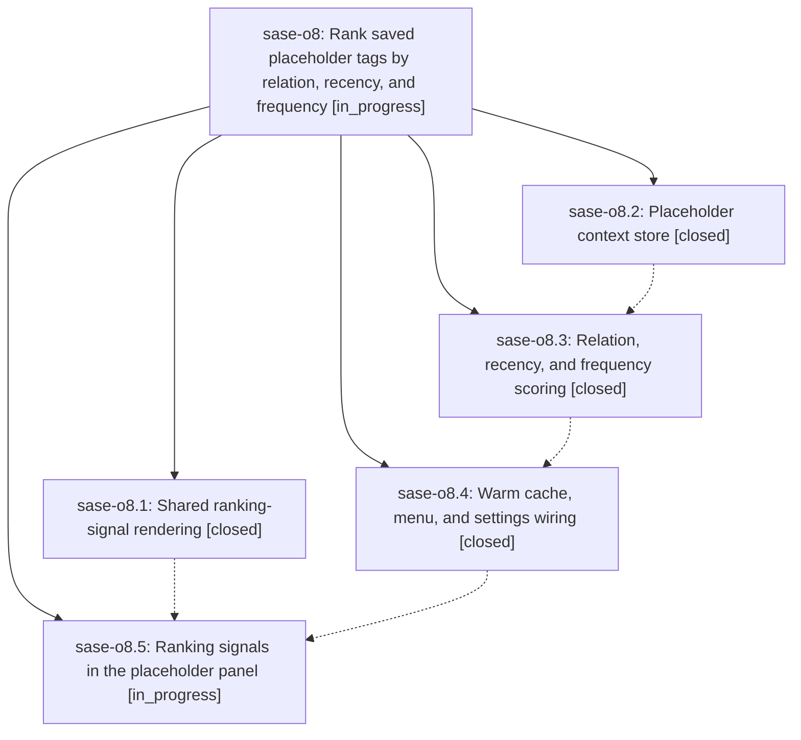

# Bead: sase-o8 — Rank saved placeholder tags by relation, recency, and frequency

[Bead Pages](../README.md) / sase-o8

**Status:** ◐ in_progress · **Type:** ▸ plan · **Tier:** epic
**Owner:** `bryanbugyi34@gmail.com` · **Created by:** [bbugyi200.athena.04e](https://github.com/sase-org/sase--agents/blob/main/families/bbugyi200.athena.04e.md) · **Assignee:** `sase-o8.land`
**Created:** 2026-08-17 06:01:52 EDT
**Plan:** [202608/placeholder\_completion\_ranking.md](https://github.com/sase-org/sase--plans/blob/main/202608/placeholder_completion_ranking.md)

## Description

The `<` completion menu ranks saved placeholder tags by how strongly they relate to the prompt being written, how recently they were used, and how often they were used, and every saved row shows the same compact, colored signal the history-word menu already uses to explain its ordering.

## Notes

[2026-08-17T11:10:24Z · 04i] DISCOVERED ISSUE: Justfile's _lint-symvision recipe still carries --epic-symbol "sase-o8.2(CommonPlaceholderIndex)" and --epic-symbol "sase-o8.2(load_common_placeholder_index)" for phase sase-o8.2, which is now closed. Symvision correctly rejects these as stale ("bead 'sase-o8.2' is closed. Remove this stale --epic-symbol entry and clean up the symbol."), so 'just check'/'just lint' fail on a clean master for every agent until they're removed and CommonPlaceholderIndex/load_common_placeholder_index (src/sase/history/prompt_placeholders.py) are properly wired up, privatized, or pragma'd per sase/memory/symvision.md. Discovered while implementing the unrelated notification_modal_g_top_bottom plan; confirmed pre-existing via 'git stash' + running symvision directly on clean master (commit ded7f1a5f). This is a fresh instance of the exact recurring pattern tracked by open task sase-o7 (systemic fix: epic land should retire its own --epic-symbol entries at close time) — sase-o7 cites sase-o4's close note as the best worked example of the per-symbol resolution shape. Recommend the sase-o8 land agent remove these two entries and resolve the two symbols as part of landing this epic.

[2026-08-17T11:45:48Z · 04j] DISCOVERED ISSUE: independently reproduced the stale sase-o8.2 --epic-symbol lint failure while implementing grouping_cycle_back_to_o (unrelated tree). just check dies at lint (symvision) on Justfile lines for CommonPlaceholderIndex and load_common_placeholder_index because sase-o8.2 is closed. Corroborates 04i's earlier note on this epic and ready task sase-o7. Still recommend the sase-o8 land agent retire these two entries and resolve the two symbols as part of landing.

## Phases

| Bead | Title | Status | Size | Created | Agents | Commits |
|---|---|---|---|---|---:|---:|
| [sase-o8.1](sase-o8.1.md) | Shared ranking-signal rendering | ✓ closed | small | 2026-08-17 | 1 | 1 |
| [sase-o8.2](sase-o8.2.md) | Placeholder context store | ✓ closed | medium | 2026-08-17 | 1 | 1 |
| [sase-o8.3](sase-o8.3.md) | Relation, recency, and frequency scoring | ✓ closed | medium | 2026-08-17 | 1 | 1 |
| [sase-o8.4](sase-o8.4.md) | Warm cache, menu, and settings wiring | ✓ closed | medium | 2026-08-17 | 1 | 1 |
| [sase-o8.5](sase-o8.5.md) | Ranking signals in the placeholder panel | ◐ in_progress | medium | 2026-08-17 | 1 | 0 |

## Lineage

## Agents

| Agent | Bead | Commits |
|---|---|---:|
| [bbugyi200.athena.sase-o8.1](https://github.com/sase-org/sase--agents/blob/main/agents/bbugyi200.athena.sase-o8.1/README.md) | [sase-o8.1](sase-o8.1.md) | 1 |
| [bbugyi200.athena.sase-o8.2](https://github.com/sase-org/sase--agents/blob/main/agents/bbugyi200.athena.sase-o8.2/README.md) | [sase-o8.2](sase-o8.2.md) | 1 |
| [bbugyi200.athena.sase-o8.3](https://github.com/sase-org/sase--agents/blob/main/families/bbugyi200.athena.sase-o8.3.md) | [sase-o8.3](sase-o8.3.md) | 1 |
| [bbugyi200.athena.sase-o8.4](https://github.com/sase-org/sase--agents/blob/main/agents/bbugyi200.athena.sase-o8.4/README.md) | [sase-o8.4](sase-o8.4.md) | 1 |
| [bbugyi200.athena.sase-o8.5](https://github.com/sase-org/sase--agents/blob/main/agents/bbugyi200.athena.sase-o8.5/README.md) | [sase-o8.5](sase-o8.5.md) | 0 |
| [bbugyi200.athena.sase-o8.land](https://github.com/sase-org/sase--agents/blob/main/agents/bbugyi200.athena.sase-o8.land/README.md) | [sase-o8](README.md) | 0 |

## Commits

| Repo | Commit | Subject | Bead | Committed |
|---|---|---|---|---|
| sase | [`555eba0`](https://github.com/sase-org/sase/commit/555eba0b13d7392912e34567180c057a79c936e0) | refactor(ace-tui): extract shared ranking-signal rendering | [sase-o8.1](sase-o8.1.md) | 2026-08-17 06:33:12 EDT |
| sase | [`ded7f1a`](https://github.com/sase-org/sase/commit/ded7f1a5f05e4d2c1554cd75677f874b7eac6b1f) | feat(history): persist placeholder context bags and corpus stats | [sase-o8.2](sase-o8.2.md) | 2026-08-17 06:58:24 EDT |
| sase | [`577986a`](https://github.com/sase-org/sase/commit/577986af5e33db57346e8c622845ed14e7c03b03) | feat(history): rank common placeholders by relation, recency, and frequency | [sase-o8.3](sase-o8.3.md) | 2026-08-17 07:46:19 EDT |
| sase | [`68aaa68`](https://github.com/sase-org/sase/commit/68aaa68634d2462af15fea43c10c9e8dc62a549c) | feat(ace-tui): rank saved placeholder tags from the warm cache | [sase-o8.4](sase-o8.4.md) | 2026-08-17 08:27:25 EDT |
