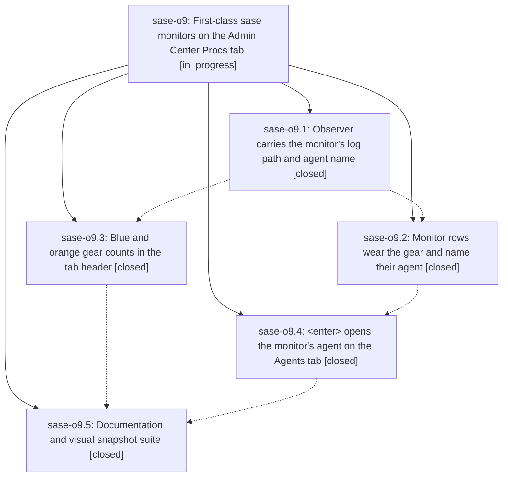

# Bead: sase-o9 — First-class sase monitors on the Admin Center Procs tab

[Bead Pages](../README.md) / sase-o9

**Status:** ◐ in_progress · **Type:** ▸ plan · **Tier:** epic
**Owner:** `bryanbugyi34@gmail.com` · **Created by:** [bbugyi200.athena.04g](https://github.com/sase-org/sase--agents/blob/main/families/bbugyi200.athena.04g.md) · **Assignee:** `sase-o9.land`
**Created:** 2026-08-17 06:54:26 EDT
**Plan:** [202608/procs\_tab\_monitor\_support.md](https://github.com/sase-org/sase--plans/blob/main/202608/procs_tab_monitor_support.md)

## Description

A monitor proc is unmistakable on the Procs tab: it wears the orange monitor gear, streams its live output like the agent metadata panel does, names the sase agent it belongs to, and opens that agent on the Agents tab with <enter> — while the tab header reports running plain procs and running monitors as blue and orange gear counts.

## Notes

[2026-08-17T12:20:27Z · 04j--1] DISCOVERED ISSUE: Justfile _lint-symvision still carries --epic-symbol "sase-o9.2(monitor_row_agent_name)" after phase sase-o9.2 closed. Symvision rejects it ('bead sase-o9.2 is closed. Remove this stale --epic-symbol entry and clean up the symbol.'), so just check / just check-full fail for every agent until the entry is removed and monitor_row_agent_name is wired, privatized, or pragma'd per sase/memory/symvision.md. Reproduced 2026-08-17 on the unrelated grouping_cycle_back_to_o tree (monitor e3kcc1p2je2q); this tree does not touch Justfile or that symbol. Same recurring leftover tracked by ready task sase-o7. Recommend the sase-o9 land agent retire the entry and resolve the symbol as part of landing.

## Phases

| Bead | Title | Status | Size | Created | Agents | Commits |
|---|---|---|---|---|---:|---:|
| [sase-o9.1](sase-o9.1.md) | Observer carries the monitor's log path and agent name | ✓ closed | small | 2026-08-17 | 1 | 1 |
| [sase-o9.2](sase-o9.2.md) | Monitor rows wear the gear and name their agent | ✓ closed | medium | 2026-08-17 | 1 | 1 |
| [sase-o9.3](sase-o9.3.md) | Blue and orange gear counts in the tab header | ✓ closed | small | 2026-08-17 | 1 | 1 |
| [sase-o9.4](sase-o9.4.md) | \<enter\> opens the monitor's agent on the Agents tab | ✓ closed | medium | 2026-08-17 | 1 | 1 |
| [sase-o9.5](sase-o9.5.md) | Documentation and visual snapshot suite | ✓ closed | small | 2026-08-17 | 1 | 1 |

## Lineage

## Agents

| Agent | Bead | Commits |
|---|---|---:|
| [bbugyi200.athena.sase-o9.1](https://github.com/sase-org/sase--agents/blob/main/agents/bbugyi200.athena.sase-o9.1/README.md) | [sase-o9.1](sase-o9.1.md) | 1 |
| [bbugyi200.athena.sase-o9.2](https://github.com/sase-org/sase--agents/blob/main/agents/bbugyi200.athena.sase-o9.2/README.md) | [sase-o9.2](sase-o9.2.md) | 1 |
| [bbugyi200.athena.sase-o9.3](https://github.com/sase-org/sase--agents/blob/main/agents/bbugyi200.athena.sase-o9.3/README.md) | [sase-o9.3](sase-o9.3.md) | 1 |
| [bbugyi200.athena.sase-o9.4](https://github.com/sase-org/sase--agents/blob/main/agents/bbugyi200.athena.sase-o9.4/README.md) | [sase-o9.4](sase-o9.4.md) | 1 |
| [bbugyi200.athena.sase-o9.5](https://github.com/sase-org/sase--agents/blob/main/agents/bbugyi200.athena.sase-o9.5/README.md) | [sase-o9.5](sase-o9.5.md) | 1 |
| [bbugyi200.athena.sase-o9.land](https://github.com/sase-org/sase--agents/blob/main/agents/bbugyi200.athena.sase-o9.land/README.md) | [sase-o9](README.md) | 0 |

## Commits

| Repo | Commit | Subject | Bead | Committed |
|---|---|---|---|---|
| sase | [`cc80519`](https://github.com/sase-org/sase/commit/cc805197bc0314307190fcc1cf22725d0856f907) | feat(ace-tui): stream monitor proc tails from their own log path | [sase-o9.1](sase-o9.1.md) | 2026-08-17 07:17:43 EDT |
| sase | [`6bd5d57`](https://github.com/sase-org/sase/commit/6bd5d57229493bb2db0d1d6b762ff7acc153d3a3) | feat(ace-tui): split blue/orange gear counts into the procs pane header | [sase-o9.3](sase-o9.3.md) | 2026-08-17 07:40:37 EDT |
| sase | [`7202e84`](https://github.com/sase-org/sase/commit/7202e847bfc8ab5cd44260e8b71955052580f26a) | feat(ace-tui): mark monitor rows with a gear and their agent's name | [sase-o9.2](sase-o9.2.md) | 2026-08-17 08:03:53 EDT |
| sase | [`790cb61`](https://github.com/sase-org/sase/commit/790cb61ee128b097842616881b92dfa3f91cf46c) | feat(ace-tui): jump from a Procs pane monitor row to its agent with Enter | [sase-o9.4](sase-o9.4.md) | 2026-08-17 08:36:36 EDT |
| sase | [`26fefda`](https://github.com/sase-org/sase/commit/26fefdab753e6a0bfbed1dcb2aacec935e3d12da) | docs(ace): document Procs monitors and add visual goldens | [sase-o9.5](sase-o9.5.md) | 2026-08-17 09:01:30 EDT |
