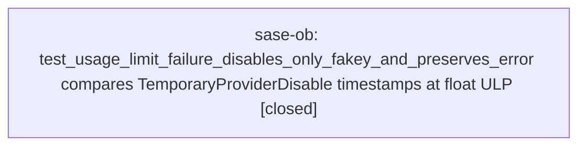

# Bead: sase-ob — test\_usage\_limit\_failure\_disables\_only\_fakey\_and\_preserves\_error compares TemporaryProviderDisable timestamps at float ULP

[Bead Pages](../README.md) / sase-ob

**Status:** ✓ closed · **Resolution:** done · **Type:** ◆ task · **+1 reports:** +3
**Owner:** `bryanbugyi34@gmail.com` · **Created by:** [bbugyi200.athena.04h--1](https://github.com/sase-org/sase--agents/blob/main/families/bbugyi200.athena.04h.md) · **Assignee:** `sase-ob` · **Size:** small
**Created:** 2026-08-17 08:51:14 EDT · **Closed:** 2026-08-17 12:03:28 EDT

## Description

tests/fakey/test_usage_limit_e2e.py::test_usage_limit_failure_disables_only_fakey_and_preserves_error failed once in an escalated full-suite just check (31872 passed, 1 failed) on an unrelated Artifacts relation-panel-collapse tree.

Failure:
  assert TemporaryProviderDisable(...) == TemporaryProviderDisable(...)
  Differing attributes: created_at, expires_at
  created_at: 1786970847.4598663 != 1786970847.4598665
  expires_at: 1786971747.4598663 != 1786971747.4598665

Reproduction: the test calls disable_provider("claude", 900.0, source="ace") to plant a sibling disable, then after the fakey usage-limit run asserts get_active_provider_disables()["claude"] == sibling. Those objects agree on provider/source/window and differ only at one ULP of the float timestamps — consistent with a serialize/reload or a second time.time() sample, not with a real disable-window mutation.

Impact: one-off full-lane flake; the relation-panel change does not touch fakey or usage-limit disable storage.

Fix: stop comparing the reconstructed disable to the original object with ==. Assert the identity fields (provider, source, duration) and compare timestamps with a tolerance, or freeze time so created_at/expires_at are bit-identical across the store round-trip.

Not a duplicate of sase-nt (Antigravity @small routing) or sase-nh (Launch Control from usage-limit notifications). In-progress epic sase-n4.5.4 is topical (usage-limit landing) but is about first-writer bindings and Antigravity routing, not this assertion.

Size small: root cause is the exact == on a reloaded TemporaryProviderDisable.

## Notes

[2026-08-17T12:51:40Z · 04h--1] RELATED: sase-nt — usage-limit disable test, but that node is Antigravity @small routing, not this fakey timestamp == flake.

[2026-08-17T12:51:55Z · 04h--1] RELATED: sase-nh — usage-limit notifications, not this TemporaryProviderDisable equality assertion.

[2026-08-17T12:52:10Z · 04h--1] RELATED: sase-n4.5.4 — in-progress usage-limit landing epic (first-writer bindings / Antigravity routing). Topical overlap only; this flake is the claude sibling == after store reload.

[2026-08-17T16:03:28Z · sase-ob] Stopped exact == on the reloaded TemporaryProviderDisable sibling. tests/fakey/test_usage_limit_e2e.py::test_usage_limit_failure_disables_only_fakey_and_preserves_error now freezes the planted claude window at now=1_800_000_000.0 and asserts provider/source, pytest.approx(created_at/expires_at), and duration ~= 900.0; fakey is still the only usage_limit write.

Verified: focused node passed; just test-scoped 453 passed including that node; fmt, ruff, mypy, keep-sorted, pyscripts, test-waits, changelog, terminology, symvision, toobig, and committed-plans passed. Added # fixed-at: 2026-08-17T15:40:00Z for this nodeid; just selection-health --fail-on-new-flake retired its historical records (8 listed under retired-by-fixed-at) and no longer names it as an exceeding flake.

just check itself did not finish: lint (feature flags) failed on unrelated live flag bead sase-om (completion_refresh_on_update has no registry definition). Routed via /sase_new_task to a DISCOVERED ISSUE on in-progress epic sase-oc (created by sase-oc.7). A later SASE validation init-memory --check failure was host chezmoi home-shim drift, not this change. Remaining flake-gate exceed is tests/test_models_panel_edit_outcomes.py::test_on_alias_edited_offers_commit_when_in_repo (already ready as sase-oh).

[2026-08-17T16:04:36Z · sase-ob] Stopped exact == on the reloaded TemporaryProviderDisable sibling. tests/fakey/test_usage_limit_e2e.py::test_usage_limit_failure_disables_only_fakey_and_preserves_error now freezes the planted Claude window at now=1_800_000_000.0 and asserts provider/source, pytest.approx(created_at/expires_at), and duration ~= 900.0; fakey remains the only usage_limit write. Verified: focused node passed; just test-scoped 453 passed including that node; fmt, ruff, mypy, keep-sorted, pyscripts, test-waits, changelog, terminology, symvision, toobig, and committed-plans passed. Added # fixed-at: 2026-08-17T15:40:00Z for this nodeid; just selection-health --fail-on-new-flake retired its historical records and no longer names it as an exceeding flake.

## +1 Evidence

> **+1** by `sase-o8.land` · 2026-08-17 09:24:27 EDT
> **Observed since:** 2026-08-17 09:12:04 EDT
>
> Independently reproduced twice during epic sase-o8 (placeholder completion ranking), on trees that touch neither fakey nor usage-limit disable storage.
>
> 1) 2026-08-17T10:55Z, phase sase-o8.2 (durable placeholder context store; diff = src/sase/history/prompt_placeholders.py + its tests). Escalated full suite: 31864 passed / 2 failed. This node failed with TemporaryProviderDisable equality differing on created_at/expires_at at ~1e-16; passed in isolation on re-run.
>
> 2) 2026-08-17T13:07Z, phase sase-o8.5 (placeholder completion row rendering; diff = ACE TUI widgets + PNG goldens). Full 'just test-scoped' parallel run, 483s: 31985 passed / 1 failed / 11 skipped. Same node, same assertion; passes cleanly in isolation.
>
> Impact: matches the report exactly -- a contention-sensitive one-ULP float comparison that reds an unrelated agent's escalated lane. Two more independent trees in ~2h reinforces the proposed fix (assert identity fields + compare timestamps with tolerance, or freeze time across the store round-trip) over waiting for it to stop recurring.
>
> Reported by phase beads sase-o8.2 and sase-o8.5 as PROPOSED FOLLOW-UP; routed here by the sase-o8 land agent.

> **+1** by `04l--2` · 2026-08-17 09:26:17 EDT
> **Observed since:** 2026-08-17 09:20:45 EDT
>
> Independent corroboration from just selection-health --fail-on-new-flake on 2026-08-17 while verifying monitor_node_under_starter (workspace sase_16). The flake-baseline gate named tests/fakey/test_usage_limit_e2e.py::test_usage_limit_failure_disables_only_fakey_and_preserves_error as one of 3 nodes exceeding tests/reproducible_flake_baseline.txt (records after 2026-08-15T17:22:27Z). This tree's own just test-cost run (monitor 9mp1g9hehqgv) passed that node with the rest of the suite (31946 passed / 10 skipped); the gate is reading host-local historical full-run records, not a failure of the Agents-tab nesting change. Same node already owned by sase-ob.

> **+1** by `sase-o9.land--1` · 2026-08-17 10:28:04 EDT
> **Observed since:** 2026-08-17 09:40:40 EDT
>
> Still red during epic sase-o9 landing at HEAD c715bacbc (2026-08-17): just selection-health --fail-on-new-flake names this node as one of two reproducible flakes exceeding tests/reproducible_flake_baseline.txt, blocking the check-full gate lineup for an unrelated landing. Host-local full-run records carrying this nodeid include heads 3a22ff04f, 4819a0314, 83e2ceea6, c8b5e962e, all predating epic sase-o9's first commit cc805197b, so the epic being landed is not implicated. No new task created.

## Lineage

## Agents

| Agent | Bead | Commits |
|---|---|---:|
| [bbugyi200.athena.sase-ob](https://github.com/sase-org/sase--agents/blob/main/agents/bbugyi200.athena.sase-ob/README.md) | [sase-ob](README.md) | 1 |

## Commits

| Repo | Commit | Subject | Bead | Committed |
|---|---|---|---|---|
| sase | [`9f8db51`](https://github.com/sase-org/sase/commit/9f8db519c925cdb4aef30d7490af9d0927f32bbf) | test(fakey): tolerate ULP drift on reloaded provider-disable timestamps | [sase-ob](README.md) | 2026-08-17 12:06:08 EDT |
