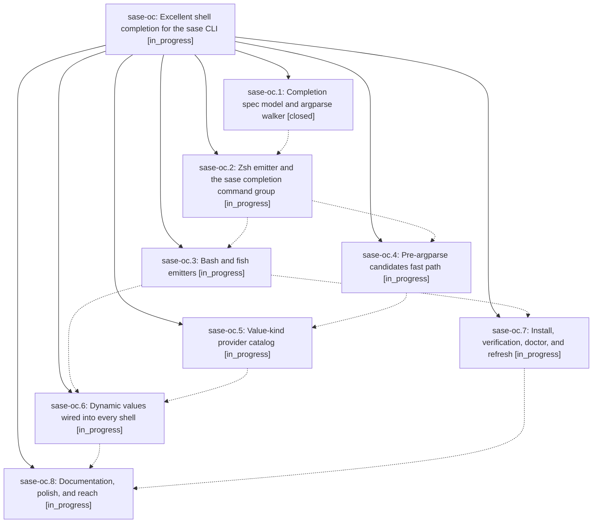

# Bead: sase-oc — Excellent shell completion for the sase CLI

[Bead Pages](../README.md) / sase-oc

**Status:** ◐ in_progress · **Type:** ▸ plan · **Tier:** epic
**Owner:** `bryanbugyi34@gmail.com` · **Created by:** [bbugyi200.athena.04p](https://github.com/sase-org/sase--agents/blob/main/families/bbugyi200.athena.04p.md) · **Assignee:** `sase-oc.land`
**Created:** 2026-08-17 08:54:22 EDT
**Plan:** [202608/cli\_completion.md](https://github.com/sase-org/sase--plans/blob/main/202608/cli_completion.md)

## Description

Typing `sase <TAB>` anywhere in the command tree offers the right commands, options, static choices, and live values — with descriptions, grouped listings, and no perceptible latency — in zsh, bash, and fish, from a grammar that cannot drift from the argparse tree.

## Phases

| Bead | Title | Status | Size | Created | Agents | Commits |
|---|---|---|---|---|---:|---:|
| [sase-oc.1](sase-oc.1.md) | Completion spec model and argparse walker | ✓ closed | medium | 2026-08-17 | 1 | 1 |
| [sase-oc.2](sase-oc.2.md) | Zsh emitter and the sase completion command group | ◐ in_progress | medium | 2026-08-17 | 1 | 0 |
| [sase-oc.3](sase-oc.3.md) | Bash and fish emitters | ◐ in_progress | medium | 2026-08-17 | 1 | 0 |
| [sase-oc.4](sase-oc.4.md) | Pre-argparse candidates fast path | ◐ in_progress | medium | 2026-08-17 | 1 | 0 |
| [sase-oc.5](sase-oc.5.md) | Value-kind provider catalog | ◐ in_progress | medium | 2026-08-17 | 1 | 0 |
| [sase-oc.6](sase-oc.6.md) | Dynamic values wired into every shell | ◐ in_progress | medium | 2026-08-17 | 1 | 0 |
| [sase-oc.7](sase-oc.7.md) | Install, verification, doctor, and refresh | ◐ in_progress | medium | 2026-08-17 | 1 | 0 |
| [sase-oc.8](sase-oc.8.md) | Documentation, polish, and reach | ◐ in_progress | small | 2026-08-17 | 1 | 0 |

## Lineage

## Agents

| Agent | Bead | Commits |
|---|---|---:|
| [bbugyi200.athena.sase-oc.1](https://github.com/sase-org/sase--agents/blob/main/agents/bbugyi200.athena.sase-oc.1/README.md) | [sase-oc.1](sase-oc.1.md) | 1 |
| [bbugyi200.athena.sase-oc.2](https://github.com/sase-org/sase--agents/blob/main/agents/bbugyi200.athena.sase-oc.2/README.md) | [sase-oc.2](sase-oc.2.md) | 0 |
| [bbugyi200.athena.sase-oc.3](https://github.com/sase-org/sase--agents/blob/main/agents/bbugyi200.athena.sase-oc.3/README.md) | [sase-oc.3](sase-oc.3.md) | 0 |
| [bbugyi200.athena.sase-oc.4](https://github.com/sase-org/sase--agents/blob/main/agents/bbugyi200.athena.sase-oc.4/README.md) | [sase-oc.4](sase-oc.4.md) | 0 |
| [bbugyi200.athena.sase-oc.5](https://github.com/sase-org/sase--agents/blob/main/agents/bbugyi200.athena.sase-oc.5/README.md) | [sase-oc.5](sase-oc.5.md) | 0 |
| [bbugyi200.athena.sase-oc.6](https://github.com/sase-org/sase--agents/blob/main/agents/bbugyi200.athena.sase-oc.6/README.md) | [sase-oc.6](sase-oc.6.md) | 0 |
| [bbugyi200.athena.sase-oc.7](https://github.com/sase-org/sase--agents/blob/main/agents/bbugyi200.athena.sase-oc.7/README.md) | [sase-oc.7](sase-oc.7.md) | 0 |
| [bbugyi200.athena.sase-oc.8](https://github.com/sase-org/sase--agents/blob/main/agents/bbugyi200.athena.sase-oc.8/README.md) | [sase-oc.8](sase-oc.8.md) | 0 |
| [bbugyi200.athena.sase-oc.land](https://github.com/sase-org/sase--agents/blob/main/agents/bbugyi200.athena.sase-oc.land/README.md) | [sase-oc](README.md) | 0 |

## Commits

| Repo | Commit | Subject | Bead | Committed |
|---|---|---|---|---|
| sase | [`48856bc`](https://github.com/sase-org/sase/commit/48856bc891f0a3f30dc5e3805c53f6bd2c840c18) | feat(completion): add the CompletionSpec model and argparse tree walker | [sase-oc.1](sase-oc.1.md) | 2026-08-17 10:03:17 EDT |
