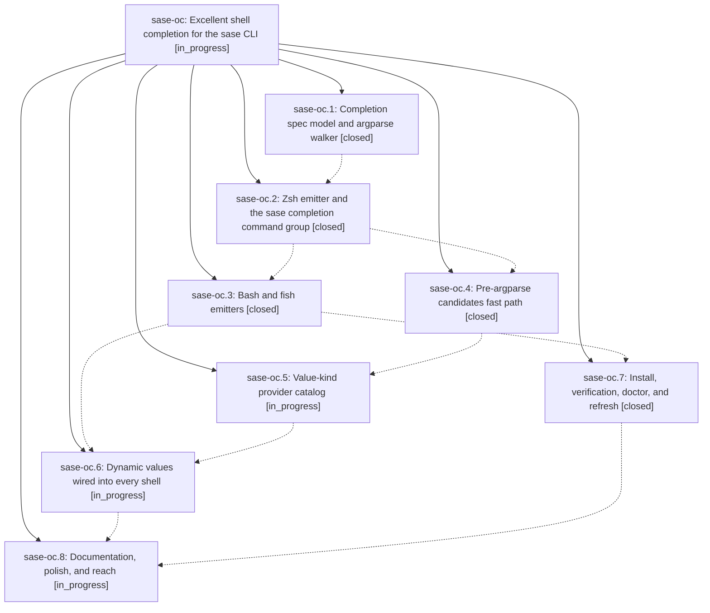

# Bead: sase-oc — Excellent shell completion for the sase CLI

[Bead Pages](../README.md) / sase-oc

**Status:** ◐ in_progress · **Type:** ▸ plan · **Tier:** epic
**Owner:** `bryanbugyi34@gmail.com` · **Created by:** [bbugyi200.athena.04p](https://github.com/sase-org/sase--agents/blob/main/families/bbugyi200.athena.04p.md) · **Assignee:** `sase-oc.land`
**Created:** 2026-08-17 08:54:22 EDT
**Plan:** [202608/cli\_completion.md](https://github.com/sase-org/sase--plans/blob/main/202608/cli_completion.md)

## Description

Typing `sase <TAB>` anywhere in the command tree offers the right commands, options, static choices, and live values — with descriptions, grouped listings, and no perceptible latency — in zsh, bash, and fish, from a grammar that cannot drift from the argparse tree.

## Notes

[2026-08-17T15:01:33Z · sase-o9.land--2] DISCOVERED ISSUE: The checked-in completion snapshot tests/completion/snapshots/cli_spec.json is already stale on master, so tests/completion/test_snapshot.py fails two nodes and holds `just test-cost`/`just check-full` red for every agent on the branch.

REPRODUCTION (workspace sase_13, HEAD c715bacbc, monitor 7r3cvqgwvqtw, 2026-08-17): the full test-cost lane reported `2 failed, 32085 passed, 11 skipped` and the only failures were tests/completion/test_snapshot.py::test_checked_in_snapshot_has_no_drift and ::test_current_structural_view_matches_checked_in_snapshot. Reproduced directly by diffing current_structural_view() against the committed JSON: the entire drift is one missing node, .root.subcommands[bead].subcommands[epic-symbols] (present in the live argparse tree, absent from the snapshot), plus the subcommand-order change that its insertion causes. Nothing else differs.

ROOT CAUSE: `sase bead epic-symbols` was added by commit fa1948437 ("feat(bead): refuse close while leftover --epic-symbol entries remain"), and `git log -S` confirms that is the only commit that introduces the string in src/sase. Phase sase-oc.1's commit 48856bc89 then added cli_spec.json (its only commit in that file's history) generated from a tree that did not yet contain fa1948437 — the two landed one commit apart from parallel workspaces, so the snapshot was correct when generated and stale the moment it landed.

IMPACT: this is a hard, deterministic red gate, not a flake, and it blocks the pytest cost lane for everyone on master until the snapshot is regenerated.

FIX: `just sync-completion-spec` (tools/sync_completion_spec --write), then review the regenerated diff — it should contain only the bead epic-symbols subtree and the reordering.

WHY HERE AND NOT A NEW TASK: routed via /sase_new_task. `sase bead search` over every task status for cli_spec/completion.snapshot/sync-completion-spec/completion spec/epic-symbols and the full --since 1w --status all task sweep found no semantic duplicate (sase-o7 is about leftover Justfile --epic-symbol entries; sase-ny is about stale ACE PNG goldens; neither shares this root cause). This epic has a direct causal link — sase-oc.1 landed the stale snapshot, phases sase-oc.3 through sase-oc.8 remain in progress and own the spec, and the epic's own goal is a grammar that cannot drift from the argparse tree — so it belongs here rather than on a standalone bead. Worth considering as part of the fix: the drift gate cannot catch a snapshot that goes stale via a commit landing in parallel, which is exactly what happened; a regeneration step in the land path (or a CI-side regenerate-and-diff) would close that window.

PROPOSED BY: the land agent for epic sase-o9 (First-class sase monitors on the Admin Center Procs tab), which found it in its landing gate. sase-o9 did not cause it: its five commits (cc805197b, 6bd5d5722, 7202e847b, 790cb61ee, 26fefdab7) touch only src/sase/ace/tui/**, docs/ace.md, tests, and one transient Justfile --epic-symbol line — no argparse parser, no src/sase/completion/**.

[2026-08-17T15:59:39Z · sase-ob] DISCOVERED ISSUE: just check fails at lint (feature flags) with: rule 8: live flag bead 'sase-om' has no definition (key 'completion_refresh_on_update').

REPRODUCTION (sase-ob worker, 2026-08-17): just check passed fmt/keep-sorted/ruff/mypy, then died in tools/check_feature_flags before later gates. grep of this tree finds no completion_refresh_on_update definition. Flag bead sase-om is OPEN/live, created 2026-08-17T15:41:43Z by sase-oc.7.

ROOT CAUSE: sase flag new writes the removal bead to the shared store immediately; the registry entry that rule 8 requires is not on this tree (phase sase-oc.7 is still in progress). That turns every other agent's just check red.

IMPACT: unrelated trees cannot finish just check. This worker's own change (usage-limit e2e timestamp == flake) does not touch flags.

FIX: land the registry definition in the same change that created sase-om, or close/defer the flag bead until that definition is committed.

WHY HERE AND NOT A NEW TASK: routed via /sase_new_task from sase-ob. Search over every task status for completion_refresh_on_update / live flag bead / check_feature_flags, plus the --since 1w --status all task sweep, found no semantic duplicate. In-progress epic sase-oc owns the flagged sase update refresh hook (sase-oc.7 created sase-om); causal, not topical.

[2026-08-17T16:07:55Z · 04z] CORROBORATION: agents_tab_unread_node_completion_keys (sase_16, 2026-08-17) hit the same just check failure independently: rule 8: live flag bead 'sase-om' has no definition (key 'completion_refresh_on_update'). Confirmed unrelated to my change via git stash on clean master. No new task filed — already tracked on this epic per the prior DISCOVERED ISSUE notes.

## Phases

| Bead | Title | Status | Size | Created | Agents | Commits |
|---|---|---|---|---|---:|---:|
| [sase-oc.1](sase-oc.1.md) | Completion spec model and argparse walker | ✓ closed | medium | 2026-08-17 | 1 | 1 |
| [sase-oc.2](sase-oc.2.md) | Zsh emitter and the sase completion command group | ✓ closed | medium | 2026-08-17 | 1 | 1 |
| [sase-oc.3](sase-oc.3.md) | Bash and fish emitters | ✓ closed | medium | 2026-08-17 | 1 | 1 |
| [sase-oc.4](sase-oc.4.md) | Pre-argparse candidates fast path | ✓ closed | medium | 2026-08-17 | 1 | 1 |
| [sase-oc.5](sase-oc.5.md) | Value-kind provider catalog | ◐ in_progress | medium | 2026-08-17 | 1 | 0 |
| [sase-oc.6](sase-oc.6.md) | Dynamic values wired into every shell | ◐ in_progress | medium | 2026-08-17 | 1 | 0 |
| [sase-oc.7](sase-oc.7.md) | Install, verification, doctor, and refresh | ✓ closed | medium | 2026-08-17 | 1 | 1 |
| [sase-oc.8](sase-oc.8.md) | Documentation, polish, and reach | ◐ in_progress | small | 2026-08-17 | 1 | 0 |

## Lineage

## Agents

| Agent | Bead | Commits |
|---|---|---:|
| [bbugyi200.athena.sase-oc.1](https://github.com/sase-org/sase--agents/blob/main/agents/bbugyi200.athena.sase-oc.1/README.md) | [sase-oc.1](sase-oc.1.md) | 1 |
| [bbugyi200.athena.sase-oc.2](https://github.com/sase-org/sase--agents/blob/main/agents/bbugyi200.athena.sase-oc.2/README.md) | [sase-oc.2](sase-oc.2.md) | 1 |
| [bbugyi200.athena.sase-oc.3](https://github.com/sase-org/sase--agents/blob/main/agents/bbugyi200.athena.sase-oc.3/README.md) | [sase-oc.3](sase-oc.3.md) | 1 |
| [bbugyi200.athena.sase-oc.4](https://github.com/sase-org/sase--agents/blob/main/agents/bbugyi200.athena.sase-oc.4/README.md) | [sase-oc.4](sase-oc.4.md) | 1 |
| [bbugyi200.athena.sase-oc.5](https://github.com/sase-org/sase--agents/blob/main/agents/bbugyi200.athena.sase-oc.5/README.md) | [sase-oc.5](sase-oc.5.md) | 0 |
| [bbugyi200.athena.sase-oc.6](https://github.com/sase-org/sase--agents/blob/main/agents/bbugyi200.athena.sase-oc.6/README.md) | [sase-oc.6](sase-oc.6.md) | 0 |
| [bbugyi200.athena.sase-oc.7](https://github.com/sase-org/sase--agents/blob/main/agents/bbugyi200.athena.sase-oc.7/README.md) | [sase-oc.7](sase-oc.7.md) | 1 |
| [bbugyi200.athena.sase-oc.8](https://github.com/sase-org/sase--agents/blob/main/agents/bbugyi200.athena.sase-oc.8/README.md) | [sase-oc.8](sase-oc.8.md) | 0 |
| [bbugyi200.athena.sase-oc.land](https://github.com/sase-org/sase--agents/blob/main/agents/bbugyi200.athena.sase-oc.land/README.md) | [sase-oc](README.md) | 0 |

## Commits

| Repo | Commit | Subject | Bead | Committed |
|---|---|---|---|---|
| sase | [`48856bc`](https://github.com/sase-org/sase/commit/48856bc891f0a3f30dc5e3805c53f6bd2c840c18) | feat(completion): add the CompletionSpec model and argparse tree walker | [sase-oc.1](sase-oc.1.md) | 2026-08-17 10:03:17 EDT |
| sase | [`1482fc1`](https://github.com/sase-org/sase/commit/1482fc1dc573af7f34dfb872110d822ee3b72eb0) | feat(completion): add native zsh emitter and sase completion CLI | [sase-oc.2](sase-oc.2.md) | 2026-08-17 10:53:53 EDT |
| sase | [`c3da174`](https://github.com/sase-org/sase/commit/c3da174ea12448497bafe9ace114e4bcd7e6c513) | feat(completion): emit bash and fish scripts from the shared spec | [sase-oc.3](sase-oc.3.md) | 2026-08-17 11:32:38 EDT |
| sase | [`24d892b`](https://github.com/sase-org/sase/commit/24d892b4de80ef1cc77849217352d91dbbcdfc39) | feat(completion): add pre-argparse candidates fast path | [sase-oc.4](sase-oc.4.md) | 2026-08-17 11:59:30 EDT |
| sase | [`3e9be9c`](https://github.com/sase-org/sase/commit/3e9be9ce44876f800bc21cc1b86e787c6be58132) | feat(completion): install scripts, doctor checks, and update refresh | [sase-oc.7](sase-oc.7.md) | 2026-08-17 12:26:21 EDT |
