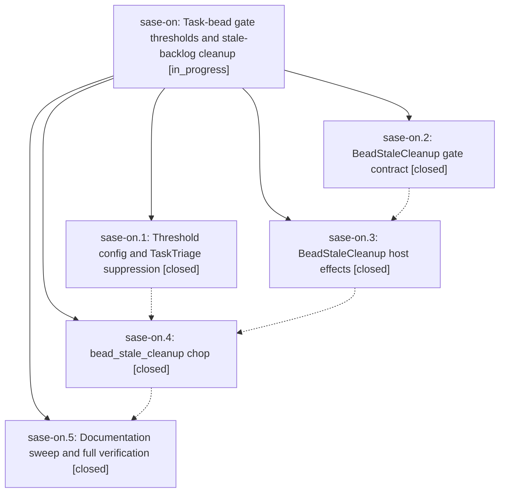

# Bead: sase-on — Task-bead gate thresholds and stale-backlog cleanup

[Bead Pages](../README.md) / sase-on

**Status:** ◐ in_progress · **Type:** ▸ plan · **Tier:** epic
**Owner:** `bryanbugyi34@gmail.com` · **Created by:** [bbugyi200.athena.04x](https://github.com/sase-org/sase--agents/blob/main/families/bbugyi200.athena.04x.md) · **Assignee:** `sase-on.land`
**Created:** 2026-08-17 11:47:54 EDT
**Plan:** [202608/task\_bead\_gate\_thresholds.md](https://github.com/sase-org/sase--plans/blob/main/202608/task_bead_gate_thresholds.md)

## Description

A ready task bead earns a TaskTriage gate only once it has at least `bead.task_triage.min_plus_ones` +1 reports, every gate already raised below that bar is canceled and its notification dismissed, and the sub-threshold remainder is swept by a new hourly chop that raises one multi-select BeadStaleCleanup gate as soon as `bead.task_triage.stale_cleanup_min_beads` beads have sat below the bar for `bead.task_triage.stale_after_days` days.

## Notes

[2026-08-17T18:21:24Z · sase-oo.land--1] DISCOVERED ISSUE: 'just symvision' (and therefore 'just check') is currently red on master 88a840063 because four of this epic's own Justfile --epic-symbol entries are now unnecessary: sase-on(create_bead_stale_cleanup_gate), sase-on(get_task_triage_stale_after_days), sase-on(get_task_triage_stale_cleanup_min_beads), and sase-on(stale_task_bead) each fail with 'symbol is already properly used. Remove this unnecessary --epic-symbol entry.' The wiring landed in b34d0d3b6 (withhold TaskTriage gates below a configurable +1 bar) and 671eea0cc (close reviewer-selected beads from the BeadStaleCleanup gate), so the exemptions became stale as soon as those phases landed rather than at epic close. Found by the land agent for epic sase-oo while running the post-close 'just symvision' confirmation; no sase-oo entries exist and nothing else in the whitelist fails. Whoever lands this epic should drop those four lines (see the Symvision epic-whitelist policy in sase/memory/symvision.md); a mid-epic phase could also drop them now to un-red the shared gate.

[2026-08-17T18:30:00Z · toobig-2y.split_file.tests.history.test_prompt_placeholders.0--1] DISCOVERED ISSUE (corroboration): independently reproduced at 2026-08-17T18:27Z on workspace sase_18 — an unrelated tests-only change (splitting tests/history/test_prompt_placeholders.py) had its mandatory 'just check' go red at lint (symvision) on the same four entries: sase-on(create_bead_stale_cleanup_gate), sase-on(get_task_triage_stale_after_days), sase-on(get_task_triage_stale_cleanup_min_beads), sase-on(stale_task_bead), Justfile lines 332-335. All four now have real non-test consumers in src/sase/scripts/sase_chop_bead_stale_cleanup.py. Second agent blocked by this in under 10 minutes, so the shared gate is actively costing unrelated agents; dropping the four lines mid-epic (rather than waiting for land) would un-red it now.

## Phases

| Bead | Title | Status | Size | Created | Agents | Commits |
|---|---|---|---|---|---:|---:|
| [sase-on.1](sase-on.1.md) | Threshold config and TaskTriage suppression | ✓ closed | medium | 2026-08-17 | 1 | 1 |
| [sase-on.2](sase-on.2.md) | BeadStaleCleanup gate contract | ✓ closed | medium | 2026-08-17 | 1 | 1 |
| [sase-on.3](sase-on.3.md) | BeadStaleCleanup host effects | ✓ closed | small | 2026-08-17 | 1 | 1 |
| [sase-on.4](sase-on.4.md) | bead\_stale\_cleanup chop | ✓ closed | medium | 2026-08-17 | 1 | 1 |
| [sase-on.5](sase-on.5.md) | Documentation sweep and full verification | ✓ closed | small | 2026-08-17 | 1 | 2 |

## Lineage

## Agents

| Agent | Bead | Commits |
|---|---|---:|
| [bbugyi200.athena.sase-on.1](https://github.com/sase-org/sase--agents/blob/main/agents/bbugyi200.athena.sase-on.1/README.md) | [sase-on.1](sase-on.1.md) | 1 |
| [bbugyi200.athena.sase-on.2](https://github.com/sase-org/sase--agents/blob/main/agents/bbugyi200.athena.sase-on.2/README.md) | [sase-on.2](sase-on.2.md) | 1 |
| [bbugyi200.athena.sase-on.3](https://github.com/sase-org/sase--agents/blob/main/agents/bbugyi200.athena.sase-on.3/README.md) | [sase-on.3](sase-on.3.md) | 1 |
| [bbugyi200.athena.sase-on.4](https://github.com/sase-org/sase--agents/blob/main/agents/bbugyi200.athena.sase-on.4/README.md) | [sase-on.4](sase-on.4.md) | 1 |
| [bbugyi200.athena.sase-on.5](https://github.com/sase-org/sase--agents/blob/main/families/bbugyi200.athena.sase-on.5.md) | [sase-on.5](sase-on.5.md) | 2 |
| [bbugyi200.athena.sase-on.land](https://github.com/sase-org/sase--agents/blob/main/agents/bbugyi200.athena.sase-on.land/README.md) | [sase-on](README.md) | 0 |

## Commits

| Repo | Commit | Subject | Bead | Committed |
|---|---|---|---|---|
| sase | [`3cfc5dd`](https://github.com/sase-org/sase/commit/3cfc5ddf48b48dbbc7f379fd8ef46c3586543660) | feat(gates): add BeadStaleCleanup notification gate contract | [sase-on.2](sase-on.2.md) | 2026-08-17 12:35:24 EDT |
| sase | [`b34d0d3`](https://github.com/sase-org/sase/commit/b34d0d3b6d85a821c7aac94e422e486eda77ae80) | feat(bead): withhold TaskTriage gates below a configurable +1 bar | [sase-on.1](sase-on.1.md) | 2026-08-17 12:39:35 EDT |
| sase | [`671eea0`](https://github.com/sase-org/sase/commit/671eea0ccf6093840c99fbaf2071c14018b63c30) | feat(bead): close reviewer-selected beads from the BeadStaleCleanup gate | [sase-on.3](sase-on.3.md) | 2026-08-17 13:07:10 EDT |
| sase | [`9f5147b`](https://github.com/sase-org/sase/commit/9f5147be365219e79fd4a3a85128c939e2cc5e00) | feat(axe): add hourly bead\_stale\_cleanup chop | [sase-on.4](sase-on.4.md) | 2026-08-17 13:48:55 EDT |
| sase | [`8c63f5e`](https://github.com/sase-org/sase/commit/8c63f5e121069b264f75863ff57a43d1d80de153) | docs(beads): document task-triage thresholds and stale-cleanup rollout | [sase-on.5](sase-on.5.md) | 2026-08-17 14:17:28 EDT |
| sase | [`4236695`](https://github.com/sase-org/sase/commit/423669549dafc56db81051a6de57c93b8d7384c0) | chore: drop resolved sase-on epic-symbol whitelist leftovers | [sase-on.5](sase-on.5.md) | 2026-08-17 14:45:30 EDT |
