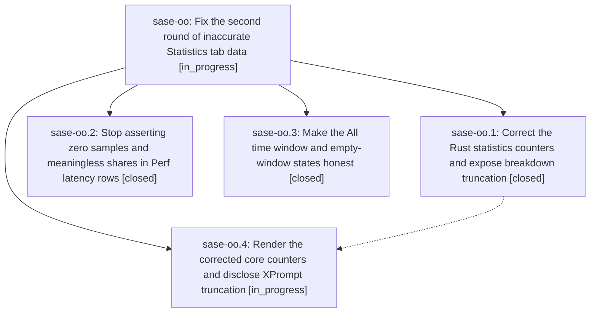

# Bead: sase-oo — Fix the second round of inaccurate Statistics tab data

[Bead Pages](../README.md) / sase-oo

**Status:** ◐ in_progress · **Type:** ▸ plan · **Tier:** epic
**Owner:** `bryanbugyi34@gmail.com` · **Created by:** [bbugyi200.athena.04y](https://github.com/sase-org/sase--agents/blob/main/families/bbugyi200.athena.04y.md) · **Assignee:** `sase-oo.land`
**Created:** 2026-08-17 12:01:57 EDT
**Plan:** [202608/statistics\_tab\_accuracy\_round\_two.md](https://github.com/sase-org/sase--plans/blob/main/202608/statistics_tab_accuracy_round_two.md)

## Description

Every number, label, and metric definition rendered by the Admin Center Statistics tab matches what its producer actually computes, including the All time range, the Perf subsystem latency counts, the Overview commits tile, and the silently truncated XPrompts breakdowns.

## Phases

| Bead | Title | Status | Size | Created | Agents | Commits |
|---|---|---|---|---|---:|---:|
| [sase-oo.1](sase-oo.1.md) | Correct the Rust statistics counters and expose breakdown truncation | ✓ closed | medium | 2026-08-17 | 1 | 2 |
| [sase-oo.2](sase-oo.2.md) | Stop asserting zero samples and meaningless shares in Perf latency rows | ✓ closed | small | 2026-08-17 | 1 | 1 |
| [sase-oo.3](sase-oo.3.md) | Make the All time window and empty-window states honest | ✓ closed | medium | 2026-08-17 | 1 | 1 |
| [sase-oo.4](sase-oo.4.md) | Render the corrected core counters and disclose XPrompt truncation | ◐ in_progress | medium | 2026-08-17 | 1 | 0 |

## Lineage

## Agents

| Agent | Bead | Commits |
|---|---|---:|
| [bbugyi200.athena.sase-oo.1](https://github.com/sase-org/sase--agents/blob/main/agents/bbugyi200.athena.sase-oo.1/README.md) | [sase-oo.1](sase-oo.1.md) | 2 |
| [bbugyi200.athena.sase-oo.2](https://github.com/sase-org/sase--agents/blob/main/agents/bbugyi200.athena.sase-oo.2/README.md) | [sase-oo.2](sase-oo.2.md) | 1 |
| [bbugyi200.athena.sase-oo.3](https://github.com/sase-org/sase--agents/blob/main/agents/bbugyi200.athena.sase-oo.3/README.md) | [sase-oo.3](sase-oo.3.md) | 1 |
| [bbugyi200.athena.sase-oo.4](https://github.com/sase-org/sase--agents/blob/main/agents/bbugyi200.athena.sase-oo.4/README.md) | [sase-oo.4](sase-oo.4.md) | 0 |
| [bbugyi200.athena.sase-oo.land](https://github.com/sase-org/sase--agents/blob/main/agents/bbugyi200.athena.sase-oo.land/README.md) | [sase-oo](README.md) | 0 |

## Commits

| Repo | Commit | Subject | Bead | Committed |
|---|---|---|---|---|
| sase | [`56dbeb2`](https://github.com/sase-org/sase/commit/56dbeb2f6d9715dc6710eb4ba0e78c9dc408fd0b) | fix(stats): make All time window and empty-window states honest | [sase-oo.3](sase-oo.3.md) | 2026-08-17 12:31:12 EDT |
| sase-core | [`sase-core@02a37e9`](https://github.com/sase-org/sase-core/commit/02a37e9d283a02cbf6bcbc95bea0df959f6b72c6) | fix(agent\_stats): correct commit, spec, runner, and xprompt counters | [sase-oo.1](sase-oo.1.md) | 2026-08-17 12:35:36 EDT |
| sase | [`05325ce`](https://github.com/sase-org/sase/commit/05325ceb727d7fa233af4ec7e6ca041fd829a8a5) | fix(stats): stop inventing Perf latency counts and shares | [sase-oo.2](sase-oo.2.md) | 2026-08-17 12:46:10 EDT |
| sase | [`24936ff`](https://github.com/sase-org/sase/commit/24936ffee3fc5136ed10bc9226bd63f8d9c4a869) | fix(core): require agent-stats schema 6 and truncation fields | [sase-oo.1](sase-oo.1.md) | 2026-08-17 12:48:23 EDT |
