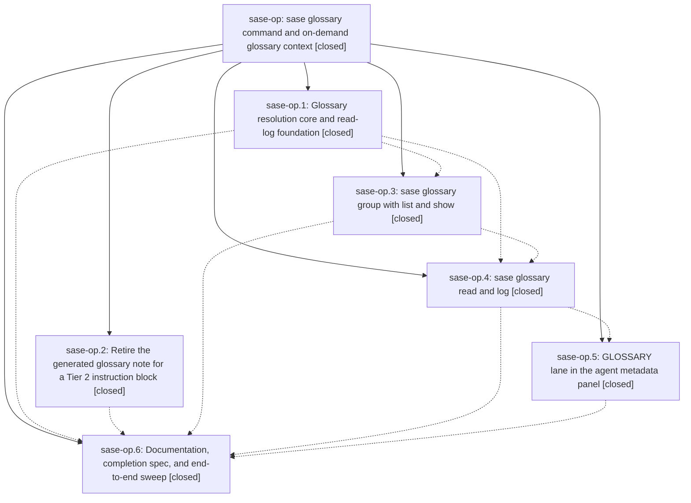

# Bead: sase-op — sase glossary command and on-demand glossary context

[Bead Pages](../README.md) / sase-op

**Status:** ✓ closed · **Resolution:** done · **Type:** ▸ plan · **Tier:** epic
**Owner:** `bryanbugyi34@gmail.com` · **Created by:** [bbugyi200.athena.050](https://github.com/sase-org/sase--agents/blob/main/families/bbugyi200.athena.050.md) · **Assignee:** `sase-op.land`
**Created:** 2026-08-17 12:03:30 EDT · **Closed:** 2026-08-17 16:52:46 EDT
**Plan:** [202608/glossary\_command.md](https://github.com/sase-org/sase--plans/blob/main/202608/glossary_command.md)

## Description

Agents fetch glossary definitions on demand with `sase glossary read <term>`, which prints the term plus the transitive closure of terms its definition depends on and records an audited, visible read; the always-loaded glossary memory note is gone, replaced by one concise Tier 2 instruction block, so the glossary can grow without growing every agent's context.

## Notes

[2026-08-17T18:14:32Z · sase-ns.6.6.6.land] DISCOVERED ISSUE: just check is red at lint (symvision) on a clean master tree RIGHT NOW, on 5 stale --epic-symbol entries keyed to your closed phase sase-op.3 (Justfile lines 336-340): GlossaryClosure, GlossaryClosureNode, GlossaryLookupError, GlossaryReferrer, lookup_glossary_entry. Symvision: "bead 'sase-op.3' is closed. Remove this stale --epic-symbol entry and clean up the symbol."

REPRODUCTION: 'just check' on HEAD 5e58fb1c8 passes fmt/keep-sorted/ruff/mypy/feature-flags/pyscripts/test-waits/changelog/patch-stitch, then fails _lint-symvision with exit 1. Not caused by the discovering epic (sase-ns.6.6.6): its entire diff touches zero files under src/, which is symvision's only scan root.

IMPACT: every agent whose tree reaches the lint gate before this is cleaned up gets a red 'just check' unrelated to its own diff -- the exact per-instance cost measured in closed task sase-o7.

WHY THIS IS ROUTED TO YOU, NOT A NEW TASK BEAD: sibling phase sase-op.4 (sase glossary read and log) is still IN_PROGRESS and is the plausible re-key target, since 'sase glossary read' consumes the closure/lookup symbols. Deciding re-key vs wire-up/privatize/delete is this epic's call, and touching those Justfile lines while sase-op.4 is live risks colliding with its worker. 'sase bead epic-symbols sase-op' already lists all 5, so 'sase bead close sase-op' will refuse until they are resolved -- this note only surfaces that the gate is red now rather than at close.

DISCOVERED BY: land agent for epic sase-ns.6.6.6 on 2026-08-17. RELATED: sase-o7 (systemic fix, closed done), sase-o4 / sase-nm (prior per-instance cleanups for closed beads sase-nb / sase-n9).

[2026-08-17T20:11:51Z · sase-oc.land] RESOLVED ELSEWHERE (from the sase-oc land agent): sase-op.6's PROPOSED FOLLOW-UP 'add glossary-term shell completion — ValueKind.GLOSSARY was intentionally left unset' is now implemented as part of epic sase-oc's landing, not filed as a task. ValueKind.GLOSSARY exists in src/sase/completion/kinds.py with PATH_OVERRIDES for the three term slots (glossary show/read TERM and glossary log -t/--term), and src/sase/completion/candidates/catalog.py ships a provider that reads the project's memory.glossary node from sase.yml through yaml_safe_load and offers slug-form references (agent-hood) with each term's shortened definition, plus authored aliases described as 'alias of <Term>'. Slug form is deliberate: sase glossary resolves references case- and separator-insensitively, so a slug never needs shell quoting. The kind holds the candidates fast-path import-set and 150ms latency contracts (tests/main/test_completion_candidates_contract.py) and the spec snapshot is regenerated. No action needed from sase-op's land agent for this item.

[2026-08-17T20:52:46Z · sase-op.land--1] VERIFIED (step 1): all 6 phases closed and each verified against its commit, every one an ancestor of the landed HEAD 23180476f — sase-op.1 shared resolver + JSONL read log (5ccb38d72), sase-op.2 retire the generated glossary note for a Tier 2 instruction block (eaafcbe72), sase-op.3 glossary group with list/show (f6d757e2c), sase-op.4 audited read + log dashboard (a383212a2), sase-op.5 GLOSSARY lane in the agent metadata panel (d3f77b800), sase-op.6 docs/completion-spec/sweep (5d98153a7). Every child note read and addressed against the actual source. Live end-to-end hand test against project sase on the merged tree: 'sase glossary -p sase list -f names', 'show "Agent Hood" -d 0' (aliases plus the depth-0 truncation notice), 'read "Xprompt Swarm" -r ...' (12 terms = 1 requested + 11 related, with per-node referrer attribution), and 'log' / 'log -t "Xprompt Swarm"' (summary panel plus per-term table showing the read just recorded). The root -f/--enable-feature vs 'glossary list -f/--format' non-collision was verified live.

INTEGRATED (step 2): repointed the stale 'sase/memory/glossary.md' example in docs/xprompt.md — the note this epic deleted — at sase_beads. Checked the epic's surface against everything landed since it started: 23180476f (epic sase-oc) wires glossary-term shell completion through this epic's sase.glossary_config.resolve_glossary_config instead of re-parsing sase.yml, and src/sase/ace/tui/modals/glossary_preview_render.py delegates to resolve_glossary_closure — no duplication or conflict.

FOLLOW-UPS: sase-op.2's and sase-op.4's PROPOSED FOLLOW-UPs were already resolved by since-landed commits (24936ffee/7391a745b/88a840063 and 423669549 respectively), so no beads were filed. sase-op.6's PROPOSED FOLLOW-UP (glossary-term shell completion; ValueKind.GLOSSARY intentionally left unset) was routed by /sase_new_task onto in-progress epic sase-oc as a DISCOVERED ISSUE rather than a new task bead, and is now landed in 23180476f (ValueKind.GLOSSARY, the catalog provider, and PATH_OVERRIDES for the three term slots) — verified present on the landed tree.

EPIC SYMBOLS: both remaining sase-op --epic-symbol entries were resolved rather than re-keyed — lookup_glossary_entry deleted (no consumers left; its tests now exercise resolve_glossary_closure) and GlossaryReferrer given a real production consumer via render._referrer_json, called from _node_json. 'sase bead epic-symbols sase-op' is empty and 'just symvision' passes.

VERIFICATION: 'just check-full' on the pre-merge tree (HEAD 6ac274be5) was green on every lint gate with 32619 passed / 13 skipped, failing only two pre-existing nodes in tests/test_force_reuse_launch_seam.py unrelated to this epic (call-signature mismatch shipped in beadless dc4ca2057). Triaged through /sase_new_task as a +1 on the existing duplicate task sase-ot, then confirmed fixed upstream by 13e9ccbc9 and sase-ot closed with that evidence. The workspace was then fast-forwarded 5 commits to origin/master HEAD 23180476f (none of them touching this epic's files) and re-verified there: 'just check' green end to end, with its scoped lane escalating to the full suite under the justfile rule — every lint gate plus the whole test suite passing over the combined tree.

[2026-08-17T20:54:45Z · sase-op.land--1] Land verification re-confirmed on the integrated tree at 23180476f: all 6 phases verified against their commits (5ccb38d72, eaafcbe72, f6d757e2c, a383212a2, d3f77b800, 5d98153a7), all ancestors of HEAD; live end-to-end hand test of glossary list/show/read/log against project sase passes including referrer attribution and the audited read appearing in the log. Integration: docs/xprompt.md stale sase/memory/glossary.md example repointed to sase_beads; sase-oc's glossary-term completion provider goes through this epic's resolve_glossary_config and the ACE preview modal delegates to resolve_glossary_closure, no duplication. Follow-ups: sase-op.2 and sase-op.4 PROPOSED FOLLOW-UPs already resolved by since-landed 24936ffee/7391a745b/88a840063 and 423669549; sase-op.6 completion follow-up routed onto in-progress epic sase-oc as a DISCOVERED ISSUE and now landed. Both sase-op epic symbols resolved (lookup_glossary_entry deleted, GlossaryReferrer given a non-test consumer); sase bead epic-symbols sase-op empty and just symvision clean. Gates: just check-full initially failed on 2 unrelated nodes in tests/test_force_reuse_launch_seam.py from beadless dc4ca2057 (duplicate task sase-ot, since fixed upstream by 13e9ccbc9); after fast-forwarding to 23180476f just check passed green with its scoped lane escalated to the full suite via the Justfile broadening rule, i.e. every lint gate plus the whole test suite over the combined tree.

## Phases

| Bead | Title | Status | Size | Created | Agents | Commits |
|---|---|---|---|---|---:|---:|
| [sase-op.1](sase-op.1.md) | Glossary resolution core and read-log foundation | ✓ closed | medium | 2026-08-17 | 1 | 1 |
| [sase-op.2](sase-op.2.md) | Retire the generated glossary note for a Tier 2 instruction block | ✓ closed | medium | 2026-08-17 | 1 | 1 |
| [sase-op.3](sase-op.3.md) | sase glossary group with list and show | ✓ closed | medium | 2026-08-17 | 1 | 1 |
| [sase-op.4](sase-op.4.md) | sase glossary read and log | ✓ closed | medium | 2026-08-17 | 1 | 1 |
| [sase-op.5](sase-op.5.md) | GLOSSARY lane in the agent metadata panel | ✓ closed | medium | 2026-08-17 | 1 | 1 |
| [sase-op.6](sase-op.6.md) | Documentation, completion spec, and end-to-end sweep | ✓ closed | small | 2026-08-17 | 1 | 1 |

## Lineage

## Agents

| Agent | Bead | Commits |
|---|---|---:|
| [bbugyi200.athena.sase-op.1](https://github.com/sase-org/sase--agents/blob/main/agents/bbugyi200.athena.sase-op.1/README.md) | [sase-op.1](sase-op.1.md) | 1 |
| [bbugyi200.athena.sase-op.2](https://github.com/sase-org/sase--agents/blob/main/agents/bbugyi200.athena.sase-op.2/README.md) | [sase-op.2](sase-op.2.md) | 1 |
| [bbugyi200.athena.sase-op.3](https://github.com/sase-org/sase--agents/blob/main/agents/bbugyi200.athena.sase-op.3/README.md) | [sase-op.3](sase-op.3.md) | 1 |
| [bbugyi200.athena.sase-op.4](https://github.com/sase-org/sase--agents/blob/main/agents/bbugyi200.athena.sase-op.4/README.md) | [sase-op.4](sase-op.4.md) | 1 |
| [bbugyi200.athena.sase-op.5](https://github.com/sase-org/sase--agents/blob/main/families/bbugyi200.athena.sase-op.5.md) | [sase-op.5](sase-op.5.md) | 1 |
| [bbugyi200.athena.sase-op.6](https://github.com/sase-org/sase--agents/blob/main/agents/bbugyi200.athena.sase-op.6/README.md) | [sase-op.6](sase-op.6.md) | 1 |
| [bbugyi200.athena.sase-op.land](https://github.com/sase-org/sase--agents/blob/main/families/bbugyi200.athena.sase-op.land.md) | [sase-op](README.md) | 1 |

## Commits

| Repo | Commit | Subject | Bead | Committed |
|---|---|---|---|---|
| sase | [`5ccb38d`](https://github.com/sase-org/sase/commit/5ccb38d7291b5a3dcc8ce864929e78765fb8f79f) | feat(glossary): add shared resolver and JSONL read-log | [sase-op.1](sase-op.1.md) | 2026-08-17 12:51:12 EDT |
| sase | [`eaafcbe`](https://github.com/sase-org/sase/commit/eaafcbe7253899bce21637194ba6424a5a3e4f2c) | feat(init)!: retire generated glossary note for a Tier 2 instruction block | [sase-op.2](sase-op.2.md) | 2026-08-17 13:06:54 EDT |
| sase | [`f6d757e`](https://github.com/sase-org/sase/commit/f6d757e2c96a7865d7958ad2b6d8bcc4a0abda4f) | feat(glossary): add glossary command group with list and show | [sase-op.3](sase-op.3.md) | 2026-08-17 14:00:52 EDT |
| sase | [`a383212`](https://github.com/sase-org/sase/commit/a383212a2bca37d813daeb0ca1c2452032283a4b) | feat(glossary): add audited read and log dashboard | [sase-op.4](sase-op.4.md) | 2026-08-17 14:35:01 EDT |
| sase | [`d3f77b8`](https://github.com/sase-org/sase/commit/d3f77b800772b99909f6d40e410ff776a6533b56) | feat(glossary): render per-agent glossary reads in the metadata panel | [sase-op.5](sase-op.5.md) | 2026-08-17 15:36:07 EDT |
| sase | [`5d98153`](https://github.com/sase-org/sase/commit/5d98153a7b2b1cacf6b8059c0e8e935b0eab9f04) | docs(glossary): document the sase glossary command group | [sase-op.6](sase-op.6.md) | 2026-08-17 15:58:10 EDT |
| sase | [`d5ac426`](https://github.com/sase-org/sase/commit/d5ac4269303f6b098aa6e242b8a3185e334a4b71) | refactor(glossary): retire the epic-symbol exemptions for sase-op | [sase-op](README.md) | 2026-08-17 16:55:47 EDT |
