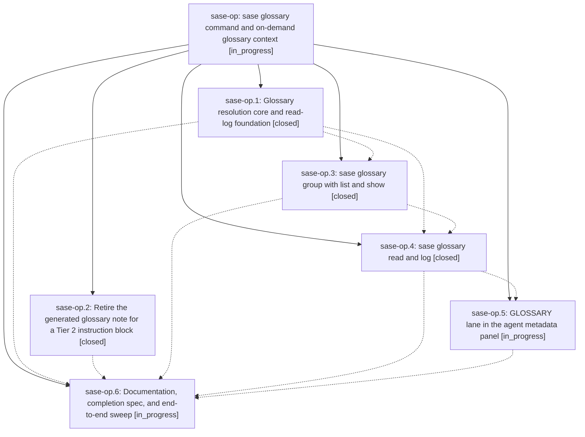

# Bead: sase-op — sase glossary command and on-demand glossary context

[Bead Pages](../README.md) / sase-op

**Status:** ◐ in_progress · **Type:** ▸ plan · **Tier:** epic
**Owner:** `bryanbugyi34@gmail.com` · **Created by:** [bbugyi200.athena.050](https://github.com/sase-org/sase--agents/blob/main/families/bbugyi200.athena.050.md) · **Assignee:** `sase-op.land`
**Created:** 2026-08-17 12:03:30 EDT
**Plan:** [202608/glossary\_command.md](https://github.com/sase-org/sase--plans/blob/main/202608/glossary_command.md)

## Description

Agents fetch glossary definitions on demand with `sase glossary read <term>`, which prints the term plus the transitive closure of terms its definition depends on and records an audited, visible read; the always-loaded glossary memory note is gone, replaced by one concise Tier 2 instruction block, so the glossary can grow without growing every agent's context.

## Notes

[2026-08-17T18:14:32Z · sase-ns.6.6.6.land] DISCOVERED ISSUE: just check is red at lint (symvision) on a clean master tree RIGHT NOW, on 5 stale --epic-symbol entries keyed to your closed phase sase-op.3 (Justfile lines 336-340): GlossaryClosure, GlossaryClosureNode, GlossaryLookupError, GlossaryReferrer, lookup_glossary_entry. Symvision: "bead 'sase-op.3' is closed. Remove this stale --epic-symbol entry and clean up the symbol."

REPRODUCTION: 'just check' on HEAD 5e58fb1c8 passes fmt/keep-sorted/ruff/mypy/feature-flags/pyscripts/test-waits/changelog/patch-stitch, then fails _lint-symvision with exit 1. Not caused by the discovering epic (sase-ns.6.6.6): its entire diff touches zero files under src/, which is symvision's only scan root.

IMPACT: every agent whose tree reaches the lint gate before this is cleaned up gets a red 'just check' unrelated to its own diff -- the exact per-instance cost measured in closed task sase-o7.

WHY THIS IS ROUTED TO YOU, NOT A NEW TASK BEAD: sibling phase sase-op.4 (sase glossary read and log) is still IN_PROGRESS and is the plausible re-key target, since 'sase glossary read' consumes the closure/lookup symbols. Deciding re-key vs wire-up/privatize/delete is this epic's call, and touching those Justfile lines while sase-op.4 is live risks colliding with its worker. 'sase bead epic-symbols sase-op' already lists all 5, so 'sase bead close sase-op' will refuse until they are resolved -- this note only surfaces that the gate is red now rather than at close.

DISCOVERED BY: land agent for epic sase-ns.6.6.6 on 2026-08-17. RELATED: sase-o7 (systemic fix, closed done), sase-o4 / sase-nm (prior per-instance cleanups for closed beads sase-nb / sase-n9).

## Phases

| Bead | Title | Status | Size | Created | Agents | Commits |
|---|---|---|---|---|---:|---:|
| [sase-op.1](sase-op.1.md) | Glossary resolution core and read-log foundation | ✓ closed | medium | 2026-08-17 | 1 | 1 |
| [sase-op.2](sase-op.2.md) | Retire the generated glossary note for a Tier 2 instruction block | ✓ closed | medium | 2026-08-17 | 1 | 1 |
| [sase-op.3](sase-op.3.md) | sase glossary group with list and show | ✓ closed | medium | 2026-08-17 | 1 | 1 |
| [sase-op.4](sase-op.4.md) | sase glossary read and log | ✓ closed | medium | 2026-08-17 | 1 | 1 |
| [sase-op.5](sase-op.5.md) | GLOSSARY lane in the agent metadata panel | ◐ in_progress | medium | 2026-08-17 | 1 | 0 |
| [sase-op.6](sase-op.6.md) | Documentation, completion spec, and end-to-end sweep | ◐ in_progress | small | 2026-08-17 | 1 | 0 |

## Lineage

## Agents

| Agent | Bead | Commits |
|---|---|---:|
| [bbugyi200.athena.sase-op.1](https://github.com/sase-org/sase--agents/blob/main/agents/bbugyi200.athena.sase-op.1/README.md) | [sase-op.1](sase-op.1.md) | 1 |
| [bbugyi200.athena.sase-op.2](https://github.com/sase-org/sase--agents/blob/main/agents/bbugyi200.athena.sase-op.2/README.md) | [sase-op.2](sase-op.2.md) | 1 |
| [bbugyi200.athena.sase-op.3](https://github.com/sase-org/sase--agents/blob/main/agents/bbugyi200.athena.sase-op.3/README.md) | [sase-op.3](sase-op.3.md) | 1 |
| [bbugyi200.athena.sase-op.4](https://github.com/sase-org/sase--agents/blob/main/agents/bbugyi200.athena.sase-op.4/README.md) | [sase-op.4](sase-op.4.md) | 1 |
| [bbugyi200.athena.sase-op.5](https://github.com/sase-org/sase--agents/blob/main/agents/bbugyi200.athena.sase-op.5/README.md) | [sase-op.5](sase-op.5.md) | 0 |
| [bbugyi200.athena.sase-op.6](https://github.com/sase-org/sase--agents/blob/main/agents/bbugyi200.athena.sase-op.6/README.md) | [sase-op.6](sase-op.6.md) | 0 |
| [bbugyi200.athena.sase-op.land](https://github.com/sase-org/sase--agents/blob/main/agents/bbugyi200.athena.sase-op.land/README.md) | [sase-op](README.md) | 0 |

## Commits

| Repo | Commit | Subject | Bead | Committed |
|---|---|---|---|---|
| sase | [`5ccb38d`](https://github.com/sase-org/sase/commit/5ccb38d7291b5a3dcc8ce864929e78765fb8f79f) | feat(glossary): add shared resolver and JSONL read-log | [sase-op.1](sase-op.1.md) | 2026-08-17 12:51:12 EDT |
| sase | [`eaafcbe`](https://github.com/sase-org/sase/commit/eaafcbe7253899bce21637194ba6424a5a3e4f2c) | feat(init)!: retire generated glossary note for a Tier 2 instruction block | [sase-op.2](sase-op.2.md) | 2026-08-17 13:06:54 EDT |
| sase | [`f6d757e`](https://github.com/sase-org/sase/commit/f6d757e2c96a7865d7958ad2b6d8bcc4a0abda4f) | feat(glossary): add glossary command group with list and show | [sase-op.3](sase-op.3.md) | 2026-08-17 14:00:52 EDT |
| sase | [`a383212`](https://github.com/sase-org/sase/commit/a383212a2bca37d813daeb0ca1c2452032283a4b) | feat(glossary): add audited read and log dashboard | [sase-op.4](sase-op.4.md) | 2026-08-17 14:35:01 EDT |
