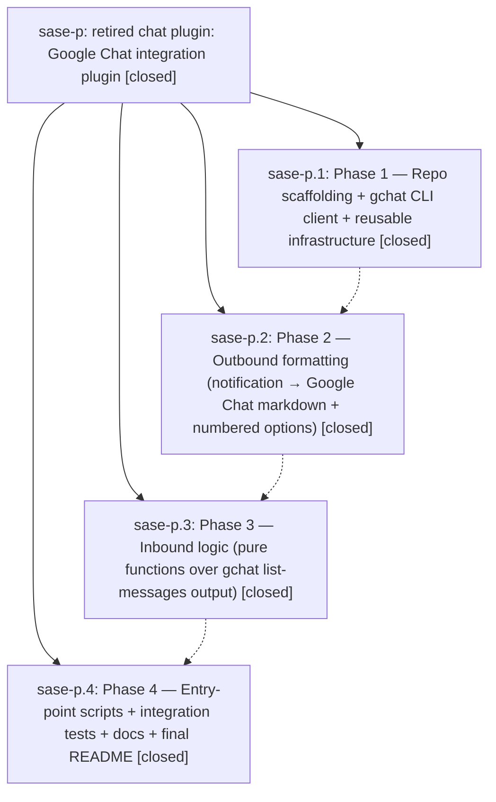

# Bead: sase-p — retired chat plugin: Google Chat integration plugin

[Bead Pages](../README.md) / sase-p

**Status:** ✓ closed · **Resolution:** (unrecorded) · **Type:** plan · **Tier:** epic
**Owner:** `bryanbugyi34@gmail.com`
**Created:** 2026-04-25 02:42:55 UTC · **Closed:** 2026-04-25 03:23:50 UTC
**Plan:** [202604/retired\_chat\_plugin.md](https://github.com/sase-org/sase--plans/blob/main/202604/retired_chat_plugin.md)

## Description

Build a new retired chat plugin plugin repository that mirrors sase-telegram functionality but speaks Google Chat. Ships sase_chop_gc_outbound and sase_chop_gc_inbound chops driven by the gchat CLI.

## Phases

| Bead | Title | Status | Size | Agents | Commits |
|---|---|---|---|---:|---:|
| [sase-p.1](sase-p.1.md) | Phase 1 — Repo scaffolding + gchat CLI client + reusable infrastructure | ✓ closed | small | 0 | 0 |
| [sase-p.2](sase-p.2.md) | Phase 2 — Outbound formatting (notification → Google Chat markdown + numbered options) | ✓ closed | small | 0 | 0 |
| [sase-p.3](sase-p.3.md) | Phase 3 — Inbound logic (pure functions over gchat list-messages output) | ✓ closed | small | 0 | 0 |
| [sase-p.4](sase-p.4.md) | Phase 4 — Entry-point scripts + integration tests + docs + final README | ✓ closed | small | 0 | 0 |

## Lineage

