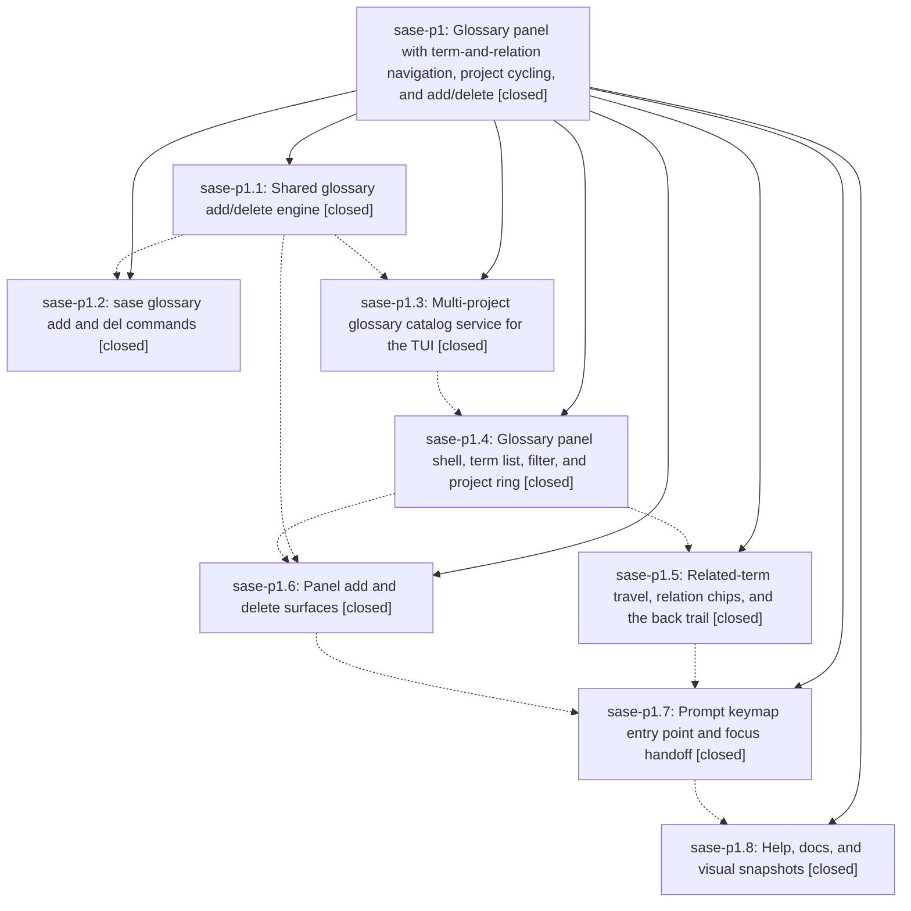

# Bead: sase-p1 — Glossary panel with term-and-relation navigation, project cycling, and add/delete

[Bead Pages](../README.md) / sase-p1

**Status:** ✓ closed · **Resolution:** done · **Type:** ▸ plan · **Tier:** epic
**Owner:** `bryanbugyi34@gmail.com` · **Created by:** [bbugyi200.athena.056](https://github.com/sase-org/sase--agents/blob/main/families/bbugyi200.athena.056.md) · **Assignee:** `sase-p1.land`
**Created:** 2026-08-17 17:42:37 EDT · **Closed:** 2026-08-18 00:44:01 EDT
**Plan:** [202608/glossary\_panel.md](https://github.com/sase-org/sase--plans/blob/main/202608/glossary_panel.md)

## Description

A user drafting a prompt can press `gG` or `<ctrl+g>G` to open a Glossary panel that browses one project's terms alphabetically, travels through related terms in both directions with a back trail, cycles the visible project with `p`/`P`, and adds or deletes terms through the same engine that backs the new `sase glossary add` and `sase glossary del` commands.

## Notes

[2026-08-17T23:50:00Z · sase-ng.1.land--1] DISCOVERED ISSUE (reported by the sase-ng.1 land agent, not caused by this epic): master's just check / just check-full is red in the _lint-symvision gate because the Justfile still carries six --epic-symbol entries keyed to phase sase-p1.2, which closed 2026-08-17T23:19:10Z:

  sase-p1.2(GlossaryConflictError), sase-p1.2(GlossaryMutationError), sase-p1.2(GlossaryMutationOutcome), sase-p1.2(GlossaryValidationError), sase-p1.2(add_glossary_term), sase-p1.2(delete_glossary_term)

Symvision error per entry: "bead 'sase-p1.2' is closed. Remove this stale --epic-symbol entry and clean up the symbol." Reproduced at master c89e5bbeb in workspace sase_13 at 2026-08-18T00:0xZ; the same gate was green in a check-full run started 23:01Z, i.e. it went red exactly when sase-p1.2 closed. This is the recurring stale-epic-symbol pattern (same shape as the sase-oc.8 and sase-ng.1.5 instances).

Since sase-p1.6 (Panel add and delete surfaces) is still in progress and is the phase that will call the add/delete engine, the fix is almost certainly to re-key these six lines to the still-open epic sase-p1 rather than delete the symbols -- the same move 13e9ccbc9 made for sase-oc.8(set_completion_summary). Left for this epic's own workers/land agent to do, since the symbols and the judgment about which open bead still needs the exemption belong to sase-p1. Recording here rather than filing a task bead because this epic is the direct cause and is still in progress.

[2026-08-18T04:44:01Z · sase-p1.land] VERIFIED (all 8 phases, source + commits + runtime, at master d4594a416):

Read every phase bead note and traced each claim to code. Engine:
src/sase/glossary/mutation.py has add_glossary_term/delete_glossary_term with the plan's
exact contract -- candidate-set validation through the Rust validator before any write,
sorted surgical/round-trip insert, and _write_config_atomically re-reading the file's
bytes and raising GlossaryConflictError on mismatch before an fsync'd temp-file
os.replace that preserves mode. relations.py::glossary_reverse_references drops
self-references and keeps catalog order. CLI: `sase glossary --help` lists
{add,del,list,log,read,show} alphabetically; end-to-end `sase glossary del hood -n -p
sase` resolved the alias to 'Agent Hood', printed the inbound blast radius (Agent Clan,
Agent Neighbor), the config path, and a correctly shlex-quoted restore command, and
wrote nothing; `-f json` emitted the same as a stable object. Display name 'sase' is
used everywhere, never the ProjectSpec key. The bare-invocation "no enabled project
matched the active workspace" error is the pre-existing shared resolution -- `list` and
`show` behave identically -- so `del` inherits the existing taxonomy as designed.
Catalog: glossary_panel_catalog.py builds the ring from the shared
enabled_project_records/glossary_project_record_for_workspace helpers p1.3 factored out
of xprompt/glossary_catalog.py, and glossary_entry_relations now has a real consumer at
modals/glossary_panel.py:632 (so the exemption p1.6 re-keyed to p1.8 was correctly
retired rather than dropped). Panel: the p1.4 generic loader
keymaps/scopes.py::_load_scope_keymaps backs all three focused scopes
(statistics/gate/glossary); ace.keymaps.glossary is in default_config.yml and
sase.schema.json. Entry: _prompt_bar_glossary_panel.py opens the panel from
GlossaryPanelRequested, seeds from the cursor term, and restores prompt focus, vim mode,
and cursor on dismiss. Docs: docs/cli.md rows for add/del, docs/memory.md glossary
section, docs/ace.md#glossary-panel, and gG/Ctrl+G G in both keymap tables. All 100
tests across the 11 glossary suites pass.

INTEGRATION with the 25 non-epic commits landed since 24f0c9539:
- fb16cfaf8 (repo mention catalog) predates p1.3's helper extraction;
  xprompt/repo_mention_catalog.py:31 now imports the shared enabled_project_records, so
  there is no duplicate project-record walker.
- cd13a0f92 (completion catalog split) landed after p1.2's completion work;
  ValueKind.GLOSSARY still routes to glossary_candidates in the new catalog_content.py,
  and (("glossary","del"),"term") is intact in completion/kinds.py.
- 98aefd35f regenerated tests/completion/snapshots/cli_spec.json after p1.2; verified the
  glossary node carries both the add and del subcommands with their full option sets.
- 1e59c50e7 (plugins.required) changed run_init_memory, which glossary/cli_write.py calls
  in-process; the composition is correct -- a regeneration blocker is reported as a
  warning and the successful write is not rolled back, exactly as the plan specifies.
- 6c4132221 / f54a91175 / fd2d71afc (sase-p2 prompt repo mentions, K preview, Ctrl+])
  all landed before p1.7/p1.8, and 9a3327a3b already fixed the Ctrl+] help-label test;
  all 39 help-modal tests pass and there is no keymap collision with gG or ^GG.
- ace/tui/repo_mention_catalog.py mirrors ace/tui/glossary_catalog.py structurally, but
  that parallel predates this epic and belongs to sase-p2; nothing here duplicates it.

EPIC WORK I FINISHED DURING LANDING: p1.7 added a `gG glossary...` row to the prompt g
prefix table and p1.8's PNG pass missed the golden that change invalidated. `just
test-visual` failed
test_prompt_stack_g_prefix_hints_png_snapshot (17.6% changed pixels; the actual frame
shows the new gG row). Re-recorded
tests/ace/tui/visual/snapshots/png/prompt_stack_g_prefix_hints_120x40.png; that file now
passes and so do all 13 nodes in test_ace_png_snapshots_prompt_stack.py. (Left
uncommitted for the commit finalizer.)

GATES at close: fmt, keep-sorted, ruff, mypy, pyscripts, test-waits, changelog,
patch/stitch terminology, symvision, toobig, SASE validation, and committed plans all
green; full `just test` 32958 passed / 12 skipped. `sase bead epic-symbols sase-p1`
reports no entries. The one remaining red is _lint-flags ("live flag bead 'sase-pa' has
no definition (key 'epic_resume_gate')"), owned by in-progress phase sase-p4.4 and
already recorded on epic sase-p4.

PROPOSED FOLLOW-UPS -- every entry from all 8 phase beads, resolved:
- p1.1 stale sase-ng.1.5 entries re-keyed to sase-ng.1: RESOLVED. No sase-ng entries
  remain in the Justfile.
- p1.4 stale sase-p2.2 entries re-keyed to sase-p2.3, and p1.5/p1.6 stale
  sase-p2.3(RepoMention) re-keyed to sase-p2.4: RESOLVED. No sase-p2 entries remain, and
  RepoMention now has real consumers in modals/repo_preview_render.py and
  repo_preview_modal.py.
- p1.6 sase-p1.5(glossary_entry_relations) re-keyed to sase-p1.8: RESOLVED, real consumer
  at glossary_panel.py:632.
- p1.7 stale sase-p3.11 and sase-p4.3 entries: RESOLVED. The Justfile whitelist now holds
  only sase-n4.5, sase-n4, and sase-p4.4 entries, all keyed to open beads, and symvision
  is green.
- p1.7 stale Ctrl+] help-label expectation: RESOLVED by 9a3327a3b before this landing.
- p1.5 / p1.6 / p1.8 doctor config.file_hooks + doctor test_checks_config_repos failures:
  NOT filed as a new task. Root-caused to a stale editable install of
  sase-research-artifacts whose .pth points at an absent linked checkout, which is a
  silent second variant of a gap active epic sase-p3 already owns (sase-p3.4 shipped
  plugins.required and the _setup installer). Corroborated with the full mechanism and
  the confirmed `sase repo open` fix path as a DISCOVERED ISSUE note on sase-p3.
- p1.8 _lint-flags sase-pa/epic_resume_gate: NOT filed as a new task. Causally owned by
  in-progress sase-p4.4; corroborated as a DISCOVERED ISSUE note on epic sase-p4 that it
  is still red 4.5 hours later at HEAD.
- p1.2 three full-suite flakes under contention
  (test_commits_pilot_drives_live_filter_bar_detail_copy_and_toggles,
  test_facade_try_disable_one_winner_under_process_contention,
  test_snapshot_includes_live_config_token_refresh_threads): NOT filed. All three passed
  in my full 32958-test run and none appear in tests/reproducible_flake_baseline.txt, so
  there is no live evidence to file against; recorded here instead.

NEW TASKS FILED from my own verification (neither caused by this epic):
- sase-ph (large, ready): two ACE PNG snapshots render this host's real launch-default
  badge CLAUDE(opus) instead of the fixture-pinned CODEX(visual-snapshot-model). Ruled
  out renderer drift, xdist contention, and an unbound fixture patch.
- sase-pi (small, ready): the prompt g-prefix which-key panel silently drops its last row
  when the bar hits its height cap -- `gx save as xprompt` disappeared at 120x40 once the
  gG row was added. Surfaced by this epic, but the clamp is pre-existing.
- test_axe_constrained_width_no_wrap_png_snapshot also failed once under contention and
  passed in isolation; already owned by ready task sase-ol, so not re-filed.

[2026-08-18T04:46:17Z · sase-p1.land] Landing verification: read all 8 phase beads and every note, traced each claim into the source and the epic's 8 commits (24f0c9539 -> d4594a416). Engine: mutation.py validates the candidate entry set through the Rust validator before writing, does sorted surgical/round-trip inserts, and _write_config_atomically re-reads the file bytes and raises GlossaryConflictError before an fsync'd os.replace; relations.py::glossary_reverse_references drops self-references. CLI: end-to-end 'sase glossary del hood -n -p sase' resolved the alias to Agent Hood, listed the inbound blast radius, printed a shlex-quoted restore command, and -f json matched; display name shown, never the spec key. Panel/entry/docs: ring built from the shared helpers p1.3 extracted, glossary_entry_relations consumed at glossary_panel.py:632, generic keymap loader backs all three focused scopes, gG and Ctrl+G G documented in both keymap tables. Integration: reviewed the 25 non-epic commits landed since the epic started; the four with real contact points (repo_mention_catalog.py shared enabled_project_records, ValueKind.GLOSSARY through the completion-catalog split, cli_spec.json subcommands, plugins.required + run_init_memory) all c

… and 582 more characters

## Phases

| Bead | Title | Status | Size | Created | Agents | Commits |
|---|---|---|---|---|---:|---:|
| [sase-p1.1](sase-p1.1.md) | Shared glossary add/delete engine | ✓ closed | medium | 2026-08-17 | 0 | 0 |
| [sase-p1.2](sase-p1.2.md) | sase glossary add and del commands | ✓ closed | medium | 2026-08-17 | 1 | 1 |
| [sase-p1.3](sase-p1.3.md) | Multi-project glossary catalog service for the TUI | ✓ closed | medium | 2026-08-17 | 1 | 1 |
| [sase-p1.4](sase-p1.4.md) | Glossary panel shell, term list, filter, and project ring | ✓ closed | medium | 2026-08-17 | 1 | 1 |
| [sase-p1.5](sase-p1.5.md) | Related-term travel, relation chips, and the back trail | ✓ closed | medium | 2026-08-17 | 1 | 1 |
| [sase-p1.6](sase-p1.6.md) | Panel add and delete surfaces | ✓ closed | medium | 2026-08-17 | 1 | 1 |
| [sase-p1.7](sase-p1.7.md) | Prompt keymap entry point and focus handoff | ✓ closed | small | 2026-08-17 | 1 | 1 |
| [sase-p1.8](sase-p1.8.md) | Help, docs, and visual snapshots | ✓ closed | medium | 2026-08-17 | 1 | 1 |

## Lineage

## Agents

| Agent | Bead | Commits |
|---|---|---:|
| [bbugyi200.athena.sase-p1.2](https://github.com/sase-org/sase--agents/blob/main/agents/bbugyi200.athena.sase-p1.2/README.md) | [sase-p1.2](sase-p1.2.md) | 1 |
| [bbugyi200.athena.sase-p1.3](https://github.com/sase-org/sase--agents/blob/main/agents/bbugyi200.athena.sase-p1.3/README.md) | [sase-p1.3](sase-p1.3.md) | 1 |
| [bbugyi200.athena.sase-p1.4](https://github.com/sase-org/sase--agents/blob/main/families/bbugyi200.athena.sase-p1.4.md) | [sase-p1.4](sase-p1.4.md) | 1 |
| [bbugyi200.athena.sase-p1.5](https://github.com/sase-org/sase--agents/blob/main/agents/bbugyi200.athena.sase-p1.5/README.md) | [sase-p1.5](sase-p1.5.md) | 1 |
| [bbugyi200.athena.sase-p1.6](https://github.com/sase-org/sase--agents/blob/main/families/bbugyi200.athena.sase-p1.6.md) | [sase-p1.6](sase-p1.6.md) | 1 |
| [bbugyi200.athena.sase-p1.7](https://github.com/sase-org/sase--agents/blob/main/agents/bbugyi200.athena.sase-p1.7/README.md) | [sase-p1.7](sase-p1.7.md) | 1 |
| [bbugyi200.athena.sase-p1.8](https://github.com/sase-org/sase--agents/blob/main/agents/bbugyi200.athena.sase-p1.8/README.md) | [sase-p1.8](sase-p1.8.md) | 1 |
| [bbugyi200.athena.sase-p1.land](https://github.com/sase-org/sase--agents/blob/main/agents/bbugyi200.athena.sase-p1.land/README.md) | [sase-p1](README.md) | 1 |

## Commits

| Repo | Commit | Subject | Bead | Committed |
|---|---|---|---|---|
| sase | [`20ba691`](https://github.com/sase-org/sase/commit/20ba691616734f2f92760c5bb58cd2070afc5d13) | feat(glossary): add CLI add and del commands | [sase-p1.2](sase-p1.2.md) | 2026-08-17 19:24:26 EDT |
| sase | [`7275ec1`](https://github.com/sase-org/sase/commit/7275ec15a93979fdf651e39628caee54df92c65f) | feat(glossary): add TUI catalog service for the glossary panel | [sase-p1.3](sase-p1.3.md) | 2026-08-17 20:09:46 EDT |
| sase | [`9093b14`](https://github.com/sase-org/sase/commit/9093b1447a4bf11aeed7fdc52b710aa0474d8db2) | feat(glossary): add glossary panel shell, term list, filter, and project ring | [sase-p1.4](sase-p1.4.md) | 2026-08-17 21:35:45 EDT |
| sase | [`fc882a1`](https://github.com/sase-org/sase/commit/fc882a1cce449ef40ee625a6669bbd8cbdc1b8aa) | feat(glossary): add relation-chip travel and the back trail | [sase-p1.5](sase-p1.5.md) | 2026-08-17 22:19:12 EDT |
| sase | [`42f0db0`](https://github.com/sase-org/sase/commit/42f0db06debdf5d5ecc21e3e569c13c75f2cc28e) | feat(tui): add glossary panel add and delete surfaces | [sase-p1.6](sase-p1.6.md) | 2026-08-17 22:45:43 EDT |
| sase | [`ad01e3c`](https://github.com/sase-org/sase/commit/ad01e3c60647c962db7a4f1f4df8dd2453cbd5e1) | feat(tui): open glossary panel from prompt gG and Ctrl+G G | [sase-p1.7](sase-p1.7.md) | 2026-08-17 23:15:45 EDT |
| sase | [`d4594a4`](https://github.com/sase-org/sase/commit/d4594a41645e33fc471a093688079a5848a0922e) | feat(ace): document glossary panel and record PNG goldens | [sase-p1.8](sase-p1.8.md) | 2026-08-17 23:47:58 EDT |
| sase | [`aef824c`](https://github.com/sase-org/sase/commit/aef824c5c7154b63b50ac20da46bbe6bb5bad66b) | test(ace): re-record the g-prefix hint PNG golden (sase-p1) | [sase-p1](README.md) | 2026-08-18 00:48:08 EDT |
