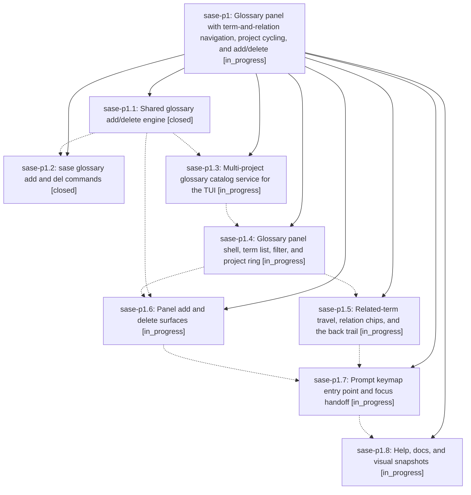

# Bead: sase-p1 — Glossary panel with term-and-relation navigation, project cycling, and add/delete

[Bead Pages](../README.md) / sase-p1

**Status:** ◐ in_progress · **Type:** ▸ plan · **Tier:** epic
**Owner:** `bryanbugyi34@gmail.com` · **Created by:** [bbugyi200.athena.056](https://github.com/sase-org/sase--agents/blob/main/families/bbugyi200.athena.056.md) · **Assignee:** `sase-p1.land`
**Created:** 2026-08-17 17:42:37 EDT
**Plan:** [202608/glossary\_panel.md](https://github.com/sase-org/sase--plans/blob/main/202608/glossary_panel.md)

## Description

A user drafting a prompt can press `gG` or `<ctrl+g>G` to open a Glossary panel that browses one project's terms alphabetically, travels through related terms in both directions with a back trail, cycles the visible project with `p`/`P`, and adds or deletes terms through the same engine that backs the new `sase glossary add` and `sase glossary del` commands.

## Phases

| Bead | Title | Status | Size | Created | Agents | Commits |
|---|---|---|---|---|---:|---:|
| [sase-p1.1](sase-p1.1.md) | Shared glossary add/delete engine | ✓ closed | medium | 2026-08-17 | 0 | 0 |
| [sase-p1.2](sase-p1.2.md) | sase glossary add and del commands | ✓ closed | medium | 2026-08-17 | 1 | 1 |
| [sase-p1.3](sase-p1.3.md) | Multi-project glossary catalog service for the TUI | ◐ in_progress | medium | 2026-08-17 | 1 | 0 |
| [sase-p1.4](sase-p1.4.md) | Glossary panel shell, term list, filter, and project ring | ◐ in_progress | medium | 2026-08-17 | 1 | 0 |
| [sase-p1.5](sase-p1.5.md) | Related-term travel, relation chips, and the back trail | ◐ in_progress | medium | 2026-08-17 | 1 | 0 |
| [sase-p1.6](sase-p1.6.md) | Panel add and delete surfaces | ◐ in_progress | medium | 2026-08-17 | 1 | 0 |
| [sase-p1.7](sase-p1.7.md) | Prompt keymap entry point and focus handoff | ◐ in_progress | small | 2026-08-17 | 1 | 0 |
| [sase-p1.8](sase-p1.8.md) | Help, docs, and visual snapshots | ◐ in_progress | medium | 2026-08-17 | 1 | 0 |

## Lineage

## Agents

| Agent | Bead | Commits |
|---|---|---:|
| [bbugyi200.athena.sase-p1.2](https://github.com/sase-org/sase--agents/blob/main/agents/bbugyi200.athena.sase-p1.2/README.md) | [sase-p1.2](sase-p1.2.md) | 1 |
| [bbugyi200.athena.sase-p1.3](https://github.com/sase-org/sase--agents/blob/main/agents/bbugyi200.athena.sase-p1.3/README.md) | [sase-p1.3](sase-p1.3.md) | 0 |
| [bbugyi200.athena.sase-p1.4](https://github.com/sase-org/sase--agents/blob/main/agents/bbugyi200.athena.sase-p1.4/README.md) | [sase-p1.4](sase-p1.4.md) | 0 |
| [bbugyi200.athena.sase-p1.5](https://github.com/sase-org/sase--agents/blob/main/agents/bbugyi200.athena.sase-p1.5/README.md) | [sase-p1.5](sase-p1.5.md) | 0 |
| [bbugyi200.athena.sase-p1.6](https://github.com/sase-org/sase--agents/blob/main/agents/bbugyi200.athena.sase-p1.6/README.md) | [sase-p1.6](sase-p1.6.md) | 0 |
| [bbugyi200.athena.sase-p1.7](https://github.com/sase-org/sase--agents/blob/main/agents/bbugyi200.athena.sase-p1.7/README.md) | [sase-p1.7](sase-p1.7.md) | 0 |
| [bbugyi200.athena.sase-p1.8](https://github.com/sase-org/sase--agents/blob/main/agents/bbugyi200.athena.sase-p1.8/README.md) | [sase-p1.8](sase-p1.8.md) | 0 |
| [bbugyi200.athena.sase-p1.land](https://github.com/sase-org/sase--agents/blob/main/agents/bbugyi200.athena.sase-p1.land/README.md) | [sase-p1](README.md) | 0 |

## Commits

| Repo | Commit | Subject | Bead | Committed |
|---|---|---|---|---|
| sase | [`20ba691`](https://github.com/sase-org/sase/commit/20ba691616734f2f92760c5bb58cd2070afc5d13) | feat(glossary): add CLI add and del commands | [sase-p1.2](sase-p1.2.md) | 2026-08-17 19:24:26 EDT |
