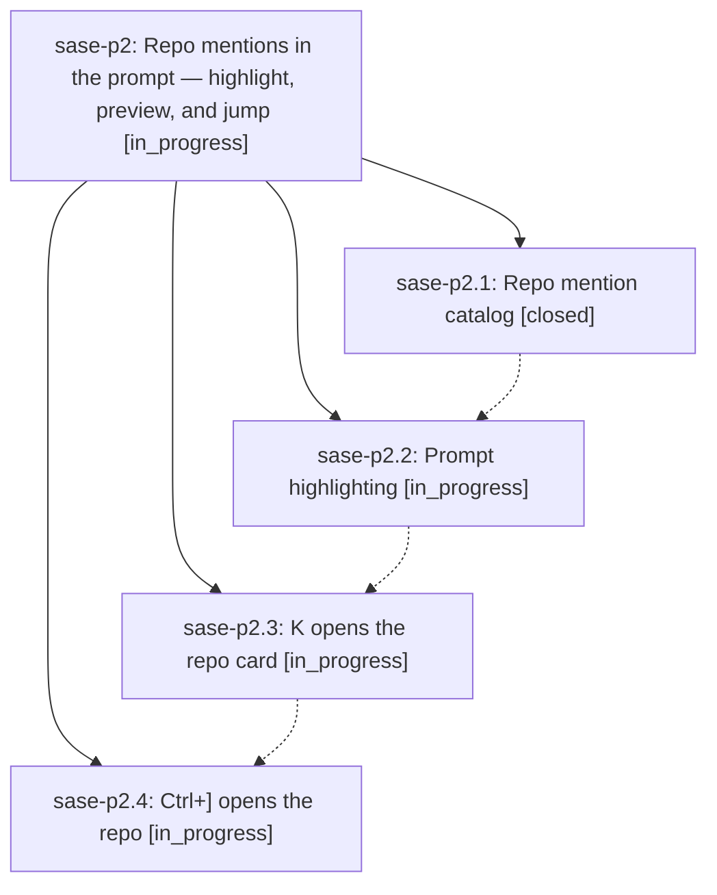

# Bead: sase-p2 — Repo mentions in the prompt — highlight, preview, and jump

[Bead Pages](../README.md) / sase-p2

**Status:** ◐ in_progress · **Type:** ▸ plan · **Tier:** epic
**Owner:** `bryanbugyi34@gmail.com` · **Created by:** [bbugyi200.athena.059](https://github.com/sase-org/sase--agents/blob/main/families/bbugyi200.athena.059.md) · **Assignee:** `sase-p2.land`
**Created:** 2026-08-17 18:09:16 EDT
**Plan:** [202608/prompt\_repo\_mentions.md](https://github.com/sase-org/sase--plans/blob/main/202608/prompt_repo_mentions.md)

## Description

Repo names typed into any ACE prompt input (`sase-core`, `chezmoi`, `gh:owner/repo`) are highlighted in their own color with the same underlined link affordance glossary terms already use, and `K` / `Ctrl+]` open a repo card and the repo itself.

## Phases

| Bead | Title | Status | Size | Created | Agents | Commits |
|---|---|---|---|---|---:|---:|
| [sase-p2.1](sase-p2.1.md) | Repo mention catalog | ✓ closed | medium | 2026-08-17 | 1 | 1 |
| [sase-p2.2](sase-p2.2.md) | Prompt highlighting | ◐ in_progress | medium | 2026-08-17 | 1 | 0 |
| [sase-p2.3](sase-p2.3.md) | K opens the repo card | ◐ in_progress | medium | 2026-08-17 | 1 | 0 |
| [sase-p2.4](sase-p2.4.md) | Ctrl+\] opens the repo | ◐ in_progress | medium | 2026-08-17 | 1 | 0 |

## Lineage

## Agents

| Agent | Bead | Commits |
|---|---|---:|
| [bbugyi200.athena.sase-p2.1](https://github.com/sase-org/sase--agents/blob/main/agents/bbugyi200.athena.sase-p2.1/README.md) | [sase-p2.1](sase-p2.1.md) | 1 |
| [bbugyi200.athena.sase-p2.2](https://github.com/sase-org/sase--agents/blob/main/agents/bbugyi200.athena.sase-p2.2/README.md) | [sase-p2.2](sase-p2.2.md) | 0 |
| [bbugyi200.athena.sase-p2.3](https://github.com/sase-org/sase--agents/blob/main/agents/bbugyi200.athena.sase-p2.3/README.md) | [sase-p2.3](sase-p2.3.md) | 0 |
| [bbugyi200.athena.sase-p2.4](https://github.com/sase-org/sase--agents/blob/main/agents/bbugyi200.athena.sase-p2.4/README.md) | [sase-p2.4](sase-p2.4.md) | 0 |
| [bbugyi200.athena.sase-p2.land](https://github.com/sase-org/sase--agents/blob/main/agents/bbugyi200.athena.sase-p2.land/README.md) | [sase-p2](README.md) | 0 |

## Commits

| Repo | Commit | Subject | Bead | Committed |
|---|---|---|---|---|
| sase | [`fb16cfa`](https://github.com/sase-org/sase/commit/fb16cfaf85fdcc9a29ba9ba64c89f6344d7e3d2e) | feat(xprompt): add project-scoped repo mention catalog | [sase-p2.1](sase-p2.1.md) | 2026-08-17 18:59:46 EDT |
