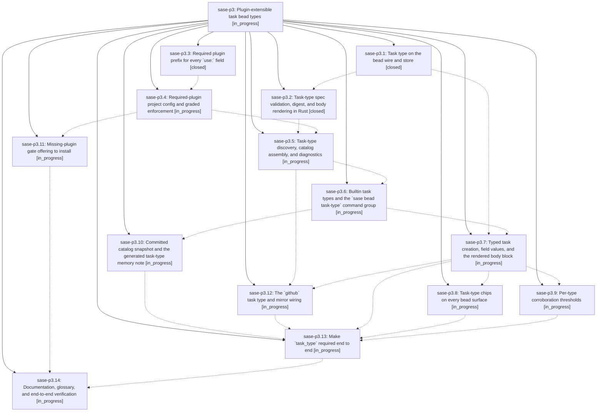

# Bead: sase-p3 — Plugin-extensible task bead types

[Bead Pages](../README.md) / sase-p3

**Status:** ◐ in_progress · **Type:** ▸ plan · **Tier:** epic
**Owner:** `bryanbugyi34@gmail.com` · **Created by:** [bbugyi200.athena.05c](https://github.com/sase-org/sase--agents/blob/main/families/bbugyi200.athena.05c.md) · **Assignee:** `sase-p3.land`
**Created:** 2026-08-17 18:50:03 EDT
**Plan:** [202608/task\_bead\_types.md](https://github.com/sase-org/sase--plans/blob/main/202608/task_bead_types.md)

## Description

Every new task bead carries a required, plugin-extensible `task_type` whose declared fields, validators, and body template are validated in the Rust core; the effective catalog is a deterministic function of a project's committed configuration rather than of whichever plugins happen to be installed on the current machine; and every surface that shows a task bead shows a distinctly colored type chip.

## Phases

| Bead | Title | Status | Size | Created | Agents | Commits |
|---|---|---|---|---|---:|---:|
| [sase-p3.1](sase-p3.1.md) | Task type on the bead wire and store | ✓ closed | medium | 2026-08-17 | 1 | 1 |
| [sase-p3.10](sase-p3.10.md) | Committed catalog snapshot and the generated task-type memory note | ◐ in_progress | medium | 2026-08-17 | 1 | 0 |
| [sase-p3.11](sase-p3.11.md) | Missing-plugin gate offering to install | ◐ in_progress | medium | 2026-08-17 | 1 | 0 |
| [sase-p3.12](sase-p3.12.md) | The \`github\` task type and mirror wiring | ◐ in_progress | small | 2026-08-17 | 1 | 0 |
| [sase-p3.13](sase-p3.13.md) | Make \`task\_type\` required end to end | ◐ in_progress | small | 2026-08-17 | 1 | 0 |
| [sase-p3.14](sase-p3.14.md) | Documentation, glossary, and end-to-end verification | ◐ in_progress | medium | 2026-08-17 | 1 | 0 |
| [sase-p3.2](sase-p3.2.md) | Task-type spec validation, digest, and body rendering in Rust | ✓ closed | medium | 2026-08-17 | 1 | 1 |
| [sase-p3.3](sase-p3.3.md) | Required plugin prefix for every \`use:\` field | ✓ closed | medium | 2026-08-17 | 1 | 1 |
| [sase-p3.4](sase-p3.4.md) | Required-plugin project config and graded enforcement | ◐ in_progress | medium | 2026-08-17 | 1 | 0 |
| [sase-p3.5](sase-p3.5.md) | Task-type discovery, catalog assembly, and diagnostics | ◐ in_progress | medium | 2026-08-17 | 1 | 0 |
| [sase-p3.6](sase-p3.6.md) | Builtin task types and the \`sase bead task-type\` command group | ◐ in_progress | medium | 2026-08-17 | 1 | 0 |
| [sase-p3.7](sase-p3.7.md) | Typed task creation, field values, and the rendered body block | ◐ in_progress | medium | 2026-08-17 | 1 | 0 |
| [sase-p3.8](sase-p3.8.md) | Task-type chips on every bead surface | ◐ in_progress | medium | 2026-08-17 | 1 | 0 |
| [sase-p3.9](sase-p3.9.md) | Per-type corroboration thresholds | ◐ in_progress | small | 2026-08-17 | 1 | 0 |

## Lineage

## Agents

| Agent | Bead | Commits |
|---|---|---:|
| [bbugyi200.athena.sase-p3.1](https://github.com/sase-org/sase--agents/blob/main/agents/bbugyi200.athena.sase-p3.1/README.md) | [sase-p3.1](sase-p3.1.md) | 1 |
| [bbugyi200.athena.sase-p3.10](https://github.com/sase-org/sase--agents/blob/main/agents/bbugyi200.athena.sase-p3.10/README.md) | [sase-p3.10](sase-p3.10.md) | 0 |
| [bbugyi200.athena.sase-p3.11](https://github.com/sase-org/sase--agents/blob/main/agents/bbugyi200.athena.sase-p3.11/README.md) | [sase-p3.11](sase-p3.11.md) | 0 |
| [bbugyi200.athena.sase-p3.12](https://github.com/sase-org/sase--agents/blob/main/agents/bbugyi200.athena.sase-p3.12/README.md) | [sase-p3.12](sase-p3.12.md) | 0 |
| [bbugyi200.athena.sase-p3.13](https://github.com/sase-org/sase--agents/blob/main/agents/bbugyi200.athena.sase-p3.13/README.md) | [sase-p3.13](sase-p3.13.md) | 0 |
| [bbugyi200.athena.sase-p3.14](https://github.com/sase-org/sase--agents/blob/main/agents/bbugyi200.athena.sase-p3.14/README.md) | [sase-p3.14](sase-p3.14.md) | 0 |
| [bbugyi200.athena.sase-p3.2](https://github.com/sase-org/sase--agents/blob/main/agents/bbugyi200.athena.sase-p3.2/README.md) | [sase-p3.2](sase-p3.2.md) | 1 |
| [bbugyi200.athena.sase-p3.3](https://github.com/sase-org/sase--agents/blob/main/families/bbugyi200.athena.sase-p3.3.md) | [sase-p3.3](sase-p3.3.md) | 1 |
| [bbugyi200.athena.sase-p3.4](https://github.com/sase-org/sase--agents/blob/main/agents/bbugyi200.athena.sase-p3.4/README.md) | [sase-p3.4](sase-p3.4.md) | 0 |
| [bbugyi200.athena.sase-p3.5](https://github.com/sase-org/sase--agents/blob/main/agents/bbugyi200.athena.sase-p3.5/README.md) | [sase-p3.5](sase-p3.5.md) | 0 |
| [bbugyi200.athena.sase-p3.6](https://github.com/sase-org/sase--agents/blob/main/agents/bbugyi200.athena.sase-p3.6/README.md) | [sase-p3.6](sase-p3.6.md) | 0 |
| [bbugyi200.athena.sase-p3.7](https://github.com/sase-org/sase--agents/blob/main/agents/bbugyi200.athena.sase-p3.7/README.md) | [sase-p3.7](sase-p3.7.md) | 0 |
| [bbugyi200.athena.sase-p3.8](https://github.com/sase-org/sase--agents/blob/main/agents/bbugyi200.athena.sase-p3.8/README.md) | [sase-p3.8](sase-p3.8.md) | 0 |
| [bbugyi200.athena.sase-p3.9](https://github.com/sase-org/sase--agents/blob/main/agents/bbugyi200.athena.sase-p3.9/README.md) | [sase-p3.9](sase-p3.9.md) | 0 |
| [bbugyi200.athena.sase-p3.land](https://github.com/sase-org/sase--agents/blob/main/agents/bbugyi200.athena.sase-p3.land/README.md) | [sase-p3](README.md) | 0 |

## Commits

| Repo | Commit | Subject | Bead | Committed |
|---|---|---|---|---|
| sase-core | [`sase-core@85cc322`](https://github.com/sase-org/sase-core/commit/85cc32278a409307a93af299e3fa24a5e42a3827) | feat(bead): add optional task\_type to the issue wire and store | [sase-p3.1](sase-p3.1.md) | 2026-08-17 19:10:05 EDT |
| sase-core | [`sase-core@82b10b5`](https://github.com/sase-org/sase-core/commit/82b10b5e43da7a1828e97554ae4a1416f3946e74) | feat(task\_type): add spec validation, digest, and body rendering | [sase-p3.2](sase-p3.2.md) | 2026-08-17 19:47:28 EDT |
| sase | [`54da09b`](https://github.com/sase-org/sase/commit/54da09ba5c0aeca06d27ff6b7c8bbfd75c7925ba) | feat(config)!: require plugin prefix on every use: field | [sase-p3.3](sase-p3.3.md) | 2026-08-17 21:18:39 EDT |
